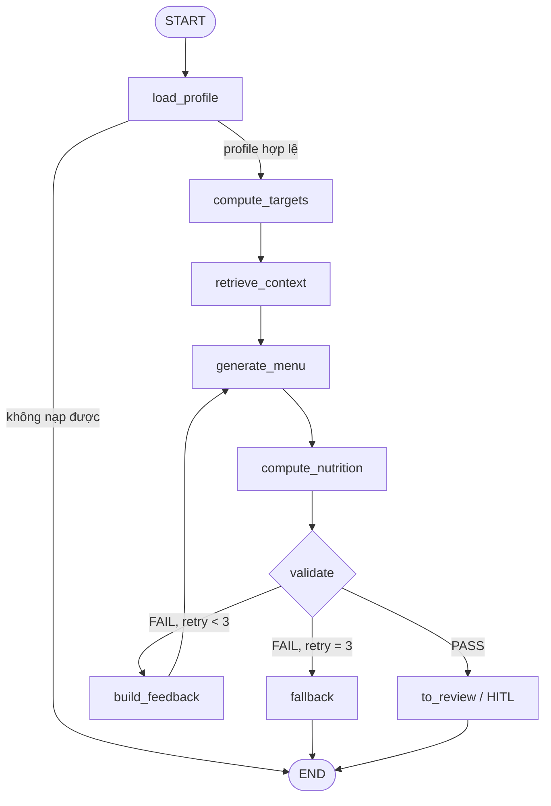
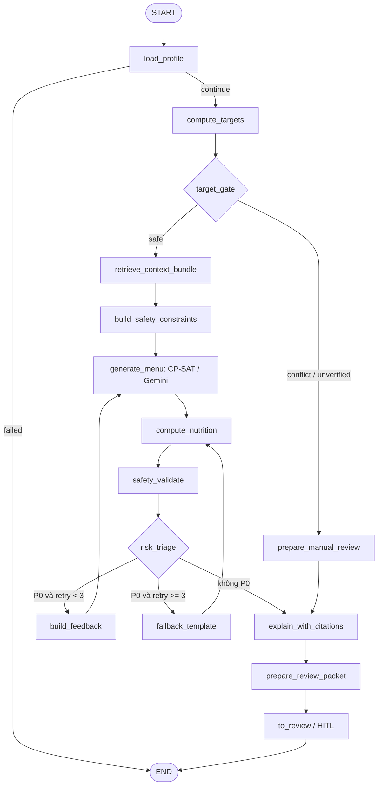

# So sánh kiến trúc LangGraph trước và sau tối ưu

> Dự án: VNutriCare AI Agent
> Baseline cũ: commit `e0d9f0d` — graph 9 node
> Kiến trúc hiện tại: commit `c651544` — Clinical Safety Hardening
> Tài liệu thiết kế gốc: `docs/LANGGRAPH_FLOW_OPTIMIZATION.md`

## 1. Kết luận nhanh

Kiến trúc mới không chỉ đổi tên node. Hệ thống đã chuyển từ một pipeline sinh–kiểm tra thực đơn tương đối tuyến tính sang kiến trúc **fail-closed, safety-gated và audit-first**:

- Graph chính tăng từ **9 node lên 15 node**.
- Có `target_gate` chặn trước CP-SAT/Gemini.
- Constraint an toàn được cấu trúc hóa trước khi generation.
- Fallback không còn đi thẳng ra `END`.
- Safety được phân cấp `P0/P1/P2`.
- HITL nhận `ReviewPacket`, citation và dấu vết phiên bản.
- Có graph riêng để tính lại downstream khi chuyên gia sửa gram.
- Có `publish_gate` ngoài graph để ngăn menu chưa duyệt hoặc đã bị sửa hiển thị cho bệnh nhân.
- State được mở rộng cho versioning, integrity hash, latency, token usage và audit trail.

Kiến trúc mới an toàn và dễ vận hành hơn rõ rệt. Tuy nhiên, một số phần trong kế hoạch tối ưu vẫn chưa hoàn thiện, đặc biệt là structured medication, truyền `lab_values` vào Core AI, Redis/cache, streaming và RAG citation đầy đủ.

---

## 2. Kiến trúc cũ

### 2.1. Graph 9 node

1. `load_profile`
2. `compute_targets`
3. `retrieve_context`
4. `generate_menu`
5. `compute_nutrition`
6. `validate`
7. `build_feedback`
8. `fallback`
9. `to_review`



### 2.2. Đặc điểm chính

- `compute_targets` không có gate riêng để dừng xung đột target.
- Retrieval trả candidate object lớn trong state.
- Safety constraint chưa được đóng gói thành schema riêng trước generation.
- `validate` vừa đánh giá dinh dưỡng vừa quyết định retry/fallback/review.
- Chỉ có mức `hard/soft violation`, chưa có risk taxonomy P0/P1/P2.
- Fallback đi thẳng tới `END`, không bắt buộc tính và kiểm định lại.
- HITL chưa có review packet chuẩn hóa.
- State chủ yếu chứa dữ liệu nghiệp vụ của một lần chạy; thiếu version/hash/audit.
- Khi chuyên gia chỉnh gram, chưa có downstream graph chuyên biệt.

---

## 3. Kiến trúc hiện tại

### 3.1. Graph chính 15 node

1. `load_profile`
2. `compute_targets`
3. `target_gate`
4. `retrieve_context_bundle`
5. `build_safety_constraints`
6. `generate_menu`
7. `compute_nutrition`
8. `safety_validate`
9. `risk_triage`
10. `build_feedback`
11. `fallback_template`
12. `prepare_manual_review`
13. `explain_with_citations`
14. `prepare_review_packet`
15. `to_review`



### 3.2. Graph tính lại sau khi chuyên gia chỉnh sửa

Đây là graph mới, tách biệt hoàn toàn khỏi retrieval và generation:


Graph này không chứa:

- Retrieval.
- CP-SAT optimizer.
- Gemini generation.
- Retry loop.
- Fallback.

Do đó, thao tác sửa gram không thể âm thầm thay thế món mà chuyên gia đang duyệt.

---

## 4. Bảng so sánh kiến trúc

| Hạng mục | Kiến trúc cũ | Kiến trúc hiện tại | Tác động |
|---|---|---|---|
| Topology | 9 node, pipeline gần tuyến tính | 15 node và một recompute graph riêng | Tách trách nhiệm rõ hơn |
| Target conflict | Có thể tiếp tục tới generation | `target_gate` chặn trước retrieval/solver/LLM | Fail-closed |
| Rule verification | Rule có thể được nạp không phân biệt trạng thái | Runtime chỉ áp dụng rule `verified`; rule `to_verify` tạo P0 | Không dùng bằng chứng chưa xác minh |
| Safety input | Filter rải rác trong retrieval/generator | `SafetyConstraints` có schema riêng | CP-SAT/Gemini nhận constraint nhất quán |
| Validation | Một node `validate` | `safety_validate` + `risk_triage` | Tách phát hiện khỏi quyết định routing |
| Risk model | `hard/soft` | `P0/P1/P2` | Phù hợp quy trình clinical review |
| Retry | Retry bằng feedback, state hạn chế | Retry có giới hạn và `attempt_history` | Giảm nguy cơ lặp và dễ audit |
| State cleanup | Có nguy cơ giữ nutrition/violation cũ | Menu mới xóa/ghi đè nutrition, violation, feedback cũ | Tránh stale state |
| Fallback | `fallback → END` | `fallback → nutrition → safety → triage → HITL` | Fallback không bypass safety |
| HITL | `to_review` đơn giản | `ReviewPacket`, risk ordering, override policy | Reviewer ra quyết định nhanh hơn |
| Reviewer edit | Chưa có flow tối ưu riêng | Downstream recompute graph | Giảm latency và cost |
| Explainability | Chưa có node riêng | `explain_with_citations` | Có cấu trúc citation/explanation |
| Publish | Chủ yếu dựa vào status | Status + P0 + version/hash integrity | Chặn menu bị sửa sau duyệt |
| Retrieval payload | Candidate object lớn trong state | Chỉ giữ `candidate_ids`, Top-K mặc định 100 | State nhẹ hơn |
| Solver budget | Chưa kiểm soát rõ theo flow | CP-SAT 2 giây/phase, tối đa khoảng 4 giây | Latency có giới hạn |
| Observability | `trace_id` và retry cơ bản | Node timing, audit event, token usage, structured error | Dễ điều tra production |
| Versioning | Thiếu version dữ liệu/rule/menu | Profile/rule/food/interaction/prompt/menu version | Có thể tái hiện quyết định |
| Integrity | Không có hash | Menu hash và nutrition hash | Bảo vệ nội dung đã duyệt |

---

## 5. Thay đổi theo từng lớp kiến trúc

### 5.1. Orchestration Layer

**Trước:** graph chủ yếu điều phối generation, nutrition và validation.

**Sau:** graph điều phối thêm ba nhóm quyết định độc lập:

1. **Pre-generation safety:** `target_gate`, `build_safety_constraints`.
2. **Post-generation safety:** `safety_validate`, `risk_triage`.
3. **Clinical delivery:** `explain_with_citations`, `prepare_review_packet`, `to_review`.

Conditional edge hiện phản ánh chính sách an toàn thay vì chỉ phản ánh trạng thái solver.

### 5.2. Clinical Safety Layer

Các guardrail mới:

- Chỉ dùng clinical rule có `verify_status == "verified"`.
- Phát hiện rule áp dụng nhưng chưa xác minh và tạo finding P0.
- Xây dựng hard nutrient bounds trước generation.
- Tổng hợp allergy, dislike và medication interaction thành `SafetyConstraints`.
- Chuẩn hóa finding theo P0/P1/P2.
- P0 không được override.
- P1 được override nhưng API yêu cầu reviewer ghi lý do.

### 5.3. Generation Layer

Kiến trúc hybrid CP-SAT/Gemini vẫn được giữ, nhưng ranh giới an toàn rõ hơn:

- Candidate được lọc và rút gọn trước generation.
- Constraint được truyền có cấu trúc.
- CP-SAT có time budget.
- Generation attempt được ghi nguồn: `cpsat`, `gemini` hoặc `fallback`.
- Mỗi menu mới tăng `menu_version` và làm sạch kết quả downstream cũ.

### 5.4. HITL Layer

`ReviewPacket` hiện chứa:

- `highest_risk`.
- `can_approve`.
- `used_fallback`.
- `target_gate_reasons`.
- Danh sách finding đã sắp xếp.
- Summary cho reviewer.

UI hiện đã sử dụng:

- Hiển thị Safety Findings P0/P1/P2.
- Khóa Approve khi còn P0.
- Bắt buộc nhập lý do khi override P1.
- Tự động recompute khi sửa gram và blur khỏi input.

### 5.5. Persistence và Publication Layer

Meal plan hiện lưu thêm:

- Safety findings và review packet.
- Citation và explanation.
- Highest risk.
- Menu/nutrition version và hash.
- Approved version/hash.
- Run ID và các data version.
- Attempt history, node timing, token usage, last error, audit events.

`publish_gate` nằm ở tầng API/domain integrity, không phải một LangGraph node. Bệnh nhân chỉ đọc được plan khi:

```text
status == approved
AND highest_risk != P0
AND menu/nutrition hash tồn tại
AND version hiện tại == version đã duyệt
AND hash hiện tại == hash đã duyệt
```

### 5.6. Operational Audit Layer

Mọi node trong graph chính và recompute graph được bọc bởi instrumentation để ghi:

- Tên node.
- Thời điểm hoàn thành.
- Duration theo millisecond.
- Các field state mà node cập nhật.

State cũng hỗ trợ:

- `run_id`, `trace_id`.
- `profile_version`, `rule_version`, `food_data_version`.
- `interaction_version`, `prompt_version`.
- `attempt_history`.
- `token_usage`.
- `last_error` có cấu trúc.

---

## 6. Thay đổi về State Schema

### State cũ

```text
patient_id, trace_id
profile, targets, candidate_foods
draft_menu, computed_nutrition, violations
retry_count, feedback, used_fallback
status, reviewer_id, reviewer_notes, needs_attention
```

### State hiện tại

```text
Identity/version
  run_id, trace_id, plan_id, patient_id, profile_id
  profile/rule/food/interaction/prompt version

Clinical
  profile, profile hash, completeness
  targets, target conflicts, unverified rule IDs
  target gate reasons, safety constraints

Retrieval/generation
  candidate IDs, guideline chunk IDs
  draft menu, source, attempts, feedback, fallback

Deterministic safety
  computed nutrition, nutrition hash
  violations, safety findings, highest risk

Explainability/HITL
  citations, expert/patient explanation
  review packet, review decision, approved version

Operations
  node timings, token usage, structured error, audit events
```

Thay đổi quan trọng nhất là state không còn chỉ mô tả “kết quả đang xử lý”, mà còn mô tả **nguồn gốc, phiên bản, mức rủi ro và lịch sử tạo ra kết quả**.

---

## 7. Tác động kỹ thuật

### Ưu điểm

- An toàn hơn vì mọi đường ra đều qua validation và HITL.
- Không gọi CP-SAT/Gemini khi target chưa đủ tin cậy.
- Reviewer edit nhanh hơn do chỉ recompute downstream.
- Dễ audit và tái hiện sự cố.
- Dễ mở rộng node mới vì nhiệm vụ đã được tách nhỏ.
- Publish Gate bảo vệ menu sau phê duyệt.

### Chi phí và trade-off

- Số node và conditional edge tăng, graph phức tạp hơn.
- State và DB schema lớn hơn.
- Cần chạy ba Alembic migration mới khi deploy.
- `target_gate` fail-closed làm giảm tỷ lệ Happy Path nếu quy trình verify rule chưa hoàn tất.
- Review UI cần theo kịp contract mới của Backend.
- Audit event và versioning làm tăng lượng dữ liệu lưu trữ.

---

## 8. Phần đã triển khai và phần còn thiếu

| Thành phần trong kế hoạch | Trạng thái | Ghi chú |
|---|---|---|
| `target_gate` | Đã triển khai | Chặn conflict và unverified rule |
| Verified-rules-only | Đã triển khai | Runtime fail-closed |
| Structured safety constraints | Đã triển khai | Allergy, dislike, nutrient, interaction |
| P0/P1/P2 | Đã triển khai | UI và API enforce P0/P1 |
| Safe fallback | Đã triển khai | Không còn edge fallback → END |
| ReviewPacket | Đã triển khai Backend | UI chưa render toàn bộ packet/citation |
| Downstream recompute | Đã triển khai | Không rerun generation |
| Publish Gate + hash | Đã triển khai | Enforce ở API/query layer |
| CP-SAT timeout | Đã triển khai | 2 giây mỗi phase |
| Top-K retrieval | Đã triển khai | Mặc định 100 candidate |
| Typed operational state | Đã triển khai | Có version/audit/error/token fields |
| Separate `preflight_profile` node | Chưa tách riêng | Completeness hiện nằm trong `load_profile` |
| Full drug dose/timing schema | Chưa hoàn thiện | Core chủ yếu nhận tên thuốc |
| `lab_values` vào Core AI | Chưa hoàn thiện | Đang lưu DB nhưng bridge chưa truyền |
| RAG retrieval/citation đầy đủ | Một phần | Citation hiện tổng hợp từ guideline refs có sẵn |
| LLM explainability chuyên sâu | Chưa hoàn thiện | Explanation hiện là deterministic template |
| Redis/distributed cache | Chưa triển khai | Repository có thể cache trong process |
| Streaming node progress | Chưa triển khai | UI đang poll trạng thái plan |
| Production LangGraph checkpointer | Chưa nối trong API runtime | Có MemorySaver utility cho dev/test |

---

## 9. Lưu ý vận hành hiện tại

- Toàn bộ clinical rule seed hiện còn `to_verify`, nên Target Gate sẽ chuyển các ca áp dụng rule sang HITL trước generation. Đây là hành vi đúng theo thiết kế fail-closed, không phải lỗi routing.
- Plan bị Target Gate chặn không có menu và không có computed nutrition; API phải trả `computed_nutrition: null`.
- Backend phải được restart sau khi thay đổi trạng thái rule vì graph nạp rule khi được assembly.
- Khi deploy commit mới, phải chạy:

```bash
alembic upgrade head
```

---

## 10. Định hướng tiếp theo

Ưu tiên kiến trúc tiếp theo nên là:

1. Mở rộng `PatientProfile` và bridge để truyền `lab_values` cùng clinical flags.
2. Chuẩn hóa medication thành hoạt chất, liều, tần suất và giờ dùng.
3. Tách `input_preflight` thành node độc lập với completeness/recency/unit checks.
4. Hiển thị đầy đủ ReviewPacket, target reasons, citations và explanation trên UI.
5. Nối persistent LangGraph checkpointer cho resume/HITL production.
6. Bổ sung Redis/cache và streaming progress sau khi flow clinical ổn định.

---

## 11. Các file kiến trúc chính

- Graph topology: `src/agents/graph.py`
- Node implementation: `src/agents/nodes/core.py`
- Typed state: `src/agents/state.py`
- CP-SAT optimizer: `src/agents/optimizer.py`
- Rule enforcement: `src/clinical/rules.py`
- Interaction safety: `src/clinical/interactions.py`
- Integrity và Publish Gate: `src/clinical/integrity.py`
- Meal plan persistence/API: `src/api/routes/meal_plans.py`
- HITL/recompute API: `src/api/routes/reviews.py`
- Reviewer UI: `web-next/src/app/dietitian/reviews/[id]/page.tsx`

