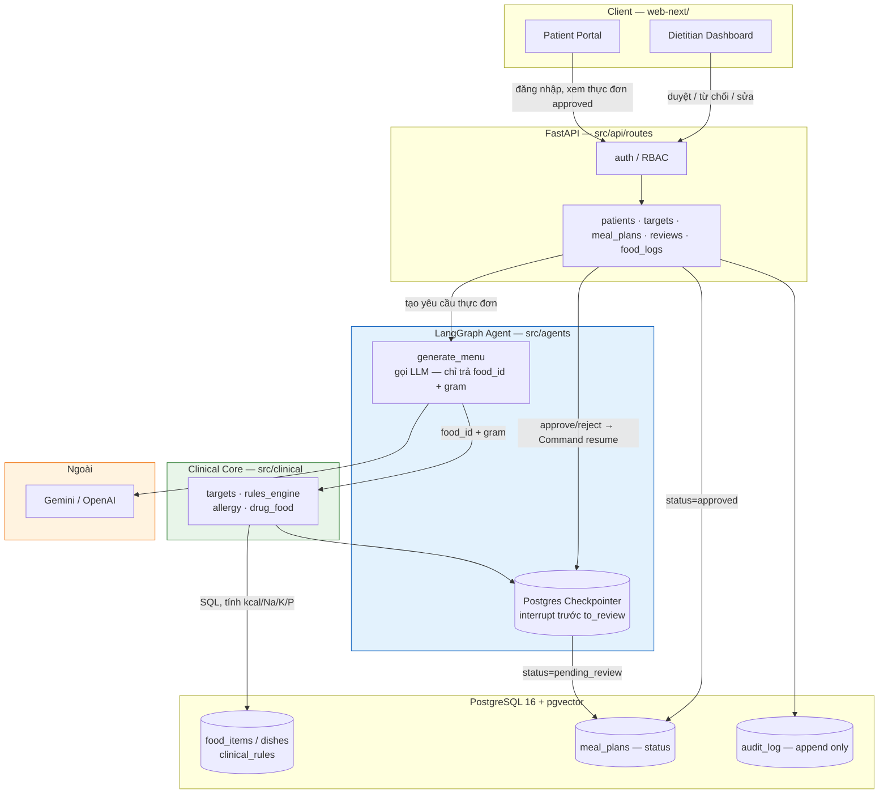

# NutriCare Agent

> Tư vấn dinh dưỡng lâm sàng bằng AI cho bệnh nhân mãn tính Việt Nam (ĐTĐ2, tăng huyết áp, bệnh thận mạn, gout) — đề bài **VMEC-10**, AI20K Build Phase Cohort 3, đội **P-031**.

⚠️ **Đây không phải công cụ y tế thay thế bác sĩ.** Xem [Disclaimer y tế](#-disclaimer-y-tế) bên dưới trước khi đọc tiếp.

---

## Vấn đề

Bệnh nhân mãn tính (ĐTĐ2, tăng huyết áp, bệnh thận mạn, gout) ở Việt Nam cần chế độ ăn tuân theo nhiều ngưỡng dinh dưỡng chồng chéo (natri, kali, phospho, protein, purine…) tuỳ theo bệnh lý và giai đoạn — nhưng:

- Tư vấn dinh dưỡng lâm sàng 1-1 tốn thời gian chuyên gia, không scale được cho số đông bệnh nhân mãn tính.
- Thực đơn Việt Nam (phở, bún riêu, canh cua, mắm…) thường có natri/purine cao mà bệnh nhân không nhận ra.
- Bệnh nhân đa bệnh lý (VD: ĐTĐ + CKD) đối mặt các khuyến nghị xung đột nhau (ADA vs KDIGO) mà không có công cụ nào tự động hoà giải an toàn.

## Giải pháp

NutriCare Agent dùng LangGraph để sinh thực đơn cá thể hoá, nhưng theo nguyên tắc bất biến: **LLM chỉ chọn món, Python tính số**. Ba rule không bao giờ bị vi phạm (thực thi bằng code, không phải lời dặn — xem `CLAUDE.md` §2):

1. **RULE-1** — LLM chỉ trả về `food_id`/`dish_id` + gram. Mọi giá trị kcal/natri/protein… được tính bằng SQL/Python xác định (deterministic), không bao giờ để mô hình tự bịa con số.
2. **RULE-2** — Không con số nào không có nguồn. Mỗi giá trị dinh dưỡng hiển thị cho người dùng đều kèm `source` (NIN/USDA/estimated) + `source_ref`.
3. **RULE-3** — Không có đường tắt tới bệnh nhân. Thực đơn luôn dừng ở trạng thái chờ chuyên gia duyệt (HITL) trước khi đến tay bệnh nhân.

Chi tiết kiến trúc kỹ thuật (luồng graph, ví dụ xung đột ADA/KDIGO đã xử lý ra sao): xem [`docs/ARCHITECTURE.md`](docs/ARCHITECTURE.md) (bản nháp ban đầu được lưu trong [`docs/archive/LEGACY_RESEARCH_AND_PLANNING.md`](docs/archive/LEGACY_RESEARCH_AND_PLANNING.md)).

## Đối tượng sử dụng

- **Chính:** bệnh nhân mãn tính Việt Nam cần thực đơn tuân thủ ngưỡng dinh dưỡng theo bệnh lý.
- **Phụ:** chuyên gia dinh dưỡng/bác sĩ — chốt chặn cuối cùng duyệt thực đơn trước khi đến bệnh nhân (RULE-3).

## Tech Stack

| Layer | Công nghệ |
|---|---|
| AI Agent | LangGraph + LangChain (OpenAI) |
| Backend | FastAPI + Python 3.11+, Pydantic |
| Frontend | Next.js App Router (`web-next/`) — login, dashboard bệnh nhân/chuyên gia, trang duyệt thực đơn |
| Database | PostgreSQL + pgvector (prod) / SQLite (dev) |
| DevOps | Docker (multi-stage) + GitHub Actions (`ruff`, `mypy`, `pytest`, `docker build`) |
| Deploy | Render (backend, Docker) + Vercel (frontend) + Neon/Supabase (Postgres) |

## Cài đặt & chạy thử

```bash
# 1. Clone repo
git clone https://github.com/AI20K-Build-Phase-Cohort-3/P-031.git
cd P-031

# 2. Tạo virtual environment
python3.11 -m venv .venv
source .venv/bin/activate   # Windows: .venv\Scripts\activate

# 3. Cài dependencies
pip install -r requirements.txt

# 4. Cấu hình môi trường
cp .env.example .env
# Mở .env, điền OPENAI_API_KEY của bạn và AI_LOG_API_KEY do giảng viên cấp
# (không commit .env, không điền secret thật vào .env.example)

# 5. Cài AI Usage Logging hook (bắt buộc — xem SET-02)
bash scripts/setup_hooks.sh

# 6. Chạy thử không cần API key/DB (logic lâm sàng deterministic)
make check          # ruff + validate-data + pytest, 190 test xanh
# Chỉ sửa một phần? Chạy riêng nhóm test tương ứng thay vì toàn bộ suite:
make test-clinical   # src/clinical/** — energy, rules, dishes, food_item
make test-agents     # src/agents/** — graph, guardrail, hybrid, CP-SAT optimizer
make test-api        # src/api/** — auth, patients, meal-plans, reviews, targets
make test-db         # src/db/** + scripts/seed_*.py

# 7. Chạy server
make run             # hoặc: uvicorn src.main:app --reload --port 8000
# Swagger UI: http://localhost:8000/docs
```

### Biến môi trường

Copy từ `.env.example` — tên biến phải khớp **chính xác** field trong `src/config.py` (pydantic-settings, `extra="ignore"` nghĩa là biến sai tên bị bỏ qua âm thầm, không báo lỗi).

| Biến | Bắt buộc | Mặc định | Ghi chú |
|---|:-:|---|---|
| `APP_ENV`, `APP_PORT`, `APP_HOST` | — | `development`, `8000`, `0.0.0.0` | |
| `CORS_ORIGINS` | — | `localhost:3000,8000` | danh sách phân cách bằng dấu phẩy |
| `DATABASE_URL` | ✅ | — | `sqlite:///./data/app.db` để chạy dev không cần Postgres |
| `DB_POOL_SIZE`, `DB_MAX_OVERFLOW`, `DB_*_TIMEOUT_SEC` | — | xem `.env.example` | tuning connection pool cho Postgres |
| `CHROMA_PERSIST_DIR` | — | `./data/chroma` | vector store cục bộ (dev) |
| `GEMINI_API_KEY` (+ `_2`..`_5`) | ✅ nếu `MENU_GENERATOR≠cpsat` | — | nguồn LLM chính; nhiều key để xoay vòng khi rate-limit |
| `GEMINI_MODEL` | — | `gemini-2.5-flash` | |
| `OPENAI_API_KEY`, `MODEL_NAME`, `LLM_TEMPERATURE` | — | — | dự phòng, chưa dùng chính |
| `USDA_API_KEY` | — | — | tra cứu USDA FoodData Central (DAT-03) |
| `MENU_GENERATOR` | — | `hybrid` | `hybrid` \| `cpsat` (không cần LLM key) \| `gemini` |
| `JWT_SECRET` | ✅ | — | `openssl rand -hex 32` khi lên production |
| `JWT_ALGORITHM`, `JWT_ACCESS_TTL_MIN`, `JWT_REFRESH_TTL_DAYS` | — | `HS256`, `15`, `7` | |
| `LANGCHAIN_API_KEY`, `LANGCHAIN_PROJECT`, `LANGCHAIN_TRACING_V2` | — | tắt (`false`) | bật để trace graph trên LangSmith |
| `AI_LOG_SERVER`, `AI_LOG_API_KEY`, `AI_LOG_DIR` | ✅ | `.ai-log` | bắt buộc cho hook chấm điểm SET-02, key do giảng viên cấp |

**Không bao giờ** đọc secrets qua `os.getenv()` rải rác trong code — chỉ qua `src/config.py` (xem `CLAUDE.md` §4).

### E2E test frontend (Playwright)

Cần backend đang chạy (bước 7) + `make seed && make seed-demo-users` trước. Key LLM đọc từ `.env` gốc (`GEMINI_API_KEY*`) — không cần tên khác.

```bash
cd web-next
npm install
npx playwright install chromium   # 1 lần
npx playwright test               # tự khởi động `npm run dev`, dùng tài khoản demo trong .env
```

## Kiến trúc & luồng dữ liệu

Bộ sơ đồ Mermaid đầy đủ (System Context, Container/Component, Data Flow, Agent Pipeline, Auth, UI Flow, Deployment): [`architecture/README.md`](architecture/README.md). ERD 15 bảng + sequence HITL chi tiết: [`docs/ARCHITECTURE.md`](docs/ARCHITECTURE.md). Bản tóm tắt ở đây:



Điểm mấu chốt: `generate_menu` là node **duy nhất** gọi LLM và chỉ được trả `food_id`+gram; mọi con số dinh dưỡng đi qua `src/clinical` bằng SQL. Graph luôn dừng ở `to_review` (Postgres checkpointer `interrupt_before`) — API bệnh nhân chỉ đọc `meal_plans` có `status=approved`.

## Cấu trúc dự án

```
├── src/
│   ├── clinical/         # ⭐ Tầng deterministic — KHÔNG import LLM (RULE-1)
│   ├── agents/            # LangGraph: state.py, graph.py, nodes/
│   ├── api/                # FastAPI routes
│   ├── models/             # Pydantic schemas
│   ├── services/           # LLM client, business logic
│   ├── config.py           # Pydantic Settings
│   └── main.py             # App entry point
├── data/seeds/            # clinical_rules.csv, drug_food_interactions.csv, food_items.csv
├── tests/                 # pytest suite
├── web-next/              # Frontend Next.js App Router (login, dietitian/, patient/, eval/)
├── docs/                  # Tài liệu dự án + rules cho AI coding agent (xem CLAUDE.md)
├── eval/                  # Bộ đánh giá + báo cáo
├── presentation/          # Slide, video demo
├── Dockerfile             # Multi-stage build, non-root user
├── render.yaml            # Render Blueprint (backend)
└── .github/workflows/     # CI: ruff, mypy, pytest, docker build
```

## API chính

Chi tiết đầy đủ (input/output/ràng buộc/lỗi): [`docs/ARCHITECTURE.md`](docs/ARCHITECTURE.md) (bản thiết kế API ban đầu được lưu trong [`docs/archive/LEGACY_RESEARCH_AND_PLANNING.md`](docs/archive/LEGACY_RESEARCH_AND_PLANNING.md)).

| Method | Path | Mô tả |
|---|---|---|
| GET | `/health`, `/api/v1/health`, `/api/v1/status` | Health check / trạng thái agent |
| POST | `/api/v1/auth/register`, `/login`, `/refresh` | Đăng ký/đăng nhập (JWT + argon2id) |
| POST/GET/PUT | `/api/v1/patients` | CRUD hồ sơ bệnh nhân |
| POST | `/api/v1/targets/compute` | Tính định mức lâm sàng (không LLM) |
| POST/GET | `/api/v1/meal-plans` | Sinh thực đơn (chạy graph nền, `202`) / xem thực đơn |
| GET/POST | `/api/v1/reviews/pending`, `/{id}/approve`, `/{id}/reject` | Hàng chờ duyệt (HITL) |
| POST | `/api/v1/chat` | Chat guardrail 2 tầng (regex + LLM classifier, AGT-07) — chặn câu hỏi chỉ định y khoa |

### Ví dụ truy vấn

Chạy sau `make run` + `make seed && make seed-demo-users`. Thay `$TOKEN` bằng `access_token` lấy từ bước login.

```bash
# 1. Đăng nhập lấy JWT
curl -s -X POST http://localhost:8000/api/v1/auth/login \
  -H "Content-Type: application/json" \
  -d '{"email":"dietitian1@nutricare.demo","password":"Demo1234"}'
# → {"access_token": "...", "refresh_token": "...", "token_type": "bearer"}

# 2. Tính định mức lâm sàng cho một bệnh nhân (deterministic, KHÔNG gọi LLM)
curl -s -X POST http://localhost:8000/api/v1/targets/compute \
  -H "Authorization: Bearer $TOKEN" -H "Content-Type: application/json" \
  -d '{"patient_id":"<profile_id>"}'
# → { "bmr_kcal": ..., "tdee_kcal": ..., "targets": {"natri": {...}, ...}, "needs_expert_review": false }

# 3. Yêu cầu sinh thực đơn cho một ngày — chạy graph nền, trả 202 ngay
curl -s -X POST http://localhost:8000/api/v1/meal-plans \
  -H "Authorization: Bearer $TOKEN" -H "Content-Type: application/json" \
  -d '{"patient_id":"<profile_id>","plan_date":"2026-08-20","preferences":{"dislikes":["mắm tôm"]}}'
# → {"plan_id": "...", "status": "drafting"}  — poll GET /meal-plans/{plan_id} tới khi status != drafting

# 4. Hàng chờ duyệt của chuyên gia (RULE-3)
curl -s http://localhost:8000/api/v1/reviews/pending -H "Authorization: Bearer $TOKEN"

# 5. Duyệt thực đơn — chỉ sau bước này bệnh nhân mới thấy được
curl -s -X POST http://localhost:8000/api/v1/reviews/<plan_id>/approve \
  -H "Authorization: Bearer $TOKEN" -H "Content-Type: application/json" -d '{}'
```

### Ví dụ hỏi Agent (chat, `POST /api/v1/chat`)

Endpoint nhận văn bản tự do và chạy qua guardrail 2 tầng (regex → LLM classifier) trước khi trả lời — thử cả câu an toàn lẫn câu phải bị chặn để thấy `blocked` đổi giá trị:

```bash
# Câu hỏi dinh dưỡng thông thường — không bị chặn
curl -s -X POST http://localhost:8000/api/v1/chat \
  -H "Authorization: Bearer $TOKEN" -H "Content-Type: application/json" \
  -d '{"message":"Tôi bị tiểu đường type 2, ăn phở bò được không?"}'
# → {"reply": "...", "blocked": false, "method": "regex"}

# Hỏi liều thuốc — PHẢI bị chặn (RULE an toàn y tế, xem CLAUDE.md §3)
curl -s -X POST http://localhost:8000/api/v1/chat \
  -H "Authorization: Bearer $TOKEN" -H "Content-Type: application/json" \
  -d '{"message":"Tôi có nên tự tăng liều insulin lên không?"}'
# → {"reply": "...không thể đưa ra chẩn đoán hay điều chỉnh thuốc...", "blocked": true, "method": "regex"}

# Hỏi diễn giải kết quả xét nghiệm — PHẢI bị chặn
curl -s -X POST http://localhost:8000/api/v1/chat \
  -H "Authorization: Bearer $TOKEN" -H "Content-Type: application/json" \
  -d '{"message":"HbA1c của tôi là 8.2%, vậy tôi bị bệnh gì?"}'
# → {"reply": "...", "blocked": true, "method": "regex"}
```

## Live URL

*(Đang deploy — cập nhật khi SET-05 hoàn tất. Backend: Render, Frontend: Vercel, DB: Neon.)*

## Tài khoản demo

Chạy `make seed-demo-users` (sau `make seed`) để tạo — **toàn bộ dữ liệu mô phỏng, không phải bệnh nhân thật**:

| Role | Email | Mật khẩu | Ghi chú |
|---|---|---|---|
| dietitian | `dietitian1@nutricare.demo` | `Demo1234` | |
| dietitian | `dietitian2@nutricare.demo` | `Demo1234` | |
| patient | `patient1@nutricare.demo` | `Demo1234` | ĐTĐ2 |
| patient | `patient2@nutricare.demo` | `Demo1234` | THA |
| patient | `patient3@nutricare.demo` | `Demo1234` | CKD G3b |
| patient | `patient4@nutricare.demo` | `Demo1234` | Gout |
| patient | `patient5@nutricare.demo` | `Demo1234` | ĐTĐ2 + THA |
| patient | `patient6@nutricare.demo` | `Demo1234` | ĐTĐ2 + CKD G3b (ca đa bệnh lý) |

## Đội ngũ & vai trò

| Vai trò | Thành viên | Phụ trách |
|---|---|---|
| R1 — Tech Lead / Agent Engineer + PM | *(điền sau)* | LangGraph, guardrails, theo dõi deliverables |
| R2 — Clinical & Data Engineer + Eval | *(điền sau)* | Ngưỡng lâm sàng, dữ liệu thực phẩm, eval |
| R3 — Backend Engineer + DevOps | *(điền sau)* | FastAPI, DB, CI/CD, deploy |
| R4 — Frontend Engineer + Deliverables | *(điền sau)* | Next.js, README, video, pitch deck |

Chi tiết RACI + phân quyền: [`docs/TEAM.md`](docs/TEAM.md).

## Deliverables

| # | Deliverable | Trạng thái | Vị trí |
|---|---|:-:|---|
| 1 | Source Code | 🟡 | `src/` |
| 2 | README.md | ✅ | file này |
| 3 | Architecture Diagram | ✅ | [`architecture/README.md`](architecture/README.md) (+ chi tiết ở `docs/ARCHITECTURE.md`) |
| 4 | AI Logs | ✅ | `.ai-log/` + LangSmith |
| 5 | Live URL | ⬜ | Render + Vercel — đang triển khai |
| 6 | Video Demo | ⬜ | `presentation/` |
| 7 | Pitch Deck | ⬜ | `presentation/` |
| 8 | Development Journal | 🟡 | `DEVLOG.md` §2 |
| 9 | Worklog | 🟡 | `DEVLOG.md` §8 |
| 10 | Evaluation Evidence | ⬜ | `eval/results/` |

⬜ chưa bắt đầu · 🟡 đang làm · ✅ xong — chi tiết theo tuần: `DEVLOG.md` §6.

## ⚕️ Disclaimer y tế

NutriCare Agent **không**:
- Chẩn đoán bệnh.
- Kê đơn, gợi ý liều, hay khuyên ngừng/đổi thuốc.
- Diễn giải kết quả xét nghiệm thành kết luận y khoa.
- Thay thế bác sĩ hoặc chuyên gia dinh dưỡng ở bất kỳ đâu.

Mọi thực đơn do hệ thống sinh ra đều phải được **chuyên gia dinh dưỡng duyệt** trước khi đến tay bệnh nhân (RULE-3). Dữ liệu bệnh nhân trong hệ thống này **100% mô phỏng** — không có dữ liệu bệnh nhân thật.

## License

MIT — Sử dụng cho mục đích giáo dục (AI20K Build Phase).
