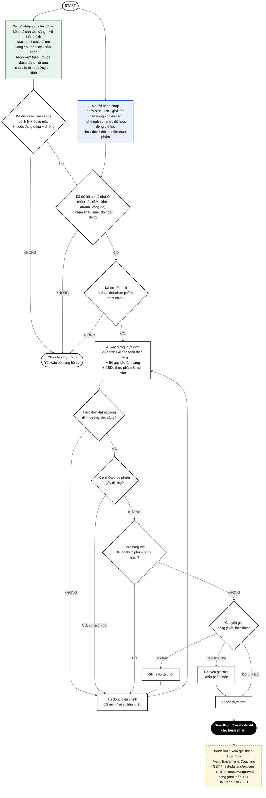

# UI Flow

> **Ghi chú 2026-08-09:**
> - Nhánh `EXPLAIN` (nét đứt = đang phát triển, chưa merge `main`) mô tả tính năng Menu Explainer & Coaching — bệnh nhân xem giải thích thực đơn bằng ngôn ngữ tự nhiên SAU khi đã duyệt. Chi tiết: `docs/PRD.md` FR-16, `docs/TICKETS.md` `AGT-13`.
> - `PT_IN` ("thực đơn / thành phần thực phẩm") hiện là luồng nhập **bằng văn bản**. Luồng chụp ảnh mâm cơm/món ăn (VLM) **KHÔNG được vẽ thêm vào đây** — R2 đang đánh giá lại có điều kiện (Gemma 4 E2B), nhưng CHƯA có quyết định chính thức đổi phạm vi MVP. Xem `docs/Nghiên cứu ứng dụng LLM và CP-SAT tạo thực đơn cho người đái tháo đường.md` mục "Tầng thị giác/VLM" trước khi thêm nhánh ảnh vào flow này.
