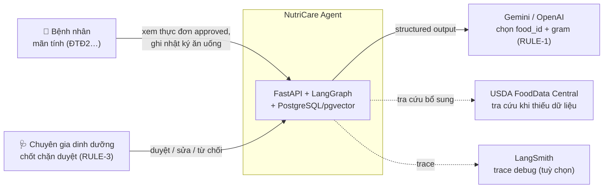
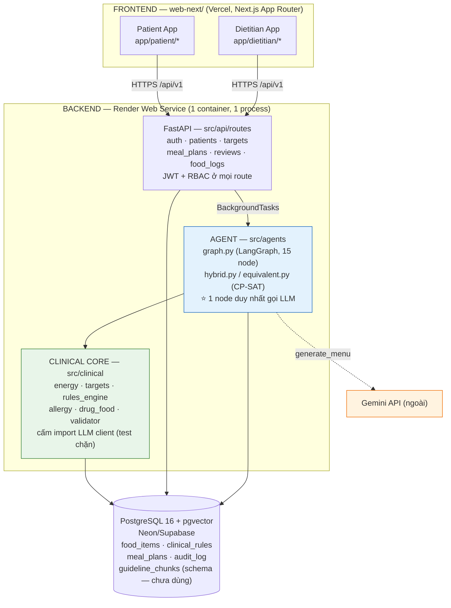
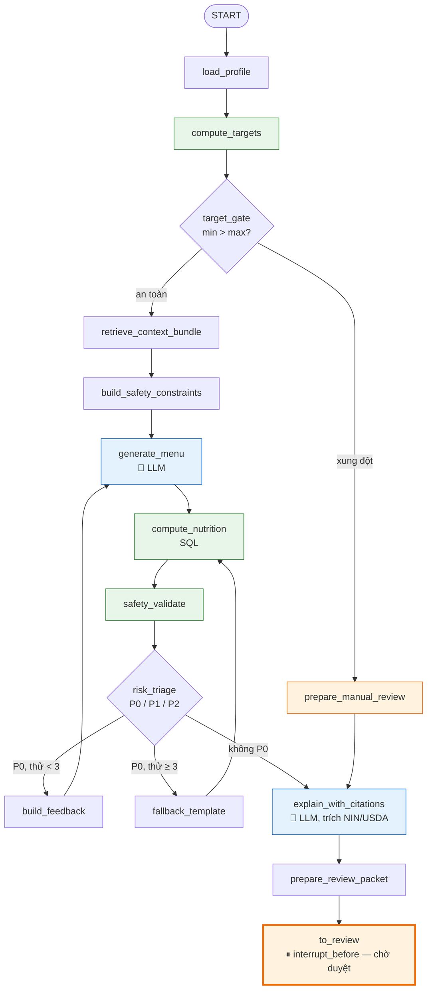
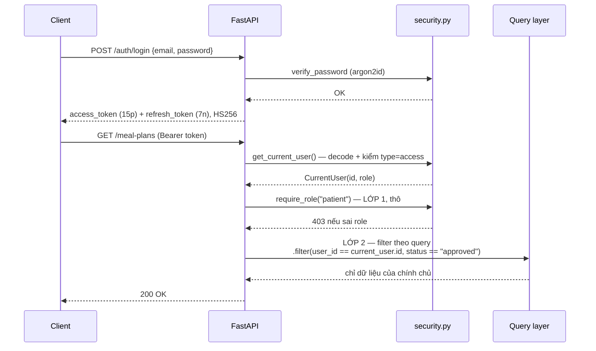
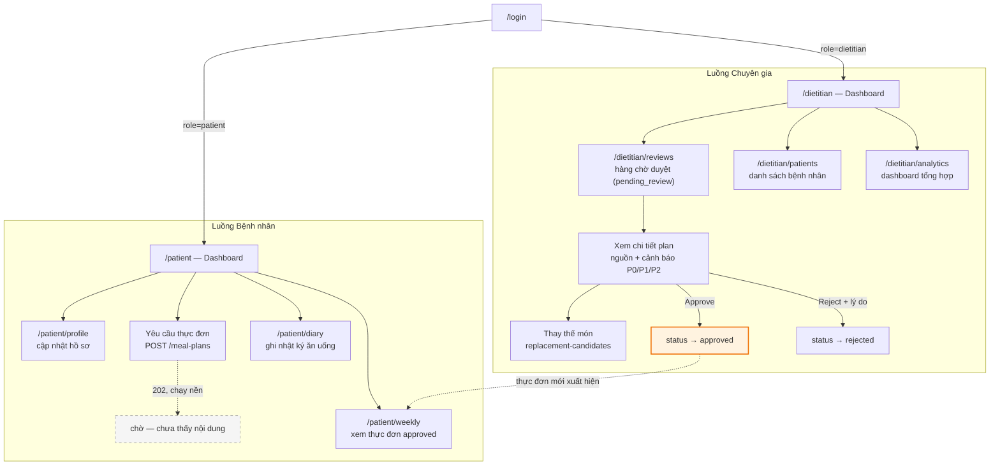
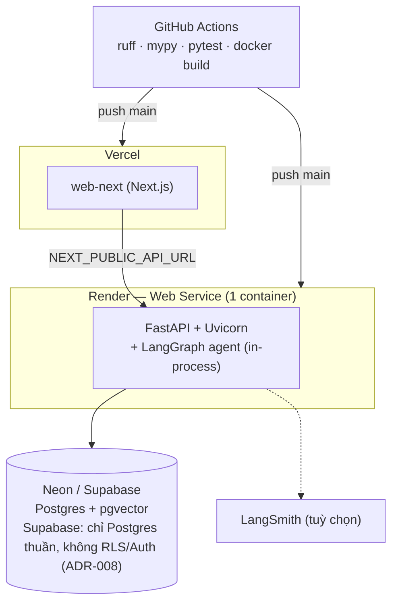

# Architecture — NutriCare Agent

> Sơ đồ Mermaid, render trực tiếp trên GitHub — không cần mở file ảnh. Nguồn đối chiếu trực tiếp với code tại thời điểm viết (16/08/2026): `src/agents/graph.py`, `src/agents/nodes/core.py`, `src/api/routes/`, `src/api/security.py`, `src/services/llm.py`, `src/db/models.py`.
>
> Bản đầy đủ hơn (ERD 15 bảng, sequence chi tiết, guardrail 4 tầng): [`docs/ARCHITECTURE.md`](../docs/ARCHITECTURE.md). File này là bản tóm tắt tập trung đúng khung đánh giá: Frontend / Backend / Agent / Vector DB / API ngoài + luồng dữ liệu.

## Mục lục

1. [System Context](#1-system-context)
2. [Container & Component View](#2-container--component-view)
3. [Data Flow](#3-data-flow)
4. [AI Agent & Safety Pipeline](#4-ai-agent--safety-pipeline)
5. [Authentication & Authorization](#5-authentication--authorization)
6. [UI Flow](#6-ui-flow)
7. [Deployment Topology](#7-deployment-topology)

---

## 1. System Context

Ai dùng hệ thống và hệ thống nói chuyện với dịch vụ ngoài nào. Không tác nhân nào tự động nhận thực đơn — mọi mũi tên tới "Bệnh nhân" chỉ mang dữ liệu đã `status=approved`.

## 2. Container & Component View

Chi tiết dễ bỏ sót: **Agent và Clinical Core không phải service riêng** — chạy trong cùng tiến trình Python với FastAPI, gọi qua `BackgroundTasks` (threadpool), không phải RPC qua mạng. Vector DB (pgvector) đã có schema nhưng pipeline ingest/retrieval **chưa nối dây** (xem ghi chú trong sơ đồ 3).

## 3. Data Flow

Dữ liệu **thật sự** di chuyển qua đâu trong một lượt sinh thực đơn — không phải sơ đồ component, mà là hành trình của con số dinh dưỡng, từ hồ sơ bệnh nhân tới màn hình bệnh nhân, đi qua đúng ranh giới RULE-1 (LLM chỉ chọn món) và RULE-3 (chỉ `approved` mới ra ngoài).

```mermaid
flowchart LR
    A["PatientProfile<br/>(DB)"] --> B["compute_targets()<br/>SQL/Python — ngưỡng theo bệnh lý"]
    B --> C["candidate shortlisting<br/>src/agents/nodes/core.py<br/>lọc dị ứng/thích, chọn top-k tất định"]
    C --> D["generate_menu<br/>LLM — CHỈ trả food_id + gram"]
    D --> E["compute_nutrition()<br/>SQL — sum kcal/Na/K/P từ food_items"]
    E --> F["safety_validate()<br/>so khớp thực đơn ↔ ngưỡng"]
    F --> G{"risk_triage<br/>P0/P1/P2"}
    G -->|P0| D
    G -->|P1/P2/không P0| H["review packet<br/>+ nguồn NIN/USDA"]
    H --> I[("meal_plans<br/>status=pending_review")]
    I --> J["Chuyên gia duyệt<br/>POST /reviews/approve"]
    J --> K[("meal_plans<br/>status=approved")]
    K --> L["Patient App<br/>GET /meal-plans<br/>chỉ đọc approved"]

    RAG["guideline_chunks + pgvector<br/>❌ pipeline ingest/retrieval chưa triển khai"]
    C -.->|dự kiến, chưa nối| RAG

    style D fill:#e3f2fd,stroke:#1565c0
    style E fill:#e8f5e9,stroke:#2e7d32
    style F fill:#e8f5e9,stroke:#2e7d32
    style B fill:#e8f5e9,stroke:#2e7d32
    style J fill:#fff3e0,stroke:#ef6c00
    style RAG fill:#f5f5f5,stroke:#9e9e9e,stroke-dasharray: 5 5
```

**Điểm mấu chốt:** node xanh dương (`generate_menu`) là nơi duy nhất LLM chạm vào dữ liệu — và nó chỉ trả về `food_id`+gram. Mọi ô xanh lá là tính toán tất định bằng SQL/Python. Nhánh RAG (xám, nét đứt) được vẽ để trung thực về hiện trạng: bảng đã có, chưa được nối vào luồng chọn món.

## 4. AI Agent & Safety Pipeline

`src/agents/graph.py` — 15 node. Hai điểm rẽ nhánh: xung đột mục tiêu lâm sàng đi thẳng sang duyệt thủ công; rủi ro **P0** vòng lại sinh thực đơn tối đa 3 lần rồi mới dùng mẫu dự phòng. **P1/P2** không chặn — đi tiếp kèm cảnh báo tới bàn duyệt (fail-closed có kiểm soát, không fail-silent).

### Phân cấp cảnh báo (`risk_triage`)

| Tầng | Ý nghĩa | Hành vi |
|---|---|---|
| **P0** | Nguy hiểm (vượt ngưỡng cứng, tương tác thuốc nặng...) | Chặn phát hành, `build_feedback` → sinh lại tối đa 3 lần → `fallback_template` |
| **P1** | Cảnh báo | Đi tiếp, gắn `warning` vào review packet cho chuyên gia |
| **P2** | Thông tin | Ghi chú tham khảo, không chặn |

## 5. Authentication & Authorization

Hai lớp tách biệt: **role check** (thô, ở tầng dependency `require_role`) và **row-level ownership filter** (mịn, ở tầng query) — thiếu lớp thứ hai là lỗ hổng IDOR kinh điển, dự án có cả hai.

## 6. UI Flow

Hai luồng màn hình tách biệt theo vai trò — bệnh nhân không bao giờ có đường vào hàng chờ duyệt; chuyên gia là cổng bắt buộc trước khi bệnh nhân thấy bất kỳ thực đơn nào.

## 7. Deployment Topology

Một service Render duy nhất phục vụ cả API lẫn Agent (không có worker service riêng — khớp với mục 2). Cold start free tier ~50s, cần "warm up" trước demo.

