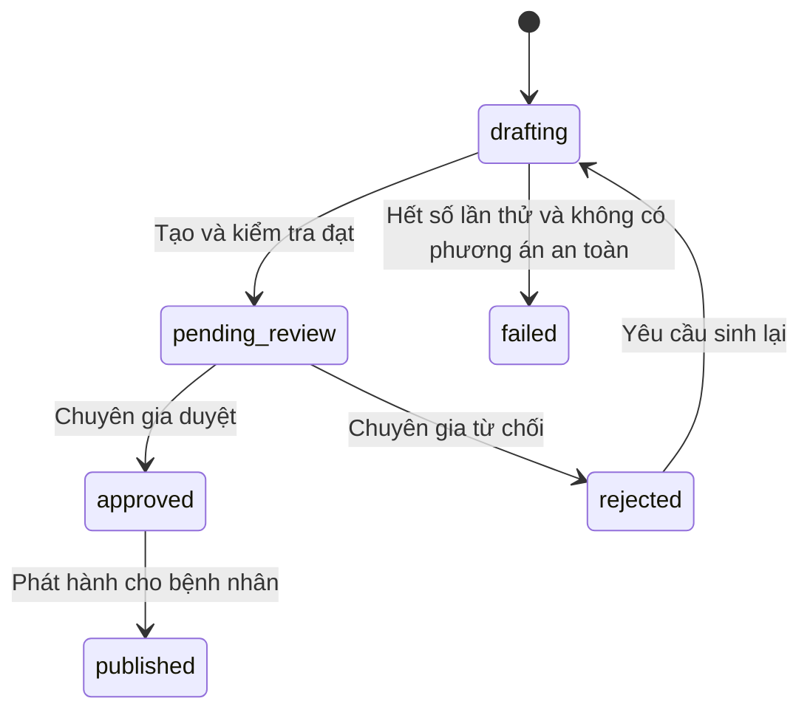

# Tài liệu API — NutriCare Agent

> Phiên bản tài liệu: **1.0**  
> Ngày cập nhật: **05/08/2026**  
> Tiền tố API: **`/api/v1`**  
> Mục đích: làm quy ước chung giữa giao diện, máy chủ, lõi lâm sàng, bộ tối ưu CP-SAT và tác nhân AI.

## 1. Phạm vi và trạng thái

Tài liệu này mô tả cả API hiện có và API dự kiến trong kế hoạch ba tuần. Mỗi API được gắn một trong các trạng thái:

| Ký hiệu | Ý nghĩa |
|---|---|
| ✅ Đã có | Đã được khai báo trong mã nguồn và có thể gọi |
| 🟡 Khung | Đã có đường dẫn nhưng chưa xử lý nghiệp vụ hoàn chỉnh |
| ⬜ Dự kiến | Quy ước để đội phát triển; chưa được coi là đã triển khai |

### Hiện trạng nhanh

| Phương thức | Đường dẫn | Trạng thái | Mục đích |
|---|---|---|---|
| `GET` | `/health` | ✅ Đã có | Kiểm tra máy chủ |
| `GET` | `/api/v1/health` | ✅ Đã có | Kiểm tra máy chủ dưới tiền tố API |
| `GET` | `/api/v1/status` | ✅ Đã có | Kiểm tra trạng thái tác nhân AI |
| `POST` | `/api/v1/chat` | 🟡 Khung | Hiện luôn trả `501 Chưa triển khai` |
| Các API còn lại | `/api/v1/...` | ⬜ Dự kiến | Sẽ triển khai theo kế hoạch ba tuần |

> Không được dùng bảng API dự kiến làm bằng chứng rằng tính năng đã hoàn thành. Trạng thái chỉ chuyển sang “Đã có” sau khi mã nguồn, kiểm thử và tài liệu OpenAPI cùng tồn tại.

## 2. Thuật ngữ

| Từ | Cách hiểu |
|---|---|
| API | Cổng để giao diện và máy chủ trao đổi dữ liệu |
| Mã truy cập | Chuỗi xác nhận người dùng đã đăng nhập |
| Lõi lâm sàng | Phần chương trình tính định mức theo hồ sơ và quy tắc y khoa |
| CP-SAT | Bộ tối ưu chọn món và khẩu phần theo các giới hạn đã được cung cấp |
| Tác nhân AI | Luồng LangGraph hiểu yêu cầu, chọn món và giải thích kết quả |
| Chờ duyệt | Thực đơn đã được máy kiểm tra nhưng chưa được chuyên gia phê duyệt |
| Nguồn | Tài liệu hoặc bảng dữ liệu chứng minh giá trị dinh dưỡng |

## 3. Nguyên tắc bắt buộc

1. Mô hình ngôn ngữ chỉ được đề xuất mã món và số gram; không tự tạo kcal, natri, protein hoặc các số dinh dưỡng khác.
2. Python/SQL tính toàn bộ số dinh dưỡng từ dữ liệu đã có nguồn.
3. Lõi lâm sàng cung cấp giới hạn; CP-SAT chỉ tối ưu trong giới hạn đó và không tự đưa ra quyết định y khoa.
4. Thực đơn mới sinh luôn ở trạng thái chờ duyệt.
5. Bệnh nhân không được xem nội dung thực đơn chưa duyệt.
6. Mọi lần sửa, duyệt hoặc từ chối phải được ghi vào nhật ký kiểm tra.
7. Dữ liệu sử dụng trong giai đoạn này là dữ liệu bệnh nhân mô phỏng.
8. Không trả phân tích nội bộ hoặc câu lệnh hệ thống của mô hình ra API công khai.

## 4. Địa chỉ và tài liệu tự động

### Môi trường máy cá nhân

```text
Địa chỉ máy chủ: http://localhost:8000
Tài liệu Swagger: http://localhost:8000/docs
Tệp OpenAPI:      http://localhost:8000/openapi.json
```

Địa chỉ môi trường chạy thử sẽ được bổ sung sau khi triển khai. Không ghi khóa bí mật vào tài liệu này.

### Kiểu dữ liệu chung

- Ngày giờ dùng ISO 8601 và múi giờ rõ ràng, ví dụ `2026-08-25T14:30:00+07:00`.
- Khối lượng thực phẩm dùng `gram`.
- Năng lượng dùng `kcal`.
- Natri, kali, phospho và purine dùng `mg`.
- Protein, carbohydrate, chất béo, chất xơ và đường dùng `g`.
- Mã bản ghi dùng chuỗi duy nhất hoặc số nguyên; một loại bản ghi phải dùng thống nhất một kiểu.
- Trường chưa có dữ liệu dùng `null`, không dùng chuỗi rỗng hoặc số `0` để thay thế.

## 5. Đăng nhập và phân quyền

Các API cần đăng nhập sử dụng tiêu đề:

```http
Authorization: Bearer <ma_truy_cap>
Content-Type: application/json
```

### Vai trò

| Hành động | Bệnh nhân | Chuyên gia dinh dưỡng | Quản trị viên |
|---|:---:|:---:|:---:|
| Xem và sửa hồ sơ của mình | Có | Có | Có |
| Xem hồ sơ bệnh nhân được giao | Không | Có | Có |
| Yêu cầu sinh thực đơn | Có | Có | Có |
| Xem thực đơn chờ duyệt | Không | Có | Có |
| Sửa, duyệt hoặc từ chối thực đơn | Không | Có | Có |
| Xem thực đơn đã duyệt của mình | Có | Có | Có |
| Xem nhật ký kiểm tra | Không | Theo phạm vi được giao | Có |
| Sửa quy tắc lâm sàng | Không | Không | Có |

Khi bệnh nhân A yêu cầu tài nguyên của bệnh nhân B, máy chủ trả `404`, không trả `403`, để không tiết lộ tài nguyên đó có tồn tại.

## 6. Khuôn dạng phản hồi

### Thành công

API trả trực tiếp đối tượng hoặc danh sách đã mô tả. API tạo mới thường trả `201`; tác vụ sinh thực đơn chạy lâu trả `202`.

### Lỗi thống nhất đề xuất

```json
{
  "error": {
    "code": "VALIDATION_ERROR",
    "message": "Dữ liệu gửi lên chưa hợp lệ",
    "details": [
      {
        "field": "weight_kg",
        "message": "Cân nặng phải nằm trong khoảng 20–300 kg"
      }
    ],
    "trace_id": "tr_01JABCXYZ"
  }
}
```

| Mã HTTP | Ý nghĩa |
|---:|---|
| `200` | Thành công |
| `201` | Đã tạo bản ghi |
| `202` | Đã nhận yêu cầu và đang xử lý |
| `400` | Yêu cầu sai nghiệp vụ |
| `401` | Chưa đăng nhập hoặc mã truy cập hết hạn |
| `403` | Đã đăng nhập nhưng sai vai trò |
| `404` | Không tìm thấy hoặc không được phép biết tài nguyên tồn tại |
| `409` | Xung đột trạng thái, ví dụ duyệt lại thực đơn đã duyệt |
| `422` | Dữ liệu đầu vào không hợp lệ |
| `429` | Gửi quá nhiều yêu cầu |
| `500` | Lỗi máy chủ |
| `501` | API mới là khung, chưa triển khai |
| `503` | Dịch vụ phụ thuộc tạm thời không sẵn sàng |

## 7. API đang có trong mã nguồn

### 7.1. Kiểm tra máy chủ

**`GET /health` — ✅ Đã có**  
**`GET /api/v1/health` — ✅ Đã có**

Hai đường dẫn trả cùng kiểu dữ liệu. Không cần đăng nhập.

Phản hồi `200`:

```json
{
  "status": "ok",
  "env": "development"
}
```

### 7.2. Kiểm tra tác nhân AI

**`GET /api/v1/status` — ✅ Đã có**

Không cần đăng nhập.

Phản hồi `200` hiện tại:

```json
{
  "status": "ready",
  "agent": "LangGraph Agent v1.0"
}
```

> Phản hồi này chỉ cho biết đường dẫn hoạt động; chưa chứng minh luồng LangGraph, dữ liệu hoặc mô hình ngôn ngữ đã sẵn sàng.

### 7.3. Trò chuyện với tác nhân AI

**`POST /api/v1/chat` — 🟡 Khung**

Hiện tại API chưa nhận thân yêu cầu và luôn trả:

```json
{
  "detail": "Chưa triển khai — xem ticket BE-06"
}
```

Mã HTTP: `501`.

Khuôn dạng dự kiến sau này:

```json
{
  "message": "Tôi bị tăng huyết áp, nên giảm món nào?"
}
```

Không đưa trường `analysis` hoặc phân tích nội bộ của mô hình vào phản hồi công khai.

## 8. API đăng nhập — dự kiến

### 8.1. Đăng nhập

**`POST /api/v1/auth/login` — ⬜ Dự kiến**

Yêu cầu:

```json
{
  "email": "patient.demo@nutricare.local",
  "password": "mat-khau-demo"
}
```

Phản hồi `200`:

```json
{
  "access_token": "<ma_truy_cap>",
  "refresh_token": "<ma_lam_moi>",
  "token_type": "bearer",
  "expires_in": 1800,
  "user": {
    "id": "usr_patient_01",
    "role": "patient",
    "display_name": "Bệnh nhân mô phỏng 01"
  }
}
```

### 8.2. Làm mới mã truy cập

**`POST /api/v1/auth/refresh` — ⬜ Dự kiến**

```json
{
  "refresh_token": "<ma_lam_moi>"
}
```

### 8.3. Lấy thông tin người đang đăng nhập

**`GET /api/v1/auth/me` — ⬜ Dự kiến**

Yêu cầu đăng nhập. Phản hồi chứa mã người dùng, tên hiển thị và vai trò; không trả mật khẩu hoặc khóa bí mật.

## 9. API hồ sơ bệnh nhân — dự kiến

### 9.1. Tạo hồ sơ

**`POST /api/v1/patients` — ⬜ Dự kiến**

```json
{
  "age": 58,
  "sex": "male",
  "height_cm": 165,
  "weight_kg": 65,
  "activity_level": "light",
  "weight_goal": "maintain",
  "conditions": [
    {"code": "T2DM", "stage": null},
    {"code": "CKD", "stage": "G3b"}
  ],
  "allergies": ["hải sản"],
  "medications": ["metformin"],
  "region": "north",
  "dislikes": ["mướp đắng"],
  "frailty_sarcopenia": false,
  "metabolically_unstable": false,
  "sodium_wasting": false
}
```

Phản hồi `201` thêm `patient_id`, thời gian tạo và thời gian cập nhật.

### 9.2. Đọc hồ sơ

**`GET /api/v1/patients/{patient_id}` — ⬜ Dự kiến**

Quyền truy cập:

- Bệnh nhân chỉ đọc hồ sơ của mình.
- Chuyên gia chỉ đọc bệnh nhân được giao.
- Quản trị viên đọc theo phạm vi quản trị.

### 9.3. Cập nhật hồ sơ

**`PATCH /api/v1/patients/{patient_id}` — ⬜ Dự kiến**

Chỉ gửi các trường cần thay đổi. Thay đổi bệnh lý, thuốc hoặc dị ứng phải được ghi nhật ký.

### Giá trị hợp lệ

| Trường | Giá trị |
|---|---|
| `sex` | `male`, `female` |
| `activity_level` | `sedentary`, `light`, `moderate`, `active` |
| `weight_goal` | `lose`, `maintain`, `gain` |
| `condition.code` | `T2DM`, `HTN`, `CKD`, `GOUT` |
| `region` | `north`, `central`, `south`, hoặc `null` |
| `age` | 1–120 |
| `height_cm` | 80–250 |
| `weight_kg` | 20–300 |

## 10. API tính định mức lâm sàng — dự kiến

### 10.1. Tính định mức từ hồ sơ đã lưu

**`POST /api/v1/targets/compute` — ⬜ Dự kiến**

Yêu cầu:

```json
{
  "patient_id": "pat_demo_01"
}
```

Phản hồi `200` minh họa:

```json
{
  "patient_id": "pat_demo_01",
  "bmr_kcal": 1420.5,
  "tdee_kcal": 1953.2,
  "targets": {
    "kcal": {
      "nutrient": "kcal",
      "min_value": 1758,
      "max_value": 2148,
      "unit": "kcal/day",
      "rule_ids": ["BASE-ENERGY-01"],
      "guideline_refs": ["Mifflin-St Jeor"]
    },
    "na_mg": {
      "nutrient": "na_mg",
      "min_value": null,
      "max_value": 2000,
      "unit": "mg/day",
      "rule_ids": ["CKD-NA-01", "HTN-NA-01"],
      "guideline_refs": ["KDIGO 2024", "WHO Sodium Guideline"]
    }
  },
  "applied_rule_ids": ["BASE-ENERGY-01", "CKD-NA-01", "HTN-NA-01"],
  "needs_expert_review": false,
  "conflict_notes": []
}
```

Lưu ý:

- Ví dụ trên chỉ minh họa cấu trúc, không phải kết luận y khoa cho một bệnh nhân thật.
- API này không gọi mô hình ngôn ngữ và không gọi CP-SAT.
- Khi nhiều bệnh cùng giới hạn một chất, lõi lâm sàng chọn giới hạn an toàn hơn và trả quy tắc đã áp dụng.

## 11. API thực đơn — dự kiến

### 11.1. Yêu cầu sinh thực đơn

**`POST /api/v1/meal-plans` — ⬜ Dự kiến**

```json
{
  "patient_id": "pat_demo_01",
  "days": 1,
  "preferences": {
    "region": "north",
    "available_food_ids": [1, 2, 8, 15, 21]
  }
}
```

Phản hồi `202`:

```json
{
  "plan_id": "plan_01JABCXYZ",
  "status": "drafting",
  "message": "Hệ thống đã nhận yêu cầu sinh thực đơn",
  "status_url": "/api/v1/meal-plans/plan_01JABCXYZ/status",
  "trace_id": "tr_01JABCXYZ"
}
```

Luồng xử lý phía máy chủ:

```text
Đọc hồ sơ
→ tính định mức lâm sàng
→ lấy món phù hợp
→ mô hình ngôn ngữ đề xuất món
→ CP-SAT tối ưu món và khẩu phần
→ Python/SQL tính dinh dưỡng
→ kiểm tra giới hạn và dị ứng
→ sinh lại tối đa 3 lần nếu chưa đạt
→ chuyển sang chờ chuyên gia duyệt
```

### 11.2. Xem trạng thái xử lý

**`GET /api/v1/meal-plans/{plan_id}/status` — ⬜ Dự kiến**

```json
{
  "plan_id": "plan_01JABCXYZ",
  "status": "pending_review",
  "retry_count": 1,
  "needs_attention": false,
  "updated_at": "2026-08-20T14:30:00+07:00"
}
```

Bệnh nhân được xem trạng thái nhưng không được xem nội dung khi trạng thái là `drafting` hoặc `pending_review`.

### 11.3. Danh sách thực đơn của bệnh nhân

**`GET /api/v1/meal-plans?patient_id={patient_id}&status=approved` — ⬜ Dự kiến**

Đối với vai trò bệnh nhân, máy chủ phải tự ép bộ lọc chỉ lấy thực đơn đã duyệt; không tin giá trị `status` do giao diện gửi lên.

### 11.4. Xem thực đơn

**`GET /api/v1/meal-plans/{plan_id}` — ⬜ Dự kiến**

Phản hồi minh họa sau khi đã duyệt:

```json
{
  "plan_id": "plan_01JABCXYZ",
  "patient_id": "pat_demo_01",
  "status": "approved",
  "meals": {
    "breakfast": [
      {
        "food_id": 12,
        "name": "Cháo yến mạch",
        "grams": 250,
        "source": "USDA",
        "source_ref": "FDC-123456",
        "is_estimated": false
      }
    ],
    "lunch": [],
    "dinner": [],
    "snack": []
  },
  "nutrition": {
    "kcal": 1812.4,
    "protein_g": 48.2,
    "carb_g": 238.1,
    "fat_g": 62.5,
    "fiber_g": 27.3,
    "sugar_g": 31.2,
    "sugar_is_complete": true,
    "na_mg": 1875,
    "k_mg": 2410,
    "p_mg": 820,
    "purine_mg": 315,
    "has_estimated": false
  },
  "violations": [],
  "review": {
    "reviewer_name": "Chuyên gia mô phỏng",
    "approved_at": "2026-08-20T15:00:00+07:00"
  },
  "disclaimer": "Thực đơn hỗ trợ tham khảo và đã được chuyên gia duyệt; không thay thế chẩn đoán hoặc điều trị y khoa."
}
```

## 12. API chuyên gia kiểm duyệt — dự kiến

### 12.1. Hàng chờ duyệt

**`GET /api/v1/reviews/pending?page=1&page_size=20` — ⬜ Dự kiến**

Chỉ chuyên gia và quản trị viên được gọi.

Phản hồi `200`:

```json
{
  "items": [
    {
      "plan_id": "plan_01JABCXYZ",
      "patient_id": "pat_demo_01",
      "created_at": "2026-08-20T14:30:00+07:00",
      "needs_attention": false,
      "hard_violation_count": 0,
      "soft_violation_count": 1
    }
  ],
  "page": 1,
  "page_size": 20,
  "total": 1
}
```

### 12.2. Duyệt nguyên trạng

**`POST /api/v1/reviews/{plan_id}/approve` — ⬜ Dự kiến**

```json
{
  "notes": "Thực đơn phù hợp với hồ sơ mô phỏng."
}
```

Máy chủ phải kiểm tra lại trước khi duyệt. Nếu còn vi phạm bắt buộc, trả `409`.

### 12.3. Sửa khẩu phần và duyệt

**`POST /api/v1/reviews/{plan_id}/approve` — ⬜ Dự kiến**

```json
{
  "edits": [
    {
      "food_id": 12,
      "meal_slot": "breakfast",
      "grams": 220
    }
  ],
  "notes": "Giảm khẩu phần bữa sáng."
}
```

Sau khi sửa, máy chủ phải:

1. Tính lại toàn bộ dinh dưỡng bằng Python/SQL.
2. Kiểm tra lại giới hạn, dị ứng và tương tác liên quan.
3. Từ chối duyệt nếu còn vi phạm bắt buộc.
4. Lưu dữ liệu trước/sau vào nhật ký kiểm tra.

### 12.4. Từ chối

**`POST /api/v1/reviews/{plan_id}/reject` — ⬜ Dự kiến**

```json
{
  "reason": "Lượng tinh bột bữa tối chưa phù hợp; cần sinh lại."
}
```

`reason` là bắt buộc. Chuỗi trống trả `422`.

## 13. API nhật ký kiểm tra — dự kiến

**`GET /api/v1/audit?resource_type=meal_plan&resource_id={plan_id}` — ⬜ Dự kiến**

Phản hồi:

```json
{
  "items": [
    {
      "id": "audit_01",
      "action": "meal_plan.approved",
      "actor_id": "usr_dietitian_01",
      "actor_role": "dietitian",
      "resource_id": "plan_01JABCXYZ",
      "before": {"status": "pending_review"},
      "after": {"status": "approved"},
      "created_at": "2026-08-20T15:00:00+07:00",
      "trace_id": "tr_01JABCXYZ"
    }
  ]
}
```

Không xây API sửa hoặc xóa nhật ký.

## 14. Trạng thái thực đơn

| Trạng thái | Ý nghĩa | Bệnh nhân xem nội dung? |
|---|---|:---:|
| `drafting` | Hệ thống đang tạo hoặc tối ưu | Không |
| `pending_review` | Đã qua kiểm tra máy, đang chờ chuyên gia | Không |
| `approved` | Chuyên gia đã duyệt | Có |
| `rejected` | Chuyên gia từ chối | Không |
| `published` | Bản đã duyệt được phát hành cho bệnh nhân | Có |
| `failed` | Sinh thực đơn thất bại | Không |

Chuyển trạng thái hợp lệ:



Không cho chuyển trực tiếp `drafting → published` hoặc `pending_review → published`.

## 15. Mối quan hệ giữa API và các thành phần

| API | Lõi lâm sàng | CP-SAT | Tác nhân AI | Chuyên gia duyệt |
|---|:---:|:---:|:---:|:---:|
| Đăng nhập/hồ sơ | Không | Không | Không | Không |
| Tính định mức | Có | Không | Không | Không |
| Sinh thực đơn | Có | Có | Có | Chưa, chỉ chuyển sang chờ |
| Xem trạng thái | Không | Không | Không | Không |
| Duyệt/sửa thực đơn | Kiểm tra lại | Có thể tối ưu lại | Không bắt buộc | Có |
| Trò chuyện | Có thể tra cứu | Không bắt buộc | Có | Chuyển câu hỏi khi cần |

## 16. Yêu cầu kiểm thử tối thiểu

### Đăng nhập và phân quyền

- Không có mã truy cập gọi API riêng tư phải nhận `401`.
- Bệnh nhân gọi hàng chờ duyệt phải nhận `403`.
- Bệnh nhân A gọi hồ sơ/thực đơn của B phải nhận `404`.
- Mã truy cập hết hạn phải nhận `401`.

### Hồ sơ và lâm sàng

- Tuổi, chiều cao, cân nặng ngoài khoảng hợp lệ phải nhận `422`.
- Hồ sơ nhiều bệnh phải chọn ngưỡng an toàn hơn và trả các quy tắc đã áp dụng.
- Mọi định mức phải có mã quy tắc và nguồn hướng dẫn.

### Thực đơn

- Mã thực phẩm không tồn tại phải bị từ chối.
- Mọi giá trị dinh dưỡng phải có nguồn.
- Phần tính dinh dưỡng không được gọi mô hình ngôn ngữ.
- Dị ứng là vi phạm bắt buộc và không được bỏ qua.
- Quá ba lần sinh lại phải dừng, không lặp vô hạn.
- Bệnh nhân không thể xem nội dung thực đơn chờ duyệt bằng cả giao diện lẫn gọi API trực tiếp.

### Kiểm duyệt

- Từ chối không có lý do phải nhận `422`.
- Sửa gram phải tính và kiểm tra lại trước khi duyệt.
- Thực đơn còn vi phạm bắt buộc không được duyệt.
- Mọi thay đổi phải có người thực hiện, thời gian và dữ liệu trước/sau.

## 17. Quy tắc cập nhật tài liệu

Khi thêm hoặc sửa API, người thực hiện phải:

1. Cập nhật mô hình dữ liệu Pydantic để OpenAPI sinh đúng.
2. Cập nhật trạng thái và ví dụ trong tài liệu này.
3. Thêm kiểm thử cho trường hợp thành công, dữ liệu sai và sai quyền.
4. Kiểm tra `/docs` và `/openapi.json` sau khi chạy máy chủ.
5. Không đánh dấu “Đã có” trước khi mã nguồn và kiểm thử được gộp.
6. Nếu cấu trúc phản hồi thay đổi, báo cho người làm giao diện trước khi gộp mã.

