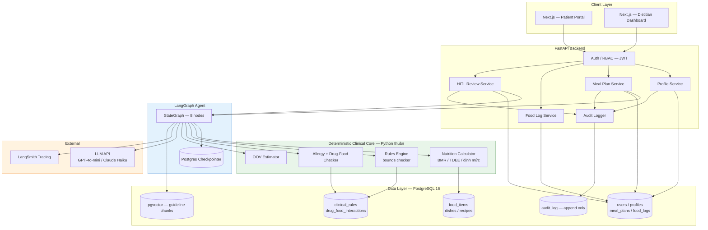
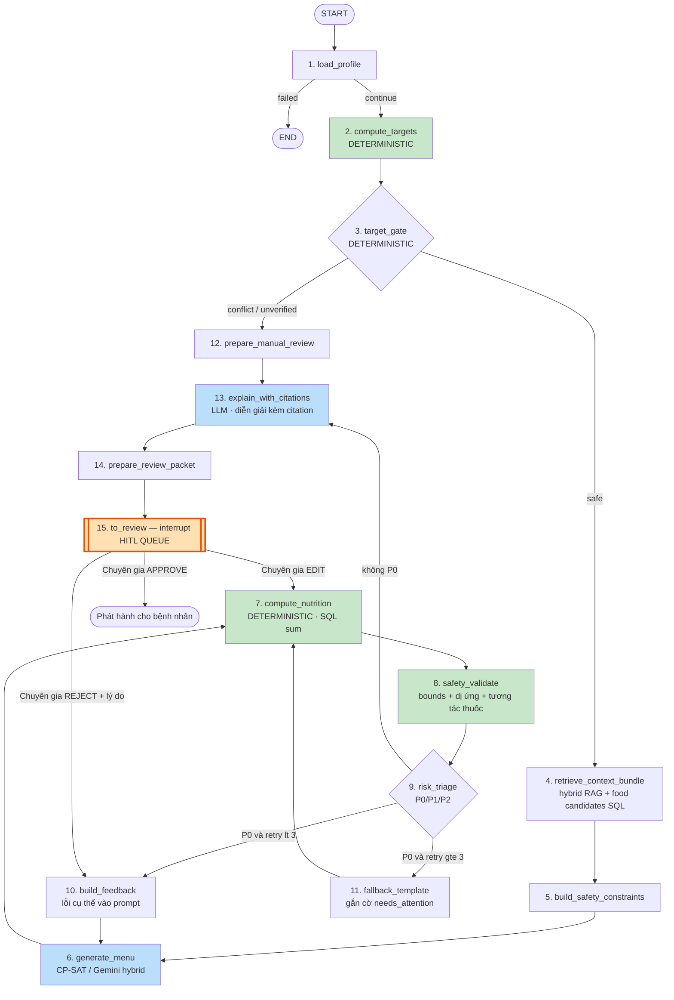
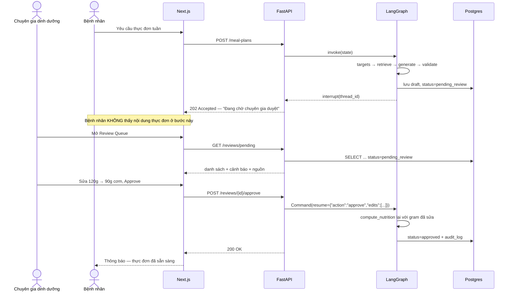
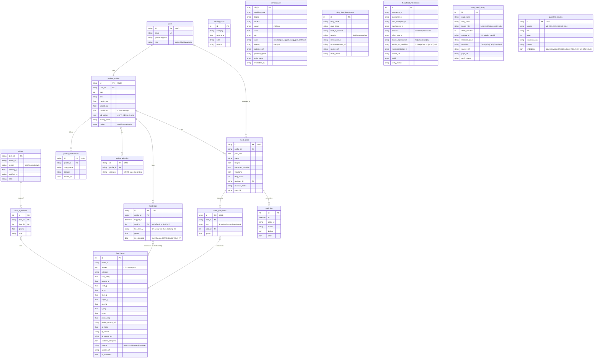
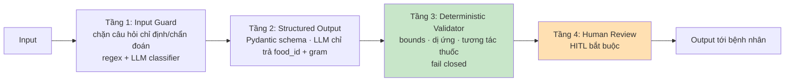
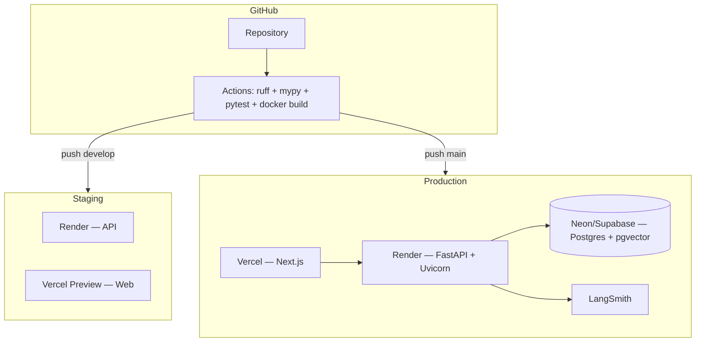

# ARCHITECTURE — NutriCare Agent

> Deliverable #3 · Phiên bản 1.0 · 26/07/2026
> Nguyên tắc bất biến: **LLM chọn món — Python tính số.**
> Kiến trúc trong file này trung lập về bệnh lý (schema, luồng graph, nguyên tắc). Phạm vi bệnh lý nghiệm thu MVP xem `docs/PRD.md` v2.1 (trọng tâm ĐTĐ2).

---

## 1. Nguyên tắc thiết kế

| # | Nguyên tắc | Diễn giải |
|---|---|---|
| P1 | **Determinism over eloquence** | Bất kỳ thứ gì đo được bằng công thức thì tính bằng code, không hỏi LLM |
| P2 | **No number without source** | Mọi giá trị dinh dưỡng đi kèm `food_id` + `source` + `source_url`; không có nguồn thì không hiển thị |
| P3 | **Human is the last gate** | Không có đường nào từ LLM đến bệnh nhân mà không qua bàn duyệt của chuyên gia |
| P4 | **Fail closed** | Validator nghi ngờ → chặn, không phát hành. Thà không có thực đơn còn hơn có thực đơn sai |
| P5 | **Everything is auditable** | Mọi lần sinh, sửa, duyệt đều ghi log bất biến kèm actor và timestamp |
| P6 | **One database** | Postgres + pgvector. Không thêm hệ quản trị dữ liệu nào nữa |

---

## 2. Sơ đồ tổng thể hệ thống



**Đọc sơ đồ:** khối xanh lá (Clinical Core) là nơi mọi con số được sinh ra — nó **không gọi LLM**. Khối xanh dương (Agent) gọi LLM nhưng chỉ để *chọn* và *diễn đạt*.

---

## 3. Luồng LangGraph Agent

> **Cập nhật 2026-08-09:** mục này trước đây mô tả graph 8-node ban đầu (thiết kế lúc lập kiến trúc). Graph thật trong `src/agents/graph.py` hiện có **15 node** (an toàn hơn: fail-closed có kiểm soát, gate ngưỡng lâm sàng tách riêng, phân loại rủi ro P0/P1/P2, audit đầy đủ). Đặc tả chi tiết từng lớp thay đổi + lý do: `docs/LANGGRAPH_ARCHITECTURE_COMPARISON.md`. Bản Mermaid dưới đây đồng bộ lại cho khớp `main`.



### `generate_menu` — CP-SAT/hybrid (đã triển khai, không phải chỉ LLM)

`src/agents/hybrid.py::HybridMenuGenerator` là generator thật đang dùng trong `generate_menu` (wired qua `AGT-10`) — ưu tiên giải bằng OR-Tools **CP-SAT chế độ feasibility-only** (đo được nhanh hơn nhiều so với chế độ tối đa hoá hàm mục tiêu: ~0,1s OPTIMAL so với ~105s rồi UNKNOWN), Gemini chỉ được gọi khi CP-SAT không tìm được nghiệm khả thi hoặc để chọn giữa các nghiệm hợp lệ (structured output, chỉ `food_id`+gram — RULE-1 vẫn giữ nguyên qua lớp này). Khi bài toán vô nghiệm vì tủ lạnh/nguyên liệu sẵn có không đủ, `src/agents/equivalent.py` (thực đơn tương đương, P2/AGT-12) tái dùng CP-SAT với tập ứng viên và dải ràng buộc thu hẹp quanh thực đơn gốc — "tương đương" được định nghĩa bằng ràng buộc toán học, không phải LLM phán đoán ngữ nghĩa.

### Vì sao node 7 (`compute_nutrition`) tách khỏi node 6 (`generate_menu`)

LLM/CP-SAT ở node 6 chỉ trả về JSON dạng:

```json
{"meals": [{"slot": "breakfast", "items": [{"food_id": 1042, "grams": 180}]}]}
```

Node 7 tự truy vấn SQL và tính tổng. **LLM không bao giờ nhìn thấy hay sinh ra con số kcal.** Đây là cơ chế chống bịa số ở tầng kiến trúc, không phải ở tầng prompt — mạnh hơn nhiều so với việc dặn LLM "đừng bịa".

### Explainer & Coaching cho bệnh nhân — dịch vụ ngoài graph (đang xây, chưa merge)

Khác với `explain_with_citations` (node 13, giải thích cho chuyên gia TRƯỚC khi duyệt), tính năng "Menu Explainer & Coaching" đang phát triển (PR #77 — B1 deterministic, `AGT-13` — B2 LLM+route) giải thích **thực đơn đã `approved`** cho bệnh nhân bằng ngôn ngữ tự nhiên. Đây là **endpoint gọi theo yêu cầu (`GET /meal-plans/{id}/explain`), KHÔNG phải node trong graph** — vì mọi node hiện tại chạy trước khi duyệt, còn việc duyệt (`POST /reviews/{planId}/approve`) chỉ đổi `status` trên DB, không resume graph. `src/clinical/menu_explainer.py` (assembler tất định) + `src/services/menu_explanation_guard.py` (chặn bịa số) + `src/services/menu_coach.py` (LLM văn phong hoá, B2) theo đúng mẫu đã dùng cho `target_assistant.py` (P1).

### State schema

> Cập nhật 2026-08-09: state thật trong `src/agents/graph.py` đã mở rộng nhiều so với bản thiết kế ban đầu bên dưới — thêm version/hash để audit, `target_gate`/`risk_triage`/`review_packet` cho luồng 15-node. Xem đặc tả nhóm trường đầy đủ + lý do mở rộng: `docs/LANGGRAPH_ARCHITECTURE_COMPARISON.md` §6 ("State hiện tại"). Khối dưới đây giữ lại làm ví dụ khái niệm ban đầu, không phải state thật hiện tại.

```python
class NutriState(TypedDict):
    # Input
    patient_id: str
    request_type: Literal["daily", "weekly", "family_meal"]
    date_range: tuple[date, date]

    # Deterministic outputs
    profile: PatientProfile
    targets: ClinicalTargets        # kcal, protein_g, na_mg, k_mg, p_mg, purine_mg, fiber_g
    applied_rule_ids: list[str]

    # RAG
    guideline_chunks: list[Chunk]
    candidate_foods: list[FoodItem]

    # Agent loop
    draft_menu: MenuDraft | None
    computed_nutrition: NutritionSummary | None
    violations: list[Violation]
    retry_count: int                # max 3
    feedback: str | None

    # HITL
    status: Literal["drafting","pending_review","approved","rejected","published"]
    reviewer_id: str | None
    reviewer_notes: str | None

    # Audit
    trace_id: str
    sources: list[SourceRef]        # bắt buộc không rỗng khi status=approved
```

---

## 4. Luồng HITL (sequence)



---

## 5. Mô hình dữ liệu

> ⚠️ **2026-08-05 (BE-01):** ERD dưới đây build ra thẳng từ `src/db/models.py`
> (SQLAlchemy, nguồn sự thật cho DDL) — 2 bản mô tả cùng 1 schema, sửa bên
> này phải sửa bên kia. So với bản vẽ ban đầu ở S1 (trước khi có dữ liệu
> thật), đã bổ sung 6 bảng: `dishes`, `dish_ingredients`, `serving_sizes`,
> `patient_medications`, `patient_allergies`, `food_logs`, `guideline_chunks`
> — những bảng này đã tồn tại thật trong `data/seeds/`/ticket DAT-04/DAT-06/
> CLN-05/CLN-06/BE-07 nhưng ERD cũ chưa vẽ ra. Đã build + chạy thật
> `alembic upgrade head` / `downgrade base` trên SQLite trắng — xem `alembic/`.



### Bảng bắt buộc có cột `source`

`food_items`, `dishes`, `clinical_rules`, `drug_food_interactions`, `food_food_interactions`, `drug_meal_timing`, `guideline_chunks`.
**CI có test chặn: không dòng nào được có `source IS NULL`.**

### Vì sao `dish_ingredients`/`meal_plan_items`/`food_logs` không tự tính dinh dưỡng

Đúng RULE-1: các bảng này chỉ lưu `food_id` + `grams` (+ `slot` cho thực đơn).
Không cột nào lưu sẵn kcal/Na/protein của dòng — mọi tổng dinh dưỡng tính lại
bằng SQL từ `food_items` tại thời điểm đọc, không bao giờ cache giá trị đã
tính (tránh lệch khi `food_items` được sửa lại sau).

---

## 6. Hợp đồng API (v1)

| Method | Endpoint | Role | Mô tả |
|---|---|---|---|
| POST | `/api/v1/auth/login` | public | JWT |
| GET | `/api/v1/health` | public | Health check |
| POST | `/api/v1/profiles` | patient, dietitian | Tạo/cập nhật hồ sơ |
| GET | `/api/v1/profiles/me` | patient | Hồ sơ của mình |
| POST | `/api/v1/targets/compute` | dietitian | Tính định mức lâm sàng (không cần LLM) |
| POST | `/api/v1/meal-plans` | patient, dietitian | Sinh thực đơn → trạng thái `pending_review` |
| GET | `/api/v1/meal-plans` | patient | Chỉ trả về `status=approved` |
| GET | `/api/v1/meal-plans/{id}` | owner, dietitian | Chi tiết + nguồn + cảnh báo |
| GET | `/api/v1/reviews/pending` | **dietitian** | Hàng chờ duyệt |
| POST | `/api/v1/reviews/{id}/approve` | **dietitian** | Duyệt (kèm edits tuỳ chọn) |
| POST | `/api/v1/reviews/{id}/reject` | **dietitian** | Từ chối + lý do (bắt buộc) |
| POST | `/api/v1/food-logs` | patient | Ghi nhật ký |
| GET | `/api/v1/food-logs/summary` | patient, dietitian | Tổng hợp ngày/tuần + cảnh báo ngưỡng |
| POST | `/api/v1/family-meal/decompose` | patient | Phân rã mâm cơm |
| GET | `/api/v1/shopping-list/{plan_id}` | patient | Danh sách đi chợ |
| POST | `/api/v1/chat` | patient, dietitian | Hội thoại (có guardrail chặn chỉ định y khoa) |

**Response envelope chuẩn** — mọi response chứa dữ liệu dinh dưỡng phải có:

```json
{
  "data": { "...": "..." },
  "sources": [
    {"food_id": 1042, "name": "Gạo tẻ máy", "source": "NIN", "ref": "Bảng TPTP VN 2007, tr.42"}
  ],
  "warnings": [
    {"type": "drug_food", "severity": "high", "message": "Bưởi tương tác với Atorvastatin"}
  ],
  "disclaimer": "Thông tin mang tính tham khảo, không thay thế chỉ định của bác sĩ. Đã được duyệt bởi CN. Nguyễn Văn X lúc 20/08/2026 14:32."
}
```

---

## 7. Kiến trúc Guardrails — 4 tầng



| Tầng | Chặn được gì | Không chặn được gì |
|---|---|---|
| 1. Input Guard | "Tôi bị bệnh gì?", "Giảm liều insulin được không?" | Câu hỏi ẩn ý |
| 2. Structured Output | LLM bịa số kcal, bịa tên thực phẩm | LLM chọn món không phù hợp |
| 3. Validator | Vượt ngưỡng Na/K/P/kcal, dị ứng, tương tác thuốc | Sai sót lâm sàng tinh vi |
| 4. HITL | Phần còn lại | — (đây là chốt chặn cuối) |

**Câu trả lời chuẩn khi Tầng 1 kích hoạt:**
> "Mình không thể đưa ra chẩn đoán hay điều chỉnh thuốc — việc đó thuộc thẩm quyền của bác sĩ điều trị. Mình có thể giúp bạn về khẩu phần ăn trong khuôn khổ chỉ định sẵn có. Bạn muốn mình chuyển câu hỏi này tới chuyên gia dinh dưỡng đang phụ trách bạn không?"

---

## 8. Bảo mật & Quyền riêng tư

| Khía cạnh | Thiết kế v1 |
|---|---|
| Xác thực | JWT (access 30 phút + refresh), argon2id cho mật khẩu |
| Phân quyền | RBAC ở tầng dependency của FastAPI, **kiểm tra ở cả API lẫn query** (bệnh nhân chỉ đọc `patient_id = current_user.profile_id`) |
| PHI trong prompt | **Không gửi tên, email, CCCD, địa chỉ vào LLM.** Chỉ gửi: tuổi, giới, cân nặng, chiều cao, mã bệnh, chỉ số xét nghiệm, danh sách thuốc |
| Mã hoá | TLS trên đường truyền; cột nhạy cảm dùng `pgcrypto` hoặc mã hoá tầng ứng dụng |
| Logging | Logger có filter tự động che PII; **cấm `print()`** |
| Audit | `audit_log` append-only, không có endpoint DELETE |
| Dữ liệu | NHANES 2021–2023 public-use, de-identified được phép cho dev/test; benchmark eval vẫn là synthetic; cấm SEQN/PII trong prompt và log |
| Tuân thủ | Tham chiếu Nghị định 13/2023/NĐ-CP. **Không tuyên bố "HIPAA compliant"** — chỉ nói "thiết kế theo nguyên tắc tối thiểu hoá dữ liệu" |

---

## 9. Deployment



- **Backend:** Render Web Service, Docker multi-stage, health check `/api/v1/health`
- **Frontend:** Vercel, biến `NEXT_PUBLIC_API_URL`
- **DB:** Neon free tier (có pgvector) hoặc Supabase — nếu chọn Supabase, chỉ dùng làm Postgres hosted thuần, xem ràng buộc ở ADR-008
- **Secrets:** chỉ qua env vars của platform, **không bao giờ trong repo**
- **Cold start Render free tier ~50s** → trước demo phải "warm up" bằng cách gọi health check

---

## 10. Cấu trúc thư mục (mở rộng từ template AI20K)

```
├── src/
│   ├── agents/
│   │   ├── graph.py               # StateGraph, edges, checkpointer
│   │   ├── state.py               # NutriState
│   │   ├── nodes/
│   │   │   ├── load_profile.py
│   │   │   ├── compute_targets.py     # KHÔNG gọi LLM
│   │   │   ├── retrieve_context.py
│   │   │   ├── generate_menu.py       # gọi LLM
│   │   │   ├── compute_nutrition.py   # KHÔNG gọi LLM
│   │   │   ├── validate.py            # KHÔNG gọi LLM
│   │   │   └── explain.py             # gọi LLM
│   │   └── tools/
│   │       ├── food_search.py
│   │       ├── nutrition_calculator.py
│   │       ├── meal_planner.py
│   │       └── interaction_checker.py
│   ├── clinical/                  # ⭐ Deterministic core — trái tim dự án
│   │   ├── energy.py              # BMR, TDEE
│   │   ├── targets.py             # định mức theo bệnh lý
│   │   ├── rules_engine.py        # bounds checker
│   │   ├── allergy.py
│   │   ├── drug_food.py
│   │   └── oov_estimator.py
│   ├── rag/
│   │   ├── ingest.py
│   │   ├── chunker.py
│   │   └── hybrid_search.py       # BM25 + pgvector
│   ├── api/routes/
│   │   ├── auth.py · profiles.py · meal_plans.py
│   │   ├── reviews.py · food_logs.py · chat.py
│   ├── models/                    # Pydantic schemas
│   ├── db/                        # SQLAlchemy models, Alembic
│   ├── core/                      # config, logging, security
│   └── main.py
├── web/                           # Next.js (nếu tách repo thì bỏ)
├── data/
│   ├── seeds/food_items.csv       # có cột source
│   ├── seeds/clinical_rules.csv
│   ├── seeds/drug_food.csv
│   └── guidelines/                # PDF/MD để ingest RAG
├── eval/
│   ├── datasets/cases_60.jsonl
│   ├── scripts/run_eval.py
│   └── results/report.md          # Deliverable #10
├── tests/{unit,integration,eval}
├── docs/                          # tài liệu này
├── DEVLOG.md                      # Deliverable #8 + #9
└── CLAUDE.md                      # rules cho AI coding agent
```

---

## 11. Architecture Decision Records (rút gọn)

| ADR | Quyết định | Lựa chọn thay thế đã cân nhắc | Lý do chọn |
|---|---|---|---|
| ADR-001 | Postgres + pgvector, không dùng Qdrant | Qdrant, Milvus, Chroma | Dưới 5.000 chunk; giảm 1 service; 1 connection string |
| ADR-002 | LLM chỉ trả `food_id` + gram | Cho LLM trả cả giá trị dinh dưỡng | Nghiên cứu chứng minh LLM lệch định lượng hệ thống; đây là chống bịa ở tầng kiến trúc |
| ADR-003 | 1 graph (nay 15 node, mở rộng từ thiết kế ban đầu 8 node — xem `docs/LANGGRAPH_ARCHITECTURE_COMPARISON.md`), không 5 agent rời | Multi-agent CrewAI | Debug được, latency thấp, vẫn thể hiện được agentic loop |
| ADR-004 | HITL bằng LangGraph `interrupt` + checkpointer | Bảng status thuần | Đúng chuẩn LangGraph, resume được state; **có fallback nếu quá phức tạp** |
| ADR-005 | Drug-food curated 80 cặp thay vì DDID 23.950 | Import DDID | License chưa rõ; 80 cặp đủ bao phủ 4 nhóm bệnh của đề bài |
| ADR-006 | Render + Vercel, không K8s | AWS EKS, GCP GKE | 6 tuần, free tier, không được thêm điểm nếu dùng K8s |
| ADR-007 | Fail closed | Cảnh báo rồi vẫn hiển thị | Bối cảnh y tế; sai sót có hậu quả thật |
| ADR-008 | Supabase = hosted Postgres+pgvector thuần (nếu chọn thay Neon), KHÔNG dùng RLS/Auth/CLI migration của Supabase | Dùng full stack Supabase (Auth + RLS + Supabase CLI migrations) | Auth (JWT+argon2id) và authorization (chặn ở tầng query FastAPI, VD `_get_owned_profile`) đã tự xây — thêm RLS tạo 2 tầng phân quyền phải đồng bộ tay, dễ lệch. Alembic đã là nguồn chân lý schema duy nhất — dùng song song Supabase CLI migrations tạo 2 nguồn cạnh tranh. Free tier Supabase tự pause sau 1 tuần không hoạt động — cần lưu ý trước demo. Xem research 2026-08-07 trong `DEVLOG.md` |

---

## 12. Những gì hệ thống KHÔNG làm (nói rõ trong demo)

- ❌ Không chẩn đoán bệnh
- ❌ Không kê đơn, không điều chỉnh liều thuốc
- ❌ Không thay thế bác sĩ hay chuyên gia dinh dưỡng
- ❌ Không xử lý dữ liệu định danh hoặc dữ liệu bệnh nhân Việt Nam thật; NHANES public-use chỉ dùng trong phạm vi nghiên cứu/dev/test đã công bố
- ❌ Không tự động phát hành thực đơn khi chưa có người duyệt

> Liệt kê rõ ràng những gì mình *không* làm là dấu hiệu của một đội hiểu bài toán y tế. Đưa slide này vào pitch deck.
