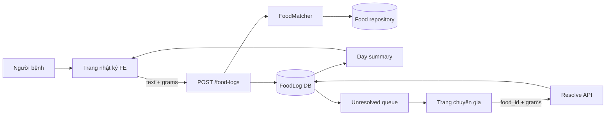
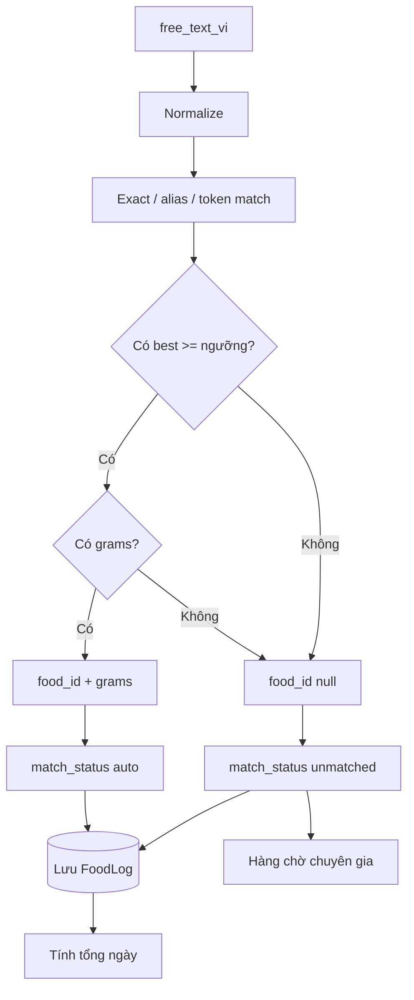
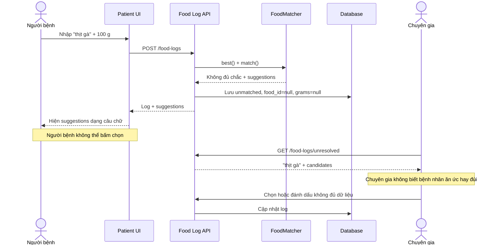
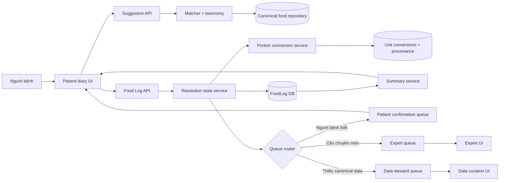
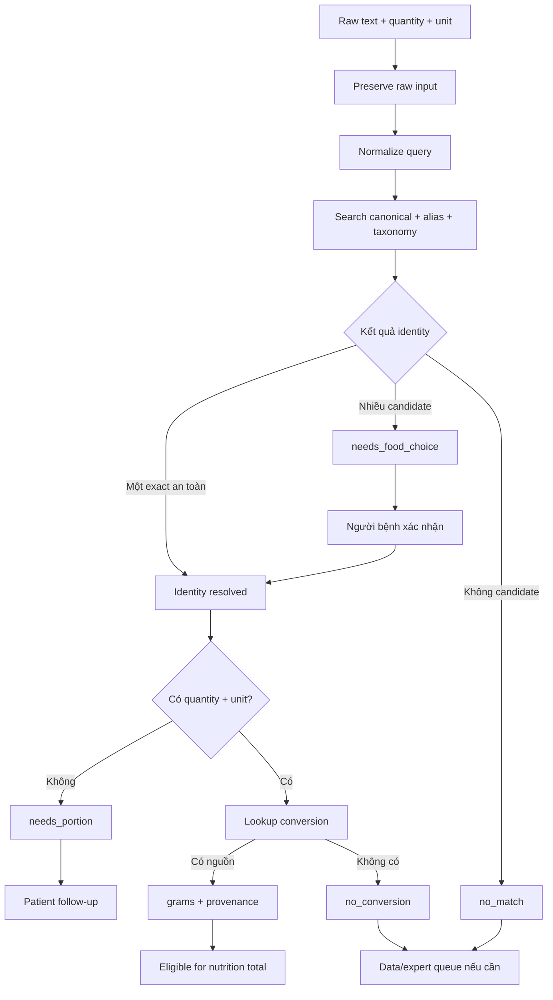
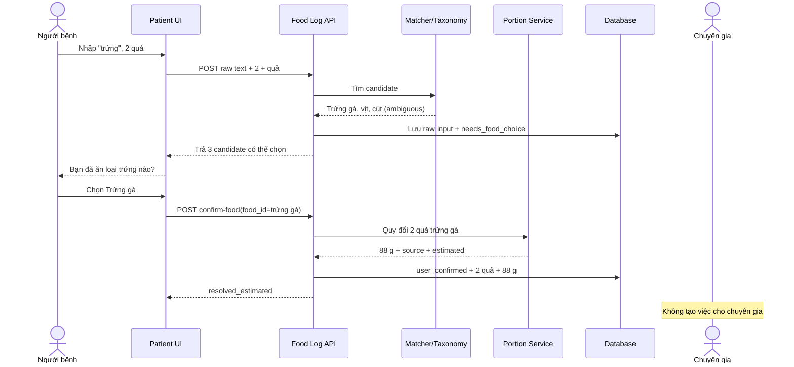
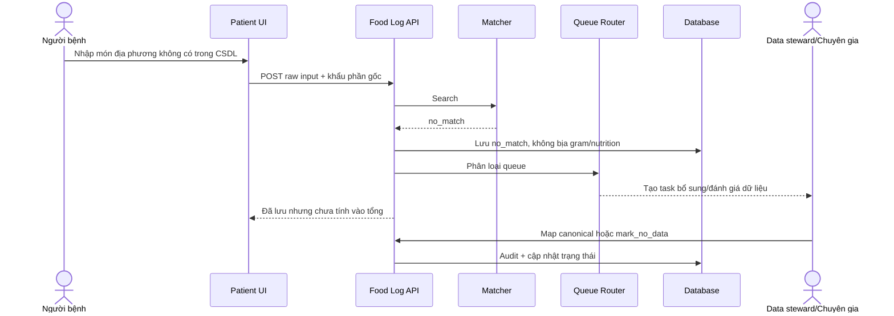

# Báo cáo cải thiện Backend cho nhật ký ăn uống VNutriCare

**Ngày đánh giá:** 14/08/2026  
**Phạm vi chính:** Chuẩn hóa tên món, alias vùng miền, gợi ý, xác nhận của người bệnh, khẩu phần/đơn vị và tổng hợp dinh dưỡng.  
**Nguồn đầu vào:** Feedback kiểm thử thực tế, API food logs, `FoodMatcher`, schema database và test hiện tại.  
**Tài liệu liên quan:** [FRONTEND_UI_UX_IMPROVEMENT_REPORT.md](FRONTEND_UI_UX_IMPROVEMENT_REPORT.md), [WEB_DEPLOY_COMPARISON.md](WEB_DEPLOY_COMPARISON.md).

## 0. Cách đọc và mức độ xác minh

| Nhãn | Ý nghĩa |
|---|---|
| **Đã xác minh** | Có trong code/schema/test hiện tại |
| **Đã có nền tảng nhưng chưa nối end-to-end** | Model hoặc dữ liệu đã có, nhưng API/UI chưa sử dụng hoàn chỉnh |
| **Khoảng thiếu** | Chưa có contract, state, test hoặc workflow cần thiết |
| **Đề xuất** | Kiến trúc/API đích; ví dụ JSON và ID chỉ minh họa, không phải endpoint hiện có |

Các endpoint `/confirm-food`, `/portion`, suggestion API, taxonomy service, queue router và role data steward trong tài liệu là **đề xuất**. `FoodMatcher`, `/food-logs`, unresolved queue, `portion_qty`, `portion_unit`, `grams_source_ref` và các role `patient|dietitian|admin` là **đã xác minh trong code**.

## 0.1. Vai trò người sử dụng và quyền sở hữu quyết định

### Role hệ thống hiện có

| Role | Quyền liên quan đã xác minh | Không được suy rộng thành |
|---|---|---|
| `patient` | Ghi và đọc nhật ký thuộc hồ sơ của mình; đọc dữ liệu được phép | Người duyệt canonical data hoặc quyết định lâm sàng |
| `dietitian` | Xem unresolved queue, resolve log, quản lý/review thực đơn | Người biết chính xác bệnh nhân đã ăn gì khi input mơ hồ |
| `admin` | Một số endpoint cho phép cùng dietitian để vận hành | Chuyên gia dinh dưỡng hoặc bác sĩ mặc định |

### Vai trò đề xuất, chưa tồn tại trong auth

| Vai trò đề xuất | Trách nhiệm | Không chịu trách nhiệm |
|---|---|---|
| Data steward | Duyệt alias, duplicate, taxonomy, serving conversion và provenance | Duyệt điều trị hoặc thực đơn lâm sàng |
| Clinical reviewer | Duyệt rule/cảnh báo có ảnh hưởng lâm sàng; có thể là dietitian theo tổ chức | Sửa dữ liệu kỹ thuật hàng loạt |
| Caregiver/delegate | Hỗ trợ ghi nhận nếu người bệnh đồng ý | Tự truy cập hồ sơ khi chưa có consent/delegation |

### Quy tắc “ai biết thì người đó xác nhận”

| Câu hỏi | Người trả lời đầu tiên | Lý do |
|---|---|---|
| Đã ăn trứng gà, vịt hay cút? | Người bệnh/người ghi bữa | Họ quan sát bữa ăn |
| Đã ăn bao nhiêu quả/miếng/bát? | Người bệnh/người ghi bữa | Chuyên gia không có dữ kiện này |
| Alias này có phải tên vùng miền hợp lệ? | Data steward đề xuất | Cần quản trị dữ liệu và nguồn |
| Conversion này có đủ tin cậy? | Data steward + reviewer phù hợp | Cần nguồn và đánh giá sai số |
| Cảnh báo có thể override không? | Chuyên gia lâm sàng | Là quyết định chuyên môn |
| Thực đơn được phát hành không? | `dietitian` theo workflow hiện tại | RULE-3/HITL |

## 0.2. Bảng điểm đủ và điểm thiếu backend

| Năng lực | Điểm đã đủ hoặc nền tảng tốt | Điểm còn thiếu | Mức xác minh |
|---|---|---|---|
| Chuẩn hóa tên | Unicode, bỏ dấu, exact, alias, token, ngưỡng cao | Collision-safe index, taxonomy/category ambiguity | Code + tests |
| Fail closed | Tên chung `thịt bò` có test không auto-map | Chưa có golden coverage đầy đủ cho gà, trứng, heo và deploy parity | Tests hiện có |
| Food log | Create/list/summary/unresolved/resolve | Patient confirmation, edit/delete và persistent suggestions | Routes hiện có |
| Dữ liệu thiếu | Không cộng OOV như 0; coverage/verdict bảo thủ | Gộp thiếu identity và thiếu portion | Routes + diary logic |
| Khẩu phần | DB có quantity/unit/source; có CSV conversion | Create API chỉ nhận grams; conversion chưa nối end-to-end | Schema + route |
| Phân quyền | Ownership check và role guard | Data stewardship/delegation chưa có | Security/routes |
| Audit | Expert resolve có audit | Patient confirm, edit/delete chưa có vì endpoint chưa tồn tại | Food-log route |
| Evaluation | Có unit/API test quan trọng | Chưa có golden dataset, property test và workload SLO đầy đủ | Test suite đã đọc |

Kết luận phạm vi: backend **đủ nền tảng để không bịa số trong một số luồng**, nhưng **chưa đủ workflow để nhận dạng và định lượng food log ở quy mô vận hành**.

## 1. Kết luận nhanh

Backend hiện đã có một số nguyên tắc đúng:

- Matcher tất định, không dùng LLM để tự quyết tên món.
- Ngưỡng auto-match cao.
- Tên chung như `thịt bò` đã có test yêu cầu trả gợi ý thay vì tự chọn phần thịt.
- Món chưa xác định không được cộng như 0.
- Khi còn dữ liệu thiếu, hệ thống không kết luận sai là “đạt ngưỡng”.
- Database có trường lưu khẩu phần gốc và nguồn quy đổi gram.
- Có bảng quy đổi cho một số đơn vị như quả, muỗng canh và muỗng cà phê.

Tuy nhiên, API hiện chưa hoàn thành vòng lặp người bệnh xác nhận:

- Chỉ trả suggestion ở một số response, không có endpoint tìm kiếm/chọn gợi ý dành cho người bệnh.
- Chỉ chuyên gia được resolve log, trong khi chuyên gia không biết người bệnh đã ăn bộ phận nào.
- Gộp “không rõ món” và “thiếu khẩu phần” vào cùng trạng thái `unmatched`.
- Request chỉ nhận `grams`, chưa nhận `portion_qty` và `portion_unit`.
- Matcher dùng `setdefault` cho exact/alias, có nguy cơ che collision và phụ thuộc thứ tự dữ liệu.
- Chưa có taxonomy đủ rõ cho tên cha như thịt, gà, trứng và các biến thể bộ phận/trạng thái chế biến.

Đây là lỗi logic sản phẩm và hợp đồng API, không thể xử lý hoàn toàn bằng cách thêm dữ liệu.

## 2. Hiện trạng kiến trúc

### 2.1. Luồng tạo nhật ký hiện tại

API nhận:

```json
{
  "profile_id": "...",
  "free_text_vi": "thịt gà",
  "grams": 100,
  "slot": "lunch"
}
```

Backend gọi `matcher.best()` và `matcher.match()`.

- Nếu có `best` và có gram: gán `food_id`, trạng thái `auto`.
- Nếu thiếu một trong hai: bỏ `food_id`, bỏ `grams`, trạng thái `unmatched`.

Điều này làm mất thông tin đã biết. Ví dụ backend đã xác định chính xác `Cà rốt` nhưng thiếu khẩu phần thì vẫn lưu như chưa xác định được món.

### 2.2. Matcher hiện tại

Matcher chuẩn hóa:

- Unicode.
- Chữ hoa/thường.
- Dấu tiếng Việt.
- Một số từ sơ chế.
- Stopword.
- Exact name.
- Alias.
- Token overlap.

Nguyên tắc thận trọng là đúng. Tuy nhiên exact index và alias index đang ánh xạ mỗi key tới một ID duy nhất bằng `setdefault`. Nếu nhiều record cùng tên chuẩn hóa hoặc alias collision, record xuất hiện trước có thể được chọn mà không biểu diễn ambiguity.

### 2.3. Database đã sẵn sàng hơn API

`FoodLog` đã có:

- `portion_qty`.
- `portion_unit`.
- `grams_source_ref`.
- `match_status`.
- `match_confidence`.

Nhưng route tạo nhật ký chỉ nhận gram và luôn gán `portion_unit = g`. Bảng `unit_conversions.csv` đã có một số conversion nhưng chưa được tích hợp đầy đủ vào API food logs.

## 2A. Đánh giá đầy đủ kiến trúc và các luồng hệ thống

### 2A.1. Kết luận về mức độ hoàn thiện hiện tại

| Hạng mục | Đã có | Còn thiếu hoặc chưa khép kín | Đánh giá |
|---|---|---|---|
| Kiến trúc module | FE nhật ký, API food logs, matcher, DB, summary, expert queue | Thiếu patient-confirmation service và portion conversion service trong luồng chính | Chưa đủ |
| Data flow | Input text đi qua matcher và lưu FoodLog | Suggestion không tồn tại bền vững; mất phần đã biết khi thiếu gram | Chưa khép kín |
| Control flow | Có nhánh auto/unmatched | Chỉ có hai nhánh, gộp nhiều trạng thái nghiệp vụ khác nhau | Chưa đủ |
| Sequence | Có request tạo log và expert resolve | Thiếu chuỗi bệnh nhân chọn candidate, bổ sung đơn vị, sửa/xóa | Chưa đủ |
| Pipeline | Normalize → match → lưu → summary | Thiếu ambiguity gate, conversion gate, provenance và queue routing | Chưa đủ |
| Workflow người bệnh | Nhập text và gram | Không hoàn tất được ambiguity; không sửa ngay được | Chưa hoàn chỉnh |
| Workflow chuyên gia | Resolve OOV | Nhận cả việc mà chỉ người bệnh mới trả lời được | Sai phân công |
| Evaluation | Có một số unit/API tests | Chưa có golden dataset đủ rộng, workload metric và end-to-end evaluation | Chưa đủ |

Kết luận: nhóm đã xây được **các khối thành phần ban đầu**, nhưng chưa xây đủ **vòng đời hoàn chỉnh của một food log**. Luồng đang dừng ở “matcher không chắc thì chuyển chuyên gia”, trong khi còn thiếu bước quan trọng nhất là hỏi lại người đã ăn.

### 2A.2. Sơ đồ kiến trúc hiện tại



Điểm nghẽn của kiến trúc hiện tại:

1. Người bệnh gửi dữ liệu một lần rồi mất quyền xác nhận candidate.
2. Mọi dòng không đủ điều kiện auto đều có thể đi vào cùng unresolved queue.
3. Chuyên gia phải xử lý cả ambiguity ngôn ngữ lẫn thiếu khẩu phần.
4. Chuyên gia không có dữ kiện thực tế để biết người bệnh đã ăn phần nào.
5. Queue tăng theo số bữa ghi nhận, không chỉ theo số ca lâm sàng khó.

### 2A.3. Data flow hiện tại



Lỗi data flow quan trọng là nhánh `Có best nhưng thiếu grams` quay về cùng trạng thái với `Không biết món nào`. Khi đó backend bỏ cả `food_id` dù identity đã biết. Dữ liệu bị giảm chất lượng ngay trong pipeline.

### 2A.4. Control flow hiện tại

Control flow hiện chỉ có hai kết quả chính:

```text
IF best_match AND grams
    AUTO_RESOLVED
ELSE
    UNMATCHED -> EXPERT_QUEUE
```

Control flow này không biểu diễn được:

- Có đúng món nhưng thiếu số lượng.
- Có số lượng nhưng tên món mơ hồ.
- Có món và đơn vị nhưng chưa có conversion.
- Có nhiều candidate ngang nhau.
- Người bệnh không nhớ loại cụ thể.
- Món hoàn toàn mới, cần data steward.

Vì vậy, sai lầm không nằm ở một câu `if` riêng lẻ mà ở mô hình trạng thái quá nghèo so với nghiệp vụ.

### 2A.5. Sequence diagram hiện tại



Sequence này xác nhận feedback: dù matcher có gợi ý đúng, workflow vẫn sai vì người cần xác nhận không có control, còn người không biết câu trả lời lại bị giao nhiệm vụ resolve.

### 2A.6. Pipeline hiện tại

```text
Input tự do
  → Chuẩn hóa text
  → Tìm exact/alias/token
  → Áp ngưỡng auto-match
  → Kiểm tra gram
  → Lưu auto hoặc unmatched
  → Tính coverage/tổng ngày
  → Đẩy unmatched sang chuyên gia
```

Pipeline đã có các bước normalize, match và summary, nhưng thiếu bốn gate:

1. **Ambiguity gate:** tên cha có nhiều loại con hay không.
2. **Patient confirmation gate:** người bệnh đã xác nhận candidate chưa.
3. **Portion conversion gate:** đơn vị có quy đổi đủ nguồn hay không.
4. **Queue routing gate:** ca này thuộc người bệnh, chuyên gia hay data steward.

### 2A.7. Workflow chuyên gia hiện tại gây quá tải như thế nào

Giả sử có:

- 100 người bệnh hoạt động.
- Mỗi người ghi 3 bữa/ngày.
- Mỗi bữa trung bình 2 mục thực phẩm/món.
- Chỉ 20% mục bị mơ hồ hoặc thiếu khẩu phần.

Khối lượng unresolved có thể là:

```text
100 × 3 × 2 × 20% = 120 dòng/ngày
```

Nếu một chuyên gia cần trung bình 45 giây để đọc và xử lý một dòng:

```text
120 × 45 giây = 5.400 giây ≈ 90 phút/ngày
```

Đó mới chỉ là 100 người bệnh và chưa tính thời gian mở hồ sơ, trao đổi lại, sửa candidate sai hoặc xử lý món mới. Khi tăng lên 1.000 người bệnh, kiến trúc này không scale.

Quan trọng hơn, nhiều dòng trong số đó **không thể được chuyên gia giải quyết đúng**. Với input `trứng`, chuyên gia không biết là trứng gà, vịt hay cút. Với `thịt gà`, chuyên gia không biết là ức, đùi hay cánh. Xử lý nhanh sẽ thành đoán; xử lý thận trọng sẽ phải liên hệ lại người bệnh. Cả hai đều làm tăng chi phí vận hành.

### 2A.8. Chỉ số tải chuyên gia cần theo dõi

Không chỉ theo dõi số dòng unresolved. Cần có:

- `unresolved_created_per_day`.
- `patient_confirmation_rate`.
- `expert_queue_rate` trên tổng food logs.
- `median_expert_resolution_time`.
- `queue_age_p95`.
- `no_data_rate`.
- `expert_override_rate` sau auto-match.
- `recontact_patient_rate`.
- Số unresolved trên mỗi 100 bữa ghi nhận.

Mục tiêu ban đầu đề xuất:

- Ít nhất 70% ambiguity có candidate được người bệnh tự xác nhận.
- Dưới 5% tổng food logs đi vào expert queue.
- Không có log chỉ thiếu khẩu phần đi thẳng vào expert queue trước khi hỏi lại người bệnh.
- Queue P95 được xử lý trong thời gian do nhóm sản phẩm xác định.

## 2B. Kiến trúc và các luồng đề xuất

### 2B.1. Kiến trúc đích



Khác biệt cốt lõi:

- Matcher không còn trực tiếp quyết toàn bộ workflow.
- Resolution service giữ state identity và portion độc lập.
- Queue router giao câu hỏi cho đúng người biết câu trả lời.
- Data steward tách khỏi chuyên gia lâm sàng khi vấn đề là canonical data.

### 2B.2. Data flow đích



Data flow mới không vứt bỏ dữ liệu đã biết. `2 quả` vẫn được giữ khi chưa biết loại trứng; `food_id cà rốt` vẫn được giữ khi chưa biết lượng.

### 2B.3. Control flow đích

```text
1. Resolve identity
   - exact/unique alias an toàn -> resolved
   - category hoặc nhiều candidate -> patient choice
   - không có candidate -> data/expert review

2. Resolve portion
   - gram trực tiếp -> exact_grams
   - quantity + unit có nguồn -> converted/estimated
   - thiếu quantity -> patient follow-up
   - không có conversion -> giữ raw, không tính tổng

3. Route work
   - câu hỏi về điều đã ăn -> patient
   - quyết định lâm sàng -> expert
   - thiếu canonical/alias/conversion -> data steward

4. Aggregate
   - chỉ cộng log đủ identity + portion
   - trả coverage và cờ estimated
```

### 2B.4. Sequence diagram đích: tên món mơ hồ



### 2B.5. Sequence diagram đích: món thật sự không có dữ liệu



### 2B.6. Pipeline đích

```text
Capture raw input
  → Normalize
  → Retrieve candidates
  → Detect exact/alias collision
  → Detect category ambiguity
  → Patient confirmation nếu cần
  → Resolve quantity/unit
  → Convert với provenance
  → Validate eligibility
  → Persist state + audit
  → Aggregate nutrition + coverage
  → Route unresolved đến đúng queue
  → Feed confirmed alias/conversion vào evaluation, không tự học trực tiếp
```

Không được tự động biến lựa chọn của một người bệnh thành alias toàn hệ thống. Dữ liệu xác nhận chỉ là candidate cho quy trình data review, vì một cách gọi cá nhân có thể không đại diện cho toàn bộ vùng miền.

### 2B.7. Workflow vận hành đích

| Loại vấn đề | Người xử lý đầu tiên | Khi nào chuyển tiếp |
|---|---|---|
| Tên chung, có gợi ý | Người bệnh | Không nhận ra món nào |
| Thiếu số lượng/đơn vị | Người bệnh | Không nhớ hoặc không có conversion |
| Không có món trong CSDL | Data steward | Cần đánh giá lâm sàng hoặc nguồn |
| Tương tác thuốc/thực phẩm | Chuyên gia | Theo escalation lâm sàng |
| Cảnh báo dinh dưỡng | Chuyên gia | Theo protocol |
| Alias mới từ người dùng | Data steward | Chuyên gia duyệt nếu ảnh hưởng lâm sàng |
| Conversion mới | Data steward/chuyên gia | Chỉ publish khi có nguồn và review |

Workflow này bảo vệ thời gian chuyên gia cho quyết định lâm sàng, thay vì dùng họ làm công cụ autocomplete thủ công.

## 3. Phân loại lỗi từ feedback

| Feedback | Phân loại chính | Nguyên nhân |
|---|---|---|
| `thịt heo` cần hiểu là `thịt lợn` | Data + matcher | Thiếu/không dùng alias thống nhất ở mọi record |
| `thịt gà` bị gán thành đùi gà | Backend logic | Auto-match tên cha vào một record con hoặc deploy chưa có guard mới |
| `trứng` không biết là trứng gì | Backend contract + FE | Cần trả danh sách con và bắt người dùng chọn |
| Chuyên gia không biết bệnh nhân ăn phần nào | Product logic | Sai khi đẩy mọi ambiguity sang expert queue |
| Chỉ hiện ba gợi ý dạng note | Frontend | API có suggestion nhưng UI không có selection flow |
| Không biết đơn vị của trứng | Backend contract + data | API chỉ nhận gram; conversion chưa nối vào route |
| Tên vùng miền bị thiếu | Data governance | Alias coverage chưa đủ và chưa có golden set vùng miền |
| Gợi ý đúng nhưng vẫn trải nghiệm sai | Product logic | Thiếu endpoint patient confirmation và state machine |

## 4. Nguyên tắc backend bắt buộc

### Nguyên tắc 1: Tên cha không được auto-map vào tên con

Các từ sau mặc định là category/query mơ hồ:

- thịt.
- thịt bò.
- thịt heo/thịt lợn.
- thịt gà/gà.
- trứng.
- cá.
- rau.
- sữa.

Chỉ auto-map nếu có một canonical item thực sự đại diện chính xác cho tên đó và có quy tắc chuyên môn xác nhận việc dùng giá trị dinh dưỡng đại diện. Nếu có nhiều biến thể đáng kể về dinh dưỡng, phải trả ambiguity.

### Nguyên tắc 2: Không lấy gợi ý đầu tiên làm sự thật

Suggestions là tập ứng viên, không phải kết quả. Backend chỉ nhận lựa chọn khi client gửi `candidate_id` trong một endpoint xác nhận rõ ràng.

### Nguyên tắc 3: Người biết thông tin phải là người xác nhận

- Người bệnh xác nhận loại thực phẩm và khẩu phần họ đã ăn.
- Chuyên gia xử lý trường hợp không có ứng viên, dữ liệu bất thường hoặc cần tạo canonical item mới.
- Backend xác minh lựa chọn hợp lệ, nhưng không đoán thay cả hai.

### Nguyên tắc 4: Giữ mọi dữ liệu gốc

Không được xóa:

- Chuỗi người dùng nhập.
- Khẩu phần gốc.
- Đơn vị gốc.
- Danh sách ứng viên tại thời điểm match nếu cần audit.
- Nguồn conversion.

### Nguyên tắc 5: Tách identity confidence và portion confidence

Một log cần hai trục độc lập:

- Độ chắc chắn món nào.
- Độ chắc chắn ăn bao nhiêu.

Không thể dùng một `match_status` để biểu diễn cả hai.

## 5. State machine đề xuất

### 5.1. Trạng thái nhận dạng thực phẩm

```text
food_resolution_status:
  exact
  alias
  user_confirmed
  expert_confirmed
  ambiguous
  no_match
  no_data
```

### 5.2. Trạng thái khẩu phần

```text
portion_status:
  exact_grams
  converted
  estimated
  no_conversion
  missing
```

### 5.3. Trạng thái tổng hợp cho UI

Backend có thể trả thêm `resolution_state`:

```text
resolved
resolved_estimated
needs_food_choice
needs_portion
needs_both
no_match
no_conversion
```

Không bắt frontend tự suy state từ nhiều field rời rạc.

### 5.4. Điều kiện được tính vào tổng

Một log chỉ được cộng khi:

```text
food_id != null
AND grams != null
AND food_resolution_status in {exact, alias, user_confirmed, expert_confirmed}
AND portion_status in {exact_grams, converted, estimated}
```

Nếu `estimated`, tổng phải mang cờ có thành phần ước tính.

## 6. API contract đề xuất

### 6.1. API tìm kiếm gợi ý

```http
GET /api/v1/foods/suggestions?q=thịt%20gà&limit=5
```

Response:

```json
{
  "query": "thịt gà",
  "normalized_query": "thit ga",
  "resolution": "ambiguous",
  "candidates": [
    {
      "food_id": 101,
      "name_vi": "Ức gà không da",
      "category": "thịt gia cầm",
      "matched_on": "token",
      "score": 0.72,
      "aliases": ["lườn gà"],
      "portion_units": ["g", "miếng"]
    },
    {
      "food_id": 102,
      "name_vi": "Đùi gà có da",
      "category": "thịt gia cầm",
      "matched_on": "token",
      "score": 0.72,
      "aliases": [],
      "portion_units": ["g", "cái", "miếng"]
    }
  ]
}
```

Không trả một `best_food_id` khi `resolution = ambiguous`.

### 6.2. API tạo log dạng draft

```http
POST /api/v1/food-logs
```

```json
{
  "profile_id": "...",
  "free_text_vi": "trứng",
  "slot": "breakfast",
  "portion_qty": 2,
  "portion_unit": "quả"
}
```

Response có thể là:

```json
{
  "id": "...",
  "free_text_vi": "trứng",
  "food_id": null,
  "food_resolution_status": "ambiguous",
  "portion_qty": 2,
  "portion_unit": "quả",
  "grams": null,
  "portion_status": "no_conversion",
  "resolution_state": "needs_food_choice",
  "suggestions": [
    {"food_id": 33, "name_vi": "Trứng gà", "score": 0.67},
    {"food_id": 34, "name_vi": "Trứng vịt", "score": 0.67},
    {"food_id": 36, "name_vi": "Trứng cút", "score": 0.67}
  ]
}
```

Khẩu phần `2 quả` phải được giữ lại dù chưa biết loại trứng; sau khi người dùng chọn loại, backend mới dùng conversion tương ứng.

### 6.3. API người bệnh xác nhận ứng viên

```http
POST /api/v1/food-logs/{log_id}/confirm-food
```

```json
{
  "food_id": 33,
  "suggestion_token": "signed-or-versioned-token"
}
```

Quy tắc:

- Bệnh nhân chỉ xác nhận log của chính mình.
- `food_id` phải nằm trong tập suggestion hoặc yêu cầu một bước tìm kiếm rõ ràng.
- Sau khi chọn `Trứng gà`, backend quy đổi `2 quả` theo conversion của trứng gà.
- Lưu actor là patient và trạng thái `user_confirmed`.
- Ghi audit log trước/sau.

### 6.4. API cập nhật khẩu phần

```http
PATCH /api/v1/food-logs/{log_id}/portion
```

```json
{
  "portion_qty": 2,
  "portion_unit": "quả"
}
```

Response phải có:

```json
{
  "portion_qty": 2,
  "portion_unit": "quả",
  "grams": 88,
  "portion_status": "estimated",
  "grams_source_ref": "..."
}
```

### 6.5. API chỉnh sửa và xóa

Cần có:

```http
PATCH /api/v1/food-logs/{log_id}
DELETE /api/v1/food-logs/{log_id}
```

Mọi thay đổi làm tính lại summary trên server và ghi audit phù hợp.

## 7. Sửa matcher

### 7.1. Exact index phải hỗ trợ nhiều ID

Thay:

```python
dict[str, int]
```

bằng:

```python
dict[str, list[int]]
```

Nếu normalized exact key ánh xạ nhiều record:

- Không auto-match.
- Trả tất cả canonical candidate sau khi deduplicate.
- Ghi nhận collision trong validation report.

### 7.2. Alias collision cũng phải fail closed

Một alias không được im lặng trỏ tới record đầu tiên khi nhiều thực phẩm cùng khai báo. Validator phải phát hiện:

- Alias trùng canonical name của món khác.
- Một alias thuộc nhiều food ID.
- Alias quá chung như `thịt`, `gà`, `trứng`.
- Alias ghép sai vùng miền hoặc sai loài.

### 7.3. Phân biệt canonical item và category node

Nên có taxonomy:

```text
Thịt
├── Thịt lợn
│   ├── Thịt lợn nạc
│   ├── Thịt lợn ba chỉ
│   └── Thịt lợn nửa nạc nửa mỡ
├── Thịt bò
│   ├── Thịt bò thăn
│   └── Thịt bò bắp
└── Thịt gà
    ├── Ức gà không da
    ├── Đùi gà có da
    └── Thịt gà ta trung bình
```

Category node dùng để tìm kiếm và tạo suggestion, không có giá trị dinh dưỡng để cộng trực tiếp trừ khi chuyên gia phê duyệt một representative item với nhãn rõ ràng.

### 7.4. Đừng bỏ từ phân biệt dinh dưỡng

Normalizer không được loại các token như:

- nạc.
- mỡ.
- ba chỉ/ba rọi.
- có da/không da.
- ức/đùi/cánh.
- tươi/khô.
- nguyên kem/tách béo.
- chiên/luộc nếu database phân biệt trạng thái chế biến.

Các token này thay đổi thành phần dinh dưỡng đáng kể.

### 7.5. Auto-accept cần thêm điều kiện margin

Không chỉ kiểm tra score cao nhất. Cần:

- `top_score >= threshold`.
- `top_score - second_score >= margin`.
- Query không phải category node.
- Exact/alias key không collision.
- Candidate có dữ liệu đủ và được phép dùng.

## 8. Alias vùng miền và quản trị dữ liệu

### 8.1. Alias cần lưu có cấu trúc

Thay vì chỉ list string, dài hạn nên có:

```json
{
  "value": "thịt heo ba rọi",
  "region": "south",
  "kind": "regional_synonym",
  "source_ref": "...",
  "review_status": "approved"
}
```

### 8.2. Golden set vùng miền tối thiểu

Cần khóa test cho các nhóm:

- lợn/heo.
- lạc/đậu phộng.
- ngô/bắp.
- dứa/thơm/khóm.
- vừng/mè.
- mướp đắng/khổ qua.
- cá quả/cá lóc/cá chuối.
- hành lá/hành hoa.
- sắn/khoai mì.
- hạt sen/hột sen.

Mỗi alias phải dẫn về đúng canonical item, không chỉ “một item có token gần giống”.

### 8.3. Duplicate canonical records

Dữ liệu hiện có dấu hiệu chứa nhiều record tên gần hoặc trùng nhau từ các nguồn khác nhau. Cần report:

- Exact normalized duplicates.
- Cùng nguồn nhưng lặp ID khác.
- Bản song ngữ và bản tiếng Việt cùng đại diện một thực phẩm.
- Giá trị dinh dưỡng khác nhau đáng kể giữa duplicate.

Không xóa cơ học. Cần chọn canonical record và lưu provenance/variant.

## 9. Khẩu phần và đơn vị

### 9.1. Mô hình dữ liệu đề xuất

Một conversion cần:

```text
food_id hoặc dish_id
unit_code
unit_label_vi
grams_per_unit
size_variant
region
source_ref
is_estimated
review_status
```

Không nên key conversion chỉ bằng tên nguyên liệu vì tên có thể đổi hoặc collision.

### 9.2. Đơn vị canonical

- `g`, `kg`.
- `ml`, `l`.
- `piece`/quả/cái.
- `bowl`/bát/chén.
- `tablespoon`/muỗng canh.
- `teaspoon`/muỗng cà phê.
- `cup`/cốc/ly.
- `slice`/lát.
- `serving`/phần.

Label vùng miền có thể khác, nhưng unit code phải thống nhất.

### 9.3. Quy đổi theo đúng loại

`1 quả` không có một giá trị chung:

- Trứng gà khác trứng vịt.
- Trứng cút khác trứng gà.
- Quả chuối nhỏ khác quả chuối lớn.

Vì vậy conversion chỉ chạy sau khi xác định `food_id` và size variant khi cần.

### 9.4. Nguồn và mức tin cậy

Mỗi conversion phải phân biệt:

- Đo trực tiếp hoặc nguồn chính thức.
- Ước tính từ dữ liệu nước ngoài.
- Chuyên gia nội bộ xác nhận.
- Chưa duyệt.

Conversion chưa duyệt không được dùng cho ràng buộc lâm sàng mà không có cờ estimated.

## 10. Hàng chờ chuyên gia cần thay đổi

Không đẩy mọi ambiguity sang chuyên gia. Chia queue:

### Queue A: Chờ người bệnh xác nhận

- Có 2–5 ứng viên tốt.
- Câu hỏi thuộc thông tin người bệnh biết.
- Ví dụ: loại trứng, phần thịt, khẩu phần.

### Queue B: Chờ chuyên gia/data steward

- Không có ứng viên.
- Nghi ngờ món mới hoặc món địa phương.
- Candidate có dữ liệu dinh dưỡng không đủ.
- Cần tạo dish/canonical item mới.
- Có xung đột nguồn hoặc cảnh báo lâm sàng.

### Queue C: Không đủ dữ liệu

- Người bệnh không nhớ.
- Không thể quy đổi khẩu phần.
- Không có nguồn an toàn.

`mark_no_data` là kết quả hợp lệ và phải giữ nguyên tính minh bạch của summary.

## 11. Backlog backend

### BE-P0-01: Tách trạng thái food và portion

**Acceptance criteria:**

- `Cà rốt` không gram: giữ `food_id`, trạng thái `needs_portion`.
- `trứng` + `2 quả`: giữ khẩu phần gốc, trạng thái `needs_food_choice`.
- Summary không cộng khi thiếu một trục.

### BE-P0-02: Endpoint patient confirm

- Bệnh nhân xác nhận log của chính mình.
- Không thể xác nhận log người khác.
- Không lấy candidate ngoài tập cho phép mà không search lại.
- Có audit log.

### BE-P0-03: API quantity/unit

- Request nhận `portion_qty` và `portion_unit`.
- Response trả gram, trạng thái, nguồn và cờ estimated.
- Không conversion thì giữ dữ liệu gốc và gram null.

### BE-P0-04: Chặn category auto-match

- `thịt gà`, `gà`, `trứng`, `thịt heo`, `thịt bò`, `rau`, `cá` không auto-map vào variant cụ thể.
- Trả candidate ổn định và có giải thích.

### BE-P0-05: Phát hiện exact/alias collision

- Matcher không phụ thuộc thứ tự CSV.
- Duplicate exact hoặc alias không auto-match.
- Validation CI fail với collision nguy hiểm chưa được allowlist.

### BE-P1-01: Suggestion search API

- Pagination/limit hợp lý.
- Debounce-friendly.
- Trả category, alias match, score và portion units.
- Không lộ record chưa được phép dùng.

### BE-P1-02: Edit/delete food log

- Kiểm tra ownership.
- Tính lại summary.
- Audit thao tác quan trọng.

### BE-P1-03: Taxonomy thực phẩm

- Parent/child rõ.
- Category không cộng dinh dưỡng.
- Hỗ trợ filter theo vùng miền và loại.

### BE-P1-04: Golden dataset matcher

- Tên vùng miền.
- Tên không dấu.
- Typo phổ biến.
- Tên chung.
- Bộ phận thịt.
- Trạng thái chế biến.
- Collision và negative cases.

## 12. Bộ test bắt buộc

### Matcher tests

```text
"thịt gà"       -> ambiguous, không auto
"ức gà"         -> đúng ức gà nếu exact/alias duy nhất
"gà"            -> ambiguous
"trứng"         -> gợi ý gà/vịt/cút, không auto
"trứng gà"      -> exact nếu duy nhất
"thịt heo"      -> gợi ý các loại thịt lợn, không auto
"thịt heo nạc"  -> Thịt lợn nạc qua alias
"thịt bò"       -> gợi ý thăn/bắp..., không auto
"cơm trắng"     -> auto nếu canonical duy nhất
"bí ngô"        -> không thành ngô/bắp
```

### Portion tests

- `2 quả trứng gà` quy đổi theo trứng gà.
- `2 quả trứng cút` không dùng conversion trứng gà.
- `1 bát cơm` chỉ quy đổi khi có serving source phù hợp.
- `2 miếng thịt` chưa có conversion thì gram null.
- Conversion estimated truyền cờ lên summary.

### API tests

- Suggestions vẫn có sau reload/list.
- Patient confirm thành công với log của mình.
- Patient không confirm log người khác.
- Không nhận food ID giả.
- Sửa khẩu phần làm summary thay đổi.
- Món chưa đủ dữ liệu không kết luận `within`.
- Cảnh báo vượt trần vẫn được phát hiện từ phần đã biết.

### Property tests

- Thứ tự item đầu vào thay đổi không làm kết quả ambiguity đổi.
- Thêm một alias collision không được làm auto-match sang record đầu tiên.
- Normalize idempotent.
- Không candidate nào có score ngoài `[0,1]`.

## 13. Ranh giới trách nhiệm để tránh conflict Git

### Backend sở hữu

- `src/clinical/matching.py`.
- `src/api/routes/food_logs.py`.
- Schema/migration liên quan FoodLog, alias, portion conversion.
- Data validation và golden tests.
- API contract/OpenAPI.

### Frontend sở hữu

- Patient diary form và suggestion picker.
- Mobile navigation.
- Hiển thị state và validation.

### Cách phối hợp

1. Backend chốt OpenAPI và JSON fixtures trước.
2. Frontend build bằng mock fixture, không sửa backend.
3. Backend implement và chạy contract tests.
4. Tích hợp trên một branch riêng sau khi cả hai phía xanh.
5. Không cùng sửa `web-next/src/lib/api.ts` trong nhiều branch; chọn một owner tích hợp contract.

## 14. Migration và tương thích ngược

Trong giai đoạn chuyển đổi:

- Giữ `match_status` cũ để đọc record lịch sử.
- Thêm field mới nullable.
- Backfill theo quy tắc bảo thủ.
- Record `unmatched` cũ không được tự động gán lại hàng loạt nếu chưa xác nhận.
- API version mới có thể trả cả field cũ và mới trong một release.
- Sau khi frontend chuyển hoàn toàn mới deprecate state cũ.

Ví dụ backfill:

- `auto` + food_id + grams -> `exact/alias` và `exact_grams` nếu có provenance.
- `expert` -> `expert_confirmed`.
- `unmatched` -> không suy đoán; giữ `ambiguous` hoặc `no_match` sau khi chạy audit offline.
- `no_data` -> `no_data`.

## 15. Quan sát và đo chất lượng

Theo dõi các metric:

- Tỷ lệ auto-match.
- Tỷ lệ user-confirmed.
- Tỷ lệ expert-confirmed.
- Tỷ lệ no-match.
- Tỷ lệ log thiếu khẩu phần.
- Tỷ lệ conversion estimated.
- Top query không có kết quả.
- Top alias collision.
- Tỷ lệ người dùng sửa auto-match.

Nếu tỷ lệ sửa auto-match cao, phải hạ quyền tự động hoặc tăng ngưỡng; không chỉ thêm dữ liệu để cố tăng coverage.

## 16. Definition of Done backend

Backend chỉ được coi là hoàn thành khi:

- Tên chung không tự map vào biến thể cụ thể.
- Exact và alias collision được phát hiện và fail closed.
- Người bệnh có thể xác nhận suggestion của chính mình.
- Food identity và portion có state độc lập.
- API hỗ trợ quantity/unit, giữ dữ liệu gốc và nguồn conversion.
- Suggestions còn tồn tại sau reload.
- Chuyên gia chỉ xử lý ca thực sự cần chuyên môn/data stewardship.
- Summary không cộng dữ liệu chưa đủ và không kết luận sai.
- Golden tests bao phủ alias vùng miền, bộ phận thịt, trứng và negative cases.
- OpenAPI đã chốt để frontend không phải đoán contract.

## 17. Kết luận

Backend hiện đã có triết lý “thà thiếu còn hơn sai”, nhưng chưa đưa triết lý đó thành một state machine và API flow hoàn chỉnh cho người bệnh. Việc bổ sung thêm alias chỉ giải quyết được một phần nhỏ. Thay đổi quan trọng nhất là tách nhận dạng món khỏi khẩu phần, để người bệnh xác nhận ambiguity ngay tại thời điểm nhập và chỉ đẩy ca không thể giải quyết sang chuyên gia.

Khi hoàn thành các mục P0, hệ thống sẽ không còn tự gán `thịt gà` thành đùi gà, không coi `trứng` là một loại cụ thể và không ép mọi khẩu phần về gram không có nguồn. Đây là nền tảng cần thiết trước khi xây golden dataset và đánh giá chất lượng matcher.
