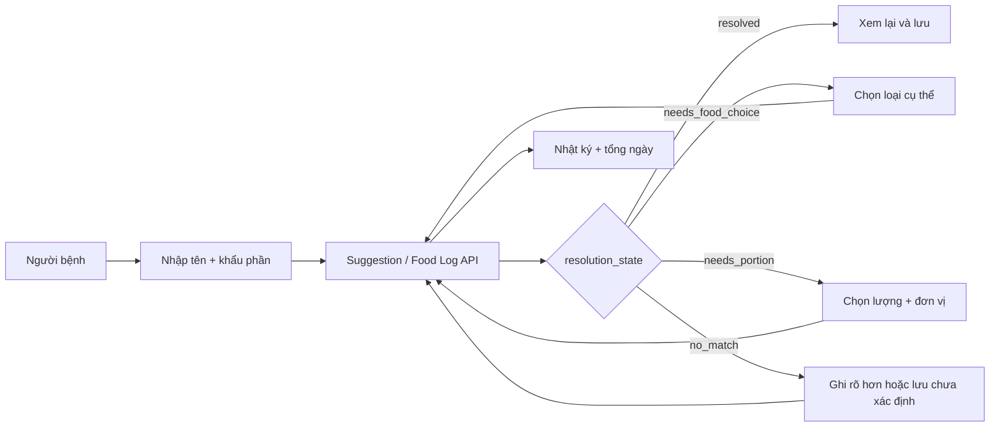
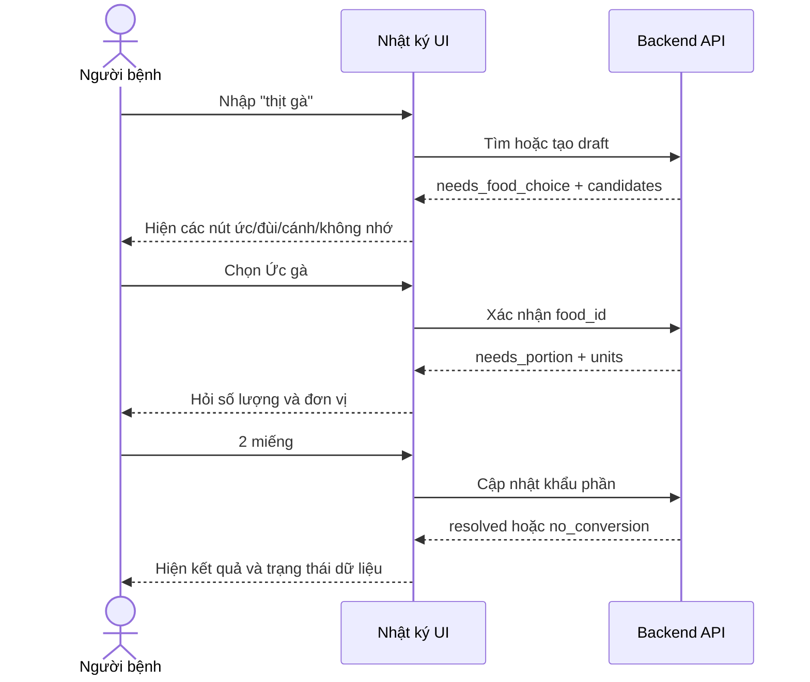

# Báo cáo cải thiện Frontend và UI/UX VNutriCare

**Ngày đánh giá:** 14/08/2026  
**Phạm vi chính:** Giao diện người bệnh, đặc biệt là nhật ký ăn uống, navigation và responsive mobile.  
**Nguồn đầu vào:** Feedback kiểm thử thực tế, bản deploy VNutriCare và code frontend hiện tại.  
**Tài liệu liên quan:** [WEB_DEPLOY_COMPARISON.md](WEB_DEPLOY_COMPARISON.md), [BACKEND_FOOD_LOG_MATCHING_IMPROVEMENT_REPORT.md](BACKEND_FOOD_LOG_MATCHING_IMPROVEMENT_REPORT.md).

## 0. Cách đọc và mức độ xác minh

Tài liệu phân biệt ba loại nội dung:

| Nhãn | Ý nghĩa |
|---|---|
| **Đã xác minh** | Quan sát trực tiếp từ code hoặc bản deploy tại ngày đánh giá |
| **Khoảng thiếu** | Chức năng chưa có, chưa có route, bị disabled hoặc chưa có bằng chứng hoạt động end-to-end |
| **Đề xuất** | Thiết kế mục tiêu; không được hiểu là hệ thống hiện đã hỗ trợ |

Các ví dụ như `needs_food_choice`, patient-confirmation API, đơn vị linh hoạt và bottom navigation là **đề xuất**. Các lỗi mobile menu, route `/patient/meal-plans`, suggestions dạng text và form chỉ nhận gram là **đã xác minh từ code**.

## 0.1. Nhóm người sử dụng và phạm vi frontend

### Vai trò kỹ thuật hiện có

Code hiện khai báo đúng ba role:

| Role hệ thống | Người dùng thực tế | Màn hình chính | Quyền/nhu cầu chính |
|---|---|---|---|
| `patient` | Người bệnh | `/patient`, `/patient/diary` | Xem dữ liệu của mình, ghi nhật ký, xem thực đơn được phép công bố |
| `dietitian` | Chuyên gia dinh dưỡng/tiết chế | `/dietitian/**` | Quản lý hồ sơ, tạo/review thực đơn, xử lý cảnh báo và nhật ký chưa xác định |
| `admin` | Quản trị hệ thống | Chưa có workspace admin hoàn chỉnh được xác minh trong frontend | Quản trị kỹ thuật và một số API có quyền tương đương dietitian |

Không dùng từ “bác sĩ” để thay cho `dietitian` nếu chưa có role, quyền và quy trình chuyên môn riêng. Không hiển thị `admin` như chuyên gia lâm sàng chỉ vì API cho phép admin truy cập một số endpoint.

### Persona hỗ trợ nhưng chưa phải role đăng nhập

| Persona | Trạng thái | Cách hỗ trợ phù hợp |
|---|---|---|
| Người chăm sóc/người nhà | Chưa có role | Chỉ đề xuất sau khi có cơ chế consent và delegated access |
| Data steward | Chưa có role | Công cụ nội bộ để duyệt alias, canonical item và conversion; không trộn với màn hình bệnh nhân |
| Mentor/giám khảo/người xem demo | Không phải role nghiệp vụ | Dùng session demo giới hạn, không cấp quyền production |

### Phân chia nhu cầu theo người dùng

**Người bệnh cần:** thao tác mobile đơn giản, từ ngữ đời thường, xác nhận đúng thứ mình đã ăn, sửa sai nhanh và biết dữ liệu nào chưa được tính.  
**Chuyên gia cần:** hàng chờ ưu tiên theo rủi ro, đủ ngữ cảnh, không phải đoán thông tin chỉ người bệnh biết và không bị quá tải bởi lỗi nhập liệu thông thường.  
**Admin cần:** trạng thái hệ thống, audit, quyền và vận hành; không cần dashboard giả lập như chuyên gia.  
**Data steward đề xuất cần:** collision, alias, nguồn và conversion; không được ra quyết định điều trị.

## 0.2. Bảng điểm đủ và điểm thiếu frontend

| Năng lực | Điểm đã đủ hoặc nền tảng tốt | Điểm còn thiếu | Bằng chứng |
|---|---|---|---|
| Nhật ký ngày | Có create/list/summary, coverage và verdict | Chưa có luồng chọn suggestion, sửa/xóa và unit tự nhiên | Code diary + API client |
| Trung thực dữ liệu | Không hiện `0` khi chưa biết; có `insufficient_data` | Thông báo chưa phân biệt identity với portion | Code diary + API state hiện tại |
| Desktop layout | Có sidebar và bố cục hai cột | Một số route/menu chưa hoàn thiện | Cây route frontend |
| Mobile | Có CSS breakpoint | Patient layout thiếu hamburger/open/overlay | So sánh patient và dietitian layout |
| Navigation | Tổng quan và nhật ký hoạt động | Route thực đơn thiếu; tiến độ/tin nhắn/tài khoản disabled | `NAV` trong patient layout |
| Accessibility cơ bản | Có một số label, focus style và aria ở layout chuyên gia | Form nhật ký thiếu label đầy đủ; suggestion chưa có interaction | JSX/CSS hiện tại |
| Chuyên gia | Có queue review và food-log resolution UI | Queue đang nhận cả câu hỏi chuyên gia không thể biết | Food log pages và API permissions |

Kết luận phạm vi: frontend **chưa đủ feature-complete** cho hành trình người bệnh, nhưng đã có nền tảng hiển thị dữ liệu thiếu tương đối thận trọng. Các phần “đề xuất” bên dưới là backlog cần triển khai, không phải mô tả chức năng đã tồn tại.

## 1. Kết luận nhanh

Frontend hiện có nền tảng tốt về hiển thị trạng thái dữ liệu chưa đầy đủ, không biến dữ liệu thiếu thành số 0 và không kết luận “đạt” khi nhật ký còn món chưa xác định. Tuy nhiên, luồng nhập nhật ký chưa cho người bệnh hoàn thành hai quyết định quan trọng:

1. Chọn đúng loại thực phẩm khi tên nhập quá chung.
2. Chọn đơn vị và khẩu phần theo cách người dùng thực sự nhớ.

Ngoài ra, giao diện người bệnh trên mobile có lỗi navigation cụ thể: sidebar bị ẩn ở màn hình nhỏ nhưng layout không có nút mở menu. Menu hiện hiển thị sáu mục nhưng chỉ một phần nhỏ có route hoạt động. Vì vậy cảm giác “chỉ dùng được nhật ký ăn uống” là phản ánh đúng bản deploy, không chỉ là hiểu nhầm của người kiểm thử.

Các việc P0 frontend:

- Khôi phục navigation mobile bằng hamburger, drawer và overlay.
- Không để menu dẫn đến route chưa tồn tại.
- Đổi gợi ý tên món từ câu chữ thành lựa chọn có thể bấm.
- Không xóa form trước khi người bệnh hoàn tất bước chọn loại và khẩu phần.
- Thêm đơn vị linh hoạt thay vì chỉ có gram.
- Tách lỗi “chưa rõ món” khỏi lỗi “chưa rõ số lượng”.
- Thêm validation bắt buộc và thông báo lỗi ngay tại trường nhập.

## 2. Hiện trạng xác minh từ code

### 2.1. Menu người bệnh trên mobile bị mất

CSS đặt sidebar về trạng thái `translateX(-100%)` khi màn hình nhỏ hơn `900px`. Sidebar chỉ hiện lại khi có class `open`.

Layout chuyên gia đã có:

- State `open`.
- Nút hamburger `.mobile-menu-btn`.
- Nút đóng sidebar.
- Overlay để đóng menu.
- Đóng menu sau khi chọn route.

Layout người bệnh chưa có các thành phần trên. Do đó trên điện thoại hoặc khi trình duyệt dùng viewport mobile, sidebar bị đẩy khỏi màn hình và người dùng không có cách mở lại.

**Phân loại:** Lỗi frontend P0.  
**Không phải:** Lỗi backend hoặc lỗi dữ liệu.

### 2.2. Sáu mục menu nhưng phần lớn chưa hoạt động

Menu người bệnh hiện khai báo:

| Mục | Trạng thái hiện tại |
|---|---|
| Tổng quan | Có route `/patient` |
| Thực đơn | Link tới `/patient/meal-plans`, nhưng cây route hiện tại chưa có trang tương ứng |
| Nhật ký ăn uống | Có route `/patient/diary` |
| Tiến độ | Disabled |
| Tin nhắn | Disabled |
| Tài khoản | Disabled |

Như vậy không nên trình bày giao diện như sáu chức năng đã sẵn sàng. Menu disabled có thể dùng trong môi trường phát triển, nhưng trong bản demo nó làm sản phẩm trông dang dở và khiến người dùng thử bấm nhiều lần.

### 2.3. Gợi ý món chỉ là văn bản, không thể chọn

Sau khi API trả về `suggestions`, trang nhật ký chỉ hiển thị:

> Có thể là: món A, món B, món C.

Đây là thông báo, không phải một bước tương tác. Người bệnh không thể xác nhận “tôi ăn món B”. Hệ thống xóa ô tên món và gram ngay sau khi tạo log, nên người dùng cũng mất ngữ cảnh để sửa.

### 2.4. Form chỉ hỗ trợ gram

Form hiện có một input số với placeholder `gram`. Điều này không phù hợp với cách người bệnh nhớ bữa ăn:

- 1 quả trứng.
- 1 bát cơm.
- Nửa con cá.
- 2 miếng thịt.
- 1 muỗng canh dầu.
- 1 ly sữa.

Ép người dùng quy đổi sang gram tạo hai hành vi xấu: bỏ trống hoặc nhập một số đoán. Backend đã có các trường khẩu phần và bảng quy đổi đơn vị, nhưng frontend chưa khai thác.

### 2.5. Hai loại thiếu dữ liệu bị trình bày như một lỗi

Hiện tại cả hai trường hợp sau đều có thể nhận `match_status = unmatched`:

- Hệ thống không biết “thịt” là loại thịt nào.
- Hệ thống biết “cà rốt” nhưng người dùng không nhập khẩu phần.

Frontend vì vậy có thể nói “Hệ thống chưa tra được món này” trong khi món đã được xác định chính xác nhưng thiếu số lượng. Đây là lỗi UX bắt nguồn từ hợp đồng API chưa đủ chi tiết.

### 2.6. Gợi ý biến mất sau khi tải lại

Response lúc tạo log có thể chứa `suggestions`, nhưng API danh sách nhật ký hiện không luôn trả lại gợi ý cho các dòng chưa giải quyết. Frontend chỉ giữ kết quả gần nhất trong state `lastResult`. Sau reload, chuyển ngày hoặc đăng nhập lại, người bệnh không còn thấy lựa chọn trước đó.

## 3. Nguyên tắc thiết kế luồng mới

### 3.0. Vai trò frontend trong kiến trúc tổng thể

Frontend không chỉ là form gửi text. Nó là lớp điều phối hội thoại làm rõ giữa người bệnh và backend:



Control flow frontend phải dựa trên state do backend trả về, không tự suy đoán food ID hoặc gram. Chỉ khi người bệnh đã hoàn thành những câu hỏi họ có thể trả lời thì ca còn thiếu mới được chuyển sang chuyên gia/data steward.

### 3.0.1. Sequence người bệnh tự giải quyết ambiguity



Luồng này là yêu cầu kiến trúc, không phải chi tiết trang trí UI. Nếu frontend chỉ hiển thị suggestions dạng note, backend dù có matcher đúng vẫn tạo hàng chờ chuyên gia không cần thiết.

### Nguyên tắc 1: Không đoán thay người bệnh

Tên chung như “thịt”, “thịt gà”, “thịt heo”, “thịt bò”, “trứng”, “rau” hoặc “cá” không được tự động biến thành một loại cụ thể. UI phải hỏi lại bằng các lựa chọn dễ hiểu.

### Nguyên tắc 2: Người bệnh xác nhận ngay khi còn nhớ

Không đẩy mọi trường hợp mơ hồ sang chuyên gia. Chuyên gia không có mặt trong bữa ăn và không thể biết bệnh nhân đã ăn đùi gà hay ức gà. Khi có ứng viên hợp lý, người bệnh là người phù hợp nhất để chọn.

### Nguyên tắc 3: Tên món và khẩu phần là hai bước độc lập

UI phải phân biệt:

- `Bạn đã ăn gì?`
- `Bạn ăn khoảng bao nhiêu?`

Người dùng có thể xác định được một bước nhưng chưa xác định được bước còn lại.

### Nguyên tắc 4: Thiếu dữ liệu hợp lệ hơn dữ liệu sai

Cho phép lưu nhật ký chưa đầy đủ, nhưng ghi rõ phần nào còn thiếu và không cộng nó vào tổng. Không dùng câu giáo huấn dài; chỉ cần label bắt buộc/tùy chọn, trạng thái và hành động bổ sung.

### Nguyên tắc 5: Mobile là luồng chính của người bệnh

Người bệnh nhiều khả năng ghi bữa ăn trên điện thoại. Form phải được thiết kế mobile-first, không chỉ co layout desktop xuống một cột.

## 4. Luồng nhập nhật ký đề xuất

### Bước 1: Chọn thời điểm và bữa

Hiển thị segmented control:

- Sáng.
- Trưa.
- Tối.
- Bữa phụ.

Ngày mặc định là hôm nay. Thời gian có thể tự lấy hiện tại và cho chỉnh nếu cần.

### Bước 2: Nhập tên món hoặc thực phẩm

Dùng combobox/autocomplete thay cho input text đơn thuần.

Hành vi:

- Khi gõ từ 2 ký tự, gọi API gợi ý có debounce 200–300 ms.
- Hiển thị tối đa 5 gợi ý đầu.
- Tô đậm phần tên khớp.
- Có nhãn loại thực phẩm hoặc vùng miền nếu hữu ích.
- Có lựa chọn “Không thấy món phù hợp”.
- Hỗ trợ bàn phím, touch và screen reader.

Ví dụ khi gõ `thịt heo`:

- Thịt lợn nạc.
- Thịt lợn ba chỉ.
- Thịt lợn nửa nạc nửa mỡ.
- Thịt lợn mỡ.
- Món khác — nhập rõ hơn.

Ví dụ khi gõ `trứng`:

- Trứng gà.
- Trứng vịt.
- Trứng cút.
- Trứng vịt lộn.
- Loại khác.

### Bước 3: Xác nhận lựa chọn mơ hồ

Nếu người dùng nhấn lưu với tên chung, không tạo một log đã gán nhãn cụ thể. Mở một panel xác nhận ngay trong form:

> Bạn muốn ghi loại nào?

Hiển thị 3–5 nút lựa chọn lớn, không chỉ một dòng note. Nếu không có lựa chọn đúng, cho phép “Ghi tên khác” hoặc “Tôi không nhớ rõ”.

### Bước 4: Nhập khẩu phần linh hoạt

Form khẩu phần gồm:

- Ô số lượng.
- Select đơn vị theo món.
- Giá trị gram quy đổi được hiển thị dạng phụ nếu có nguồn.

Ví dụ:

| Món | Đơn vị ưu tiên |
|---|---|
| Trứng | quả, gram |
| Cơm | bát/chén, muỗng, gram |
| Thịt | miếng, phần, gram |
| Sữa | ly, hộp, ml |
| Dầu/nước mắm | muỗng cà phê, muỗng canh, ml/gram |

Nếu đơn vị chưa có quy đổi đáng tin cậy, UI phải nói “Chưa thể quy đổi chính xác” và lưu khẩu phần gốc, không tự đặt một con số gram.

### Bước 5: Review ngắn trước khi lưu

Trên mobile, hiển thị một dòng tóm tắt:

> Bữa trưa · Thịt lợn ba chỉ · 2 miếng · khoảng 60 g

Người dùng bấm `Ghi vào nhật ký`. Nếu gram là ước tính, gắn nhãn `Ước tính`.

### Bước 6: Cho phép sửa ngay

Sau khi lưu:

- Không chỉ hiện toast.
- Thêm dòng mới vào danh sách.
- Có nút `Sửa` và `Xóa`.
- Nếu còn thiếu loại hoặc khẩu phần, có CTA `Bổ sung thông tin`.
- Không xóa state trước khi biết request đã hoàn tất theo đúng trạng thái.

## 5. Thiết kế trạng thái gợi ý

Frontend cần render theo `resolution_state`, không chỉ `match_status` chung.

| Trạng thái | Nội dung UI | Hành động chính |
|---|---|---|
| `resolved` | Đã xác định món và khẩu phần | Lưu hoặc sửa |
| `needs_food_choice` | Tên quá chung hoặc nhiều ứng viên | Chọn một gợi ý |
| `needs_portion` | Đã biết món nhưng thiếu số lượng | Chọn lượng và đơn vị |
| `needs_both` | Thiếu cả loại và khẩu phần | Chọn loại trước |
| `no_match` | Không có ứng viên phù hợp | Ghi rõ hơn hoặc lưu chưa xác định |
| `no_conversion` | Có đơn vị nhưng chưa quy đổi được | Lưu khẩu phần gốc, không tính tổng |
| `resolved_estimated` | Đã quy đổi bằng hệ số ước tính có nguồn | Xác nhận giá trị ước tính |

Màu sắc chỉ hỗ trợ, không thay thế nội dung chữ.

## 6. Validation và nội dung lỗi

### Trường bắt buộc

- Tên món/thực phẩm.
- Bữa ăn.

### Trường có điều kiện

- Loại cụ thể: bắt buộc nếu tên quá chung và có nhiều nhãn.
- Số lượng/đơn vị: cần để tính dinh dưỡng, nhưng có thể lưu nhật ký chưa đầy đủ nếu sản phẩm cho phép.

### Hành vi validation

- Không cần câu “Không nhớ chính xác bao nhiêu gram? Cứ để trống...”.
- Đánh dấu `Bắt buộc` hoặc `Không bắt buộc` ngay cạnh label.
- Khi submit thiếu trường bắt buộc, viền đỏ, thông báo dưới trường và focus vào lỗi đầu tiên.
- Không chỉ disable nút mà không giải thích, vì người dùng không biết cần sửa gì.

### Hai kết quả lưu đã chốt

Form có hai hành động khác nhau về ý nghĩa dữ liệu.

#### `Xác nhận và ghi`

Chỉ khả dụng khi:

- Đã xác định loại thực phẩm/món.
- Đã có số lượng và đơn vị.
- Backend đã quy đổi được gram hoặc xác nhận khẩu phần gram trực tiếp.

Kết quả: log có thể được tính vào tổng dinh dưỡng. Nếu conversion là ước tính, UI phải hiện nhãn `Ước tính` trước khi người dùng xác nhận.

#### `Lưu chưa đầy đủ`

Khả dụng khi người dùng không nhớ loại cụ thể, khẩu phần hoặc hệ thống chưa có conversion.

Kết quả:

- Giữ nguyên tên, số lượng và đơn vị người dùng đã nhập.
- Không tự chọn candidate.
- Không tính log vào tổng dinh dưỡng.
- Hiển thị trạng thái còn thiếu và CTA `Bổ sung thông tin`.
- Chỉ chuyển expert/data queue theo routing của backend; không mặc định mọi log thiếu đều sang chuyên gia.

Hai hành động phải có hierarchy rõ: `Xác nhận và ghi` là primary; `Lưu chưa đầy đủ` là secondary. Không dùng hai nút có cùng màu hoặc cùng độ nổi bật.

### Nội dung lỗi đề xuất

| Tình huống | Nội dung |
|---|---|
| Trống tên | Vui lòng nhập tên món hoặc thực phẩm. |
| Tên quá chung | Hãy chọn loại cụ thể để hệ thống tính chính xác hơn. |
| Thiếu khẩu phần | Chưa có khẩu phần nên món này chưa được tính vào tổng. |
| Không có quy đổi | Hệ thống đã lưu “2 miếng” nhưng chưa thể quy đổi sang gram. |
| API lỗi | Chưa thể lưu nhật ký. Dữ liệu bạn nhập vẫn được giữ để thử lại. |

## 7. Mobile navigation

### Cách sửa bắt buộc

Áp dụng pattern đã có ở layout chuyên gia cho layout người bệnh:

- Thêm state `open`.
- Thêm hamburger button có `aria-label="Mở menu"`.
- Thêm nút đóng trong sidebar.
- Thêm overlay.
- Đóng drawer khi chọn một mục.
- Khóa scroll body khi drawer mở.
- Hỗ trợ đóng bằng phím Escape.
- Đưa focus vào menu khi mở và trả focus về hamburger khi đóng.

### Mobile bottom navigation

Bottom navigation **không thuộc P0**. P0 sử dụng hamburger/drawer vì pattern này đã có ở layout chuyên gia, ít rủi ro và sửa được lỗi mất menu nhanh nhất.

Bottom navigation thuộc **P1**, chỉ triển khai sau khi các route Tổng quan, Thực đơn, Nhật ký và Tài khoản đều hoạt động và đã kiểm thử kiến trúc thông tin với người dùng. Khi đủ điều kiện, bottom navigation gồm tối đa 4 mục:

- Hôm nay.
- Thực đơn.
- Nhật ký.
- Tài khoản.

Các chức năng ít dùng có thể nằm trong menu `Thêm`. Không hiển thị tab chưa hoạt động trên production.

**Quyết định đã chốt:**

| Giai đoạn | Navigation | Điều kiện |
|---|---|---|
| P0 | Hamburger + drawer | Tái sử dụng pattern chuyên gia; loại bỏ lỗi mất menu |
| P1 | Bottom navigation | Chỉ khi 4 route chính hoạt động và có usability test |
| Desktop | Sidebar | Giữ sidebar, dọn route chết và trạng thái disabled |

### Kích thước kiểm thử

- 360 × 800.
- 390 × 844.
- 412 × 915.
- 768 × 1024.
- 1366 × 768.
- Chế độ desktop site trên điện thoại vẫn phải hoạt động, nhưng không được xem đó là giải pháp mobile.

## 8. Điều chỉnh menu và route

### Trước demo

Chỉ hiển thị route thực sự hoạt động. Hai lựa chọn an toàn:

1. Hoàn thiện route rồi mới bật menu.
2. Ẩn mục chưa hoàn thiện khỏi production navigation.

Không để link `/patient/meal-plans` nếu route chưa tồn tại. Nếu `Thực đơn` thực chất là phần trên `/patient`, link phải trỏ tới route đó hoặc anchor đúng.

### Thứ tự hoàn thiện đề xuất

1. Tổng quan.
2. Thực đơn đã phê duyệt.
3. Nhật ký ăn uống.
4. Tiến độ.
5. Tài khoản.
6. Tin nhắn sau khi workflow trao đổi được xác định.

## 9. Cải thiện danh sách nhật ký

Mỗi dòng nhật ký nên có:

- Tên người dùng đã nhập.
- Tên chuẩn đã chọn, nếu khác.
- Bữa và thời gian.
- Khẩu phần gốc: `2 quả`, `1 bát`.
- Gram quy đổi nếu có: `≈ 88 g`.
- Nhãn `Chính xác`, `Ước tính` hoặc `Chưa đủ dữ liệu`.
- Nút sửa và xóa.
- Nút hoàn tất nếu còn thiếu thông tin.

Không hiển thị `— g`; nên hiển thị “Chưa có khẩu phần” vì dấu gạch không cho người dùng biết cần làm gì.

## 10. Ranh giới trách nhiệm FE/BE

### Frontend chịu trách nhiệm

- Render autocomplete và danh sách gợi ý.
- Cho người bệnh chọn, sửa hoặc từ chối gợi ý.
- Thu thập số lượng và đơn vị.
- Hiển thị trạng thái đúng theo API.
- Không tự lấy phần tử gợi ý đầu tiên làm lựa chọn mặc định.
- Giữ dữ liệu form khi API lỗi.
- Responsive, navigation và accessibility.

### Frontend không được tự làm

- Không tự chuẩn hóa `heo` thành `lợn` bằng danh sách hard-code trong component.
- Không tự quyết `gà` là đùi gà.
- Không tự quy đổi `1 bát` sang gram nếu API không trả conversion.
- Không tự tính dinh dưỡng.
- Không tự đặt confidence hoặc ngưỡng auto-match.

## 11. Backlog frontend

### FE-P0-01: Khôi phục menu mobile người bệnh

**Acceptance criteria:**

- Sidebar mở/đóng được ở viewport dưới 900px.
- Có overlay, Escape và focus management.
- Chọn route xong menu tự đóng.
- Không che nội dung hoặc tạo horizontal scroll.

### FE-P0-02: Dọn production navigation

**Acceptance criteria:**

- Không có link dẫn đến 404.
- Mục chưa hoạt động không xuất hiện hoặc được thay bằng nội dung có ích.
- Kiểm thử toàn bộ navigation bằng Playwright.

### FE-P0-03: Suggestion picker cho người bệnh

**Acceptance criteria:**

- Tên chung hiển thị tối đa 5 lựa chọn có thể bấm.
- Không chọn sẵn gợi ý đầu tiên.
- Có `Không phải các món trên` và `Tôi không nhớ rõ`.
- Lựa chọn được gửi về backend bằng ID, không bằng tên tự do.

### FE-P0-04: Khẩu phần và đơn vị linh hoạt

**Acceptance criteria:**

- Người dùng nhập quantity và unit.
- Đơn vị được lọc theo món.
- Hiển thị gram quy đổi và nhãn ước tính nếu API cung cấp.
- Không có conversion thì không dựng gram giả.

### FE-P0-05: Tách trạng thái thiếu món và thiếu khẩu phần

**Acceptance criteria:**

- `needs_food_choice` không hiển thị như thiếu gram.
- `needs_portion` không hiển thị “chưa tra được món”.
- CTA của mỗi trạng thái dẫn đúng hành động.

### FE-P1-01: Sửa và xóa nhật ký

- Sửa loại món, bữa, khẩu phần và ghi chú.
- Xóa có xác nhận và undo ngắn hạn nếu phù hợp.
- Tổng ngày cập nhật sau thao tác.

### FE-P1-02: Autocomplete tìm kiếm trực tiếp

- Debounce.
- Hủy request cũ.
- Keyboard navigation.
- Empty/loading/error state.
- Highlight phần khớp.

### FE-P1-03: Trang thực đơn người bệnh

- Chỉ hiển thị phiên bản đã phát hành.
- Có món, khẩu phần, dinh dưỡng, lý do và người phê duyệt.
- Có CTA ghi bữa ăn từ chính món trong thực đơn.

### FE-P1-04: Tiến độ bảy ngày

- Tính từ dữ liệu backend.
- Có phần trăm và nguyên nhân thiếu tuân thủ.
- Biểu đồ có mô tả text cho accessibility.

## 12. Kiểm thử frontend bắt buộc

### Unit/component tests

- Render từng resolution state.
- Không chọn suggestion đầu tiên mặc định.
- Validation required/optional.
- Quy đổi có nguồn và không có nguồn.
- Giữ form sau API error.

### E2E tests

1. Mobile mở menu và chuyển giữa Tổng quan/Nhật ký.
2. Nhập `trứng`, chọn `Trứng gà`, nhập `2 quả`, lưu thành công.
3. Nhập `thịt gà`, chọn `Ức gà`, không bị tự gán đùi gà.
4. Nhập `thịt heo`, nhận gợi ý tên chuẩn chứa `thịt lợn`.
5. Nhập món lạ, chọn lưu chưa xác định.
6. API lỗi khi lưu, form vẫn giữ nguyên.
7. Reload trang, log chưa giải quyết vẫn còn gợi ý và CTA.
8. Không có route menu nào trả 404.

## 13. UI implementation specification

Phần này chốt đủ chi tiết để frontend có thể dựng component bằng mock data trong khi chờ backend hoàn thiện contract. Mọi field ghi **Đề xuất API** chưa được sử dụng với production backend cho đến khi OpenAPI và contract tests được merge.

### 13.1. Contract `resolution_state`

Backend cần trả một trong các giá trị sau:

```typescript
type ResolutionState =
  | 'resolved'
  | 'resolved_estimated'
  | 'needs_food_choice'
  | 'needs_portion'
  | 'needs_both'
  | 'no_match'
  | 'no_conversion'
```

Quy tắc render:

| State | Thành phần bắt buộc | Primary action | Secondary action |
|---|---|---|---|
| `resolved` | Tên chuẩn + khẩu phần + gram | Xác nhận và ghi | Sửa |
| `resolved_estimated` | Như resolved + nhãn ước tính + nguồn | Xác nhận và ghi | Chỉnh khẩu phần |
| `needs_food_choice` | Suggestion panel | Chọn loại | Lưu chưa đầy đủ |
| `needs_portion` | Quantity + unit | Xác nhận và ghi | Lưu chưa đầy đủ |
| `needs_both` | Suggestion panel trước, portion sau | Tiếp tục | Lưu chưa đầy đủ |
| `no_match` | Empty suggestion state | Ghi tên rõ hơn | Lưu chưa đầy đủ |
| `no_conversion` | Khẩu phần gốc + cảnh báo chưa quy đổi | Chọn gram nếu biết | Lưu chưa đầy đủ |

Frontend không tự chuyển state. Sau mỗi lựa chọn, frontend gửi action và render state mới do backend trả về.

### 13.2. JSON response tối thiểu

**Đề xuất API, chưa phải contract production hiện tại:**

```json
{
  "id": "log-id",
  "free_text_vi": "trứng",
  "food_id": null,
  "food_name_vi": null,
  "resolution_state": "needs_food_choice",
  "portion_qty": 2,
  "portion_unit": "quả",
  "grams": null,
  "grams_source_ref": null,
  "is_estimated": false,
  "suggestions": [
    {
      "food_id": 33,
      "name_vi": "Trứng gà",
      "matched_on": "token",
      "score": 0.67,
      "portion_units": ["quả", "g"]
    }
  ]
}
```

### 13.3. Mock fixtures frontend cần có

Tạo fixture riêng cho từng state:

```text
fixtures/food-log/resolved.json
fixtures/food-log/resolved-estimated.json
fixtures/food-log/needs-food-choice.json
fixtures/food-log/needs-portion.json
fixtures/food-log/needs-both.json
fixtures/food-log/no-match.json
fixtures/food-log/no-conversion.json
```

Fixture phải khớp OpenAPI sau khi backend chốt. Không duy trì hai schema mock và production khác nhau.

### 13.4. Wireframe mobile: form mặc định

```text
┌─────────────────────────────────────┐
│ ‹  Nhật ký ăn uống        14/08    │
├─────────────────────────────────────┤
│ Bữa ăn *                           │
│ [ Sáng ][ Trưa ][ Tối ][ Phụ ]     │
│                                     │
│ Tên món hoặc thực phẩm *           │
│ ┌─────────────────────────────────┐ │
│ │ VD: trứng, cơm, thịt gà...      │ │
│ └─────────────────────────────────┘ │
│                                     │
│ Số lượng            Đơn vị         │
│ ┌──────────────┐  ┌──────────────┐ │
│ │ 2            │  │ quả       ▾  │ │
│ └──────────────┘  └──────────────┘ │
│                                     │
│ [       Xác nhận và ghi          ] │
│ [        Lưu chưa đầy đủ          ] │
└─────────────────────────────────────┘
```

### 13.5. Wireframe: suggestion panel

```text
┌─────────────────────────────────────┐
│ Bạn đã ăn loại nào?                │
│ Chọn một loại để tính chính xác.   │
│                                     │
│ ○ Trứng gà                         │
│ ○ Trứng vịt                        │
│ ○ Trứng cút                        │
│ ○ Trứng vịt lộn                    │
│                                     │
│ [ Không phải các món trên ]        │
│ [ Tôi không nhớ rõ ]               │
└─────────────────────────────────────┘
```

Yêu cầu:

- Không chọn sẵn item đầu tiên.
- Toàn bộ hàng là touch target, không chỉ radio nhỏ.
- Tối đa 5 candidate; candidate còn lại đi qua tìm kiếm.
- Giữ nguyên text và khẩu phần khi người dùng quay lại.

### 13.6. Wireframe: dòng nhật ký

```text
┌─────────────────────────────────────┐
│ TRƯA                         ⋯      │
│ Trứng gà                           │
│ Bạn ghi: “trứng”                   │
│ 2 quả · khoảng 88 g  [Ước tính]    │
└─────────────────────────────────────┘

┌─────────────────────────────────────┐
│ TRƯA                         ⋯      │
│ Thịt gà                            │
│ Chưa xác định phần thịt            │
│ [Bổ sung thông tin] [Chưa tính]    │
└─────────────────────────────────────┘
```

Menu `⋯` có `Sửa` và `Xóa`. Trên desktop có thể hiện nút trực tiếp nếu đủ không gian.

### 13.7. Component inventory

| Component | Trách nhiệm | Không làm |
|---|---|---|
| `MealSlotControl` | Chọn bữa | Không tự chọn theo giờ sau khi người dùng đã sửa |
| `FoodAutocomplete` | Query + loading/error/empty | Không tự quyết food ID |
| `SuggestionPanel` | Hiển thị và xác nhận candidate | Không chọn item đầu tiên mặc định |
| `PortionInput` | Quantity + unit | Không tự quy đổi gram |
| `ResolutionNotice` | Giải thích state | Không kết luận lâm sàng |
| `FoodLogReview` | Tóm tắt trước lưu | Không sửa dữ liệu backend |
| `FoodLogRow` | Hiển thị raw/canonical/portion/state | Không ẩn nhãn estimated |
| `PatientMobileNav` | Drawer P0 | Không hiện route chưa hoạt động |

### 13.8. Visual specification

Giữ design token hiện có của VNutriCare, không tạo một theme mới riêng cho nhật ký.

#### Spacing

Sử dụng thang 4 px:

```text
4, 8, 12, 16, 20, 24, 32 px
```

- Khoảng label → input: 6–8 px.
- Khoảng giữa form group: 16–20 px.
- Padding card mobile: 16 px.
- Khoảng giữa hai CTA: 8 px.

#### Typography

- Page title: 24 px desktop, 20 px mobile; line-height tối thiểu 1.2.
- Section title: 17–18 px.
- Body/input: tối thiểu 16 px trên mobile để tránh iOS tự zoom.
- Supporting text: tối thiểu 13 px; không dùng text quá nhạt.
- Không scale font theo viewport width.

#### Controls

- Touch target tối thiểu 44 × 44 px.
- Input/button cao tối thiểu 44 px trên mobile.
- Border radius theo token hiện tại, không tạo pill cho input thông thường.
- Primary action dùng màu thương hiệu hiện tại.
- Secondary action dùng nền trong suốt/border; không cạnh tranh với primary.

#### Trạng thái màu

| State | Màu/chỉ báo | Nội dung chữ bắt buộc |
|---|---|---|
| Đã xác nhận | Xanh thương hiệu | Đã xác định |
| Ước tính | Vàng/amber tiết chế | Ước tính |
| Thiếu dữ liệu | Xám hoặc amber | Chưa đủ dữ liệu |
| Lỗi/chặn | Đỏ | Mô tả lỗi và cách sửa |

Không dùng màu là tín hiệu duy nhất. Mọi state có icon hoặc text tương ứng.

### 13.9. Accessibility specification

- Mục tiêu WCAG 2.2 AA cho luồng chính.
- Contrast text và control đáp ứng AA.
- Autocomplete dùng combobox/listbox semantics phù hợp.
- Screen reader được thông báo khi số suggestions thay đổi.
- Error summary xuất hiện sau submit lỗi và liên kết tới field tương ứng.
- Focus không bị mất khi panel suggestions mở/đóng.
- Luồng hoạt động hoàn toàn bằng bàn phím.
- Giao diện dùng được ở zoom 200% mà không mất chức năng.
- Animation tôn trọng `prefers-reduced-motion`.

### 13.10. KPI UX và cách đo

| KPI | Định nghĩa | Mục tiêu MVP đề xuất | Cách đo |
|---|---|---:|---|
| Task completion | Hoàn thành ghi một món hoặc chủ động lưu chưa đủ | ≥ 90% | Usability test + analytics |
| Median time to log | Từ focus tên món đến lưu thành công | ≤ 30 giây | Client event timestamps |
| Patient confirmation rate | Ambiguity được người bệnh tự xác nhận | ≥ 70% | Backend resolution events |
| Expert queue rate | Food logs đi vào expert/data queue | < 5% | Backend queue metric |
| Correction rate | Log resolved bị người dùng/chuyên gia sửa lại | Theo dõi baseline; giảm qua từng bản | Audit events |
| Mobile navigation success | Mở menu và đến đúng trang không lỗi | 100% trong test task | Usability + E2E |
| API retry recovery | Retry thành công mà không mất form | 100% test case | E2E fault injection |

Các ngưỡng trên là mục tiêu MVP đề xuất, phải được product owner xác nhận sau usability test đầu tiên. Không dùng analytics chứa tên món tự do hoặc dữ liệu sức khỏe nhạy cảm; event chỉ lưu loại hành động, state và thời lượng cần thiết.

### 13.11. Kế hoạch usability test

Tối thiểu 5 người cho vòng phát hiện lỗi ban đầu, ưu tiên đại diện người dùng thực tế thay vì chỉ thành viên kỹ thuật.

Nhiệm vụ:

1. Ghi `2 quả trứng gà`.
2. Ghi `thịt gà` nhưng không nhớ phần thịt.
3. Ghi `1 bát cơm`.
4. Sửa một log đã ghi sai.
5. Mở menu mobile và chuyển sang Thực đơn.

Quan sát:

- Người dùng có hiểu khác nhau giữa hai nút lưu không.
- Có nhận ra suggestion panel là lựa chọn bắt buộc không.
- Có hiểu nhãn `Ước tính` và `Chưa tính` không.
- Có tìm được thao tác sửa/xóa không.
- Có hoàn thành mà không cần người điều phối hướng dẫn không.

## 14. Definition of Done frontend

Frontend chỉ được coi là hoàn thành khi:

- OpenAPI/JSON contract cho `resolution_state`, suggestions và portion đã được chốt và có contract test.
- Luồng người bệnh hoạt động ở mobile thật, không cần bật desktop mode.
- Menu không mất và không có route chết.
- P0 dùng hamburger/drawer; không đưa bottom navigation lên production khi route chưa đủ.
- Tên chung không bị tự biến thành món cụ thể trên UI.
- Người bệnh chọn được một trong các gợi ý.
- Khẩu phần hỗ trợ đơn vị tự nhiên, không chỉ gram.
- Hai loại thiếu dữ liệu được hiển thị khác nhau.
- Hai hành động `Xác nhận và ghi` và `Lưu chưa đầy đủ` có kết quả dữ liệu đúng contract.
- Nhật ký sửa/xóa/bổ sung được.
- Không tự tính dinh dưỡng hoặc conversion phía client.
- Có E2E test cho các ca `trứng`, `thịt gà`, `thịt heo`, món lạ và mobile menu.
- Đã kiểm tra ảnh chụp Playwright ở desktop và mobile.
- Đạt WCAG 2.2 AA cho luồng chính và touch target tối thiểu 44 × 44 px.
- Có usability test và baseline cho task completion, thời gian ghi món và expert queue rate.

## 15. Kết luận

Vấn đề hiện tại là sự kết hợp của UI/UX và API contract, không thể giải quyết chỉ bằng bổ sung alias trong dataset. Frontend cần chuyển từ “nhập text rồi báo kết quả” sang một luồng xác nhận có hướng dẫn: gõ tên, chọn loại, chọn khẩu phần, review và lưu.

Ưu tiên trước mắt là sửa menu mobile, dọn route chết và làm suggestion picker. Chỉ ba thay đổi này đã giúp bản demo không còn cảm giác chỉ có một trang hoạt động và loại bỏ trải nghiệm hệ thống đoán bừa tên thực phẩm.
