# Kiến trúc Hybrid — NutriCare Agent

Kiến trúc kết hợp AI tạo sinh với các thành phần xác định. Nguyên tắc cốt lõi: **LLM hiểu yêu cầu và diễn giải; CP-SAT tối ưu thực đơn; Python tính toán và kiểm tra an toàn.**

## Luồng kiến trúc chính

```mermaid
flowchart LR
    USER[Người dùng]
    ROUTER{Hybrid Router}
    LLM[LLM<br/>Local hoặc Cloud]
    DATA[(SQL + RAG<br/>Món ăn và guideline)]
    SOLVER[CP-SAT<br/>Tối ưu thực đơn]
    CORE[Clinical Engine<br/>Tính dinh dưỡng]
    CHECK{Validator<br/>An toàn?}
    HUMAN[Chuyên gia<br/>HITL]
    RESULT[Thực đơn<br/>kèm nguồn và cảnh báo]

    USER --> ROUTER
    ROUTER -->|Hiểu yêu cầu| LLM
    LLM -->|Sở thích có cấu trúc| DATA
    DATA -->|Món phù hợp + bằng chứng| SOLVER
    SOLVER -->|Thực đơn tối ưu| CORE
    CORE -->|Kết quả tính chính xác| CHECK
    CHECK -->|Đạt, rủi ro thấp| RESULT
    CHECK -->|Không đạt| SOLVER
    CHECK -->|Rủi ro cao| HUMAN
    HUMAN -->|Sửa / duyệt| RESULT
    RESULT -->|LLM diễn giải| LLM
    LLM -->|Phản hồi dễ hiểu| USER

    classDef input fill:#e3f2fd,stroke:#1565c0,color:#0d47a1;
    classDef ai fill:#fff3e0,stroke:#ef6c00,color:#e65100;
    classDef data fill:#f3e5f5,stroke:#7b1fa2,color:#4a148c;
    classDef safe fill:#e8f5e9,stroke:#2e7d32,color:#1b5e20;
    classDef human fill:#fff8e1,stroke:#f9a825,color:#f57f17;

    class USER,RESULT input;
    class ROUTER,LLM ai;
    class DATA data;
    class SOLVER,CORE,CHECK safe;
    class HUMAN human;
```



## Vai trò các module

| Module | Vai trò chính |
|---|---|
| Hybrid Router | Chọn xử lý bằng local LLM, cloud LLM hoặc luồng không cần LLM |
| LLM | Hiểu yêu cầu, trích xuất sở thích và diễn giải kết quả |
| SQL + RAG | SQL cung cấp số liệu thực phẩm; RAG cung cấp guideline và nguồn |
| CP-SAT | Chọn món và khẩu phần thỏa các ràng buộc |
| Clinical Engine | Tính kcal và dưỡng chất bằng code xác định |
| Validator | Chặn dị ứng, tương tác thuốc và vi phạm ngưỡng lâm sàng |
| HITL | Chuyên gia xử lý trường hợp rủi ro cao hoặc không tìm được phương án an toàn |

## Cấu hình MVP

```text
Người dùng → Cloud LLM → SQL → CP-SAT → Clinical Engine → Validator → Kết quả
```

Local LLM, hybrid RAG đầy đủ và router học máy có thể được bổ sung sau mà không làm thay đổi lõi Clinical Engine.
