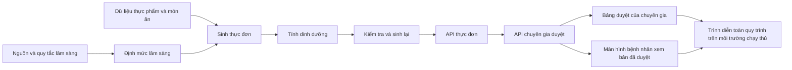

# Kế hoạch Jira 3 tuần — NutriCare Agent

> Thời gian: **06/08/2026–26/08/2026**  
> Phạm vi: hoàn thiện lõi lâm sàng, tác nhân AI sinh thực đơn, lớp bảo vệ an toàn, giao diện lập trình (API), quy trình chuyên gia kiểm duyệt, giao diện hai vai trò và bản trình diễn toàn bộ quy trình trên môi trường chạy thử.  
> Nguyên tắc: **LLM chỉ chọn món; Python/SQL tính số; mọi số liệu có nguồn; thực đơn phải được chuyên gia duyệt trước khi bệnh nhân nhìn thấy.**

## 1. Mục tiêu sau 3 tuần

Đến hết ngày 26/08/2026, đội phải trình diễn được luồng:

1. Bệnh nhân đăng nhập và tạo hồ sơ mô phỏng.
2. Lõi lâm sàng tính định mức, trả danh sách quy tắc đã áp dụng và nguồn hướng dẫn y khoa.
3. Tác nhân AI sinh thực đơn từ mã thực phẩm/món ăn và số gram.
4. Python/SQL tính dinh dưỡng, kiểm tra dị ứng và các ngưỡng lâm sàng.
5. Thực đơn không đạt được sinh lại tối đa 3 lần; không vòng lặp vô hạn.
6. Thực đơn đạt yêu cầu chuyển sang trạng thái `pending_review` (chờ chuyên gia duyệt).
7. Chuyên gia xem, sửa gram, duyệt hoặc từ chối.
8. Bệnh nhân chỉ xem được thực đơn đã duyệt.
9. Mọi hành động quan trọng có nhật ký kiểm tra; môi trường chạy thử hoạt động ổn định.

### Chỉ số nghiệm thu cấp dự án

| Mã | Chỉ số | Mục tiêu ngày 26/08 |
|---|---|---:|
| KPI-01 | Lõi tính toán lâm sàng vượt qua toàn bộ kiểm thử đơn vị | 100% |
| KPI-02 | Số liệu dinh dưỡng có nguồn hợp lệ | 100% |
| KPI-03 | Thực đơn đạt bộ kiểm tra sau tối đa 3 lần sinh | ≥ 95% trên bộ kiểm tra nhanh |
| KPI-04 | Chặn đúng câu hỏi chỉ định y khoa | ≥ 95% trên 20 câu red-team |
| KPI-05 | Bệnh nhân truy cập dữ liệu người khác | 0 trường hợp; trả 404 |
| KPI-06 | Bệnh nhân xem menu chưa duyệt | 0 trường hợp |
| KPI-07 | Thời gian chuyên gia duyệt một menu | ≤ 2 phút |
| KPI-08 | Toàn bộ quy trình trên môi trường chạy thử | 3 lần liên tiếp không lỗi |

## 2. Phân vai theo năng lực

| Thành viên | Vai trò chính trong dự án | Trách nhiệm quyết định | Người hỗ trợ thay thế |
|---|---|---|---|
| **Anh Hưng** | Phụ trách lâm sàng, dữ liệu và huấn luyện AI/ngôn ngữ | Kiểm chứng nguồn y khoa, xây quy tắc lâm sàng, dữ liệu thực phẩm và bộ đánh giá; làm việc với cố vấn y tế; có quyền từ chối thay đổi ngưỡng lâm sàng thiếu nguồn | Phương |
| **Nam** | Phụ trách tác nhân AI, máy học và kỹ thuật chung | Xây luồng LangGraph, câu lệnh cho mô hình, khuôn dạng đầu ra, vòng kiểm tra–sinh lại, lớp bảo vệ an toàn; theo dõi và tối ưu chất lượng/chi phí mô hình | Hưng |
| **Linh** | Phụ trách toàn hệ thống và triển khai | Cơ sở dữ liệu, API, đăng nhập/phân quyền, kết nối quy trình chuyên gia duyệt, kiểm tra tự động và môi trường chạy thử; có quyền chặn gộp mã khi kiểm tra lỗi hoặc thiếu bài kiểm thử | Nam |
| **Chị Phương** | Phụ trách luồng sản phẩm, giao diện và phân tích dữ liệu | Thiết kế luồng bệnh nhân/chuyên gia, màn hình duyệt, trải nghiệm cảnh báo và nguồn tham khảo, theo dõi chỉ số; hỗ trợ Hưng nghiên cứu và chuẩn hoá nội dung y tế | Linh |

### Quy tắc chịu trách nhiệm

- Chỉ có **một người thực hiện chính** chịu trách nhiệm hoàn thành mỗi thẻ công việc; người kiểm tra không phải người đồng sở hữu.
- Mọi yêu cầu gộp mã chạm `src/clinical/`, `data/seeds/` hoặc ngưỡng y khoa bắt buộc Hưng kiểm tra.
- Mọi yêu cầu gộp mã chạm `src/agents/` bắt buộc Nam kiểm tra.
- Mọi yêu cầu gộp mã chạm phần đăng nhập, cơ sở dữ liệu, triển khai hoặc API phân quyền bắt buộc Linh kiểm tra.
- Phương kiểm tra điều kiện nghiệm thu về luồng người dùng, cảnh báo và khả năng đọc hiểu của giao diện.
- Dữ liệu bệnh nhân trong cả ba tuần là dữ liệu mô phỏng; không đưa dữ liệu bệnh nhân thật vào kho mã hoặc môi trường chạy thử.

## 3. Cấu hình Jira

### Một số từ kỹ thuật được giữ lại

| Từ | Cách hiểu trong tài liệu |
|---|---|
| API | Cổng để giao diện và máy chủ trao đổi dữ liệu |
| LangGraph | Thư viện dùng để ghép các bước xử lý của tác nhân AI |
| JWT, RBAC | Cách xác thực đăng nhập và phân quyền theo vai trò |
| CI/CD | Quy trình tự động kiểm tra mã và đưa hệ thống lên môi trường chạy |
| LLM | Mô hình ngôn ngữ lớn dùng để chọn và sắp xếp món; không được tự tính số dinh dưỡng |
| P0, P1, P2, P3 | Mức ưu tiên từ khẩn cấp/bắt buộc đến có thể làm sau |

### Project

| Thuộc tính | Giá trị |
|---|---|
| Project name | NutriCare Agent |
| Project key | `NCA` |
| Bảng quản lý | Scrum (làm việc theo từng đợt ngắn) |
| Cách ước lượng | Điểm công việc: 1, 2, 3, 5, 8 |
| Chu kỳ | 7 ngày, từ Thứ Năm đến Thứ Tư |
| Loại thẻ | Nhóm việc lớn, yêu cầu người dùng, công việc, lỗi, thử nghiệm và công việc con |

### Epic

| Nhóm việc lớn | Tên | Người phụ trách |
|---|---|---|
| `NCA-E1` | Kiến thức lâm sàng và dữ liệu | Hưng |
| `NCA-E2` | Tác nhân AI, lớp bảo vệ và đánh giá | Nam |
| `NCA-E3` | Nền tảng, API và bảo mật | Linh |
| `NCA-E4` | Chuyên gia kiểm duyệt, giao diện và luồng sản phẩm | Phương |
| `NCA-E5` | Tích hợp, kiểm tra chất lượng và chuẩn bị trình diễn | Linh |

### Luồng xử lý thẻ công việc

`Danh sách chờ → Đã chọn cho tuần → Đang làm → Đang kiểm tra → Kiểm tra chất lượng/lâm sàng → Hoàn thành`

- `Blocked` (bị chặn) chỉ là nhãn cảnh báo, không tạo thêm trạng thái.
- Mỗi người chỉ có tối đa **một thẻ đang làm**.
- Vướng quá 90 phút phải ghi bình luận vào thẻ và báo người hỗ trợ thay thế.
- Thẻ lâm sàng phải được kiểm tra chuyên môn; thẻ giao diện/API phải được kiểm tra chất lượng.
- Lỗi P0/P1 được đưa vào tuần làm việc ngay; nếu thêm việc P2/P3 thì phải đưa một thẻ khác ra ngoài để tránh quá tải.

### Khu vực công việc và nhãn

| Khu vực | Nhãn gợi ý |
|---|---|
| Lâm sàng, dữ liệu, tác nhân AI, máy chủ, giao diện, triển khai, đánh giá | `p0`, `p1`, `clinical-review` (cần kiểm tra lâm sàng), `security` (bảo mật), `hitl` (chuyên gia duyệt), `groundedness` (có nguồn), `staging` (chạy thử), `demo-blocker` (chặn trình diễn) |

## 4. Tuần 1 — Lõi lâm sàng và nền tảng

**Thời gian:** 06/08–12/08/2026  
**Mục tiêu tuần:** API tính được định mức lâm sàng có nguồn từ hồ sơ mô phỏng; có cơ sở dữ liệu, đăng nhập/phân quyền và lượng dữ liệu tối thiểu để tác nhân AI bắt đầu hoạt động.

| Jira | Nhóm | Công việc | Người làm chính | Người kiểm tra | Điểm | Ưu tiên | Phụ thuộc | Điều kiện nghiệm thu rút gọn |
|---|---|---|---|---|---:|---|---|---|
| `NCA-101` | E1 | Chốt nguồn, license và lập `REFERENCES.md` | Hưng | Phương | 3 | P0 | — | Mọi ngưỡng/số liệu dùng trong sprint có URL, ngày truy cập và trạng thái xác minh |
| `NCA-102` | E1 | Hoàn thiện schema và ≥150 thực phẩm cốt lõi | Hưng | Linh | 5 | P0 | NCA-101 | Không dòng nào thiếu nguồn; script validate và seed chạy được |
| `NCA-103` | E1 | Hoàn thiện clinical rules cho ĐTĐ2, THA, CKD, gout | Hưng | Nam | 5 | P0 | NCA-101 | ≥40 rule; có `guideline_ref`; phát hiện rule trùng/xung đột |
| `NCA-104` | E1 | Tính định mức và kiểm tra giới hạn lâm sàng | Hưng | Nam | 5 | P0 | NCA-103 | Người có nhiều bệnh được áp dụng ngưỡng nghiêm ngặt hơn; trả danh sách quy tắc đã dùng; có kiểm thử giá trị biên |
| `NCA-105` | E3 | Cấu trúc cơ sở dữ liệu, nâng cấp bảng và tạo hồ sơ mẫu | Linh | Hưng | 5 | P0 | NCA-102 | Cơ sở dữ liệu trống có thể tạo đủ bảng; có 2 chuyên gia và 6 bệnh nhân mô phỏng |
| `NCA-106` | E3 | Đăng nhập, phân quyền và API hồ sơ bệnh nhân | Linh | Nam | 5 | P0 | NCA-105 | Mã đăng nhập và vai trò hoạt động đúng; kiểm tra dữ liệu hồ sơ; không ghi mật khẩu hoặc khóa bí mật vào nhật ký |
| `NCA-107` | E3 | API tính định mức lâm sàng | Linh | Hưng | 3 | P0 | NCA-104, NCA-106 | `POST /targets/compute` trả targets, rules, guideline refs; không gọi LLM |
| `NCA-108` | E2 | Hoàn thiện cấu trúc trạng thái và khung LangGraph | Nam | Linh | 3 | P0 | Luồng biên dịch được; trạng thái chứa hồ sơ, định mức, số lần thử lại và lỗi |
| `NCA-109` | E2 | Node load profile và compute targets | Nam | Hưng | 3 | P0 | NCA-107, NCA-108 | Chạy không cần LLM key; output khớp API/clinical engine |
| `NCA-110` | E4 | Chốt luồng người dùng và bản phác thảo hai vai trò | Phương | Linh | 3 | P0 | Bản nháp quy ước API | Có luồng bệnh nhân/chuyên gia, trạng thái đang tải/lỗi/chưa có dữ liệu và vị trí cảnh báo y tế |
| `NCA-111` | E4 | Khung giao diện, màn hình đăng nhập và điều hướng theo vai trò | Phương | Linh | 5 | P1 | NCA-106, NCA-110 | Đăng nhập/đăng xuất; sai vai trò được chuyển về đúng trang; hiển thị cơ bản trên điện thoại |
| `NCA-112` | E5 | Kiểm tra mã, kiểm thử, kiểm tra dữ liệu và khóa bí mật tự động | Linh | Nam | 3 | P0 | — | Mọi yêu cầu gộp mã đều được kiểm tra; hệ thống báo lỗi khi dữ liệu thiếu nguồn hoặc có khóa bí mật |

### Kết quả trình diễn tuần 1

- Đăng nhập bằng tài khoản mô phỏng.
- Tạo/mở hồ sơ bệnh nhân.
- Gọi API tính targets và giải thích được rule/nguồn áp dụng.
- CI xanh trên nhánh tích hợp.

## 5. Tuần 2 — Tác nhân AI an toàn và thực đơn chờ duyệt

**Thời gian:** 13/08–19/08/2026  
**Mục tiêu tuần:** Tác nhân AI sinh được thực đơn một ngày; các giá trị dinh dưỡng do chương trình tính, có nguồn, được kiểm tra và sinh lại khi chưa đạt; kết quả luôn dừng ở trạng thái chờ chuyên gia duyệt.

| Jira | Nhóm | Công việc | Người làm chính | Người kiểm tra | Điểm | Ưu tiên | Phụ thuộc | Điều kiện nghiệm thu rút gọn |
|---|---|---|---|---|---:|---|---|---|
| `NCA-201` | E1 | Bộ món Việt tối thiểu phục vụ trình diễn | Hưng | Phương | 5 | P0 | NCA-102 | ≥40 món ưu tiên, công thức/gram/nguồn được kiểm tra; không chờ đủ 80 món mới tích hợp |
| `NCA-202` | E1 | Dị ứng và ánh xạ nguyên liệu ẩn | Hưng | Nam | 3 | P0 | NCA-201 | Dị ứng luôn chặn cứng; có kiểm thử bún riêu/mắm tôm và các tên gọi tương đương chính |
| `NCA-203` | E2 | Tìm món phù hợp và lấy ngữ cảnh có nguồn | Nam | Hưng | 5 | P1 | NCA-201 | Trả danh sách thực phẩm/món hợp lệ; loại món gây dị ứng hoặc vi phạm quy tắc bắt buộc |
| `NCA-204` | E2 | Sinh thực đơn theo khuôn dạng đầu ra cố định | Nam | Hưng | 5 | P0 | NCA-203 | Mô hình chỉ trả mã món, số gram và bữa ăn; mã lạ bị từ chối; không cho mô hình tự ghi kcal, natri hoặc protein |
| `NCA-205` | E2 | Tính dinh dưỡng bằng chương trình và gắn nguồn | Nam | Hưng | 3 | P0 | NCA-204 | Kết quả khớp 5 mẫu tính tay; 100% món có nguồn; phần tính toán không gọi mô hình ngôn ngữ |
| `NCA-206` | E2 | Kiểm tra, phản hồi lỗi và sinh lại tối đa 3 lần | Nam | Hưng | 5 | P0 | NCA-104, NCA-202, NCA-205 | Phản hồi chỉ ra chất/món gây vượt; không lặp vô hạn; thất bại thì gắn cờ `needs_attention` (cần chú ý) |
| `NCA-207` | E2 | Lớp bảo vệ trước câu hỏi chỉ định y khoa | Nam | Hưng | 5 | P0 | NCA-108 | Chặn đúng ≥95% bộ 20 câu; tỷ lệ chặn nhầm <10%; trả hướng dẫn chuyển chuyên gia |
| `NCA-208` | E3 | API tạo và đọc thực đơn không bắt người dùng chờ | Linh | Nam | 5 | P0 | NCA-206 | Yêu cầu tạo trả mã 202 và mã thực đơn; có giới hạn thời gian rõ ràng; trạng thái ban đầu là chờ duyệt |
| `NCA-209` | E3 | Bảo mật tài nguyên theo bệnh nhân | Linh | Nam | 3 | P0 | NCA-106, NCA-208 | Bệnh nhân A đọc B trả 404; bệnh nhân không nhận nội dung plan pending |
| `NCA-210` | E4 | Form hồ sơ bệnh nhân nối API | Phương | Linh | 5 | P1 | NCA-106, NCA-110 | Client/server validation khớp; có lưu nháp; hiển thị lỗi dễ hiểu |
| `NCA-211` | E4 | Màn hình trạng thái tạo thực đơn | Phương | Linh | 3 | P1 | NCA-208 | Thể hiện processing/pending/approved/failed; pending không lộ nội dung |
| `NCA-212` | E5 | Kiểm thử bắt buộc mọi số liệu có nguồn | Linh | Hưng | 3 | P0 | NCA-205 | Hệ thống kiểm tra tự động báo lỗi nếu số dinh dưỡng thiếu nguồn hoặc phần tính số gọi mô hình ngôn ngữ |

### Kết quả trình diễn tuần 2

- Từ một hồ sơ mẫu, tạo được menu một ngày.
- Xem trace ba bước: chọn món → code tính số → validator.
- Thử thực đơn lỗi và quan sát quá trình sinh lại/phương án dự phòng.
- Thực đơn kết thúc ở trạng thái chờ duyệt; bệnh nhân không xem được nội dung.

## 6. Tuần 3 — Chuyên gia kiểm duyệt, chạy thử và kiểm tra toàn bộ quy trình

**Thời gian:** 20/08–26/08/2026  
**Mục tiêu tuần:** Chuyên gia duyệt, sửa hoặc từ chối thực đơn trên bảng điều khiển; bệnh nhân chỉ thấy bản đã duyệt; toàn bộ quy trình chạy ổn định trên môi trường chạy thử.

| Jira | Nhóm | Công việc | Người làm chính | Người kiểm tra | Điểm | Ưu tiên | Phụ thuộc | Điều kiện nghiệm thu rút gọn |
|---|---|---|---|---|---:|---|---|---|
| `NCA-301` | E3 | Lưu trạng thái và API hàng chờ chuyên gia duyệt | Linh | Nam | 5 | P0 | NCA-208 | Liệt kê được thực đơn chờ; duyệt/sửa/từ chối đúng vai trò; từ chối phải có lý do; trạng thái không mất khi khởi động lại |
| `NCA-302` | E3 | Nhật ký cho việc sinh/sửa/duyệt/từ chối | Linh | Hưng | 3 | P0 | NCA-301 | Có người thực hiện, thời gian, dữ liệu trước/sau; không có API sửa hoặc xoá nhật ký |
| `NCA-303` | E4 | Dashboard hàng chờ và chi tiết duyệt | Phương | Linh | 8 | P0 | NCA-301 | Hiện menu, targets, violations, nguồn; cảnh báo high nổi bật; thao tác duyệt ≤2 phút |
| `NCA-304` | E4 | Sửa gram và tính lại trước khi duyệt | Phương | Hưng | 5 | P0 | NCA-303 | UI cập nhật tổng; backend validate lại; không duyệt nếu còn hard violation |
| `NCA-305` | E4 | Màn hình thực đơn đã duyệt cho bệnh nhân | Phương | Hưng | 5 | P0 | NCA-301 | Chỉ hiện bản approved; có người/thời gian duyệt, nguồn từng món và disclaimer |
| `NCA-306` | E2 | Bộ 20 câu thử phá an toàn và đánh giá nhanh thực đơn | Nam | Hưng | 3 | P0 | NCA-206, NCA-207 | Xuất tỷ lệ chặn an toàn, tỷ lệ đạt sau khi sinh lại, tỷ lệ có nguồn và danh sách trường hợp thất bại |
| `NCA-307` | E2 | Theo dõi luồng và đo thời gian/chi phí | Nam | Linh | 3 | P1 | NCA-208 | Theo dõi được từng bước; có thời gian phản hồi trung vị/chậm, lượng đơn vị xử lý của mô hình và chi phí trung bình mỗi thực đơn |
| `NCA-308` | E1 | Buổi kiểm tra với cố vấn y tế | Hưng | Phương | 3 | P0 | NCA-303, NCA-306 | Kiểm tra ≥5 thực đơn; ghi nhận xét, quyết định sửa/không sửa và nguồn bổ sung |
| `NCA-309` | E4 | Bảng theo dõi chất lượng tuần | Phương | Nam | 3 | P1 | NCA-306, NCA-307 | Tổng hợp tỷ lệ đạt, số lần sinh lại, thời gian, chi phí và nhóm lỗi chính |
| `NCA-310` | E5 | Đưa lên môi trường chạy thử và tạo dữ liệu mẫu an toàn | Linh | Phương | 5 | P0 | NCA-301, NCA-305 | Triển khai bằng một lệnh hoặc quy trình tự động; kiểm tra hoạt động đạt; chạy lại tạo dữ liệu không bị nhân đôi |
| `NCA-311` | E5 | Kiểm tra toàn quy trình, bảo mật và cùng tìm lỗi | Linh | Cả đội | 5 | P0 | NCA-310 | Luồng chạy 3 lần liên tiếp; kiểm thử phân quyền đạt; không còn lỗi P0/P1 |
| `NCA-312` | E5 | Kịch bản trình diễn và danh sách cách phục hồi | Phương | Linh | 3 | P1 | NCA-311 | Có kịch bản 3–4 phút, tài khoản mẫu và phương án dự phòng khi mô hình hoặc môi trường chạy thử gặp lỗi |

### Kết quả trình diễn tuần 3

- Chạy live luồng bệnh nhân → agent → chuyên gia → bệnh nhân.
- Sửa gram trên bảng điều khiển và chứng minh hệ thống tính, kiểm tra lại.
- Chứng minh menu pending không thể xem từ cả UI lẫn API.
- Trình bày kết quả cố vấn kiểm tra và bảng chỉ số đánh giá nhanh.

## 7. Chuỗi công việc bắt buộc và quan hệ phụ thuộc



Các thẻ trên chuỗi công việc bắt buộc: `NCA-101/102/103/104 → NCA-201/204/205/206 → NCA-208 → NCA-301/303/305 → NCA-310/311`.

Nếu một thẻ trên chuỗi bắt buộc trễ quá 1 ngày, người phụ trách phải tách phần tối thiểu có thể tích hợp và chuyển phần còn lại sang danh sách làm sau. Không chờ hoàn thiện “đẹp” mới bàn giao quy ước cho người kế tiếp.

## 8. Điều kiện để một thẻ được bắt đầu

Ticket chỉ được kéo vào sprint khi:

- Có mô tả giá trị người dùng hoặc mục tiêu kỹ thuật rõ ràng.
- Có điều kiện nghiệm thu kiểm thử được.
- Có người làm chính, người kiểm tra, mức ưu tiên, điểm ước lượng và quan hệ phụ thuộc.
- Quy ước dữ liệu/API đã thống nhất nếu có nhiều người cùng kết nối.
- Ticket y khoa đã chỉ rõ nguồn cần dùng hoặc người chịu trách nhiệm xác minh.
- Không chứa dữ liệu bệnh nhân thật hoặc yêu cầu chưa được phép sử dụng.

## 9. Điều kiện để một thẻ được coi là hoàn thành

Thẻ chỉ được chuyển sang “Hoàn thành” khi:

- Điều kiện nghiệm thu đã được kiểm tra và đính kèm bằng chứng vào Jira.
- Có kiểm thử trường hợp thông thường và trường hợp biên cho phần xử lý mới.
- Kiểm tra cách viết mã, kiểu dữ liệu, kiểm thử đơn vị/tích hợp và kiểm tra dữ liệu đều đạt.
- Yêu cầu gộp mã được ít nhất một người phù hợp phê duyệt và đã gộp vào nhánh tích hợp.
- Không hard-code secret; không log thông tin nhạy cảm.
- Số liệu dinh dưỡng mới có `source`/`source_ref`; ngưỡng y khoa có `guideline_ref`.
- Thay đổi API/schema đã cập nhật tài liệu liên quan.
- Thay đổi có ảnh hưởng đến buổi trình diễn đã được xác nhận trên môi trường chạy thử.
- Nhật ký phát triển và nhật ký công việc được cập nhật ngắn gọn.

## 10. Lịch làm việc và nghi thức

| Nghi thức | Thời điểm | Thời lượng | Đầu ra |
|---|---|---:|---|
| Lập kế hoạch tuần | Tối ngày đầu tuần | 45 phút | Chốt phạm vi, người phụ trách, phụ thuộc và rủi ro |
| Báo cáo ngắn hằng ngày | 21:00 hằng ngày | 5 phút/người | Hôm qua / hôm nay / việc đang bị chặn / mã thẻ |
| Đồng bộ việc phụ thuộc | Thứ Hai và Thứ Năm | 20 phút | Chốt quy ước API và việc bàn giao trên chuỗi bắt buộc |
| Cố vấn kiểm tra lâm sàng | Tối thiểu 1 lần/tuần | 30–60 phút | Biên bản câu hỏi, nguồn và quyết định |
| Trình diễn nội bộ | Tối ngày cuối tuần | 45 phút | Trình diễn trên nhánh tích hợp hoặc môi trường chạy thử |
| Nhìn lại tuần | Sau trình diễn | 15 phút | Một điều giữ, một điều bỏ, một hành động có người chịu trách nhiệm |

## 11. Quản lý rủi ro và phương án giảm phạm vi

| Rủi ro | Dấu hiệu sớm | Owner | Phương án |
|---|---|---|---|
| Nguồn y khoa chưa được cố vấn xác nhận | Quy tắc P0 còn trạng thái “chưa xác minh” sau tuần 1 | Hưng | Chỉ dùng hướng dẫn công khai, gắn nguồn rõ; không đưa quy tắc chưa xác minh vào trình diễn |
| Dữ liệu món chưa đủ | Tác nhân AI thường không tìm thấy món phù hợp | Hưng | Chốt 40 món trình diễn có chất lượng trước; 40 món còn lại đưa vào danh sách làm sau |
| Mô hình ngôn ngữ không ổn định | Thường xuyên không đọc được kết quả hoặc phải thử lại quá 3 lần | Nam | Khuôn dạng đầu ra chặt, giảm độ ngẫu nhiên, lưu kết quả dùng lại và có thực đơn dự phòng theo bệnh lý |
| HITL interrupt quá phức tạp | Sau 2 ngày state vẫn không persist | Linh | Fallback sang state machine bằng cột `status`; vẫn giữ đủ kiểm soát duyệt |
| Giao diện bị chặn bởi API | Chưa có dữ liệu giả lập hoặc quy ước đổi liên tục | Phương | Chốt mô tả API và dữ liệu trả về giả lập đầu tuần; giao diện phát triển theo quy ước |
| Triển khai không ổn định | Môi trường chạy thử lỗi liên tục hoặc khởi động quá chậm | Linh | Thêm kiểm tra hoạt động, tạo dữ liệu không trùng, lưu kết quả dùng lại; chuẩn bị video và bản chạy tại máy làm phương án dự phòng |
| Thành viên quá tải | Một người có hơn một thẻ đang làm hoặc thường xuyên chuyển việc sang tuần sau | Nam | Giữ P0, bỏ P2/P3; người hỗ trợ nhận phần việc nhỏ đã tách rõ, không đổi trách nhiệm mơ hồ |

### Thứ tự cắt khi trễ

1. Bỏ bảng phân tích số liệu `NCA-309`.
2. Giảm RAG/retrieval nâng cao, dùng SQL filter + guideline context cố định có nguồn.
3. Giảm bộ món từ 80 xuống 40 món đã kiểm chứng.
4. Bỏ regenerate sau reject; vẫn giữ approve/edit/reject và lịch sử.
5. Hoãn nhật ký ăn uống, thực đơn 7 ngày, shopping list và các tính năng nâng cao.

**Không được cắt:** nguồn dữ liệu, tính dinh dưỡng bằng chương trình, bộ kiểm tra lâm sàng, lớp bảo vệ an toàn, phân quyền, chuyên gia kiểm duyệt, nhật ký kiểm tra tối thiểu, cảnh báo y tế và toàn bộ quy trình trên môi trường chạy thử.

## 12. Mẫu mô tả thẻ Jira

```markdown
## Giá trị / Mục tiêu
Là [vai trò], tôi muốn [khả năng] để [nhận được giá trị].

## Phạm vi
- Phần sẽ làm:
- Phần chưa làm:

## Điều kiện nghiệm thu
- Given ... When ... Then ...
- Given ... When ... Then ...

## Ghi chú kỹ thuật
- API/cấu trúc dữ liệu:
- Ràng buộc lâm sàng/nguồn:
- Ràng buộc nhật ký/bảo mật:

## Quan hệ phụ thuộc
- Công việc này đang chặn:
- Công việc này bị chặn bởi:

## Bằng chứng kiểm thử
- Kiểm thử đơn vị/tích hợp/toàn quy trình:
- Ảnh chụp/nhật ký/báo cáo:

## Điều kiện hoàn thành
- [ ] Mã nguồn + kiểm thử + tài liệu
- [ ] Hệ thống kiểm tra tự động đạt
- [ ] Người kiểm tra/chuyên gia lâm sàng đã duyệt
- [ ] Đã xác nhận trên môi trường chạy thử (nếu áp dụng)
```

## 13. Danh sách công việc để sau 3 tuần

Các hạng mục sau không đưa vào cam kết 3 tuần: đủ 80 món Việt, đầy đủ 80 tương tác thuốc–thực phẩm, đánh giá chất lượng truy xuất tài liệu, ước lượng món chưa có trong dữ liệu, nhật ký ăn uống, thực đơn 7 ngày, mâm cơm gia đình, danh sách đi chợ, biểu đồ 30 ngày, xuất PDF và bài thuyết trình/video cuối. Chỉ đưa vào sớm khi toàn bộ việc P0 của tuần hiện tại đã hoàn thành và không còn lỗi P0/P1.
