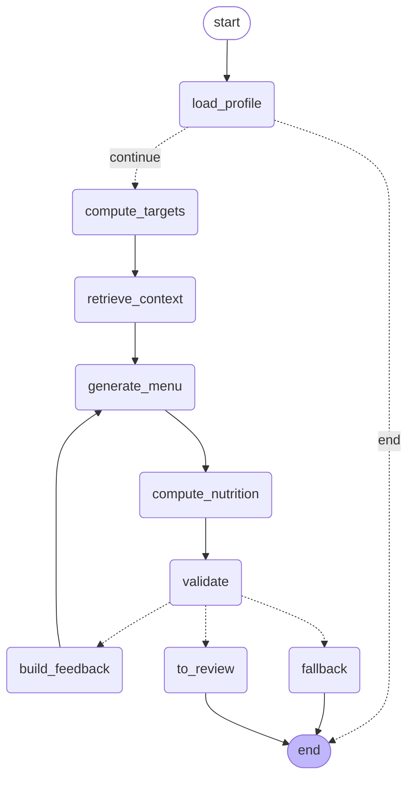

# CODE KHUNG — Clinical Engine + LangGraph Agent

> Ticket bao phủ: CLN-01 → CLN-05, AGT-01 → AGT-06, một phần HIT-01, EVL-03
> Trạng thái: **51 test xanh**, chạy được ngay, không cần API key và không cần database.
> (Chuyển từ README.md sang đây khi SET-06 viết lại README theo README_boilerplate.md — nội dung kỹ thuật này vẫn còn giá trị tham khảo cho ai làm AGT-*/CLN-*.)

---

## Chạy thử trong 30 giây

```bash
pip install pydantic langgraph pytest
python -m pytest -q            # 51 passed
python scripts/validate_data.py
```

Không cần `OPENAI_API_KEY`: LLM được ẩn sau interface `MenuGenerator`, test dùng bản giả. Đây là chủ ý — toàn bộ logic lâm sàng phải kiểm chứng được mà không cần gọi mô hình.

---

## Cấu trúc

```
src/
├── clinical/                 ⭐ Tầng deterministic — KHÔNG import LLM
│   ├── models.py             Pydantic: hồ sơ, định mức, thực đơn, vi phạm
│   ├── energy.py             BMR (Mifflin-St Jeor), TDEE, cân nặng hiệu chỉnh
│   ├── rules.py              Nạp clinical_rules.csv, hợp nhất đa bệnh lý
│   ├── nutrition.py          compute_nutrition() — nơi RULE-1 được thực thi
│   └── validator.py          Bounds checker + sinh feedback cho retry
├── agents/
│   ├── state.py              NutriState (TypedDict)
│   ├── nodes/core.py         8 node + router, mỗi node khai báo LLM: YES/NO
│   └── graph.py              StateGraph + interrupt cho HITL
data/seeds/
├── clinical_rules.csv        18 rule, mỗi rule có guideline_ref
├── drug_food_interactions.csv 30 cặp tương tác
└── food_items.template.csv   152 thực phẩm — phần số liệu chờ nhập (xem data/README.md)
scripts/validate_data.py      Chặn merge nếu dữ liệu thiếu nguồn hoặc phi lý
```

---

## Ba nguyên tắc được thực thi bằng code, không phải bằng lời dặn

### RULE-1 — LLM chọn món, Python tính số

`MenuItem` chỉ có đúng hai field:

```python
class MenuItem(BaseModel):
    food_id: int
    grams: float
```

Không có chỗ nào để LLM ghi kcal hay natri. Con số duy nhất đến từ `compute_nutrition()`, vốn tra `FoodRepository`. Có test kiểm tra bằng AST rằng `src/clinical/*` không import `openai`, `anthropic`, `langchain_openai`…

```
test_tang_deterministic_khong_duoc_import_llm[clinical/nutrition.py] PASSED
test_schema_llm_khong_co_field_dinh_duong PASSED
```

### RULE-2 — Không con số nào không có nguồn

`FoodItem.source_ref` là field bắt buộc, và validator từ chối `TODO`/`N/A`. Mỗi lần tính đều sinh `sources[]`. `scripts/validate_data.py` chặn CI nếu seed thiếu nguồn.

### RULE-3 — Không có đường tắt tới bệnh nhân

Graph `interrupt_before=["to_review"]`. Test xác nhận sau khi chạy xong, `state.next == ("to_review",)` và `status != "approved"`. Không có nhánh nào trong graph đặt trạng thái `approved` — việc đó chỉ xảy ra khi chuyên gia thao tác qua API.

---

## Luồng agent



Sơ đồ này xuất trực tiếp từ code bằng `graph.get_graph().draw_mermaid()` — nghĩa là nó **không thể lệch với thực tế**. Dùng cho Deliverable #3.

| Node | LLM | Vai trò |
|---|:-:|---|
| `load_profile` | ❌ | Nạp hồ sơ, thoát sớm nếu không có |
| `compute_targets` | ❌ | BMR → TDEE → định mức theo bệnh lý |
| `retrieve_context` | ❌ | Lọc sẵn thực phẩm cấm/dị ứng **trước khi** LLM nhìn thấy |
| `generate_menu` | ✅ | Node duy nhất gọi LLM trong luồng sinh thực đơn |
| `compute_nutrition` | ❌ | Cộng bằng dữ liệu tra được, sinh `sources[]` |
| `validate` | ❌ | Bounds checker + dị ứng, fail closed |
| `build_feedback` | ❌ | Sinh feedback cụ thể cho lần retry |
| `fallback` | ❌ | Thực đơn mẫu khi hết 3 lượt, gắn `needs_attention` |

---

## Một phát hiện đáng chú ý từ test

Test `test_da_benh_ly_lay_nguong_nghiem_ngat_hon` ban đầu **fail**, và nó fail vì một xung đột y khoa có thật:

- ADA khuyến nghị bệnh nhân ĐTĐ ăn protein 15–20% năng lượng → **72 g/ngày**
- KDIGO giới hạn bệnh nhân CKD ở 0,6–0,8 g/kg → **52 g/ngày**

Bệnh nhân ĐTĐ + CKD (rất phổ biến) rơi vào mâu thuẫn: ngưỡng tối thiểu cao hơn ngưỡng tối đa. Hệ thống đã hành xử đúng — gắn cờ `needs_expert_review` thay vì tự chọn. Nhưng nếu để vậy thì **mọi ca ĐTĐ+CKD đều bị đẩy sang chuyên gia**, làm hỏng trải nghiệm.

Giải pháp: thêm cột `overridden_by` vào `clinical_rules.csv`. Rule protein của ADA bị vô hiệu khi bệnh nhân có CKD — đúng với thực hành lâm sàng (KDIGO thắng ADA ở nhóm bệnh nhân này). Cơ chế xung đột vẫn giữ nguyên làm lưới an toàn cho các trường hợp chưa lường trước.

> Đây là loại chi tiết nên đưa vào slide "Challenges & Learnings". Nó cho thấy đội hiểu domain chứ không chỉ ghép thư viện.

---

## Những gì còn thiếu (không nằm trong khung này)

| Việc | Ticket | Ai |
|---|---|---|
| Bản cài đặt `MenuGenerator` thật (structured output) | AGT-04 | R1 |
| `FoodRepository` dùng SQL thay vì in-memory | BE-01 | R3 |
| PostgresSaver thay MemorySaver | HIT-01 | R1 |
| Guardrail chặn chỉ định y khoa | AGT-07 | R1 |
| RAG guideline + citation | AGT-03, DAT-06 | R1, R2 |
| Kiểm tra tương tác thuốc trong validator | CLN-06 | R2 |
| OOV Estimator | CLN-07 | R2 |
| Toàn bộ API và frontend | EPIC 4, 6 | R3, R4 |

Khi cắm `MenuGenerator` thật vào, **không được sửa gì trong `src/clinical/`**. Nếu thấy mình đang phải sửa tầng deterministic để LLM chạy được, đó là dấu hiệu đang vi phạm RULE-1.

---

## Ghi chú về dữ liệu trong test

Toàn bộ số liệu dinh dưỡng trong `tests/conftest.py` là **dữ liệu giả** dùng để kiểm tra logic, đánh dấu `source_ref = "TEST-FIXTURE"`. Không copy sang `data/seeds/`. Dữ liệu thật phải đến từ NIN hoặc USDA (ticket DAT-02).
