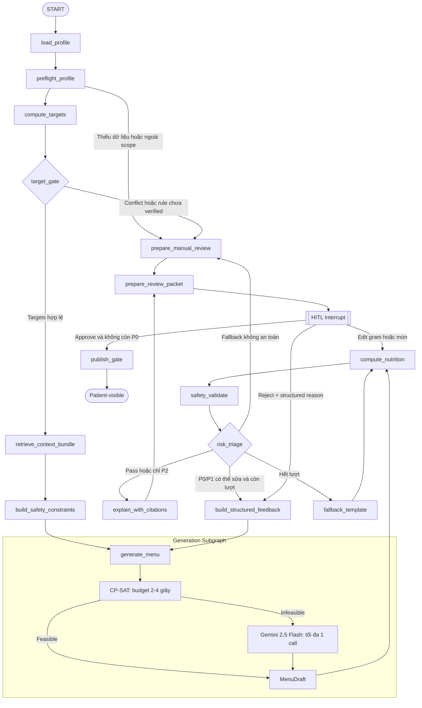

# Phương án tối ưu luồng LangGraph — VNutriCare AI Agent

> **Mục tiêu:** Nâng cấp luồng 9 node hiện tại theo ba trục: an toàn lâm sàng, latency/chi phí và khả năng bảo trì/mở rộng.
>
> **Phạm vi:** `src/agents/graph.py`, `src/agents/nodes/`, generator Hybrid CP-SAT/Gemini, HITL và Tuyến C Explainability/RAG.

---

## 1. Tóm tắt đề xuất

Luồng hiện tại nên được tổ chức lại thành bốn subgraph có hợp đồng rõ ràng:

1. `Clinical Preflight` — kiểm tra hồ sơ, tính target và chặn xung đột.
2. `Menu Generation` — lấy ứng viên, dựng constraint, CP-SAT trước và Gemini khi cần.
3. `Safety Validation` — kiểm tra dinh dưỡng, dị ứng, tương tác và provenance.
4. `Human Review & Publish` — giải thích có citation, HITL, kiểm tra lại sau sửa và publish gate.

Nguyên tắc bắt buộc:

- Mọi đường chạy, kể cả fallback và menu do chuyên gia sửa, phải đi qua cùng một Safety Gate.
- LLM chỉ chọn `food_id`/`dish_id` và gram; mọi số dinh dưỡng do deterministic core tính.
- Không menu nào tới bệnh nhân nếu chưa `approved`, còn P0 hoặc menu đã thay đổi sau lần duyệt.
- Rule và interaction ở trạng thái `to_verify` không được kích hoạt như production rule.

---

## 2. Current vs Proposed

| Hạng mục | Current | Proposed |
|---|---|---|
| Target conflict | Gắn `needs_attention` nhưng vẫn tiếp tục sinh menu | `target_gate` dừng sớm và chuyển chuyên gia |
| Drug/meal interaction | Có bảng DB nhưng chưa nối graph | Pre-check tạo constraint và post-check trên menu thực tế |
| Severity | Chủ yếu `hard`/`soft` | Chuẩn hóa P0/P1/P2 kèm blocking policy |
| Fallback | Tính nutrition rồi đi thẳng `END` | Fallback quay lại `compute → safety_validate → review` |
| HITL | Trạng thái `pending_review` đơn giản | Review packet risk-first; edit chỉ chạy lại downstream |
| CP-SAT | Có thể chạy hai pha, tối đa 30 giây/pha | Tổng solver budget 2–4 giây; trả feasible sớm |
| Gemini | Có thể nhận toàn bộ candidate list | Chỉ nhận top-k; tối đa một call trong happy/fallback flow |
| RAG/Explain | Chưa có node thực thi | Sau Safety Gate, trước HITL; chạy lại khi menu bị sửa |
| State | `TypedDict(total=False)`, ít metadata | Typed state, versioning, attempt history, citations và audit events |
| Persistence | Background task + DB status | Durable job + Postgres checkpointer/outbox khi production |

---

## 3. Luồng cải tiến đề xuất



---

## 4. Cải tiến an toàn lâm sàng

### 4.1. `preflight_profile`

Đặt ngay sau `load_profile`.

Nhiệm vụ:

- Kiểm tra nhân trắc, bệnh, giai đoạn CKD, thuốc và dị ứng.
- Kiểm tra xét nghiệm bắt buộc và độ mới của HbA1c/eGFR/kali máu.
- Phát hiện bệnh ngoài scope, CKD G5D hoặc tình huống chưa có rule phù hợp.
- Không đưa PII/PHI không cần thiết xuống LLM.

Output đề xuất:

- `profile_completeness`;
- `missing_fields`;
- `stale_clinical_data`;
- `unsupported_flags`;
- `manual_review_required`.

### 4.2. `target_gate`

Đặt ngay sau `compute_targets`.

Chuyển thẳng sang chuyên gia nếu:

- `needs_expert_review=true`;
- target có `min > max` hoặc dải quá hẹp;
- rule đang `to_verify`;
- thiếu dữ liệu để kích hoạt rule an toàn;
- rule bị vô hiệu bởi cờ frailty, sarcopenia, metabolic instability hoặc sodium wasting.

Không để target conflict tiếp tục xuống CP-SAT như luồng hiện tại.

### 4.3. `build_safety_constraints`

Đặt trước `generate_menu`.

Nguồn dữ liệu:

- dị ứng và món không ăn;
- `drug_food_interactions`;
- `drug_meal_timing`;
- `food_food_interactions`;
- condition/stage và clinical flags;
- rule đã `verified`.

Output máy đọc được:

```text
excluded_food_ids
excluded_dish_ids
excluded_categories
meal_timing_constraints
nutrient_caps
required_review_flags
constraint_sources
```

CP-SAT nhận trực tiếp các constraint này. Gemini chỉ nhìn thấy danh sách ứng viên đã được lọc.

### 4.4. `safety_validate`

Thay node `validate` hiện tại bằng một Safety Subgraph gồm:

- `validate_nutrition_bounds`;
- `validate_allergies`;
- `validate_drug_food`;
- `validate_drug_meal_timing`;
- `validate_food_food`;
- `validate_provenance`;
- `validate_recipe_completeness`.

Mỗi finding cần có cấu trúc:

```text
code
severity
blocking
actual
limit
rule_id
source_ref
affected_items
suggested_action
resolution_status
```

### 4.5. `risk_triage`

- **P0 — Blocking:** dị ứng, interaction nghiêm trọng, ID/source không hợp lệ, target conflict, hard limit hoặc recipe thiếu nguyên liệu trọng yếu. Không được approve.
- **P1 — Clinical review:** thiếu dữ liệu kali/purine/đường, interaction mức vừa hoặc rule có độ chắc thấp. Cho phép override nhưng bắt buộc lý do.
- **P2 — Quality/adherence:** khẩu vị, độ đa dạng, vùng miền, chi phí hoặc món lặp. Không chặn duyệt.

### 4.6. Sửa luồng fallback

Luồng hiện tại `fallback → END` phải được thay bằng:

```text
fallback_template
  → compute_nutrition
  → safety_validate
  → risk_triage
  → explain_with_citations
  → prepare_review_packet
  → HITL
```

Fallback không đạt Safety Gate phải chuyển sang trạng thái `no_safe_solution` hoặc `manual_review_required`; không giữ lại menu lỗi trước đó.

### 4.7. `publish_gate`

Chỉ publish khi tất cả điều kiện sau đúng:

- `status=approved`;
- không còn P0;
- menu version được duyệt trùng menu version hiện tại;
- nutrition/safety hash không thay đổi sau lần duyệt;
- có `reviewer_id`, quyết định và timestamp;
- mọi số hiển thị có provenance.

---

## 5. Thiết kế HITL tối ưu

Dashboard nên nhận một `ReviewPacket` duy nhất:

- P0 hiển thị đầu tiên, sau đó P1/P2.
- So sánh `actual ↔ target`, kèm món gây vi phạm.
- Hiển thị rule, evidence grade và citation ngay cạnh cảnh báo.
- Sửa gram/add/remove món rồi gọi server recompute với debounce 300–500 ms.
- Sau chỉnh sửa chỉ chạy lại:

```text
compute_nutrition → safety_validate → explain_with_citations
```

Không chạy lại profile, retrieval hoặc Gemini.

Quy tắc thao tác:

- Disable Approve khi còn P0.
- Override P1 yêu cầu lý do chuẩn hóa và ghi chú.
- Reject dùng mã lý do như `too_salty`, `poor_variety`, `not_practical`, không chỉ free text.
- Resume graph bằng Postgres checkpointer với `thread_id=plan_id` nếu triển khai interrupt thật.

---

## 6. Tối ưu latency và chi phí

### 6.1. Latency budget

| Stage | Budget mục tiêu |
|---|---:|
| Profile + targets | <200 ms |
| Retrieve + safety constraints | <300 ms |
| CP-SAT | 2–4 s |
| Nutrition + full validation | <300 ms |
| Explain/template citation | 0,2–2 s |
| Gemini fallback nếu cần | ≤8 s |
| Tổng happy path | 3–7 s |
| Tổng có Gemini | 10–15 s |

### 6.2. CP-SAT

- Hạ timeout từ 30 giây mỗi pha xuống tổng 2–4 giây.
- Warm-up OR-Tools khi application startup để tránh cold import.
- Dừng ngay khi tìm được feasible solution phù hợp MVP.
- Precompute nutrient vector của từng food/dish.
- Giảm candidate từ khoảng 521 xuống 50–120 bằng source quality, nhóm món, bữa ăn, vùng miền, bệnh, dị ứng và độ đầy đủ dữ liệu.
- Nếu chạy cấu hình `cpsat` thuần và solver trả infeasible, đi thẳng fallback; không giải lại cùng input ba lần.

### 6.3. Multi-stage generation

Nên chia thành các stage deterministic, không chia thành nhiều lượt Gemini:

1. `meal_skeleton` — số bữa, slot và giới hạn món mỗi bữa.
2. `candidate_ranking` — SQL/cache lấy top-k cho từng slot.
3. `gram_allocation` — CP-SAT giải toàn ngày.
4. `gemini_repair` — chỉ khi CP-SAT infeasible hoặc cần sửa constraint chất lượng chưa mô hình hóa.

Không dùng luồng `Gemini sinh cấu trúc → Gemini chọn món → Gemini tính gram`, vì làm tăng token, latency và số điểm có thể sai.

### 6.4. Streaming trạng thái

Dùng SSE hoặc WebSocket để gửi các event:

```text
profile_validated
targets_computed
optimizing
validating
awaiting_review
```

Không stream menu chưa validate cho bệnh nhân. Chuyên gia chỉ xem draft sau Safety Gate; bệnh nhân chỉ xem sau `publish_gate`.

### 6.5. Caching

| Cache | Cache key bắt buộc | Khuyến nghị |
|---|---|---|
| Rule set | `rule_version` | In-memory |
| Food/dish repository | `data_version` | In-memory |
| Dish nutrient vectors | `dish_id + recipe_version + data_version` | In-memory/Redis |
| Clinical targets | `profile_clinical_hash + rule_version` | Redis TTL |
| Candidate retrieval | `constraints_hash + data_version` | Redis TTL |
| Interaction constraints | `medication_hash + condition_hash + interaction_version` | Redis TTL |
| RAG chunks | `rule_ids + guideline_version` | Redis |
| Gemini output | `deidentified_prompt_hash + model + prompt_version` | Redis TTL ngắn |

Nguyên tắc:

- Demo một instance: in-memory cache là đủ.
- Nhiều worker/replica: Redis cho cache và distributed lock.
- PostgreSQL là nguồn sự thật cho checkpoint/audit; Redis chỉ là cache.
- Không cache raw PII/PHI hoặc cache thiếu version key.
- Nạp food, dishes và rules một lần khi startup; không đọc lại toàn bộ CSV cho từng request.

---

## 7. Tuyến C — Explainability và RAG Citation

Vị trí đề xuất:

```text
Safety PASS
  → explain_with_citations
  → prepare_review_packet
  → HITL
```

Nếu chuyên gia sửa menu:

```text
HITL edit
  → compute_nutrition
  → safety_validate
  → explain_with_citations
  → HITL
```

Node Explain chỉ được nhận:

- nutrition do server tính;
- applied rule IDs;
- safety findings;
- guideline chunks đã retrieve;
- source references;
- menu ID và gram đã khóa.

LLM không được thêm ngưỡng hoặc số mới. Không tìm được citation thì trả `insufficient_evidence`, không tự suy diễn.

Nên có hai output:

- `expert_explanation`: rule, evidence grade, rationale và citation chi tiết.
- `patient_explanation`: ngôn ngữ đơn giản, chỉ sinh sau khi menu được approve.

---

## 8. Graph State Schema đề xuất

```python
class NutriState(TypedDict):
    # Identity/version
    run_id: str
    trace_id: str
    plan_id: str
    profile_id: str
    profile_version: str
    rule_version: str
    food_data_version: str
    interaction_version: str
    prompt_version: str

    # Clinical
    profile_snapshot_hash: str
    completeness: ProfileCompleteness
    targets: ClinicalTargets
    target_conflicts: list[TargetConflict]
    safety_constraints: SafetyConstraints

    # Retrieval
    candidate_ids: list[int]
    guideline_chunk_ids: list[str]

    # Generation
    draft_menu: MenuDraft | None
    menu_version: int
    generation_source: Literal["cpsat", "gemini", "fallback"]
    attempt_count: int
    attempt_history: list[GenerationAttempt]

    # Deterministic results
    computed_nutrition: NutritionSummary | None
    nutrition_hash: str | None
    safety_findings: list[SafetyFinding]
    highest_risk: Literal["P0", "P1", "P2", "none"]

    # Explainability
    citations: list[Citation]
    expert_explanation: str | None
    patient_explanation: str | None

    # HITL
    status: PlanStatus
    review_packet: ReviewPacket | None
    reviewer_id: str | None
    review_decision: str | None
    reviewer_notes: str | None
    approved_menu_version: int | None

    # Operations
    node_timings_ms: dict[str, int]
    token_usage: TokenUsage
    last_error: StructuredError | None
    audit_events: list[AuditEvent]
```

Không checkpoint toàn bộ `FoodItem` hoặc candidate objects; chỉ lưu IDs, hash và version. Điều này giảm kích thước checkpoint và hạn chế PHI exposure.

---

## 9. Maintainability và Scalability

- Dùng Pydantic/discriminated models cho `SafetyFinding`, `GenerationAttempt` và `StructuredError`.
- Mỗi node phải idempotent: cùng input/version cho cùng kết quả.
- Tách top-level graph thành bốn subgraph:
  - `ClinicalPreflightSubgraph`;
  - `MenuGenerationSubgraph`;
  - `SafetyValidationSubgraph`;
  - `HumanReviewSubgraph`.
- Audit trail ghi append-only trong DB; LangGraph checkpoint không thay thế audit log nghiệp vụ.
- Khi production, chuyển generation sang durable worker/queue để restart FastAPI không làm mất job.
- Ghi metrics theo node: latency, cache hit, solver status, Gemini token, retry reason và số finding P0/P1/P2.
- Generator trả result có kiểu rõ ràng thay vì chỉ `MenuDraft`, ví dụ `feasible`, `infeasible`, `timeout`, `provider_error`, `invalid_output`.

---

## 10. Lộ trình triển khai

### Phase 1 — P0 Safety Hardening

1. Thêm conditional edge `target_gate` sau `compute_targets`.
2. Đưa fallback quay lại `compute_nutrition → validate → to_review`.
3. Xóa/ghi đè state cũ khi đổi draft: `violations`, `feedback`, `computed_nutrition`.
4. Chặn production rule có `verify_status != verified`.
5. Thêm `publish_gate` theo menu version và safety hash.

### Phase 2 — Interaction Safety và HITL

1. Nối drug–food, drug–meal và food–food vào `build_safety_constraints`/`safety_validate`.
2. Thêm P0/P1/P2 và `ReviewPacket`.
3. Chỉnh sửa HITL chỉ chạy lại downstream compute/validate/explain.
4. Quyết định chính thức giữa DB-status HITL và LangGraph interrupt + Postgres checkpointer.

### Phase 3 — Latency dưới 10–15 giây

1. Cache repository/rules và precompute nutrient vectors.
2. Giảm candidate bằng top-k retrieval.
3. Giới hạn CP-SAT tổng 2–4 giây.
4. Gemini tối đa một call với timeout 6–8 giây.
5. Thêm SSE progress events.

### Phase 4 — Tuyến C và Production Scale

1. Ingest guideline đã duyệt và bật pgvector.
2. Thêm `explain_with_citations` và citation validation.
3. Bổ sung state/audit versioning đầy đủ.
4. Durable queue, distributed cache và observability theo node.

---

## 11. Definition of Done

Phương án được coi là triển khai xong khi:

- Target conflict không thể đi vào generation.
- Fallback và clinician edit đều chạy lại full Safety Gate.
- Không thể approve/publish khi còn P0.
- Menu thay đổi sau duyệt làm approval cũ mất hiệu lực.
- Happy path CP-SAT hoàn thành dưới 10 giây trong môi trường demo.
- Có Gemini timeout và đường xử lý provider error rõ ràng.
- Citation gắn với rule/guideline version và không chứa số do LLM tự sinh.
- Audit tái dựng được toàn bộ chuỗi: input version → attempts → nutrition → findings → edits → approval → publish.

