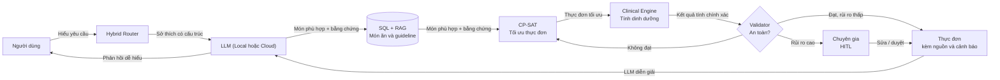

# Nghiên cứu: Đái tháo đường, nhu cầu tư vấn dinh dưỡng và định vị NutriCare Agent

> Tài liệu nghiên cứu bổ sung cho VMEC-10 / AI20K Cohort 3. Mọi số liệu, nhận định đều dẫn nguồn — không có con số nào trong tài liệu này được ước tính hoặc suy diễn mà không có trích dẫn (theo đúng DEC-008 của dự án). Nơi có DOI, đã ghi kèm DOI; nơi chỉ có URL, đã ghi URL truy cập được.

---

## 1. Tổng quan bệnh đái tháo đường (ĐTĐ)

### 1.1 Gánh nặng toàn cầu

Theo **IDF Diabetes Atlas, ấn bản 11 (2025)** — báo cáo dịch tễ học chính thức của Liên đoàn Đái tháo đường Quốc tế:

- **589 triệu người trưởng thành (20–79 tuổi)** đang sống chung với đái tháo đường trên toàn cầu — tỷ lệ 1/9 người trưởng thành, tương đương **11,1%** dân số nhóm tuổi này ([IDF Diabetes Atlas 2025](https://diabetesatlas.org/resources/idf-diabetes-atlas-2025/); [IDF 11th Edition](https://idf.org/news-and-resources/resources/idf-diabetes-atlas-11th-edition-2025/)).
- Dự báo đến **2050**, con số này tăng lên **853 triệu người**, tỷ lệ **12,96%** ([diabetesatlas.org](https://diabetesatlas.org/resources/idf-diabetes-atlas-2025/)).
- ĐTĐ gây ra **3,4 triệu ca tử vong trong năm 2024** — trung bình cứ 9 giây có 1 người tử vong vì biến chứng liên quan ([nguồn đã dẫn](https://diabetesatlas.org/resources/idf-diabetes-atlas-2025/)).
- Chi phí y tế liên quan ĐTĐ đã vượt **1.000 tỷ USD** toàn cầu, tăng **338% trong 17 năm** ([nguồn đã dẫn](https://diabetesatlas.org/resources/idf-diabetes-atlas-2025/)).
- Riêng gánh nặng kinh tế được WHO ước tính trong **Global Report on Diabetes (2016)**: tổng thiệt hại GDP (chi phí trực tiếp + gián tiếp) có thể lên tới **1,7 nghìn tỷ USD**, trong đó **800 tỷ USD** thuộc về các nước thu nhập thấp và trung bình ([WHO, World Health Day 2016](https://www.who.int/vietnam/news/detail/07-04-2016-world-health-day-2016-together-on-the-front-lines-against-diabetes); tóm tắt báo cáo tại [International Journal of Noncommunicable Diseases](https://journals.lww.com/ijnc/fulltext/2016/01010/who_global_report_on_diabetes__a_summary.2.aspx)).

### 1.2 Tình hình tại Việt Nam

- Theo dữ liệu Ngân hàng Thế giới, tỷ lệ ĐTĐ ở nhóm tuổi 20–79 tại Việt Nam là **3,4% năm 2024**, tăng từ 3,2% năm 2011 ([Trading Economics, dẫn theo World Bank](https://tradingeconomics.com/vietnam/diabetes-prevalence-percent-of-population-ages-20-to-79-wb-data.html)).
- Theo báo cáo thời sự tháng 7/2025: ước tính **7 triệu người Việt Nam đang sống chung với ĐTĐ**, nhưng có tới **khoảng 50% chưa được chẩn đoán** ([VietnamPlus, "Vietnam sees alarming surge in diabetes cases, over half undiagnosed"](https://en.vietnamplus.vn/vietnam-sees-alarming-surge-in-diabetes-cases-over-half-undiagnosed-post322823.vnp)).
- Việt Nam đã ban hành **Chiến lược quốc gia phòng, chống bệnh không lây nhiễm giai đoạn 2015–2025**, bao gồm dự phòng và kiểm soát ĐTĐ, cùng kế hoạch cấp tỉnh tập trung phát hiện và quản lý tăng huyết áp/ĐTĐ tại tuyến xã giai đoạn 2020–2025 ([PMC6357573 — Implementation of national action plans on NCDs](https://www.ncbi.nlm.nih.gov/pmc/articles/PMC6357573/); [WHO Vietnam — Hai Duong blueprint](https://www.who.int/vietnam/news/detail/16-06-2020-who-lauds-hai-duong-s-blueprint-for-noncommunicable-diseases)).
- Số liệu chi tiết theo quốc gia (tỷ lệ, số ca, xu hướng) được IDF cập nhật tại trang riêng cho Việt Nam: [IDF Diabetes Atlas — Viet Nam](https://diabetesatlas.org/data-by-location/country/viet-nam/).

**Nhận định:** tỷ lệ mắc ở Việt Nam về danh nghĩa thấp hơn mức trung bình toàn cầu, nhưng tốc độ gia tăng nhanh và **tỷ lệ chưa chẩn đoán rất cao (~50%)** là hai yếu tố khiến việc can thiệp sớm — đặc biệt qua dinh dưỡng, thứ không cần chẩn đoán xác định để bắt đầu phòng ngừa — trở nên cấp thiết.

---

## 2. Vai trò của tư vấn dinh dưỡng trong điều trị ĐTĐ

### 2.1 Khuyến nghị chính thống (ADA Standards of Care)

**American Diabetes Association — Standards of Care in Diabetes 2025** (bản cập nhật thường niên, tài liệu tham chiếu lâm sàng được dùng phổ biến nhất) đưa ra các điểm chính:

- ADA **không** chỉ định một chế độ ăn cố định hay tỷ lệ macronutrient cụ thể cho mọi bệnh nhân — khuyến nghị hiện tại là **cá thể hoá** theo mục tiêu điều trị, đặc điểm sinh lý và thuốc đang dùng ([Medscape — ADA 2025 Guideline Summary Part 3](https://reference.medscape.com/cc2/p10/standards-care-type-2-diabetes-part-3-summary-guideline-2025a1000oh7)).
- Với người ĐTĐ týp 2 kèm thừa cân/béo phì: kết hợp **liệu pháp dinh dưỡng + vận động + can thiệp hành vi**, mục tiêu giảm cân **3–7%**, tạo thâm hụt năng lượng **500–750 kcal/ngày**; nơi có điều kiện nên tư vấn cường độ cao (**≥16 buổi trong 6 tháng**) ([Diabetes Care — Summary of Revisions 2025](https://diabetesjournals.org/care/article/48/Supplement_1/S6/157564/Summary-of-Revisions-Standards-of-Care-in-Diabetes)).
- Bản 2025 bổ sung khuyến nghị mới (5.29) khuyến khích tăng đạm thực vật và chất xơ ([nguồn đã dẫn](https://reference.medscape.com/cc2/p10/standards-care-type-2-diabetes-part-3-summary-guideline-2025a1000oh7)).

### 2.2 Bằng chứng hiệu quả

- Một tổng quan hệ thống + phân tích gộp (RCT) tại các nước thu nhập thấp/trung bình: chương trình giáo dục dinh dưỡng tại tuyến chăm sóc ban đầu giảm HbA1c trung bình **−0,37%** (27 nghiên cứu); chương trình thay thế thực phẩm giảm **−0,54%** (2 nghiên cứu) ([PMC8915303](https://pmc.ncbi.nlm.nih.gov/articles/PMC8915303/)).
- Liệu pháp dinh dưỡng do chuyên gia dinh dưỡng (dietitian) thực hiện cho kết quả cải thiện kiểm soát đường huyết có ý nghĩa lâm sàng, nhất quán trên nhiều nhóm dân tộc ở cả 6 châu lục có người sinh sống ([ScienceDirect — AJCN, hiệu quả MNT ở tiền ĐTĐ](https://www.sciencedirect.com/science/article/pii/S0002916523661209)).
- Với đồng mắc ĐTĐ + tăng huyết áp — nhóm bệnh chính mà NutriCare Agent nhắm tới — các chiến lược can thiệp dinh dưỡng tại chăm sóc ban đầu cũng cho hiệu quả có ý nghĩa thống kê ([PMC8998242, DOI: 10.3390/ijerph19074243](https://doi.org/10.3390/ijerph19074243)).

**Kết luận mục 2:** dinh dưỡng không phải biện pháp hỗ trợ phụ mà là **trụ cột điều trị chính thức** theo guideline, có bằng chứng RCT/tổng quan hệ thống hậu thuẫn — đúng như thiết kế RULE-3 (không thực đơn nào tới bệnh nhân mà chưa qua chuyên gia duyệt) của dự án.

---

## 3. Nhu cầu dinh dưỡng cụ thể của người bệnh ĐTĐ (và các bệnh đồng mắc)

Người bệnh ĐTĐ týp 2 tại Việt Nam hiếm khi mắc đơn bệnh — đa phần đồng mắc tăng huyết áp, bệnh thận mạn (CKD) hoặc gout, mỗi bệnh kéo theo một trục dinh dưỡng riêng mà NutriCare Agent phải cân bằng đồng thời:

| Trục dinh dưỡng | Bệnh liên quan | Khuyến nghị chính | Nguồn |
|---|---|---|---|
| **Chỉ số đường huyết (GI) / tải đường huyết (GL)** | ĐTĐ | Ưu tiên thực phẩm GI thấp–trung bình để kiểm soát đường huyết sau ăn; carb khả dụng = carb tổng − chất xơ | [Atkinson FS et al. 2021, *Am J Clin Nutr* 114(5):1625–1632, DOI: 10.1093/ajcn/nqab233](https://ajcn.nutrition.org/article/S0002-9165(22)00494-4/fulltext) — bảng GI quốc tế lớn nhất hiện có, >4.000 thực phẩm |
| **Natri (muối)** | Tăng huyết áp, CKD | DASH diet: giảm natri, tăng rau quả/ngũ cốc nguyên hạt, giảm mỡ bão hoà; CKD G3-5: natri <2,3 g/ngày (<100 mmol) | Thử nghiệm DASH gốc ([StatPearls NBK482514](https://www.ncbi.nlm.nih.gov/books/NBK482514/)); [2017 ACC/AHA Hypertension Guideline](https://www.ncbi.nlm.nih.gov/pmc/articles/PMC6120944/); [KDIGO 2024 CKD Guideline](https://kdigo.org/wp-content/uploads/2024/03/KDIGO-2024-CKD-Guideline.pdf) |
| **Kali, Phospho, Đạm** | Bệnh thận mạn (CKD) | Đạm ~0,8 g/kg/ngày (CKD G3–G5); điều chỉnh kali theo kali máu thực tế, không áp trần cứng cho mọi bệnh nhân; phospho cần tính theo khả năng hấp thu (phospho vô cơ hấp thu hiệu quả hơn phospho hữu cơ) | [KDOQI 2020 Nutrition in CKD Update](https://www.ajkd.org/article/S0272-6386(20)30726-5/fulltext); [KDIGO 2024](https://kdigo.org/wp-content/uploads/2024/03/KDIGO-2024-CKD-Guideline.pdf) |
| **Purine** | Gout | Hạn chế purine, rượu, fructose cao — khuyến nghị có điều kiện (mức bằng chứng thấp) do tương quan liều-đáp ứng giữa purine và cơn gout cấp | [FitzGerald et al. 2020, *Arthritis Care & Research*, DOI: 10.1002/acr.24180](https://acrjournals.onlinelibrary.wiley.com/doi/10.1002/acr.24180) |
| **Đường tự do (free sugar)** | ĐTĐ, béo phì | WHO khuyến nghị đường tự do <10% tổng năng lượng, lý tưởng <5% | Đã áp dụng trong `clinical_rules.csv` của dự án (ADA Standards of Care 2026) |

Đây chính xác là 4 nhóm ràng buộc đang được mã hoá trong `data/seeds/clinical_rules.csv` của NutriCare Agent (BASE-NA, BASE-FIB, CKD-NA, GOUT-PURINE...) — tài liệu này xác nhận các ràng buộc đó có căn cứ trong y văn, không phải quy ước nội bộ.

**Điểm mấu chốt về đa bệnh lý:** một bệnh nhân ĐTĐ + CKD cùng lúc chịu ràng buộc "ưu tiên đạm để tránh suy dinh dưỡng" (ĐTĐ) và "hạn chế đạm để bảo tồn chức năng thận" (CKD) — hai khuyến nghị có thể xung đột trực tiếp, đòi hỏi hệ thống phải có cơ chế phát hiện xung đột thay vì áp cả hai rule một cách máy móc (KDIGO 2024 nhấn mạnh **cá thể hoá theo mức độ bệnh thận và bệnh đồng mắc**, không phải áp trần cứng — [nguồn đã dẫn](https://kdigo.org/wp-content/uploads/2024/03/KDIGO-2024-CKD-Guideline.pdf)).

---

## 4. Tính cấp thiết của đề tài

Tổng hợp từ các mục trên, 4 lý do khiến bài toán "tư vấn dinh dưỡng ĐTĐ bằng AI, có kiểm chứng lâm sàng" cấp thiết tại Việt Nam:

1. **Quy mô và xu hướng tăng nhanh:** ~7 triệu người mắc, tăng đều qua các năm, và **~50% chưa được chẩn đoán** ([VietnamPlus](https://en.vietnamplus.vn/vietnam-sees-alarming-surge-in-diabetes-cases-over-half-undiagnosed-post322823.vnp)) — nghĩa là can thiệp dinh dưỡng dự phòng (trước khi có chẩn đoán chính thức) có giá trị cộng đồng lớn.
2. **Thiếu hụt nhân lực dinh dưỡng lâm sàng:** tính đến thời điểm khảo sát, **Việt Nam chưa có ai đạt chuẩn "Registered Dietitian"** theo chuẩn quốc tế, và Viện Dinh dưỡng Quốc gia — dù là cơ quan đầu ngành — không phải một hiệp hội hành nghề dinh dưỡng (Dietetic Association) như các nước phát triển ([Springer Nature — Determinants of clinical nutrition knowledge... in Vietnam's public hospitals](https://link.springer.com/article/10.1186/s12960-025-01014-2)). Khoảng trống nhân lực này khiến việc mở rộng tư vấn 1-1 truyền thống không khả thi về quy mô.
3. **Thói quen ăn mặn vượt xa khuyến nghị:** khảo sát STEPS quốc gia (Bộ Y tế) cho thấy người Việt tiêu thụ trung bình **9,4 g muối/ngày (2015)**, giảm còn khoảng **8,1 g/ngày (2020–2021)** — vẫn **gần gấp đôi** mức khuyến nghị của WHO (**≤5 g/ngày**) ([PMC11975537 — Trends in Salt Consumption in Vietnam 2015–2021](https://pmc.ncbi.nlm.nih.gov/articles/PMC11975537/); [VietnamPlus](https://en.vietnamplus.vn/vietnamese-salt-consumption-doubles-who-recommended-level-post128562.vnp)). Đây là trục rủi ro trực tiếp cho nhóm ĐTĐ + tăng huyết áp + CKD mà đề tài nhắm tới.
4. **Công cụ AI hiện có chưa đủ tin cậy về mặt lâm sàng** (xem mục 5 và 6) — cả ứng dụng thương mại lẫn LLM thuần tuý đều có khoảng trống rõ ràng về độ chính xác dinh dưỡng và mức độ tuân thủ guideline, mở ra dư địa cho một hệ thống thiết kế đúng từ đầu để giải quyết vấn đề này (kiến trúc RULE-1/RULE-2/RULE-3 của dự án).

---

## 5. Nghiên cứu liên quan

### 5.1 Hiệu quả của mHealth/app trong quản lý ĐTĐ nói chung

- Tổng quan các tổng quan hệ thống (*systematic review of systematic reviews*): can thiệp mHealth cải thiện HbA1c thêm **−0,3% đến −0,5%** và giảm cân **−1,0 đến −2,4 kg** so với chăm sóc chuẩn ([PMC7218595](https://www.ncbi.nlm.nih.gov/pmc/articles/PMC7218595/)).
- Phân tích gộp trên các ứng dụng smartphone hỗ trợ tự quản lý ĐTĐ týp 2 xác nhận hiệu quả tương tự ([PLOS ONE, DOI: 10.1371/journal.pone.0166718](https://journals.plos.org/plosone/article?id=10.1371%2Fjournal.pone.0166718)).
- **Nhưng đồng thời cảnh báo chất lượng:** nhiều app "thiết kế kém, không hoạt động đúng như quảng cáo, hoặc không tuân thủ guideline dựa trên bằng chứng" — và "cần nền tảng vững chắc phù hợp với hướng dẫn dinh dưỡng ĐTĐ, điều mà nhiều app hiện tại chưa làm được" ([PMC11771836 — narrative review mHealth cho béo phì và ĐTĐ](https://www.ncbi.nlm.nih.gov/pmc/articles/PMC11771836/)).
- Một nghiên cứu đánh giá riêng biệt về **chất lượng và mức độ tuân thủ guideline của các app quản lý dinh dưỡng ĐTĐ trên di động** vừa công bố năm 2026, trực tiếp cùng chủ đề với đề tài này: ["Quality and Guideline Adherence of Mobile Nutrition Management Apps for Diabetes: Evaluation Study", *JMIR Diabetes*, 2026](https://diabetes.jmir.org/2026/1/e80890).

### 5.2 LLM và AI tạo sinh trong tư vấn dinh dưỡng ĐTĐ

- **NutriGen** (Khamesian, Arefeen, Carpenter, Ghasemzadeh — arXiv, tháng 2/2025): framework dùng LLM để sinh thực đơn cá nhân hoá, có xây dựng "personalized nutrition database" và dùng USDA nutrition database làm tham chiếu; Llama 3.1 8B và GPT-3.5 Turbo đạt sai số **1,55%** và **3,68%** so với mục tiêu năng lượng đề ra ([arXiv:2502.20601](https://arxiv.org/abs/2502.20601); [mã nguồn GitHub](https://github.com/SamanKhamesian/NutriGen)).
- **AI Dietitian cho ĐTĐ týp 2** (Sun, Zhang, Gu et al., *JMIR* 2023) — xuất phát từ đúng vấn đề "thiếu chuyên gia dinh dưỡng lâm sàng" ở Trung Quốc, kết hợp LLM + nhận diện hình ảnh món ăn; ChatGPT/GPT-4 được kiểm tra qua đề thi Chứng chỉ Chuyên gia Dinh dưỡng Trung Quốc, 162/168 câu trả lời được chuyên gia đánh giá tích cực; mô hình nhận diện ảnh (Dino V2) đạt F1 = 0,825 ([JMIR 2023, e51300](https://www.jmir.org/2023/1/e51300); [PMC10667983](https://pmc.ncbi.nlm.nih.gov/articles/PMC10667983/)).
- **Cảnh báo quan trọng nhất cho định hướng kiến trúc của dự án này:** nghiên cứu *"Large Language Models as Clinical Nutrition Decision Tools: Quantitative Bias and Guideline Deviation in Type 2 Diabetes Meal Planning"* (*Healthcare*, MDPI, 2026, DOI: [10.3390/healthcare14060739](https://doi.org/10.3390/healthcare14060739)) cho 6 LLM phổ biến tự sinh thực đơn 3 ngày/1800 kcal cho bệnh nhân ĐTĐ2, rồi so với thực đơn tham chiếu do chuyên gia dinh dưỡng thiết kế theo ADA/EASD/IDF. Kết luận: **độ an toàn lâm sàng, độ chính xác định lượng và mức tuân thủ guideline của thực đơn do AI tạo ra vẫn chưa đủ tin cậy** — "thực đơn do AI sinh ra cho quản lý ĐTĐ không nên thay thế liệu pháp dinh dưỡng y khoa chuyên nghiệp mà không có đánh giá của chuyên gia."

  → Đây chính là bằng chứng học thuật trực tiếp xác nhận tính đúng đắn của **RULE-1** (LLM không bao giờ tính giá trị dinh dưỡng, chỉ chọn `food_id + grams`) và **RULE-3** (không thực đơn nào tới bệnh nhân mà chưa qua chuyên gia duyệt — HITL) mà NutriCare Agent đã áp dụng từ đầu.

### 5.3 Bộ dữ liệu học máy liên quan (bối cảnh, không phải nguồn dinh dưỡng)

- **Pima Indians Diabetes Database**: 768 bản ghi, 8 biến lâm sàng (số lần mang thai, glucose, huyết áp, độ dày da, insulin, BMI, chỉ số di truyền, tuổi) + nhãn nhị phân mắc/không mắc ĐTĐ. Nguồn gốc từ *National Institute of Diabetes and Digestive and Kidney Diseases*, phân phối công khai qua Kaggle (giấy phép CC0) ([Kaggle](https://www.kaggle.com/datasets/uciml/pima-indians-diabetes-database)). Đây là benchmark phổ biến cho bài toán **dự đoán nguy cơ mắc ĐTĐ** — khác với bài toán "tư vấn thực đơn" của NutriCare Agent, nhưng có thể tham khảo nếu dự án mở rộng sang module sàng lọc nguy cơ trong tương lai.

---

## 6. Khảo sát ứng dụng hiện có (iOS & Android)

### 6.1 Nhóm ứng dụng theo dõi ĐTĐ tổng quát (không chuyên sâu dinh dưỡng)

| Ứng dụng | Nền tảng | Điểm mạnh | Hạn chế liên quan tới dinh dưỡng |
|---|---|---|---|
| **mySugr** | iOS & Android | Nhật ký đường huyết/carb/thuốc/vận động, ước tính HbA1c, đồng bộ CGM, kết nối máy đo Accu-Chek | Không tối ưu thực đơn theo bệnh đồng mắc; không có cơ sở dữ liệu món Việt |
| **Glucose Buddy** | iOS & Android (miễn phí) | Nhật ký glucose/carb/thuốc/vận động, tích hợp Dexcom, biểu đồ xu hướng | Ghi nhận thủ công là chính, không tính toán ràng buộc lâm sàng đa bệnh |
| **Beat Diabetes** | Android | Do đội ngũ bác sĩ thiết kế, được Healthline chọn "best diabetes diet app" 3 năm liên tiếp | Nội dung hướng tới thị trường Ấn Độ/quốc tế, không có dữ liệu thực phẩm Việt |

Nguồn tổng hợp: [Type1Strong — Best Diabetes Apps 2025](https://www.type1strong.org/blog-post/12-best-diabetes-apps-of-2025-tools-for-better-management-and-monitoring); [Gluroo — mySugr vs Glucose Buddy](https://gluroo.com/blog/diabetes-101/mysugr-vs-glucose-buddy-full-comparison/); [Google Play — Beat Diabetes](https://play.google.com/store/apps/details?id=com.andromo.dev462136.app489914&hl=en); [Google Play — mySugr](https://play.google.com/store/apps/details?id=com.mysugr.android.companion&hl=en_US&gl=US).

### 6.2 Nhóm ứng dụng dinh dưỡng/thực đơn chuyên biệt cho ĐTĐ

| Ứng dụng | Nền tảng | Mô tả |
|---|---|---|
| **My Diabetes Diet & Meal Plan** (Nikita Gnedin) | iOS (App Store) | Tạo thực đơn ĐTĐ cá nhân hoá từ danh sách món ăn có sẵn ([App Store](https://apps.apple.com/us/app/my-diabetes-diet-meal-plan/id1562044498)) |
| **MyDiabetes: Meal, Carb Tracker** | Android (Google Play) | Xây dựng cùng chuyên gia dinh dưỡng, có công thức nấu ăn và chiến lược quản lý ([Google Play](https://play.google.com/store/apps/details?id=health.mydiabetes&hl=en_US)) |
| **Diabetes Recipes Diabetic Diet** | Android | Kế hoạch bữa ăn + theo dõi đường huyết ([Google Play](https://play.google.com/store/apps/details?id=com.eduven.cc.diabetic&hl=en_US)) |

### 6.3 Nhóm ứng dụng dinh dưỡng phổ thông (không chuyên ĐTĐ) hay bị dùng thay thế

- **MyFitnessPal**: cơ sở dữ liệu thực phẩm lớn nhất phân khúc, nhưng **không có tính năng riêng cho ĐTĐ** — không tích hợp chỉ số đường huyết (GI), không có cảnh báo tăng đường huyết trễ do đạm/béo, không có công cụ tính liều insulin ([Carb Counting Hub — MyFitnessPal review](https://carbcountinghub.org/apps/myfitnesspal-review/)).
- **Fooducate**: chấm điểm chất lượng thực phẩm A–D, có cân nhắc phần nào tác động đường huyết nhưng **không hiển thị trực tiếp trị số GI**, không phân tích GI ở cấp độ cả bữa ăn ([Curex — Top Apps to Track Glycemic Index](https://getcurex.com/weight-loss-blog/top-apps-to-track-glycemic-index)).

### 6.4 Khoảng trống chung (gap analysis)

Từ khảo sát trên và đối chiếu với nghiên cứu JMIR Diabetes 2026 (mục 5.1), có thể tổng hợp 4 khoảng trống lặp lại ở hầu hết ứng dụng hiện có:

1. **Không có dữ liệu thực phẩm Việt Nam đủ tin cậy** — các app quốc tế dùng cơ sở dữ liệu Mỹ/châu Âu, không phù hợp khẩu phần Việt (phở, bún, nước mắm, mắm tôm... với hàm lượng natri rất khác biệt).
2. **Không xử lý đa bệnh lý đồng thời** — hầu hết chỉ tối ưu 1 trục (đường huyết HOẶC cân nặng), không cân bằng đồng thời ĐTĐ + THA + CKD + gout như một bệnh nhân thực tế thường gặp.
3. **Thiếu minh bạch nguồn gốc số liệu dinh dưỡng** — không rõ số kcal/natri hiển thị lấy từ đâu, không có cơ chế cảnh báo khi dữ liệu thiếu/không chắc chắn (đúng vấn đề mà RULE-2 của NutriCare Agent được thiết kế để giải quyết).
4. **Không có tầng duyệt chuyên gia (HITL)** — thực đơn do app/AI sinh ra đến thẳng người dùng, đúng rủi ro mà nghiên cứu Healthcare 2026 (mục 5.2) đã cảnh báo.

---

## 7. Định vị NutriCare Agent và luồng dự kiến

### 7.1 Luồng xử lý (kiến trúc mục tiêu)

Sơ đồ kiến trúc mục tiêu của dự án (đã thống nhất, xem `mermaid-diagram-2026-08-04-221331.png`) trực tiếp giải quyết 4 khoảng trống nêu ở mục 6.4:

Đối chiếu trực tiếp với các khoảng trống mục 6.4:

| Khoảng trống của app hiện có | Cách NutriCare Agent xử lý |
|---|---|
| Thiếu dữ liệu thực phẩm Việt tin cậy | `SQL + RAG` truy vấn `food_items.csv` — mọi con số có `source_ref` trỏ về NIN/USDA thật (RULE-2), không có ô nào điền "từ trí nhớ" |
| Không xử lý đa bệnh lý | `Clinical Engine` áp đồng thời mọi rule khớp hồ sơ bệnh nhân (`clinical_rules.csv`), phát hiện xung đột giữa các ngưỡng (VD ĐTĐ+CKD) thay vì áp máy móc |
| Thiếu minh bạch nguồn số liệu | Mọi kết quả trả về kèm `source_ref` + `is_estimated` — đúng khuyến nghị của nghiên cứu JMIR 2026 về "cần nền tảng vững chắc phù hợp guideline" |
| Không có tầng duyệt chuyên gia | Nút `Validator` phân luồng theo mức rủi ro: đạt → trả kết quả; rủi ro cao → bắt buộc qua `Chuyên gia HITL` trước khi tới người dùng — đúng khuyến nghị "không thay thế đánh giá chuyên gia" của nghiên cứu Healthcare 2026 |

### 7.2 Vai trò `CP-SAT` trong luồng (đã nghiên cứu và triển khai — AGT-09)

Điểm khác biệt kỹ thuật quan trọng của luồng này so với phần lớn hệ thống LLM-sinh-thực-đơn hiện có (mục 5.2, 6.2): thay vì để LLM **đoán** tổ hợp món ăn rồi kiểm tra lại (cách tiếp cận phổ biến, và cũng là cách tiếp cận bị nghiên cứu Healthcare 2026 chỉ ra nhiều sai lệch định lượng), NutriCare Agent dùng **OR-Tools CP-SAT** — một solver constraint programming — để **giải trực tiếp** bài toán "chọn food_id + gram nào để thoả mãn đồng thời mọi ngưỡng lâm sàng", trên chính dữ liệu đã có `source_ref`. LLM lùi về đúng vai trò trong sơ đồ: hiểu yêu cầu tự nhiên của người dùng và diễn giải kết quả — không bao giờ chọn số. Đã triển khai thử nghiệm (`src/agents/optimizer.py`, ticket AGT-09), chạy được trên dữ liệu seed thật của dự án.

---

## 8. Dữ liệu đã sử dụng / dự kiến sử dụng

| Nguồn dữ liệu | Dùng cho | Trạng thái trong dự án | Trích dẫn |
|---|---|---|---|
| **Bảng thành phần thực phẩm Việt Nam 2017** (Viện Dinh dưỡng Quốc gia) | Giá trị dinh dưỡng cơ bản (kcal, đạm, béo, carb, xơ, Na, K, P...) của thực phẩm Việt | Đã trích 20/41 dòng còn thiếu vào `food_items.csv` (DAT-09), có mã số + trang cụ thể | Viện Dinh dưỡng — Bộ Y tế, Nhà xuất bản Y học; cổng thông tin chính thức: [viendinhduong.vn](https://viendinhduong.vn/en/home.html); cổng dữ liệu dinh dưỡng mới ra mắt 1/2026 ([thông báo ra mắt VNeNUTRITION](https://viendinhduong.vn/en/article/news/inauguration-of-the-nutrition-information-portal---a-digital-platform-disseminating-scientific-knowledge-for-community-health-69816206130a51fb73076e52)) |
| **Bảng thành phần thực phẩm Việt Nam 2007** | Đối chiếu bổ sung | Đã thử trích tự động — font Việt hoá kiểu cũ (TCVN3/VNI) khiến tên món giải mã sai; chưa dùng được, ghi rõ hạn chế trong `data/README.md` | Viện Dinh dưỡng — Bộ Y tế, Nhà xuất bản Y học |
| **USDA FoodData Central** | Vi chất chi tiết, món/nguyên liệu NIN không có số liệu | Đã dùng bổ sung Na/K/chất béo cho nhiều dòng `food_items.csv`, luôn ghi `fdcId` | U.S. Department of Agriculture, Agricultural Research Service. *FoodData Central*. [fdc.nal.usda.gov](https://fdc.nal.usda.gov) (trích dẫn chuẩn theo hướng dẫn của chính USDA — [tham khảo](https://aithor.com/blog/how-to-cite-usda)) |
| **International Tables of Glycemic Index and Glycemic Load 2021** | Trị số GI cho món ăn/thực phẩm | Đã dùng cho `gi_values.csv` (21 dòng) | Atkinson FS, Brand-Miller JC, Foster-Powell K, Buyken AE, Goletzke J. *International tables of glycemic index and glycemic load values 2021: a systematic review*. **Am J Clin Nutr**. 2021;114(5):1625–1632. DOI: [10.1093/ajcn/nqab233](https://doi.org/10.1093/ajcn/nqab233) |
| **GI món ăn Việt Nam (Chan et al. 2001)** | 7 món Việt (bún/phở tươi, cơm tẻ, xôi, na, sữa đặc...) không có trong bảng GI quốc tế | Đã dùng cho `gi_values.csv` | Chan HMS et al. 2001. *Eur J Clin Nutr* 55:1076–1083 |
| **USDA and ODS-NIH Database for the Purine Content of Foods (Release 2.0)** | Hàm lượng purine cho bệnh nhân gout | Đã dùng cho `purine_values.csv` (19 dòng) | USDA-ARS Methods and Application of Food Composition Laboratory & NIH Office of Dietary Supplements. *USDA and ODS-NIH Database for the Purine Content of Foods*, Release 2.0. [ars.usda.gov — tài liệu kỹ thuật](https://www.ars.usda.gov/ARSUserFiles/80400535/Data/Purine/PURINEDATABASEDOCUMENTATION2025.pdf); tổng quan tại [ODS-NIH Special Component Databases](https://ods.od.nih.gov/Research/specialdatabases.aspx) |
| **Guideline lâm sàng** (ADA, KDIGO, ACC/AHA, ACR) | `clinical_rules.csv` — ngưỡng Na/K/P/purine/đường/xơ theo từng bệnh | Đã seed 21 rule, đang trong quá trình R2 đối chiếu lại nguồn gốc (`verify_status=to_verify`) | ADA *Standards of Care in Diabetes—2025/2026* ([diabetes.org](https://diabetes.org/newsroom/press-releases/american-diabetes-association-releases-standards-care-diabetes-2025)); KDIGO *2024 Clinical Practice Guideline for CKD* ([kdigo.org](https://kdigo.org/wp-content/uploads/2024/03/KDIGO-2024-CKD-Guideline.pdf)); KDOQI *Nutrition in CKD: 2020 Update* ([ajkd.org](https://www.ajkd.org/article/S0272-6386(20)30726-5/fulltext)); *2017 ACC/AHA Hypertension Guideline*; FitzGerald et al. 2020, *Arthritis Care & Research*, DOI: [10.1002/acr.24180](https://doi.org/10.1002/acr.24180) |
| **Pima Indians Diabetes Database** (dự kiến, chưa dùng) | Nếu mở rộng sang module sàng lọc/dự đoán nguy cơ ĐTĐ trong tương lai | Chưa tích hợp — chỉ ghi nhận là nguồn tham khảo tiềm năng | National Institute of Diabetes and Digestive and Kidney Diseases; phân phối qua [Kaggle (CC0)](https://www.kaggle.com/datasets/uciml/pima-indians-diabetes-database) |

---

## 9. Kết luận

Ba luận điểm chính rút ra từ nghiên cứu này:

1. **Cấp thiết về quy mô và nguồn lực:** Việt Nam có ~7 triệu người bệnh ĐTĐ, một nửa chưa được chẩn đoán, trong khi gần như không có lực lượng "Registered Dietitian" đạt chuẩn quốc tế để tư vấn 1-1 ở quy mô cần thiết — cùng lúc mức tiêu thụ muối trung bình vẫn gần gấp đôi khuyến nghị WHO.
2. **Khoảng trống công nghệ có thật, không phải giả định:** cả ứng dụng thương mại (mySugr, Glucose Buddy, MyFitnessPal, Fooducate...) lẫn các hệ thống LLM thuần tuý sinh thực đơn đều được chính các nghiên cứu học thuật (JMIR Diabetes 2026; Healthcare/MDPI 2026) chỉ ra hạn chế về độ chính xác định lượng, mức tuân thủ guideline và thiếu tầng duyệt chuyên gia.
3. **Kiến trúc NutriCare Agent bám sát đúng khuyến nghị từ y văn**, không phải tự phát minh: tách bạch vai trò LLM (hiểu ngôn ngữ tự nhiên, diễn giải) khỏi vai trò tính toán (Clinical Engine + CP-SAT, thuần Python/solver trên dữ liệu có nguồn), và bắt buộc duyệt chuyên gia trước khi thực đơn đến người dùng — đúng cảnh báo "không thay thế đánh giá chuyên gia" mà nghiên cứu 2026 đưa ra.

---

## 10. Danh mục tài liệu tham khảo đầy đủ

1. International Diabetes Federation. *IDF Diabetes Atlas*, 11th edition, 2025. https://diabetesatlas.org/resources/idf-diabetes-atlas-2025/
2. International Diabetes Federation. *IDF Diabetes Atlas — Viet Nam*. https://diabetesatlas.org/data-by-location/country/viet-nam/
3. World Health Organization. *Global Report on Diabetes*, 2016. Tóm tắt: https://journals.lww.com/ijnc/fulltext/2016/01010/who_global_report_on_diabetes__a_summary.2.aspx ; thông cáo: https://www.who.int/vietnam/news/detail/07-04-2016-world-health-day-2016-together-on-the-front-lines-against-diabetes
4. VietnamPlus. "Vietnam sees alarming surge in diabetes cases, over half undiagnosed", 07/2025. https://en.vietnamplus.vn/vietnam-sees-alarming-surge-in-diabetes-cases-over-half-undiagnosed-post322823.vnp
5. World Bank (qua Trading Economics). *Vietnam — Diabetes Prevalence (% of population ages 20 to 79)*. https://tradingeconomics.com/vietnam/diabetes-prevalence-percent-of-population-ages-20-to-79-wb-data.html
6. Implementation of national action plans on noncommunicable diseases, Bhutan, Cambodia, Indonesia, Philippines, Sri Lanka, Thailand and Viet Nam. PMC6357573. https://www.ncbi.nlm.nih.gov/pmc/articles/PMC6357573/
7. American Diabetes Association. *Standards of Care in Diabetes—2025*. Summary of Revisions. *Diabetes Care*. https://diabetesjournals.org/care/article/48/Supplement_1/S6/157564/Summary-of-Revisions-Standards-of-Care-in-Diabetes
8. Medscape. *Diabetes Standards of Care: ADA 2025 Guideline Summary Part 3*. https://reference.medscape.com/cc2/p10/standards-care-type-2-diabetes-part-3-summary-guideline-2025a1000oh7
9. Nutrition therapy effectiveness, low/middle-income countries, systematic review + meta-analysis of RCTs. PMC8915303. https://pmc.ncbi.nlm.nih.gov/articles/PMC8915303/
10. Effectiveness of Strategies for Nutritional Therapy for Patients with Type 2 Diabetes and/or Hypertension in Primary Care: A Systematic Review and Meta-Analysis. PMC8998242. DOI: 10.3390/ijerph19074243. https://doi.org/10.3390/ijerph19074243
11. The effectiveness of medical nutrition therapy provided by a dietitian in adults with prediabetes: a systematic review and meta-analysis. *Am J Clin Nutr*. https://ajcn.nutrition.org/article/S0002-9165(23)66120-9/fulltext
12. Atkinson FS, Brand-Miller JC, Foster-Powell K, Buyken AE, Goletzke J. *International tables of glycemic index and glycemic load values 2021: a systematic review*. **Am J Clin Nutr**. 2021;114(5):1625–1632. DOI: 10.1093/ajcn/nqab233. https://ajcn.nutrition.org/article/S0002-9165(22)00494-4/fulltext
13. Chan HMS et al. 2001. *Eur J Clin Nutr* 55:1076–1083 (GI món ăn Việt Nam).
14. KDIGO. *2024 Clinical Practice Guideline for the Evaluation and Management of CKD*. https://kdigo.org/wp-content/uploads/2024/03/KDIGO-2024-CKD-Guideline.pdf
15. KDOQI. *Clinical Practice Guideline for Nutrition in CKD: 2020 Update*. *Am J Kidney Dis*. https://www.ajkd.org/article/S0272-6386(20)30726-5/fulltext
16. FitzGerald JD et al. *2020 American College of Rheumatology Guideline for the Management of Gout*. **Arthritis Care & Research**. DOI: 10.1002/acr.24180. https://acrjournals.onlinelibrary.wiley.com/doi/10.1002/acr.24180
17. DASH Diet — StatPearls. https://www.ncbi.nlm.nih.gov/books/NBK482514/
18. Blood Pressure Control and Cardiovascular Outcomes: Real-world Implications of the 2017 ACC/AHA Hypertension Guideline. PMC6120944. https://www.ncbi.nlm.nih.gov/pmc/articles/PMC6120944/
19. U.S. Department of Agriculture, Agricultural Research Service. *FoodData Central*. https://fdc.nal.usda.gov
20. USDA-ARS & NIH Office of Dietary Supplements. *USDA and ODS-NIH Database for the Purine Content of Foods*, Release 2.0. https://www.ars.usda.gov/ARSUserFiles/80400535/Data/Purine/PURINEDATABASEDOCUMENTATION2025.pdf ; https://ods.od.nih.gov/Research/specialdatabases.aspx
21. Effectiveness of Mobile Health Interventions on Diabetes and Obesity Treatment and Management: Systematic Review of Systematic Reviews. PMC7218595. https://www.ncbi.nlm.nih.gov/pmc/articles/PMC7218595/
22. T2DM Self-Management via Smartphone Applications: A Systematic Review and Meta-Analysis. *PLOS ONE*. DOI: 10.1371/journal.pone.0166718. https://journals.plos.org/plosone/article?id=10.1371%2Fjournal.pone.0166718
23. The transformative power of mHealth apps: empowering patients with obesity and diabetes – a narrative review. PMC11771836. https://www.ncbi.nlm.nih.gov/pmc/articles/PMC11771836/
24. Quality and Guideline Adherence of Mobile Nutrition Management Apps for Diabetes: Evaluation Study. *JMIR Diabetes*. 2026. https://diabetes.jmir.org/2026/1/e80890
25. Khamesian S, Arefeen A, Carpenter SM, Ghasemzadeh H. *NutriGen: Personalized Meal Plan Generator Leveraging Large Language Models to Enhance Dietary and Nutritional Adherence*. arXiv:2502.20601, 02/2025. https://arxiv.org/abs/2502.20601 ; mã nguồn: https://github.com/SamanKhamesian/NutriGen
26. *Large Language Models as Clinical Nutrition Decision Tools: Quantitative Bias and Guideline Deviation in Type 2 Diabetes Meal Planning*. **Healthcare** (MDPI). 2026. DOI: 10.3390/healthcare14060739. https://doi.org/10.3390/healthcare14060739
27. Sun H, Zhang K, Gu Q, Jiang G, Yang X, Qin W, Lan W, Han D. *An AI Dietitian for Type 2 Diabetes Mellitus Management Based on Large Language and Image Recognition Models: Preclinical Concept Validation Study*. **JMIR**. 2023. https://www.jmir.org/2023/1/e51300 ; PMC10667983: https://pmc.ncbi.nlm.nih.gov/articles/PMC10667983/
28. Trends in Salt Consumption and Reduction Practices in Vietnam During 2015–2021: Analyzing Urinary Sodium Levels Among 18–69 Aged Populations. PMC11975537. https://pmc.ncbi.nlm.nih.gov/articles/PMC11975537/
29. VietnamPlus. "Vietnamese salt consumption doubles WHO-recommended level". https://en.vietnamplus.vn/vietnamese-salt-consumption-doubles-who-recommended-level-post128562.vnp
30. Determinants of clinical nutrition knowledge, attitudes, and practices of the nutrition workforce in Vietnam's public hospitals. *Human Resources for Health*, Springer Nature. https://link.springer.com/article/10.1186/s12960-025-01014-2
31. Viện Dinh dưỡng Quốc gia (National Institute of Nutrition, Vietnam). Cổng thông tin: https://viendinhduong.vn/en/home.html ; thông báo ra mắt cổng dữ liệu dinh dưỡng số (1/2026): https://viendinhduong.vn/en/article/news/inauguration-of-the-nutrition-information-portal---a-digital-platform-disseminating-scientific-knowledge-for-community-health-69816206130a51fb73076e52
32. Food composition tables for Vietnam (FAO INFOODS). https://www.fao.org/infoods/infoods/tables-and-databases/vietnam/en/
33. Pima Indians Diabetes Database. National Institute of Diabetes and Digestive and Kidney Diseases, qua Kaggle (CC0). https://www.kaggle.com/datasets/uciml/pima-indians-diabetes-database
34. mySugr. Google Play. https://play.google.com/store/apps/details?id=com.mysugr.android.companion&hl=en_US&gl=US
35. Beat Diabetes. Google Play. https://play.google.com/store/apps/details?id=com.andromo.dev462136.app489914&hl=en
36. My Diabetes Diet & Meal Plan. App Store. https://apps.apple.com/us/app/my-diabetes-diet-meal-plan/id1562044498
37. MyDiabetes: Meal, Carb Tracker. Google Play. https://play.google.com/store/apps/details?id=health.mydiabetes&hl=en_US
38. Diabetes Recipes Diabetic Diet. Google Play. https://play.google.com/store/apps/details?id=com.eduven.cc.diabetic&hl=en_US
39. mySugr vs. Glucose Buddy: Full App Comparison. Gluroo. https://gluroo.com/blog/diabetes-101/mysugr-vs-glucose-buddy-full-comparison/
40. Best Type 1 Diabetes Apps of 2026. Type1Strong. https://www.type1strong.org/blog-post/12-best-diabetes-apps-of-2025-tools-for-better-management-and-monitoring
41. MyFitnessPal review — Carb Counting Hub. https://carbcountinghub.org/apps/myfitnesspal-review/
42. Top Apps to Track Glycemic Index — Curex. https://getcurex.com/weight-loss-blog/top-apps-to-track-glycemic-index

---

*Ghi chú phương pháp: tài liệu này được biên soạn bằng tìm kiếm web trực tiếp (WebSearch/WebFetch) trong phiên làm việc, đối chiếu chéo nhiều nguồn cho mỗi số liệu quan trọng (VD tỷ lệ ĐTĐ Việt Nam đối chiếu World Bank + VietnamPlus + IDF Atlas). Không có số liệu nào trong tài liệu là suy diễn hoặc nhớ lại không kiểm chứng — theo đúng nguyên tắc DEC-008 của dự án.*
