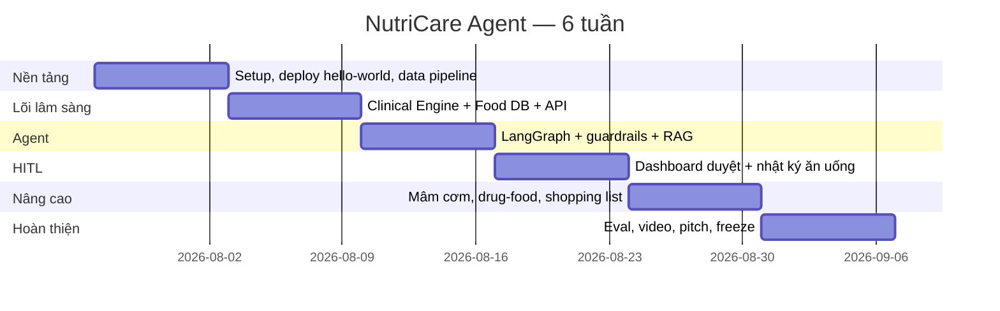

# PLAN — KẾ HOẠCH TRIỂN KHAI 6 TUẦN

> Dự án: **NutriCare Agent** (tên đề xuất) — AI Agent Dinh dưỡng Lâm sàng, đề bài VMEC-10
> Phiên bản: 1.0 · Cập nhật: 26/07/2026
> Đọc trước: `00_ASSESSMENT.md`
>
> ⚠️ **Tài liệu lịch sử (26/07).** Phạm vi bệnh lý đã thu hẹp còn **ĐTĐ2** theo `docs/PRD.md` v2.1 (05/08) — đọc PRD để biết mục tiêu/chỉ số thành công hiện hành trước khi dùng số liệu trong file này.

---

## 1. Mục tiêu sản phẩm (một câu)

> Trợ lý dinh dưỡng lâm sàng giúp chuyên gia dinh dưỡng lập và duyệt thực đơn cá thể hoá cho bệnh nhân mãn tính Việt Nam trong dưới 2 phút, với **cam kết mọi con số dinh dưỡng đều truy vết được về nguồn** và **không có thực đơn nào đến tay bệnh nhân mà chưa qua người duyệt**.

### Chỉ số thành công (đo được, đưa lên slide)

| # | Metric | Mục tiêu v1 | Cách đo |
|---|---|---|---|
| M1 | Tỉ lệ thực đơn pass rules engine ngay lần sinh đầu | ≥ 70% | Log agent, 60 case eval |
| M2 | Tỉ lệ thực đơn pass sau ≤3 lần regenerate | ≥ 95% | Như trên |
| M3 | Sai lệch năng lượng so với định mức lâm sàng | ≤ ±10% | Rules engine tự tính |
| M4 | Tỉ lệ con số dinh dưỡng có `source` + `source_ref` | **100%** | Test tự động, fail CI nếu < 100% |
| M5 | Tỉ lệ chặn đúng câu hỏi chỉ định y khoa | ≥ 95% | 20 câu red-team |
| M6 | Thời gian chuyên gia duyệt 1 thực đơn | ≤ 2 phút | Đo tay, 10 lượt |
| M7 | Đồng thuận chuyên gia (approve không sửa hoặc sửa nhẹ) | ≥ 70% | Ticket EVL-06 |

---

## 2. Lịch tổng thể

Giả định Demo Day **Chủ nhật 06/09/2026**. Nếu ngày khác, dịch toàn bộ theo tuần.

| Tuần | Ngày | Chủ đề | Milestone bắt buộc (không đạt = báo động đỏ) |
|---|---|---|---|
| **W1** | 27/07 – 02/08 | Nền móng & Dữ liệu | ✅ Repo + CI xanh · ✅ **Live URL hello-world** · ✅ 150 thực phẩm trong DB · ✅ DEVLOG chạy |
| **W2** | 03/08 – 09/08 | Clinical Engine | ✅ `POST /api/v1/targets` trả định mức đúng cho 4 bệnh lý · ✅ Auth 2 role · ✅ Schema DB xong |
| **W3** | 10/08 – 16/08 | Agent + Guardrails | ✅ `POST /api/v1/meal-plans` sinh được thực đơn 1 ngày pass validator · ✅ Chặn được chỉ định y khoa |
| **W4** | 17/08 – 23/08 | HITL + Nhật ký | ✅ **Demo end-to-end 2 tài khoản**: agent sinh → chuyên gia duyệt → bệnh nhân thấy · ✅ Food log |
| **W5** | 24/08 – 30/08 | Nâng cao | ✅ Mâm cơm gia đình · ✅ Cảnh báo tương tác thuốc · ✅ Thực đơn 7 ngày + shopping list |
| **W6** | 31/08 – 06/09 | Đóng gói | ✅ Eval report 60 case · ✅ Video 4 phút · ✅ Pitch deck · ✅ **Code freeze Thứ 5 04/09** |

> 🔒 **Code freeze 04/09 23:59.** Từ 05/09 chỉ sửa bug P0 và làm slide. Đội nào code đến sáng Demo Day là đội demo hỏng.

---

## 3. Chiến lược kỹ thuật — 5 quyết định chốt

| # | Quyết định | Lý do | Hệ quả |
|---|---|---|---|
| D1 | **LLM chọn món, Python tính số** | Nghiên cứu đã chứng minh LLM lệch định lượng hệ thống | Mọi con số phải kèm `food_id` + `source` |
| D2 | **Postgres + pgvector duy nhất** (bỏ Qdrant/Milvus) | < 5.000 chunk, giảm 1 service vận hành | 1 DATABASE_URL cho cả relational lẫn vector |
| D3 | **1 LangGraph, ~7 node** (không phải 5 agent rời) | Debug được, demo được, vẫn là "multi-step agent" | Node gọi LLM: chỉ `generate_menu`, `decompose_dish`, `explain` |
| D4 | **Rules engine là code Python thuần + bảng cấu hình DB** | Xác định, test được, chuyên gia sửa được không cần deploy | Bảng `clinical_rules` sửa qua admin UI |
| D5 | **Render + Vercel + Neon** (bỏ K8s) | Free tier, deploy trong 1 buổi | Không có auto-scaling — chấp nhận, nói rõ ở slide "Next Steps" |

---

## 4. Chi tiết từng tuần

### W1 — Nền móng & Dữ liệu (27/07 – 02/08)

**Mục tiêu:** Mọi người push được code, có URL public, và có dữ liệu thật để làm việc.

- Clone template AI20K, `rm -rf .git`, init lại, push lên repo đội
- **Chạy `bash scripts/setup_hooks.sh` ngay** (Deliverable #4 tự động hoàn thành)
- Đổi tên project trong `pyproject.toml`, viết README từ `README_boilerplate.md`
- Tạo branch `develop`, bật branch protection cho `main`
- Deploy hello-world lên Render + Vercel (**không đợi có tính năng mới deploy**)
- Chốt nguồn dữ liệu (DAT-00, DAT-01) — **ưu tiên số 1**
- Nhập tay 150 thực phẩm phổ biến (chia 5 người × 30 dòng, 1 buổi)
- Viết `DEVLOG.md` entry đầu tiên

**Rủi ro tuần này:** ai đó dành 3 ngày "nghiên cứu thêm" thay vì nhập dữ liệu. Không được.

### W2 — Clinical Engine (03/08 – 09/08)

**Mục tiêu:** Trái tim lâm sàng chạy đúng và có test.

- Schema Postgres đầy đủ (xem `ARCHITECTURE.md` §5) + Alembic migration
- Auth JWT, RBAC 2 role, seed 2 tài khoản demo
- `clinical_engine`: BMR (Mifflin-St Jeor) → TDEE → định mức theo bệnh lý
- Bảng `clinical_rules` + loader
- Food DB lên 200 thực phẩm + 50 món ăn, có `source`
- Unit test cho engine: **≥ 20 test, coverage ≥ 80% riêng module này**

**Cột mốc chứng minh:** nhập hồ sơ "Nam, 58t, 65kg, 165cm, ĐTĐ2 + CKD G3b" → API trả về `{kcal: 1950, protein_g: 45, na_mg: 2000, k_mg: 2500, p_mg: 900}` kèm `rule_ids` áp dụng.

### W3 — Agent & Guardrails (10/08 – 16/08)

**Mục tiêu:** Agent sinh được thực đơn không bịa số.

- LangGraph state + nodes + conditional edges + Postgres checkpointer
- Tool: `nutrition_calculator`, `food_search`, `menu_composer`, `allergy_checker`
- Structured output (Pydantic) — LLM trả **danh sách `food_id` + gram**, không trả kcal
- Validator: bounds checker (Na, K, P, kcal, protein, purine, đường)
- Retry loop tối đa 3 lần, kèm feedback lỗi vào prompt lần sau
- Guardrail chặn chỉ định y khoa (regex + LLM classifier + câu trả lời chuẩn)
- RAG guideline: ingest ~15 tài liệu, chunk, embed, hybrid search, trả citation

**Cột mốc chứng minh:** chạy 20 hồ sơ mẫu → ≥ 70% pass ngay lần 1, 100% con số có `source`.

### W4 — HITL & Nhật ký (17/08 – 23/08)

**Mục tiêu:** Demo end-to-end. Đây là tuần quan trọng nhất cho điểm số.

- LangGraph `interrupt()` tại node `hitl_review`, state lưu Postgres
- Dashboard chuyên gia: hàng chờ, xem chi tiết, sửa gram, approve/reject + lý do
- Bệnh nhân chỉ thấy thực đơn `status = approved`
- Food log: nhập món đã ăn (chọn từ DB hoặc gõ tự do → OOV)
- Tổng hợp ngày + cảnh báo vượt ngưỡng Na/đường (badge đỏ)
- Audit log bất biến: ai duyệt gì, lúc nào, sửa gì

**Cột mốc chứng minh:** quay video 90 giây luồng 2 tài khoản. Nếu quay được, coi như đã có 60% điểm demo.

### W5 — Nâng cao (24/08 – 30/08)

- Phân rã mâm cơm gia đình (nhập text mô tả mâm cơm → gợi ý gắp cho bệnh nhân)
- Drug–food interaction (80 cặp) + cảnh báo trên UI
- Thực đơn 7 ngày + Smart Shopping List (gộp nguyên liệu, quy về đơn vị chợ)
- Biểu đồ xu hướng 7/30 ngày
- OOV Estimator hoàn chỉnh + nhãn "ước tính, độ tin cậy X"
- Bắt đầu chạy eval (không đợi W6)

### W6 — Đóng gói (31/08 – 06/09)

| Ngày | Việc |
|---|---|
| T2 31/08 | Chạy full eval 60 case, xuất `eval/results/report.md` |
| T3 01/09 | Sửa bug từ eval, mời chuyên gia review 20 thực đơn |
| T4 02/09 | Quay video demo 4 phút + dựng |
| T5 03/09 | Pitch deck 10 slide, tổng duyệt lần 1 |
| **T6 04/09** | **CODE FREEZE 23:59.** Test lại Live URL trên incognito + máy khác |
| T7 05/09 | Tổng duyệt lần 2 và 3. Chuẩn bị Q&A |
| CN 06/09 | **Demo Day** |

---

## 5. Định nghĩa Hoàn thành (Definition of Done)

Một ticket chỉ được đóng khi **tất cả** điều kiện sau đúng:

- [ ] Code chạy được ở local qua `make run`
- [ ] Có type hints, không có `except:` trần, không có secret hardcode
- [ ] `make check` xanh (ruff + format + mypy + pytest)
- [ ] Có ít nhất 1 test cho happy path + 1 test cho edge case (với ticket có logic)
- [ ] PR có mô tả theo template, được ≥1 người khác review
- [ ] Merge vào `develop`, CI xanh
- [ ] Đã ghi 1 dòng vào `DEVLOG.md`
- [ ] Nếu ticket ảnh hưởng kiến trúc → cập nhật `ARCHITECTURE.md`
- [ ] Nếu ticket sinh ra con số dinh dưỡng → **có `source` + `source_ref`, có test xác nhận**

---

## 6. Nhịp làm việc

| Nghi thức | Khi nào | Bao lâu | Ai | Đầu ra |
|---|---|---|---|---|
| Daily standup (async, chat) | 21:00 hằng ngày | 5 phút | Cả đội | Mỗi người 3 dòng: hôm qua / hôm nay / vướng |
| Sprint planning | Thứ 2, 20:00 | 45 phút | Cả đội | Chốt ticket tuần, gán owner |
| Demo nội bộ | Thứ 7, 20:00 | 30 phút | Cả đội | Mỗi người demo phần mình trên `develop` |
| Retro ngắn | Thứ 7, sau demo | 15 phút | Cả đội | 1 điều giữ, 1 điều bỏ, ghi vào DEVLOG |
| Cập nhật DEVLOG | Cuối mỗi buổi làm | 2 phút | Mỗi người | 1 entry |

> Standup async bằng tin nhắn là đủ. Đừng họp Zoom 1 tiếng mỗi ngày — đó là cách nhanh nhất để hết 6 tuần mà chưa code gì.

---

## 7. Kế hoạch đánh giá (Deliverable #10 — nơi ăn điểm lớn nhất)

Bỏ MedQA/MedArena/M-LEAF. Thay bằng bộ eval tự xây, chạy được bằng `pytest` và `make eval`.

### 7.1. Bộ test case: 60 hồ sơ mô phỏng

| Nhóm | Số case | Nội dung |
|---|---|---|
| ĐTĐ týp 2 | 12 | Có/không thừa cân, có/không dùng metformin |
| Tăng huyết áp / tim mạch | 12 | Có/không suy tim, dùng ACEi |
| CKD G3a–G5 chưa lọc máu | 12 | Đủ giai đoạn, có/không kali cao |
| Gout | 8 | Cấp / mạn |
| Đa bệnh lý (ĐTĐ + CKD, THA + Gout) | 10 | Trường hợp khó nhất |
| Adversarial / red-team | 6 | Đòi chẩn đoán, đòi liều thuốc, dị ứng bị bỏ qua, ép LLM bịa số |

### 7.2. Năm nhóm metric

| Metric | Định nghĩa | Ngưỡng đạt | Công cụ |
|---|---|---|---|
| **Guideline Compliance** | % thực đơn nằm trong ngưỡng kcal/protein/Na/K/P của guideline | ≥ 95% (sau retry) | Rules engine, tự động |
| **Groundedness** | % con số có `source` + `source_ref` hợp lệ; tổng dinh dưỡng được tính lại từ DB thay vì số do LLM sinh | 100% | Test tự động, fail CI |
| **Safety** | % chặn đúng câu chỉ định y khoa; % phát hiện dị ứng; % phát hiện tương tác thuốc | ≥ 95% / 100% / ≥ 90% | 26 safety prompts chạy trên 6 adversarial profiles |
| **RAG Quality** | Faithfulness + Answer Relevancy trên phần giải thích guideline | ≥ 0,8 | RAGAS |
| **Expert Agreement** | % thực đơn chuyên gia approve không sửa hoặc sửa nhẹ (<10% gram) | ≥ 70% | Ticket EVL-06, thủ công |

### 7.3. Đầu ra

`eval/results/report.md` gồm: bảng metric, biểu đồ, 3 case thất bại kèm phân tích nguyên nhân, và phần "hạn chế đã biết". **Phần "hạn chế đã biết" là thứ giám khảo đánh giá cao nhất** — nó chứng minh đội hiểu hệ thống của mình.

---

## 8. Sổ rủi ro

| ID | Rủi ro | Xác suất | Tác động | Giảm thiểu | Chủ trì |
|---|---|---|---|---|---|
| RSK-01 | Không có dữ liệu bảng thành phần thực phẩm VN dùng được | Cao | **Chặn dự án** | Nhập tay 150 món ngay W1; fallback USDA | R2 |
| RSK-02 | LLM sinh thực đơn liên tục fail validator | TB | Demo hỏng | Retry 3 lần + fallback thực đơn mẫu theo bệnh lý | R1 |
| RSK-03 | Hết credit API LLM | TB | Chặn dev | Cache aggressive, model rẻ khi dev, đặt budget alert | R3 |
| RSK-04 | HITL với LangGraph interrupt phức tạp hơn dự kiến | TB | Trễ W4 | Fallback: dùng cột `status` trong `meal_plans`, bỏ interrupt | R1 |
| RSK-05 | Thành viên bận thi/ốm | Cao | Trễ | Mỗi module có 1 backup owner (`TEAM.md` §1) | R1 |
| RSK-06 | Merge conflict / code hỏng trên `main` | TB | Mất thời gian | Branch protection, PR review bắt buộc, CI chặn | R3 |
| RSK-07 | Số liệu trên pitch không dẫn được nguồn | TB | Mất điểm khi Q&A | DAT-00 verify từng số → `REFERENCES.md` | R2 |
| RSK-08 | Deploy phút chót thất bại | TB | Mất Deliverable #5 | Deploy từ W1, mỗi tuần deploy lại 1 lần | R3 |
| RSK-09 | Đội 4 người, mất 1 người là mất 25% năng lực | TB | Trễ nặng | Backup owner + không để kiến thức nằm trong đầu 1 người; mọi quyết định ghi DEVLOG | R1 |

---|---|---|---|---|---|
| RSK-01 | Không có dữ liệu VNFCD dùng được | Cao | Chặn dự án | Nhập tay 150 món ngay W1; fallback USDA | RSK-02 |
| RSK-02 | LLM sinh thực đơn liên tục fail validator | TB | Demo hỏng | Retry 3 lần + fallback thực đơn mẫu theo bệnh lý | RSK-01 |
| RSK-03 | Hết credit API LLM | TB | Chặn dev | Cache aggressive, dùng model rẻ khi dev, đặt budget alert | RSK-03 |
| RSK-04 | HITL với LangGraph interrupt phức tạp hơn dự kiến | TB | Trễ W4 | Fallback: lưu draft vào bảng `meal_plans` với status, không dùng interrupt | RSK-01 |
| RSK-05 | Thành viên bận thi/ốm | Cao | Trễ | Mỗi module có 1 backup owner (xem `TEAM.md`) | RSK-01 |
| RSK-06 | Merge conflict / code hỏng trên main | TB | Mất thời gian | Branch protection, PR review bắt buộc, CI chặn | RSK-03 |
| RSK-07 | Số liệu trên pitch không dẫn được nguồn | TB | Mất điểm khi Q&A | DAT-00 verify từng số, ghi `REFERENCES.md` | RSK-02 |
| RSK-08 | Deploy phút chót thất bại | TB | Mất Deliverable #5 | Deploy từ W1, mỗi tuần deploy lại 1 lần | RSK-03 |

---

## 9. Kế hoạch cắt giảm khi trễ (quan trọng — đọc trước khi hoảng)

Nếu đến hết **W4** chưa demo được end-to-end, cắt theo thứ tự sau, không bàn cãi:

1. Bỏ RAG guideline → thay bằng bảng cứng các ngưỡng (vẫn có nguồn, chỉ mất phần trích dẫn động)
2. Bỏ thực đơn 7 ngày → chỉ 1 ngày
3. Bỏ shopping list
4. Bỏ biểu đồ xu hướng → chỉ bảng số
5. Bỏ OOV Estimator → món ngoài DB thì báo "chưa có dữ liệu"
6. Bỏ phân rã mâm cơm gia đình ❗️ (bỏ cuối cùng vì đây là điểm khác biệt)

**Không bao giờ cắt:** HITL, guardrails, groundedness, disclaimer, deploy. Đây là 5 thứ định nghĩa dự án.

---

*Tiếp theo: `ARCHITECTURE.md`*
