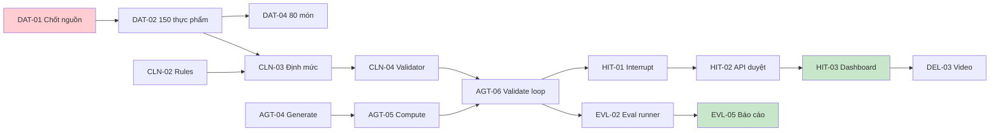

# TICKETS — BACKLOG & GIAO VIỆC

> 54 ticket · 6 sprint · Ước tính tổng ≈ 438 giờ-người
> Ký hiệu: **P0** = chặn dự án · **P1** = cần cho MVP · **P2** = nâng cao · **P3** = có thì tốt
> Owner theo mã vai trò trong `TEAM.md` (R1–R4 · đội 4 người)

> ⚠️ **Đổi phạm vi (2026-08-05, `docs/PRD.md` v2.1):** MVP thu hẹp trọng tâm nghiệm thu/demo về **ĐTĐ2**. Các ticket/AC nhắc tới THA, CKD, Gout (chủ yếu `CLN-02`, `CLN-03`, `CLN-06`, `DAT-05`, `AGT-03`) **không bị xoá khỏi backlog, code đã build cho các bệnh này vẫn giữ nguyên và tiếp tục hoạt động đúng như thiết kế** (cơ chế phát hiện xung đột đa bệnh lý đã đối chiếu lại với tài liệu kế hoạch gốc, xác nhận đúng đặc tả — xem `CLAUDE.md` §7, DEVLOG DEC-014) — chỉ không còn là **trọng tâm phát triển tính năng mới**. Ưu tiên sprint còn lại: đường găng ĐTĐ2 trước cho việc mới, không cần mở rộng thêm phạm vi đa bệnh lý trừ khi có ticket riêng.

**Cách dùng:** copy sang GitHub Issues hoặc Notion. Tiêu đề issue = `[MÃ] Tên ticket`. Gắn label = epic + priority. Milestone = sprint.

---

## Tổng quan theo sprint

| Sprint | Tuần | Ticket | Giờ ước tính |
|---|---|---|---|
| S1 | 27/07–02/08 | SET-01→06, DAT-00→03 | 78h |
| S2 | 03/08–09/08 | DAT-04→06, DAT-11, CLN-01→05, BE-01→05 | 96h |
| S3 | 10/08–16/08 | AGT-01→08, CLN-06→07, BE-06→07 | 96h |
| S4 | 17/08–23/08 | HIT-01→05, FE-01→06, BE-08→09 | 88h |
| S5 | 24/08–30/08 | ADV-01→06, FE-07→08, EVL-01→03 | 62h |
| S6 | 31/08–06/09 | EVL-04→06, DEL-01→06 | 44h |

---

## EPIC 0 — SETUP (S1) — *Owner chính: R3*

### `SET-01` Khởi tạo repo từ template AI20K
**Owner:** R3 · **P0** · 2h · **Deps:** —
Clone `starter-code-template`, `rm -rf .git`, `git init`, push lên repo đội. Đổi `pyproject.toml` (name, description, repo URL). Tạo `develop`. Bật branch protection cho `main` + `develop` (require PR, ≥1 approval, status checks).
**AC:** Cả 5 người clone và chạy `make run` thành công · `main` không push thẳng được · `.env.example` đầy đủ biến của dự án.

### `SET-02` Cài AI Usage Logging Hooks
**Owner:** R3 · **P0** · 1h · **Deps:** SET-01
Chạy `bash scripts/setup_hooks.sh` trên máy **từng người**. Điền `AI_LOG_API_KEY` do instructor cấp vào `.env`.
**AC:** Mỗi thành viên có ít nhất 1 entry trong `.ai-log/session.jsonl` · `git push` chạy pre-push hook không lỗi · Người dùng ChatGPT/web tool biết cách chạy `log_manual.py`.
> Đây là Deliverable #4, làm 1 lần được điểm cả kỳ. Không ai được `git push --no-verify`.

### `SET-03` CODEOWNERS + PR template + Issue template
**Owner:** R3 · **P1** · 2h · **Deps:** SET-01
Tạo `.github/CODEOWNERS` (theo `TEAM.md` §4), `.github/pull_request_template.md`, 2 issue template (feature/bug).
**AC:** PR chạm `src/clinical/` tự động request review R2 · PR template có checklist DoD.

### `SET-04` CI pipeline
**Owner:** R3 · **P0** · 4h · **Deps:** SET-01
GitHub Actions: `ruff check`, `ruff format --check`, `mypy`, `pytest`, `docker build`. Chạy trên PR vào `develop`/`main`.
**AC:** CI xanh trên PR mẫu · CI đỏ khi cố tình để lỗi lint · Thời gian chạy < 5 phút.

### `SET-05` Deploy hello-world lên cloud
**Owner:** R3 · **P0** · 4h · **Deps:** SET-04
Render (backend, Docker) + Vercel (frontend) + Neon/Supabase Postgres có `pgvector`. Cấu hình secrets trên platform.
**AC:** **Live URL công khai** trả `GET /api/v1/health` → 200 · Frontend hiển thị trang chủ gọi được API · URL ghi vào README.
> ⚠️ Ticket quan trọng nhất tuần 1. Deploy sớm để tuần 6 không phải deploy lần đầu.

### `SET-06` Khởi tạo tài liệu dự án
**Owner:** R1 · **P1** · 3h · **Deps:** SET-01
README từ `README_boilerplate.md`; copy bộ `docs/` này vào repo; tạo `DEVLOG.md`; tạo `CLAUDE.md` và `docs/rules/`.
**AC:** README có: vấn đề, giải pháp, tech stack, cách chạy, thành viên, Live URL · DEVLOG có entry đầu tiên của cả 5 người.

---

## EPIC 1 — DATA & KNOWLEDGE (S1–S2) — *Owner chính: R2*

### `DAT-00` Verify toàn bộ số liệu trong nghiên cứu
**Owner:** R2 · **P0** · 6h · **Deps:** —
Kiểm chứng từng số liệu trong `nghien_cuu_dinh_duong_ai_agent.md`: các arXiv ID, con số MAE calo, F1 phân rã món ăn, hiệu lực TT 08/2024/TT-BYT, QĐ 2598 / 3777 / 9484, NĐ 13/2023, thống kê muối VN, con số "70% không tuân thủ".
**AC:** File `docs/REFERENCES.md`, mỗi số liệu 1 dòng: `số liệu | nguồn | URL | ngày truy cập | trạng thái (verified / not-found / superseded)` · Số nào `not-found` thì **xoá khỏi đề án và pitch deck**.
> Bị giám khảo hỏi nguồn mà ú ớ sẽ mất điểm nặng hơn là không nhắc tới số liệu đó.

### `DAT-01` Chốt nguồn dữ liệu thực phẩm & pháp lý sử dụng
**Owner:** R2 · **P0** · 4h · **Deps:** —
Xác định lấy Bảng TPTP Việt Nam ở đâu (bản in/PDF/website NIN), điều kiện sử dụng. Đăng ký API key USDA FoodData Central. Kiểm tra license DDID — nếu không rõ ràng thì chuyển sang phương án curate 80 cặp thủ công.
**Đã nghiên cứu bổ sung** (xem `data/README.md` mục "Nghiên cứu bổ sung nguồn dữ liệu"): **Open Food Facts** xác nhận dùng được ngay (free API, ODbL) cho nhóm thực phẩm đóng gói; **Dược thư Quốc gia VN 2022** xác nhận dùng được cho `source_ref` của DAT-05. uFiSh1.0 (FAO cá/thủy sản) cần R2 tự thử tải link trực tiếp để xác nhận nốt. PhyFoodComp/eBASIS/ASEANFOODS/WikiFCD-FoodOn đã bị loại có ghi lý do (ngoài scope lâm sàng / license không rõ / trùng lặp VFCT / over-engineering).
**AC:** `data/README.md` ghi rõ: nguồn nào dùng được, giấy phép, cách trích dẫn · Có API key USDA hoạt động · Quyết định về DDID được ghi vào DEVLOG dạng ADR.

### `DAT-02` Thiết kế schema & nhập thực phẩm — KHÔNG GIỚI HẠN TRÊN
**Owner:** R2 (cả đội hỗ trợ nhập) · **P0** · 12h+ (mở, xem ghi chú) · **Deps:** DAT-01
CSV `data/seeds/food_items.csv` với cột: `id, name_vi, name_en, aliases, unit_ref, kcal_100g, protein_g, carb_g, fat_g, fiber_g, na_mg, k_mg, p_mg, purine_mg, gi_index, source, source_ref, is_estimated`.
Ưu tiên: gạo/bún/phở/bánh mì, thịt heo/bò/gà, cá phổ biến, tôm, trứng, đậu phụ, rau, quả, dầu mỡ, gia vị (nước mắm, bột canh, hạt nêm, mì chính, đường).
**AC:** **≥150 dòng là SÀN, không phải trần** — nhập càng nhiều thực phẩm/món có nguồn thật càng tốt, không dừng lại vì đã đạt 150 · **0 dòng thiếu `source`** · Gia vị mặn có `na_mg` chính xác (trục chính của bài toán muối) · Script `make seed` nạp được vào DB.
> ⚠️ **2026-08-05: bỏ trần số lượng.** Trước đây giới hạn "≥150 dòng" bị hiểu nhầm thành mục tiêu dừng lại — thực tế hiện đã có sẵn nguồn xác minh được (NIN 2017/2007, USDA FDC bulk, Open Food Facts — xem `data/README.md`) đủ để vượt xa 150 nếu có thời gian nhập. Không đặt trần trên; chỉ giới hạn bởi **có nguồn thật hay không** (RULE-2/DEC-008), không phải bởi số lượng mục tiêu ban đầu.
> Chia người × 30 dòng/buổi tối là nhịp làm việc gợi ý, không phải mức trần.
> ✅ **2026-08-05 — đã vượt xa sàn:** `food_items.csv` từ 152 → **7.173 dòng** (7.146 có đủ số liệu) nhờ bulk import USDA SR Legacy/Foundation Foods (6.854 dòng) + trích toàn bộ bảng NIN 2017 (167 dòng mới). Xem `data/README.md` mục "DAT-12 — bỏ trần dữ liệu". **Lưu ý quan trọng:** khối USDA bulk (id ≥ 100000) chỉ là kho tham chiếu, KHÔNG dùng làm ứng viên sinh thực đơn (`retrieve_context` đã lọc — xem `src/agents/nodes/core.py`) vì làm CP-SAT chậm 30-50 lần. 152 dòng curated Việt Nam gốc + 167 dòng NIN mới là ứng viên thật cho agent.

### `DAT-03` Tích hợp USDA FoodData Central
**Owner:** R2 · **P1** · 6h · **Deps:** DAT-01
Client gọi API USDA, mapping field sang schema nội bộ, cache vào DB, đánh dấu `source='USDA'`.
**AC:** Tra được ≥ 20 thực phẩm nhập khẩu · Có retry + timeout · Có test dùng mock, không gọi API thật trong CI.

### `DAT-04` Bộ món ăn Việt + công thức nguyên liệu — KHÔNG GIỚI HẠN TRÊN
**Owner:** R2 · **P1** · 14h+ (mở) · **Deps:** DAT-02
`dishes` + `dish_ingredients`. Mỗi món: nguyên liệu + gram cho 1 khẩu phần chuẩn + vùng miền + tag (mặn/ngọt/dầu mỡ). Bao gồm món "nguy hiểm": phở bò, bún cá, canh cua, thịt kho tàu, cá kho tộ, bún riêu, mì tôm.
Quy trình: LLM sinh nháp công thức → **R2 rà soát và sửa tay** → đối chiếu tổng dinh dưỡng với nguồn tham khảo.
**AC:** **≥80 món là SÀN** — hiện `dishes.csv` mới có **3/80**, đây là ticket P1 tồn đọng lớn nhất của EPIC 1, ưu tiên làm tiếp trước khi mở rộng thêm. Không đặt trần trên; thêm món mới bất cứ khi nào có công thức đã đối chiếu được nguồn · Na của phở bò tính ra nằm trong khoảng 3,3–4,0g muối (khớp nghiên cứu) → dùng làm test hồi quy · Mỗi món ghi `verified_by`.
> ⚠️ **2026-08-05:** bỏ trần "80 món". Thực tế mới đạt 3/80 — trước khi tính chuyện "không giới hạn", việc cấp thiết là lấp cho đủ sàn 80.
> ✅ **2026-08-05 — đã vượt xa sàn (món quốc tế):** `dishes.csv` từ 3 → **2.635 món** nhờ USDA FNDDS (2.632 món quốc tế, phân rã nguyên liệu thật qua `sr_code`→SR Legacy, `verified_by="USDA FNDDS (nguồn chính thức)"` — khác `pending` của món Việt tự soạn). Xem `data/README.md` mục "DAT-12". **3 món Việt Nam gốc (phở bò, bún đậu mắm, canh rau muống) vẫn `pending`, vẫn là việc P1 cấp thiết nhất còn lại** — món quốc tế không thay thế được nhu cầu món Việt cho demo/eval của dự án này.
> ✅ **2026-08-06 — bắt đầu lấp món Việt (vẫn `pending`, chưa R2 duyệt):** +27 món Việt/bữa ăn Việt — (a) **15 bữa ăn thật** trích từ `data/Bảng xác định nhu cầu dinh dưỡng + thực đơn.xlsx` (file thực đơn nội bộ dự án, có gram thật theo "KL sống sạch"), khớp `food_id` tự động theo tên chuẩn hoá — tỷ lệ khớp thấp (~37%, 67/180 dòng nguyên liệu) vì tên nguyên liệu trong xlsx không khớp chính xác tên trong `food_items.csv` (VD "Dầu ăn" vs "Dầu ăn thực vật") — cố tình **không fuzzy-match rộng hơn** để tránh gán sai loại thực phẩm (rủi ro lâm sàng); (b) **12 món Việt tự soạn qua LLM** (phở gà, bún chả, canh chua cá, rau muống xào tỏi, đậu phụ sốt cà chua, cá kho tộ, gà kho gừng, canh cải nấu tôm, sườn xào chua ngọt, trứng chiên hành, canh su hào cà rốt thịt băm, nấm hương xào thịt bò) — gram ước lượng theo kinh nghiệm ẩm thực phổ thông, **chưa đối chiếu nguồn định lượng nào**, một số thiếu gia vị/nguyên liệu do chưa có `food_item` tương ứng (đường, dấm, nước dùng...). **Cả 27 món đều `pending` — R2 phải rà soát gram + bổ sung nguyên liệu thiếu trước khi dùng cho bệnh nhân.** Script: `scripts/extract_menu_xlsx_dishes.py`, `data/seeds/dishes.vn_llm_draft.csv`. 3 món gốc (phở bò, bún đậu mắm, canh rau muống) vẫn là ví dụ chuẩn duy nhất đã có Na đối chiếu nghiên cứu — chưa món nào trong 27 món mới đạt mức đó.

### `DAT-05` Bảng tương tác thuốc – thực phẩm — KHÔNG GIỚI HẠN TRÊN
**Owner:** R2 · **P1** · 8h+ (mở) · **Deps:** DAT-01
`drug_food_interactions`: `drug_name, drug_class, food_or_nutrient, severity(high/moderate/low), mechanism, recommendation, source_ref`.
Bắt buộc có: Warfarin–vitamin K, ACEi/ARB–kali & muối thay thế, Statin–bưởi, Metformin–rượu & B12, Levothyroxine–canxi/đậu nành/cà phê, Digoxin–chất xơ cao, MAOI–tyramine, Allopurinol–rượu bia, lợi tiểu thiazide–kali.
**Nguồn `source_ref` ưu tiên:** **Dược thư Quốc gia Việt Nam 2022** (QĐ 3445/QĐ-BYT, 743 chuyên luận, tra cứu online miễn phí) — mỗi cặp tra chuyên luận thuốc tương ứng, `source_ref` dạng `Dược thư Quốc gia VN 2022, chuyên luận <tên thuốc>`. **Không dùng** Quyết định 5948/QĐ-BYT làm nguồn cho bảng này trừ khi ai đó mở file thật và xác nhận có mục thuốc-thực phẩm — mọi mô tả tìm được đều chỉ nói đây là danh mục tương tác **thuốc-thuốc** (633 cặp hoạt chất + 68 cặp nhóm dược lý), đừng suy đoán nó phủ cả thực phẩm.
**AC:** **≥80 cặp là SÀN, không phải trần** — 2026-08-05: đã điền `source_ref` cho 17/30 cặp (Warfarin, Digoxin, Enalapril, Atorvastatin, Hydrochlorothiazide, Colchicin, Allopurinol, Ciprofloxacin, Amlodipin, Gliclazide, Insulin — có chuyên luận riêng xác nhận trên Dược thư QGVN 2022), còn 13/30 cặp thiếu nguồn (Losartan, Simvastatin, Metformin, Levothyroxine, Furosemide, Spironolactone, Phenelzine, Tetracycline, Sắt, Canxi — chưa xác nhận được có chuyên luận riêng, KHÔNG suy đoán, cần R2 tự tra trực tiếp) · Mỗi cặp có nguồn · Khớp được cả theo hoạt chất lẫn theo nhóm thuốc · Test: hồ sơ dùng Warfarin + thực đơn nhiều rau ngót → sinh cảnh báo `high`.

### `DAT-06` Ingest guideline vào RAG — KHÔNG GIỚI HẠN TRÊN
**Owner:** R2 · **P1** · 8h+ (mở) · **Deps:** SET-05
Thu thập tài liệu (BYT, ADA, KDIGO, AHA/DASH, ACR, tài liệu Viện Dinh dưỡng — ~15 là điểm khởi đầu, không phải đích). Chunk 500–800 token, overlap 100, embed, lưu `guideline_chunks` (pgvector) kèm metadata `{source, title, page, condition}`.
**AC:** **≥15 tài liệu là SÀN** — thêm tài liệu mới bất cứ khi nào tìm được nguồn guideline chính thức phù hợp 4 bệnh mục tiêu, không giới hạn số lượng · Truy vấn "protein cho CKD giai đoạn 4" trả về chunk đúng ở top-3 · Mỗi chunk có metadata đầy đủ · Có script `make ingest` chạy lại được.

### `DAT-11` Tích hợp Open Food Facts cho thực phẩm đóng gói
**Owner:** R2 · **P2** · 4h · **Deps:** DAT-02
Client gọi API Open Food Facts (`https://world.openfoodfacts.org/api/v2/product/{barcode}.json`, free, không cần key, giới hạn 15 req/phút/IP) để lấp các dòng `food_items` là sản phẩm đóng gói/công nghiệp mà NIN/USDA không có (mì gói theo nhãn hiệu cụ thể, nước chấm/gia vị đóng gói). `source='OFF'`, `source_ref='Open Food Facts, barcode:xxxxxxxxxxxxx'`.
**AC:** Tra được ≥10 sản phẩm Việt thật (VD mì Omachi đã xác nhận có trên nền tảng) · Ghi rõ giấy phép ODbL trong `data/README.md` (yêu cầu ghi nguồn khi dùng lại) · Test dùng mock, không gọi API thật trong CI.
> P2 vì đây là nhóm phụ (thực phẩm công nghiệp), không nằm trên đường găng — chỉ làm sau khi 150 thực phẩm cốt lõi (DAT-02) đã xong.

### `DAT-12` Bỏ trần số lượng EPIC 1/2 + fill dữ liệu thật không giới hạn
**Owner:** R2 · **P1** · mở (điều phối, không phải 1 khối việc) · **Deps:** DAT-01
Ticket điều phối cho việc bỏ trần cứng ở `DAT-02/04/05/06`, `CLN-02` (đã sửa AC, xem các ticket đó) và tiếp tục fill dữ liệu thật không giới hạn trên, chỉ giới hạn bởi có nguồn thật (RULE-2/DEC-008). Kế hoạch chi tiết + trạng thái từng nguồn: `docs/PLAN_DAT-12-uncap-data-and-db.md`.
**AC:** Mỗi ticket con (`DAT-02/04/05/06`, `CLN-02`) có AC "sàn tối thiểu, không trần" · `docs/PLAN_DAT-12-uncap-data-and-db.md` được cập nhật khi có tiến độ mới · Không hạ chuẩn nguồn gốc để chạy nhanh số lượng.

### `DAT-13` Rà soát & làm giàu các khoảng trống Na/K/P và source_ref còn lại
**Owner:** R2 · **P1** · mở (điều phối, không phải 1 khối việc) · **Deps:** DAT-04, DAT-12
Sau batch 48 nguyên liệu NIN nội bộ (2026-08-06), vẫn còn khoảng trống thật: 309 dòng thiếu Na/K trong sheet "Bảng TP có phospho", 152 dòng `food_items.template.csv` chưa nhập, 13 cặp `drug_food_interactions.csv` thiếu `source_ref`, 21 dòng trùng tên lệch kcal cần đối chiếu ấn bản NIN. Kế hoạch chi tiết + thứ tự ưu tiên tra chéo nguồn (NIN2017 PDF → USDA bulk → chỉ khi không tra được mới xét `estimated` có cơ sở, không suy đoán tùy ý): `docs/PLAN_DAT-13-fill-data-gaps.md`.
**AC:** Không tự gắn giá trị 0/trace cho Na/K/P mà không có `source_ref` cụ thể (mã NIN, FDC ID, hoặc lý giải khoa học rõ ràng cho nhóm "trace") · Mỗi batch chạy `validate_data.py` + `pytest` sạch trước khi commit · `docs/PLAN_DAT-13-fill-data-gaps.md` cập nhật tiến độ theo từng mục §2.

---

### `DAT-07` Mở rộng schema `food_items`: đường tự do + nguồn GI riêng (anchor ĐTĐ2)
**Owner:** R2 · **P1** · 3h · **Deps:** DAT-02
Bổ sung `sugar_g` (cho ngưỡng đường tự do WHO) và cặp `gi_source`/`gi_source_ref` để GI có nguồn riêng, tách khỏi `source_ref` của NIN (RULE-2). Thêm helper `available_carb_g` (carb − xơ) và `glycemic_load(grams)` (None-safe). GI lấy từ **Atkinson 2021** (ISO, >4000 món) + **Mai 2001** (GI món Việt: gạo/bún/phở).
**AC:** Tạo `FoodItem` có `gi_index` mà thiếu nguồn GI → bị chặn (RULE-2) · `glycemic_load` trả `None` khi thiếu GI (không phải 0) · `sugar_g > carb_g` bị chặn · `validate_data.py` áp cùng ràng buộc trên CSV · Có unit test cho cả 4 nhánh.
> Đây là thay đổi schema tối thiểu để chốt ĐTĐ2 làm bệnh chính. GI phủ thưa nên menu engine phải suy giảm mềm khi thiếu GI.

---

## EPIC 2 — CLINICAL ENGINE (S2–S3) — *Owner chính: R2, review R1*

### `CLN-01` Module tính năng lượng
**Owner:** R2 · **P0** · 6h · **Deps:** SET-01
`src/clinical/energy.py`: BMR theo Mifflin-St Jeor, hệ số hoạt động, TDEE, điều chỉnh theo mục tiêu cân nặng (giảm/giữ/tăng), dùng cân nặng lý tưởng khi BMI > 30.
**AC:** ≥12 unit test bao gồm biên (tuổi 18, tuổi 90, BMI 15, BMI 40) · Docstring ghi rõ công thức + nguồn · Không gọi LLM, không truy vấn DB.

### `CLN-02` Bảng quy tắc lâm sàng — KHÔNG GIỚI HẠN TRÊN
**Owner:** R2 · **P0** · 8h+ (mở) · **Deps:** DAT-01
`data/seeds/clinical_rules.csv` + loader. Mỗi rule: `id, condition_code, stage, nutrient, operator, threshold, unit, per(day|meal|kg_bw), severity(hard|soft), guideline_ref`.
Phủ: ĐTĐ2 (carb %, chất xơ, GI), THA/tim mạch (Na, chất béo bão hoà), CKD G3a–G5 (protein/kg, K, P, Na), Gout (purine, cồn, fructose).
**AC:** **≥40 rule là SÀN** (hiện đã có 21 rule) — thêm rule mới bất cứ khi nào tìm được ngưỡng guideline chưa phủ, không giới hạn số lượng trên, mỗi rule có `guideline_ref` · Sửa ngưỡng chỉ cần sửa dữ liệu, **không phải sửa code** · Có test rule bị trùng/xung đột.

### `CLN-03` Bộ tính định mức cá thể
**Owner:** R2 · **P0** · 8h · **Deps:** CLN-01, CLN-02
`compute_targets(profile) -> ClinicalTargets` kèm `applied_rule_ids`. Xử lý **đa bệnh lý**: khi 2 rule cùng chất, lấy **ngưỡng nghiêm ngặt hơn** (fail-safe).
**AC:** Case "Nam 58t, 65kg, 165cm, ĐTĐ2 + CKD G3b" trả kết quả khớp với tính tay của R2 · Đa bệnh lý luôn chọn ngưỡng chặt hơn, có test riêng · Output kèm danh sách rule đã áp dụng để hiển thị trên UI.

### `CLN-04` Rules Engine — Bounds Checker
**Owner:** R2 · **P1** · 8h · **Deps:** CLN-03
`validate_menu(menu_nutrition, targets) -> list[Violation]`. Violation gồm: `nutrient, actual, limit, severity, message_vi, suggestion`. Hard violation → chặn phát hành; soft → cảnh báo.
**AC:** Thực đơn 3000mg Na cho bệnh nhân THA → hard violation kèm gợi ý cụ thể ("bỏ nước chấm, giảm 1/2 nước dùng") · Sai lệch năng lượng ±10% là soft, ±25% là hard.

### `CLN-05` Kiểm tra dị ứng
**Owner:** R2 · **P1** · 4h · **Deps:** DAT-02
Đối chiếu dị ứng của bệnh nhân với nguyên liệu (kể cả nguyên liệu ẩn: nước mắm↔cá, chả↔thịt+bột, bánh phở↔gạo).
**AC:** Dị ứng hải sản + thực đơn có bún riêu (mắm tôm) → **chặn cứng** · Dị ứng luôn là `hard`, không bao giờ chỉ cảnh báo.

### `CLN-06` Kiểm tra tương tác thuốc – thực phẩm
**Owner:** R2 · **P1** · 6h · **Deps:** DAT-05, CLN-04
Khớp thuốc bệnh nhân đang dùng với thực phẩm/vi chất trong thực đơn, sinh cảnh báo có mức độ và khuyến nghị.
**AC:** ≥90% phát hiện trên 20 case test · Cảnh báo `high` hiển thị badge đỏ trên UI · Không cảnh báo tràn lan (false positive < 20%).

### `CLN-07` OOV Estimator
**Owner:** R2 · **P2** · 10h · **Deps:** DAT-04
Món không có trong DB: (1) tra `aliases` → (2) tìm mờ tên món → (3) LLM phân rã thành nguyên liệu + gram ước tính → tra SQL từng nguyên liệu → cộng lại.
**AC:** Kết quả **luôn** gắn `is_estimated=true` + `confidence` (0–1) · UI hiển thị nhãn "ước tính" rõ ràng · Không bao giờ để LLM trả thẳng con số kcal · 10 case món địa phương cho sai lệch < 30%.

---

### `CLN-08` Rule đường tự do WHO cho ĐTĐ2
**Owner:** R2 · **P1** · 2h · **Deps:** CLN-02, DAT-07
Thêm rule `T2DM-SUG-01` (đường tự do < 10% năng lượng, WHO 2015) dùng cột `sugar_g` (DAT-07). Bổ sung `sugar_g` vào `KCAL_PER_GRAM` cho basis `pct_energy`. Validator: nhãn "Đường" + gợi ý, và **cảnh báo `incomplete_data`** khi có món thiếu `sugar_g` (tổng đường thấp hơn thực tế → không được coi là đạt ngưỡng).
**AC:** compute_targets ĐTĐ2 sinh trần `sugar_g = E×10%/4` · thực đơn thừa đường → soft violation · thực đơn thiếu số liệu đường → cảnh báo `incomplete_data` (không im lặng) · rule scope T2DM để không đụng test HTN hiện có.
> Đặt `severity=soft` dù WHO là khuyến nghị mạnh: dữ liệu đường thường thiếu (`sugar_is_complete=False`), chặn cứng trên tổng thiếu hụt sẽ sai. Broaden sang BASE khi phủ đủ `sugar_g`.

---

## EPIC 3 — AGENT (S3) — *Owner chính: R1*

### `AGT-01` State schema & khung graph
**Owner:** R1 · **P0** · 6h · **Deps:** SET-01
`src/agents/state.py` (`NutriState`) + `graph.py` với 8 node, conditional edges, Postgres checkpointer.
**AC:** Graph compile được, vẽ được sơ đồ bằng `graph.get_graph().draw_mermaid()` · Sơ đồ này dán thẳng vào `ARCHITECTURE.md`.

### `AGT-02` Node `load_profile` + `compute_targets`
**Owner:** R1 · **P0** · 4h · **Deps:** AGT-01, CLN-03
Nạp hồ sơ từ DB, gọi clinical engine. **Không LLM.**
**AC:** State sau 2 node có đủ `profile` + `targets` + `applied_rule_ids` · Test không cần API key LLM.

### `AGT-03` Node `retrieve_context` (Hybrid RAG)
**Owner:** R1 · **P1** · 8h · **Deps:** DAT-06
BM25 (Postgres full-text) + vector (pgvector), kết hợp bằng RRF. Đồng thời truy vấn SQL lấy danh sách thực phẩm ứng viên đã lọc theo bệnh lý và dị ứng.
**AC:** Top-5 chunk liên quan cho 10 truy vấn mẫu · Danh sách ứng viên đã loại sẵn thực phẩm cấm (VD: CKD → loại thực phẩm giàu K).

### `AGT-04` Node `generate_menu` (LLM + structured output)
**Owner:** R1 · **P0** · 10h · **Deps:** AGT-03
Prompt + Pydantic schema. **LLM chỉ trả `food_id`/`dish_id` + gram + slot bữa ăn.** Prompt chứa: định mức, ứng viên, sở thích, vùng miền, feedback lỗi lần trước.
**AC:** Output luôn parse được (có retry parse) · **Test: schema không có field nào cho phép LLM ghi kcal/na/protein** · `food_id` không tồn tại → reject, không tự bịa.

### `AGT-05` Node `compute_nutrition`
**Owner:** R1 · **P0** · 4h · **Deps:** AGT-04, DAT-02
Cộng dinh dưỡng bằng SQL từ `food_id` + gram. Sinh `sources[]`.
**AC:** Kết quả khớp tính tay trên 5 thực đơn mẫu · Mọi item có `source` · **Không** import module LLM nào trong file này (test tự động kiểm tra).

### `AGT-06` Node `validate` + retry loop
**Owner:** R1 · **P1** · 8h · **Deps:** CLN-04, CLN-05, AGT-05
Conditional edge: PASS → `explain`; FAIL & retry<3 → `build_feedback` → quay lại `generate_menu`; FAIL & retry=3 → fallback thực đơn mẫu + gắn cờ `needs_attention`.
**AC:** Feedback nêu **lỗi cụ thể** ("Na vượt 900mg do nước mắm + bột canh"), không phải "hãy thử lại" · Không vòng lặp vô hạn · Fallback luôn có sẵn cho 4 nhóm bệnh.

### `AGT-07` Guardrail chặn chỉ định y khoa
**Owner:** R1 · **P0** · 8h · **Deps:** AGT-01
Tầng 1: regex tiếng Việt (liều, mg thuốc, "có nên uống", "bị bệnh gì", "ngừng thuốc"…) + LLM classifier. Trả về câu trả lời chuẩn + gợi ý chuyển chuyên gia.
**AC:** **≥95% chặn đúng trên 20 câu red-team** · Không chặn nhầm câu hỏi dinh dưỡng bình thường (false positive < 10%) · Có bộ test riêng `tests/unit/test_guardrail.py`.

### `AGT-08` LangSmith tracing + đo chi phí
**Owner:** R1 · **P2** · 4h · **Deps:** AGT-06
Bật tracing, gắn tag theo node, log token và chi phí mỗi request.
**AC:** Xem được trace đầy đủ 1 lần sinh thực đơn trên LangSmith · Có số "chi phí trung bình / thực đơn" để trả lời Q&A · Screenshot cho Deliverable #4.

### `AGT-09` CP-SAT menu optimizer (thay thế vòng lặp sinh-rồi-thử của LLM)
**Owner:** R1 · **P1** · 8h · **Deps:** AGT-04, AGT-05
`generate_menu` hiện để LLM đoán food_id+grams rồi `validate` kiểm tra, sai thì `build_feedback` cho LLM đoán lại (tối đa 3 lần, AGT-06/R20.3). Thay bằng `CPSATMenuOptimizer` implement thẳng `Protocol MenuGenerator` — dùng OR-Tools CP-SAT giải trực tiếp bài toán ràng buộc (chọn food_id + gram sao cho tổng dinh dưỡng nằm trong định mức + phủ đủ nhóm thực phẩm bắt buộc) trên `candidates` đã lọc dị ứng ở `retrieve_context`. Không đổi contract, không đổi graph — cắm thẳng vào `generate_menu` node hiện có.
**AC:** Implement `Protocol MenuGenerator` (chỉ trả `food_id`+`grams`, RULE-1) · Docstring khai `LLM: NO` (R20.1) · Trả `MenuDraft` rỗng khi infeasible để route hiện có tự chuyển `fallback` (không route mới) · ≥1 test happy path + ≥1 test infeasible · `ortools` thêm vào `requirements.txt`.

### `AGT-10` Nối CP-SAT vào graph (hybrid CP-SAT → Gemini)
**Owner:** R1 · **P1** · 6h · **Deps:** AGT-09
AGT-09 mới tạo `CPSATMenuOptimizer` đứng riêng, `build_nutricare_graph()` vẫn luôn dùng Gemini. Ticket này: (a) gộp model CP-SAT thành **một model cả ngày** thay vì chia 4 bữa theo tỉ lệ cố định — cách cũ khiến bữa nhỏ dễ vô nghiệm, tổng ngày hụt, `validate` báo vi phạm; (b) `HybridMenuGenerator` (`src/agents/hybrid.py`) — lượt đầu CP-SAT, chuyển Gemini khi vô nghiệm hoặc khi đã có feedback (CP-SAT tất định nên retry cùng input là vô nghĩa); (c) `settings.menu_generator` (`hybrid`/`cpsat`/`gemini`, mặc định `hybrid`) để `assembly.py` chọn generator.
**AC:** Graph chạy hết với CP-SAT thật **không cần API key** (CI kiểm được luồng thật) · Tổng dinh dưỡng đối chiếu bằng `compute_nutrition` nằm trong mọi ngưỡng của `compute_targets` · `retry_count == 1` và không rơi `fallback` ở happy path · Hybrid không chạm LLM khi CP-SAT giải được (test bằng spy) · Không đổi `graph.py`, không thêm route.

---

## EPIC 4 — BACKEND (S2–S4) — *Owner chính: R3*

### `BE-01` Schema DB + Alembic ✅ (khung đã build, còn phần tích hợp)
**Owner:** R3 · **P0** · 8h · **Deps:** SET-05
Toàn bộ bảng theo `ARCHITECTURE.md` §5. Migration chạy được từ trắng.
**AC:** `alembic upgrade head` trên DB rỗng thành công · Có index cho các truy vấn nóng · `audit_log` không có API xoá.
**2026-08-05 — đã làm:** `src/db/models.py` (15 bảng SQLAlchemy, khớp ERD đã cập nhật ở `ARCHITECTURE.md` §5, bổ sung 6 bảng ERD cũ chưa vẽ: `dishes`, `dish_ingredients`, `serving_sizes`, `patient_medications`, `patient_allergies`, `food_logs`, `guideline_chunks`) · `alembic/` init + migration `initial schema - BE-01`, đã test `upgrade head` / `downgrade base` sạch trên SQLite trắng · `tests/test_db_models.py` (6 test: tạo bảng, insert/round-trip, quan hệ dish↔ingredient không lưu dinh dưỡng đúng RULE-1) · `src/db/base.py` (session factory + FastAPI dependency `get_db()`).
**Còn lại (chưa làm trong lượt này):** index cho truy vấn nóng (mới có index mặc định theo FK/unique, chưa rà theo pattern truy vấn thật của BE-03..BE-07) · chưa nối `src/api/routes.py` dùng `get_db()` thay vì CSV loader hiện tại (đó là việc của BE-03 trở đi) · `psycopg2-binary` chưa cài (chỉ cần khi deploy Postgres thật, xem comment trong `requirements.txt`) · migrate dữ liệu từ `data/seeds/*.csv` sang DB thật (script `make seed`/`scripts/seed_db.py`) chưa viết — đây nên là ticket riêng, xem `BE-05`.

### `BE-10` Script nạp seed CSV vào DB thật ✅
**Owner:** R3 · **P1** · 4h · **Deps:** BE-01
`scripts/seed_db.py`: đọc toàn bộ `data/seeds/*.csv` (food_items, dishes, dish_ingredients, clinical_rules, drug_food_interactions, serving_sizes) rồi insert vào DB qua `src/db/models.py`, dùng `session.merge()` hoặc upsert theo khoá chính để chạy lại nhiều lần không tạo trùng.
**AC:** Chạy trên DB SQLite trắng → đủ 152 dòng `food_items`, đủ dòng hiện có của mọi bảng seed khác, không lỗi FK (dish_ingredients trỏ đúng food_id/dish_id đã tồn tại) · Chạy lại lần 2 không tăng gấp đôi số dòng (idempotent) · Có test dùng SQLite tạm, không đụng DB thật trong CI.
**2026-08-05 — đã làm:** `scripts/seed_db.py` + `make seed`. Idempotent qua `session.merge()` theo khoá chính (`FoodItem.id`, `Dish.dish_id`, `ClinicalRule.rule_id`, `DrugFoodInteraction.id`); riêng `serving_sizes` không có khoá tự nhiên trong CSV nên xoá-hết-rồi-nạp-lại. `dish_ingredients` tự bỏ qua (kèm log) dòng trỏ tới `food_id` chưa có số liệu thay vì crash FK. **Không** seed `gi_values.csv`/`purine_values.csv`/`usda_values.csv` — đây là bảng phụ trợ đã merge vào `food_items.csv`, không phải bảng DB độc lập. `tests/test_seed_db.py` (4 test: nạp đúng số liệu thật, không lỗi FK, idempotent chạy 2 lần, bỏ qua dish_ingredient thiếu food_item) — chạy trên SQLite in-memory, không đụng DB thật. Verify thật trên SQLite trắng: 125 food_items / 3 dishes / 11 dish_ingredients / 21 clinical_rules / 30 drug_food_interactions / 5 serving_sizes, chạy lại lần 2 số dòng không đổi.

### `BE-02` Auth JWT + RBAC
**Owner:** R3 · **P0** · 8h · **Deps:** BE-01
Đăng ký/đăng nhập, argon2id, access + refresh token, dependency `require_role()`.
**AC:** Bệnh nhân gọi `/reviews/pending` → 403 · Token hết hạn → 401 · Mật khẩu không bao giờ xuất hiện trong log.

### `BE-03` API hồ sơ bệnh nhân
**Owner:** R3 · **P1** · 6h · **Deps:** BE-02
CRUD hồ sơ: nhân trắc, bệnh lý (ICD-10 + giai đoạn), chỉ số xét nghiệm, thuốc, dị ứng, sở thích, vùng miền.
**AC:** Validation chặt (cân nặng 20–300kg, tuổi 1–120) · eGFR ngoài khoảng hợp lệ → 422 · Có integration test.

### `BE-04` API tính định mức
**Owner:** R3 · **P1** · 3h · **Deps:** CLN-03, BE-03
`POST /api/v1/targets/compute` — bọc clinical engine, **không gọi LLM**, trả nhanh (<200ms).
**AC:** Response có `targets` + `applied_rule_ids` + `guideline_refs` · Hiển thị được trên UI dưới dạng "vì sao ra con số này".

### `BE-05` Seed dữ liệu demo
**Owner:** R3 · **P1** · 4h · **Deps:** BE-01, DAT-02
Script tạo: 2 chuyên gia, 6 bệnh nhân mô phỏng (mỗi bệnh lý 1–2 người), thực phẩm, món ăn, rules, tương tác thuốc.
**AC:** `make seed` chạy 1 lệnh dựng đủ dữ liệu demo · README ghi rõ tài khoản demo · **Ghi rõ "dữ liệu hoàn toàn mô phỏng"**.

### `BE-06` API sinh thực đơn
**Owner:** R3 · **P1** · 8h · **Deps:** AGT-06, BE-04
`POST /api/v1/meal-plans` chạy graph bất đồng bộ, trả 202 + `plan_id`, đặt `status=pending_review`.
**AC:** Bệnh nhân gọi `GET /meal-plans` **không thấy** plan chưa duyệt · Có timeout và xử lý lỗi LLM · Không để request treo > 60s.

### `BE-07` API nhật ký ăn uống + tổng hợp
**Owner:** R3 · **P1** · 8h · **Deps:** DAT-02, CLN-04
Ghi món đã ăn (chọn từ DB hoặc gõ tự do → OOV), tổng hợp theo ngày/tuần, so với định mức, sinh cảnh báo vượt ngưỡng.
**AC:** Tổng hợp ngày trả kcal/Na/đường/protein + % so định mức · Vượt ngưỡng Na → cảnh báo kèm chỉ rõ món nào đóng góp nhiều nhất.

### `BE-08` Audit log
**Owner:** R3 · **P1** · 5h · **Deps:** BE-01
Ghi mọi hành động: sinh, sửa, duyệt, từ chối, xem hồ sơ bệnh nhân khác. Lưu `before`/`after`.
**AC:** Duyệt 1 thực đơn sinh đủ bản ghi có actor + timestamp + diff · Không có endpoint sửa/xoá audit · Có API `GET /audit` cho admin.

### `BE-09` Kiểm thử bảo mật & phân tách dữ liệu
**Owner:** R3 · **P0** · 5h · **Deps:** BE-02, BE-06
Test tự động cho mọi endpoint có dữ liệu bệnh nhân.
**AC:** Bệnh nhân A gọi tài nguyên của B → **404** · Không endpoint nào trả PHI khi thiếu token · Không có secret trong repo (thêm `gitleaks` vào CI).

---

## EPIC 5 — HITL (S4) — *R1 graph · R3 backend · R4 frontend*

### `HIT-01` Interrupt trong LangGraph
**Owner:** R1 · **P0** · 8h · **Deps:** AGT-06, BE-01
`interrupt()` trước khi phát hành, checkpointer Postgres, resume bằng `Command`.
**AC:** Graph dừng đúng chỗ, state persist qua restart server · Resume với `approve`/`edit`/`reject` chạy đúng nhánh.
**Fallback (nếu quá 2 ngày chưa xong):** dùng cột `status` thuần trong `meal_plans`, không dùng interrupt. Ghi quyết định vào DEVLOG.

### `HIT-02` API hàng chờ duyệt
**Owner:** R3 · **P0** · 6h · **Deps:** HIT-01
`GET /reviews/pending`, `POST /reviews/{id}/approve` (kèm edits), `POST /reviews/{id}/reject` (lý do bắt buộc).
**AC:** Chỉ role dietitian truy cập được · Approve kèm sửa gram → tính lại dinh dưỡng trước khi lưu · Reject không có lý do → 422.

### `HIT-03` Dashboard duyệt thực đơn
**Owner:** R4 · **P0** · 12h · **Deps:** HIT-02
Danh sách chờ (sắp theo mức độ cảnh báo), trang chi tiết: thực đơn, định mức, biểu đồ so sánh, cảnh báo, **nguồn từng món**, ô sửa gram trực tiếp, nút Duyệt/Từ chối.
**AC:** Duyệt 1 thực đơn ≤ 2 phút (đo thật) · Cảnh báo `high` không thể bỏ lỡ về mặt thị giác · Sửa gram cập nhật tổng dinh dưỡng ngay trên UI.

### `HIT-04` Thông báo & trạng thái cho bệnh nhân
**Owner:** R4 · **P1** · 5h · **Deps:** HIT-02
Bệnh nhân thấy trạng thái "Đang chờ chuyên gia duyệt" (không thấy nội dung), khi approved thì hiện thực đơn kèm tên người duyệt + thời điểm.
**AC:** Không có cách nào xem nội dung plan chưa duyệt từ UI **và** từ API · Thực đơn đã duyệt hiển thị "Đã duyệt bởi ... lúc ...".

### `HIT-05` Vòng phản hồi khi bị từ chối
**Owner:** R1 · **P2** · 5h · **Deps:** HIT-01
Lý do từ chối của chuyên gia được đưa vào `feedback` và agent sinh lại.
**AC:** Từ chối "quá nhiều tinh bột buổi tối" → bản sinh lại giảm carb bữa tối, có test · Lịch sử các phiên bản được lưu.

---

## EPIC 6 — FRONTEND (S4–S5) — *Owner chính: R4*

### `FE-01` Khung app + Auth UI
**Owner:** R4 · **P0** · 8h · **Deps:** BE-02
Next.js App Router, layout theo role, đăng nhập/đăng xuất, lưu token an toàn, route guard.
**AC:** Sai role → redirect · Refresh trang không mất session · Responsive mobile.

### `FE-02` Form hồ sơ bệnh nhân
**Owner:** R4 · **P1** · 10h · **Deps:** BE-03
Nhiều bước: nhân trắc → bệnh lý & giai đoạn → xét nghiệm → thuốc → dị ứng → sở thích/vùng miền.
**AC:** Validation phía client khớp server · Lưu nháp giữa chừng · Chọn thuốc có gợi ý (autocomplete).

### `FE-03` Màn hình thực đơn
**Owner:** R4 · **P1** · 10h · **Deps:** BE-06
Thực đơn theo bữa, gram, tổng dinh dưỡng, thanh so sánh với định mức, **chip nguồn bấm được cho từng món**, cảnh báo, disclaimer.
**AC:** Bấm vào món hiện popup "Gạo tẻ · NIN · Bảng TPTP VN, tr.42" · Disclaimer luôn hiển thị · Món ước tính có nhãn riêng.

### `FE-04` Nhật ký ăn uống
**Owner:** R4 · **P1** · 8h · **Deps:** BE-07
Ghi món nhanh (tìm kiếm + gõ tự do), tổng hợp ngày, vòng tròn tiến độ, cảnh báo vượt ngưỡng.
**AC:** Ghi 1 bữa ≤ 20 giây · Vượt ngưỡng Na hiện cảnh báo đỏ tức thì · Xem lại được 7 ngày gần nhất.

### `FE-05` Giao diện chat có guardrail
**Owner:** R4 · **P1** · 6h · **Deps:** AGT-07
Chat với agent, hiển thị citation, hiển thị rõ khi guardrail kích hoạt.
**AC:** Hỏi "tôi nên uống thuốc gì" → hiện câu trả lời chuẩn + nút "Gửi câu hỏi cho chuyên gia" · Citation bấm được.

### `FE-06` Dark mode + Accessibility + Empty states
**Owner:** R4 · **P2** · 5h · **Deps:** FE-01
**AC:** Dark mode toàn app · Tương phản đạt WCAG AA · Mọi màn hình có trạng thái loading/rỗng/lỗi · Không có màn hình trắng.

### `FE-07` Biểu đồ xu hướng
**Owner:** R4 · **P2** · 6h · **Deps:** BE-07
Recharts: kcal/Na/đường theo 7 và 30 ngày, đường ngưỡng.
**AC:** Vượt ngưỡng hiển thị vùng đỏ · Có tooltip · Bệnh nhân và chuyên gia đều xem được.

### `FE-08` Danh sách đi chợ
**Owner:** R4 · **P3** · 5h · **Deps:** ADV-03
**AC:** Gộp nguyên liệu cả tuần, quy về đơn vị chợ (mớ/bó/lạng) · Tick được từng món · In/copy được.

---

## EPIC 7 — TÍNH NĂNG NÂNG CAO (S5) — *Owner chính: R1 + R2*

### `ADV-01` Phân rã mâm cơm gia đình
**Owner:** R1 + R2 · **P2** · 12h · **Deps:** DAT-04, CLN-04
Nhập mô tả mâm cơm bằng text ("thịt kho tàu, canh rau ngót, đậu phụ luộc, 4 người ăn") → LLM nhận diện món → SQL tra dinh dưỡng → thuật toán tối ưu chọn khẩu phần cho bệnh nhân + hướng dẫn cách gắp.
**AC:** Ví dụ trong đề án (ĐTĐ + CKD G3) cho kết quả hợp lý, nằm trong định mức · Đầu ra là **hướng dẫn hành vi** ("gạt bỏ nước kho", "chỉ ăn cái không ăn nước canh"), không chỉ là con số · Có ≥5 case test.
> Đây là tính năng khác biệt nhất của dự án. Ưu tiên hơn shopping list.

### `ADV-02` Gợi ý thay thế theo vùng miền
**Owner:** R2 · **P3** · 6h · **Deps:** DAT-04
Bảng thay thế: mắm nêm → mắm pha loãng/chanh ớt; nước cốt dừa → sữa hạt; đường → chất tạo ngọt GI thấp.
**AC:** Bệnh nhân miền Trung nhận gợi ý giảm mặn phù hợp khẩu vị · Mỗi gợi ý ghi rõ tiết kiệm được bao nhiêu mg Na / g đường.

### `ADV-03` Thực đơn 7 ngày
**Owner:** R1 · **P2** · 8h · **Deps:** AGT-06
Sinh cả tuần, tránh lặp món quá 2 lần, cân bằng dinh dưỡng theo tuần chứ không chỉ theo ngày.
**AC:** Không món nào lặp > 2 lần/tuần · Mỗi ngày vẫn pass validator riêng · Thời gian sinh < 90 giây.

### `ADV-04` Cân bằng lại theo thời gian thực
**Owner:** R1 · **P2** · 6h · **Deps:** BE-07, ADV-03
Bữa sáng vượt Na → tự điều chỉnh giảm Na bữa trưa/tối trong ngân sách còn lại.
**AC:** Bệnh nhân log bát phở (3,5g muối) → gợi ý bữa tối được điều chỉnh, tổng ngày vẫn trong ngưỡng · Nếu không thể cân bằng → nói thật ("hôm nay đã vượt, ngày mai cần bù").

### `ADV-05` Memory sở thích
**Owner:** R1 · **P3** · 5h · **Deps:** BE-03
Ghi nhớ món không thích, nguyên liệu sẵn có, dị ứng phát hiện thêm.
**AC:** Từ chối món 2 lần → không đề xuất lại trong 30 ngày · Bệnh nhân xem và xoá được ghi nhớ (quyền riêng tư).

### `ADV-06` Export PDF thực đơn
**Owner:** R4 · **P3** · 4h · **Deps:** FE-03
**AC:** PDF có logo, thực đơn, dinh dưỡng, nguồn, **disclaimer**, tên người duyệt · In A4 không vỡ layout.

---

## EPIC 8 — EVALUATION & QA (S5–S6) — *Owner chính: R2 (dữ liệu & báo cáo) + R1 (runner)*

### `EVL-01` Bộ 60 case đánh giá
**Owner:** R2 · **P1** · 10h · **Deps:** CLN-03
`eval/datasets/cases_60.jsonl` theo phân bổ trong `PLAN.md` §7.1, mỗi case có `expected_targets` tính tay.
**AC:** 60 hồ sơ synthetic, đủ 6 nhóm (trong đó 6 adversarial profiles) · `eval/datasets/safety_prompts_26.jsonl` có 26 prompt với `expected_behavior` rõ ràng · Expected targets được tính độc lập với system under test · Được R1 review chéo.

### `EVL-02` Runner đánh giá tự động
**Owner:** R1 · **P1** · 8h · **Deps:** EVL-01, AGT-06
`make eval` chạy toàn bộ case, xuất JSON + markdown, tính 5 nhóm metric.
**AC:** Chạy 1 lệnh · Kết quả reproducible (seed cố định) · Xuất bảng dán thẳng vào báo cáo.

### `EVL-03` Test groundedness trong CI
**Owner:** R3 · **P0** · 4h · **Deps:** AGT-05
Test chặn: mọi giá trị dinh dưỡng phải có `source` và `source_ref`; module `compute_nutrition` không được import LLM client; DB không dòng nào `source IS NULL` hoặc `source_ref IS NULL`.
**AC:** CI **đỏ** nếu ai đó vô tình để LLM sinh số · Chạy trên mọi PR.
> Đây là ticket biến nguyên tắc thiết kế thành ràng buộc kỹ thuật thực sự.

### `EVL-04` RAGAS cho phần giải thích
**Owner:** R2 · **P2** · 6h · **Deps:** AGT-03, DAT-06
Faithfulness + Answer Relevancy trên 30 câu hỏi guideline.
**AC:** Cả 2 chỉ số ≥ 0,8 hoặc có phân tích lý do chưa đạt · Kết quả vào báo cáo.

### `EVL-05` Báo cáo đánh giá (Deliverable #10)
**Owner:** R2 · **P1** · 6h · **Deps:** EVL-02, EVL-04
`eval/results/report.md`: phương pháp, bảng metric, biểu đồ, **3 case thất bại + phân tích nguyên nhân**, mục "hạn chế đã biết".
**AC:** Có đủ 5 nhóm metric · Phần hạn chế trung thực, không tô hồng · Có biểu đồ.

### `EVL-06` Chuyên gia dinh dưỡng review 20 thực đơn
**Owner:** R2 · **P2** · 6h · **Deps:** EVL-02
Mời 1 chuyên gia/bác sĩ/giảng viên chấm 20 thực đơn: approve / sửa nhẹ / sửa nhiều / từ chối + nhận xét.
**AC:** Có bảng kết quả + reviewer ID/vai trò ẩn danh; danh tính và bằng chứng đồng ý được đội giữ ngoài repo · Tính được chỉ số Expert Agreement · Chỉ đưa thông tin nhận diện lên slide khi chuyên gia đồng ý rõ ràng.
> Deliverable này gần như không đội nào có. Chi phí: 1 buổi cà phê. Giá trị: rất lớn.

---

## EPIC 9 — DELIVERABLES (S6) — *Owner chính: R4 (nội dung) + R1 (theo dõi)*

### `DEL-01` Hoàn thiện README
**Owner:** R4 · **P0** · 4h
**AC:** Vấn đề → giải pháp → screenshot/GIF → tech stack → cài đặt → cấu trúc → tài khoản demo → thành viên & vai trò → Live URL → **disclaimer y tế**.

### `DEL-02` Architecture Diagram cuối
**Owner:** R1 · **P0** · 2h
**AC:** `docs/architecture_diagram.md` với Mermaid render được trên GitHub · Khớp code thực tế (không phải kiến trúc mơ ước).

### `DEL-03` Video demo 4 phút
**Owner:** R4 · **P1** · 6h
Kịch bản: vấn đề (30s) → hồ sơ bệnh nhân (30s) → agent sinh thực đơn (45s) → **cảnh báo tương tác thuốc kích hoạt** (30s) → chuyên gia duyệt và sửa (45s) → bệnh nhân nhận + log bữa ăn (45s) → kiến trúc chống bịa số (30s).
**AC:** ≤ 5 phút · Có phụ đề · Upload YouTube unlisted · Link vào README.

### `DEL-04` Pitch deck 10 slide
**Owner:** R4 + cả đội · **P1** · 8h
Theo cấu trúc chương 9 template. Slide 6 phải là "Cách chúng tôi chống bịa số"; thêm 1 slide "Những gì hệ thống KHÔNG làm".
**AC:** Font ≥ 24pt · Mỗi slide 1 ý · Mọi số liệu có nguồn · Tổng duyệt ≥ 3 lần.

### `DEL-05` Hoàn tất DEVLOG + Worklog
**Owner:** R1 · **P0** · 2h
**AC:** DEVLOG có entry của mọi tuần, mọi người · `git log --oneline > docs/worklog.md` · Không có tuần nào trống.

### `DEL-06` Kiểm tra cuối trước nộp
**Owner:** R3 · **P0** · 4h
Chạy checklist `chapter-09` của template.
**AC:** 10/10 deliverable · Live URL test trên incognito + máy khác + mạng khác · `pytest` xanh · Docker build được · Không secret trong repo · Không `except:` trần · CI xanh.

---

## Phụ lục A — Ma trận phụ thuộc quan trọng

**Đường găng:** `DAT-01 → DAT-02 → CLN-03 → CLN-04 → AGT-06 → HIT-01 → HIT-03`.
Trễ bất kỳ ticket nào trên đường này là trễ cả dự án. Ưu tiên tuyệt đối.

## Phụ lục B — Phân bổ giờ theo người (đội 4)

| Vai trò | Giờ ước tính | Giờ/tuần (6 tuần) | Nặng nhất ở |
|---|---|---|---|
| R1 Tech Lead / Agent + PM | ~118h | ~20h | S3 (agent + guardrails) |
| R2 Clinical & Data + Eval | ~130h | ~22h | S1–S2 (nhập dữ liệu) |
| R3 Backend + DevOps | ~98h | ~16h | S2 (schema + auth) |
| R4 Frontend + Deliverables | ~102h | ~17h | S4 (HITL dashboard) |

### Ba cảnh báo về tải

1. **R2 quá tải tuần 1–2.** Ticket `DAT-02` (150 thực phẩm) bắt buộc chia cho **cả 4 người**, mỗi người ~38 dòng. Để R2 làm một mình là vỡ đường găng ngay tuần đầu.
2. **R1 gánh cả PM.** Dành đúng 2 giờ/tuần cho việc theo dõi, phần còn lại vẫn phải code. Nếu thấy PM ngốn quá 4 giờ/tuần thì đang họp quá nhiều.
3. **R3 rảnh nhất từ tuần 5** (DevOps đã xong từ tuần 1) → chuyển sang hỗ trợ `ADV-01` (mâm cơm gia đình) và `EVL-02` (eval runner).

### Nếu có người thứ 5 tham gia giữa chừng

Ưu tiên tách theo thứ tự: (1) DevOps/QA tách khỏi R3 → nhận `EVL-*` và `OPS`; (2) tách R2 thành clinical rules và data ETL. Bản phân vai 5 người còn lưu ở `TEAM_5p_backup.md`.
