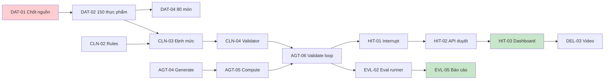

# TICKETS — BACKLOG & GIAO VIỆC

> 52 ticket · 6 sprint · Ước tính tổng ≈ 430 giờ-người
> Ký hiệu: **P0** = chặn dự án · **P1** = cần cho MVP · **P2** = nâng cao · **P3** = có thì tốt
> Owner theo mã vai trò trong `TEAM.md` (R1–R4 · đội 4 người)

**Cách dùng:** copy sang GitHub Issues hoặc Notion. Tiêu đề issue = `[MÃ] Tên ticket`. Gắn label = epic + priority. Milestone = sprint.

---

## Tổng quan theo sprint

| Sprint | Tuần | Ticket | Giờ ước tính |
|---|---|---|---|
| S1 | 27/07–02/08 | SET-01→06, DAT-00→03 | 78h |
| S2 | 03/08–09/08 | DAT-04→06, CLN-01→05, BE-01→05 | 92h |
| S3 | 10/08–16/08 | AGT-01→08, CLN-06→07, BE-06→07 | 96h |
| S4 | 17/08–23/08 | HIT-01→05, FE-01→06, BE-08→09 | 88h |
| S5 | 24/08–30/08 | ADV-01→06, FE-07→08, EVL-01→03 | 62h |
| S6 | 31/08–06/09 | EVL-04→06, DEL-01→06 | 44h |

---

## EPIC 0 — SETUP (S1) — *Owner chính: R3*

### `SET-01` Khởi tạo repo từ template AI20K
**Owner:** R3 · **P0** · 2h · **Deps:** —
Clone `starter-code-template`, `rm -rf .git`, `git init`, push lên repo đội. Đổi `pyproject.toml` (name, description, repo URL). Tạo `develop`. Bật branch protection cho `main` + `develop` (require PR, ≥1 approval, status checks).
**AC:** Cả 5 người clone và chạy `make run` thành công · `main` không push thẳng được · `.env.example` đầy đủ biến của dự án.

### `SET-02` Cài AI Usage Logging Hooks
**Owner:** R3 · **P0** · 1h · **Deps:** SET-01
Chạy `bash scripts/setup_hooks.sh` trên máy **từng người**. Điền `AI_LOG_API_KEY` do instructor cấp vào `.env`.
**AC:** Mỗi thành viên có ít nhất 1 entry trong `.ai-log/session.jsonl` · `git push` chạy pre-push hook không lỗi · Người dùng ChatGPT/web tool biết cách chạy `log_manual.py`.
> Đây là Deliverable #4, làm 1 lần được điểm cả kỳ. Không ai được `git push --no-verify`.

### `SET-03` CODEOWNERS + PR template + Issue template
**Owner:** R3 · **P1** · 2h · **Deps:** SET-01
Tạo `.github/CODEOWNERS` (theo `TEAM.md` §4), `.github/pull_request_template.md`, 2 issue template (feature/bug).
**AC:** PR chạm `src/clinical/` tự động request review R2 · PR template có checklist DoD.

### `SET-04` CI pipeline
**Owner:** R3 · **P0** · 4h · **Deps:** SET-01
GitHub Actions: `ruff check`, `ruff format --check`, `mypy`, `pytest`, `docker build`. Chạy trên PR vào `develop`/`main`.
**AC:** CI xanh trên PR mẫu · CI đỏ khi cố tình để lỗi lint · Thời gian chạy < 5 phút.

### `SET-05` Deploy hello-world lên cloud
**Owner:** R3 · **P0** · 4h · **Deps:** SET-04
Render (backend, Docker) + Vercel (frontend) + Neon/Supabase Postgres có `pgvector`. Cấu hình secrets trên platform.
**AC:** **Live URL công khai** trả `GET /api/v1/health` → 200 · Frontend hiển thị trang chủ gọi được API · URL ghi vào README.
> ⚠️ Ticket quan trọng nhất tuần 1. Deploy sớm để tuần 6 không phải deploy lần đầu.

### `SET-06` Khởi tạo tài liệu dự án
**Owner:** R1 · **P1** · 3h · **Deps:** SET-01
README từ `README_boilerplate.md`; copy bộ `docs/` này vào repo; tạo `DEVLOG.md`; tạo `CLAUDE.md` và `docs/rules/`.
**AC:** README có: vấn đề, giải pháp, tech stack, cách chạy, thành viên, Live URL · DEVLOG có entry đầu tiên của cả 5 người.

---

## EPIC 1 — DATA & KNOWLEDGE (S1–S2) — *Owner chính: R2*

### `DAT-00` Verify toàn bộ số liệu trong nghiên cứu
**Owner:** R2 · **P0** · 6h · **Deps:** —
Kiểm chứng từng số liệu trong `nghien_cuu_dinh_duong_ai_agent.md`: các arXiv ID, con số MAE calo, F1 phân rã món ăn, hiệu lực TT 08/2024/TT-BYT, QĐ 2598 / 3777 / 9484, NĐ 13/2023, thống kê muối VN, con số "70% không tuân thủ".
**AC:** File `docs/REFERENCES.md`, mỗi số liệu 1 dòng: `số liệu | nguồn | URL | ngày truy cập | trạng thái (verified / not-found / superseded)` · Số nào `not-found` thì **xoá khỏi đề án và pitch deck**.
> Bị giám khảo hỏi nguồn mà ú ớ sẽ mất điểm nặng hơn là không nhắc tới số liệu đó.

### `DAT-01` Chốt nguồn dữ liệu thực phẩm & pháp lý sử dụng
**Owner:** R2 · **P0** · 4h · **Deps:** —
Xác định lấy Bảng TPTP Việt Nam ở đâu (bản in/PDF/website NIN), điều kiện sử dụng. Đăng ký API key USDA FoodData Central. Kiểm tra license DDID — nếu không rõ ràng thì chuyển sang phương án curate 80 cặp thủ công.
**AC:** `data/README.md` ghi rõ: nguồn nào dùng được, giấy phép, cách trích dẫn · Có API key USDA hoạt động · Quyết định về DDID được ghi vào DEVLOG dạng ADR.

### `DAT-02` Thiết kế schema & nhập 150 thực phẩm cốt lõi
**Owner:** R2 (cả đội hỗ trợ nhập) · **P0** · 12h · **Deps:** DAT-01
CSV `data/seeds/food_items.csv` với cột: `id, name_vi, name_en, aliases, unit_ref, kcal_100g, protein_g, carb_g, fat_g, fiber_g, na_mg, k_mg, p_mg, purine_mg, gi_index, source, source_ref, is_estimated`.
Ưu tiên: gạo/bún/phở/bánh mì, thịt heo/bò/gà, cá phổ biến, tôm, trứng, đậu phụ, 25 loại rau, 15 loại quả, dầu mỡ, gia vị (nước mắm, bột canh, hạt nêm, mì chính, đường).
**AC:** ≥150 dòng · **0 dòng thiếu `source`** · Gia vị mặn có `na_mg` chính xác (đây là trục chính của bài toán muối) · Script `make seed` nạp được vào DB.
> Chia 5 người × 30 dòng, 1 buổi tối là xong. Đừng để 1 người làm cả tuần.

### `DAT-03` Tích hợp USDA FoodData Central
**Owner:** R2 · **P1** · 6h · **Deps:** DAT-01
Client gọi API USDA, mapping field sang schema nội bộ, cache vào DB, đánh dấu `source='USDA'`.
**AC:** Tra được ≥ 20 thực phẩm nhập khẩu · Có retry + timeout · Có test dùng mock, không gọi API thật trong CI.

### `DAT-04` Bộ 80 món ăn Việt + công thức nguyên liệu
**Owner:** R2 · **P1** · 14h · **Deps:** DAT-02
`dishes` + `dish_ingredients`. Mỗi món: nguyên liệu + gram cho 1 khẩu phần chuẩn + vùng miền + tag (mặn/ngọt/dầu mỡ). Bao gồm món "nguy hiểm": phở bò, bún cá, canh cua, thịt kho tàu, cá kho tộ, bún riêu, mì tôm.
Quy trình: LLM sinh nháp công thức → **R2 rà soát và sửa tay** → đối chiếu tổng dinh dưỡng với nguồn tham khảo.
**AC:** ≥80 món · Na của phở bò tính ra nằm trong khoảng 3,3–4,0g muối (khớp nghiên cứu) → dùng làm test hồi quy · Mỗi món ghi `verified_by`.

### `DAT-05` Bảng tương tác thuốc – thực phẩm (80 cặp)
**Owner:** R2 · **P1** · 8h · **Deps:** DAT-01
`drug_food_interactions`: `drug_name, drug_class, food_or_nutrient, severity(high/moderate/low), mechanism, recommendation, source_ref`.
Bắt buộc có: Warfarin–vitamin K, ACEi/ARB–kali & muối thay thế, Statin–bưởi, Metformin–rượu & B12, Levothyroxine–canxi/đậu nành/cà phê, Digoxin–chất xơ cao, MAOI–tyramine, Allopurinol–rượu bia, lợi tiểu thiazide–kali.
**AC:** ≥80 cặp, mỗi cặp có nguồn · Khớp được cả theo hoạt chất lẫn theo nhóm thuốc · Test: hồ sơ dùng Warfarin + thực đơn nhiều rau ngót → sinh cảnh báo `high`.

### `DAT-06` Ingest guideline vào RAG
**Owner:** R2 · **P1** · 8h · **Deps:** SET-05
Thu thập ~15 tài liệu (BYT, ADA, KDIGO, AHA/DASH, ACR, tài liệu Viện Dinh dưỡng). Chunk 500–800 token, overlap 100, embed, lưu `guideline_chunks` (pgvector) kèm metadata `{source, title, page, condition}`.
**AC:** Truy vấn "protein cho CKD giai đoạn 4" trả về chunk đúng ở top-3 · Mỗi chunk có metadata đầy đủ · Có script `make ingest` chạy lại được.

---

## EPIC 2 — CLINICAL ENGINE (S2–S3) — *Owner chính: R2, review R1*

### `CLN-01` Module tính năng lượng
**Owner:** R2 · **P0** · 6h · **Deps:** SET-01
`src/clinical/energy.py`: BMR theo Mifflin-St Jeor, hệ số hoạt động, TDEE, điều chỉnh theo mục tiêu cân nặng (giảm/giữ/tăng), dùng cân nặng lý tưởng khi BMI > 30.
**AC:** ≥12 unit test bao gồm biên (tuổi 18, tuổi 90, BMI 15, BMI 40) · Docstring ghi rõ công thức + nguồn · Không gọi LLM, không truy vấn DB.

### `CLN-02` Bảng quy tắc lâm sàng
**Owner:** R2 · **P0** · 8h · **Deps:** DAT-01
`data/seeds/clinical_rules.csv` + loader. Mỗi rule: `id, condition_code, stage, nutrient, operator, threshold, unit, per(day|meal|kg_bw), severity(hard|soft), guideline_ref`.
Phủ: ĐTĐ2 (carb %, chất xơ, GI), THA/tim mạch (Na, chất béo bão hoà), CKD G3a–G5 (protein/kg, K, P, Na), Gout (purine, cồn, fructose).
**AC:** ≥40 rule, mỗi rule có `guideline_ref` · Sửa ngưỡng chỉ cần sửa dữ liệu, **không phải sửa code** · Có test rule bị trùng/xung đột.

### `CLN-03` Bộ tính định mức cá thể
**Owner:** R2 · **P0** · 8h · **Deps:** CLN-01, CLN-02
`compute_targets(profile) -> ClinicalTargets` kèm `applied_rule_ids`. Xử lý **đa bệnh lý**: khi 2 rule cùng chất, lấy **ngưỡng nghiêm ngặt hơn** (fail-safe).
**AC:** Case "Nam 58t, 65kg, 165cm, ĐTĐ2 + CKD G3b" trả kết quả khớp với tính tay của R2 · Đa bệnh lý luôn chọn ngưỡng chặt hơn, có test riêng · Output kèm danh sách rule đã áp dụng để hiển thị trên UI.

### `CLN-04` Rules Engine — Bounds Checker
**Owner:** R2 · **P1** · 8h · **Deps:** CLN-03
`validate_menu(menu_nutrition, targets) -> list[Violation]`. Violation gồm: `nutrient, actual, limit, severity, message_vi, suggestion`. Hard violation → chặn phát hành; soft → cảnh báo.
**AC:** Thực đơn 3000mg Na cho bệnh nhân THA → hard violation kèm gợi ý cụ thể ("bỏ nước chấm, giảm 1/2 nước dùng") · Sai lệch năng lượng ±10% là soft, ±25% là hard.

### `CLN-05` Kiểm tra dị ứng
**Owner:** R2 · **P1** · 4h · **Deps:** DAT-02
Đối chiếu dị ứng của bệnh nhân với nguyên liệu (kể cả nguyên liệu ẩn: nước mắm↔cá, chả↔thịt+bột, bánh phở↔gạo).
**AC:** Dị ứng hải sản + thực đơn có bún riêu (mắm tôm) → **chặn cứng** · Dị ứng luôn là `hard`, không bao giờ chỉ cảnh báo.

### `CLN-06` Kiểm tra tương tác thuốc – thực phẩm
**Owner:** R2 · **P1** · 6h · **Deps:** DAT-05, CLN-04
Khớp thuốc bệnh nhân đang dùng với thực phẩm/vi chất trong thực đơn, sinh cảnh báo có mức độ và khuyến nghị.
**AC:** ≥90% phát hiện trên 20 case test · Cảnh báo `high` hiển thị badge đỏ trên UI · Không cảnh báo tràn lan (false positive < 20%).

### `CLN-07` OOV Estimator
**Owner:** R2 · **P2** · 10h · **Deps:** DAT-04
Món không có trong DB: (1) tra `aliases` → (2) tìm mờ tên món → (3) LLM phân rã thành nguyên liệu + gram ước tính → tra SQL từng nguyên liệu → cộng lại.
**AC:** Kết quả **luôn** gắn `is_estimated=true` + `confidence` (0–1) · UI hiển thị nhãn "ước tính" rõ ràng · Không bao giờ để LLM trả thẳng con số kcal · 10 case món địa phương cho sai lệch < 30%.

---

## EPIC 3 — AGENT (S3) — *Owner chính: R1*

### `AGT-01` State schema & khung graph
**Owner:** R1 · **P0** · 6h · **Deps:** SET-01
`src/agents/state.py` (`NutriState`) + `graph.py` với 8 node, conditional edges, Postgres checkpointer.
**AC:** Graph compile được, vẽ được sơ đồ bằng `graph.get_graph().draw_mermaid()` · Sơ đồ này dán thẳng vào `ARCHITECTURE.md`.

### `AGT-02` Node `load_profile` + `compute_targets`
**Owner:** R1 · **P0** · 4h · **Deps:** AGT-01, CLN-03
Nạp hồ sơ từ DB, gọi clinical engine. **Không LLM.**
**AC:** State sau 2 node có đủ `profile` + `targets` + `applied_rule_ids` · Test không cần API key LLM.

### `AGT-03` Node `retrieve_context` (Hybrid RAG)
**Owner:** R1 · **P1** · 8h · **Deps:** DAT-06
BM25 (Postgres full-text) + vector (pgvector), kết hợp bằng RRF. Đồng thời truy vấn SQL lấy danh sách thực phẩm ứng viên đã lọc theo bệnh lý và dị ứng.
**AC:** Top-5 chunk liên quan cho 10 truy vấn mẫu · Danh sách ứng viên đã loại sẵn thực phẩm cấm (VD: CKD → loại thực phẩm giàu K).

### `AGT-04` Node `generate_menu` (LLM + structured output)
**Owner:** R1 · **P0** · 10h · **Deps:** AGT-03
Prompt + Pydantic schema. **LLM chỉ trả `food_id`/`dish_id` + gram + slot bữa ăn.** Prompt chứa: định mức, ứng viên, sở thích, vùng miền, feedback lỗi lần trước.
**AC:** Output luôn parse được (có retry parse) · **Test: schema không có field nào cho phép LLM ghi kcal/na/protein** · `food_id` không tồn tại → reject, không tự bịa.

### `AGT-05` Node `compute_nutrition`
**Owner:** R1 · **P0** · 4h · **Deps:** AGT-04, DAT-02
Cộng dinh dưỡng bằng SQL từ `food_id` + gram. Sinh `sources[]`.
**AC:** Kết quả khớp tính tay trên 5 thực đơn mẫu · Mọi item có `source` · **Không** import module LLM nào trong file này (test tự động kiểm tra).

### `AGT-06` Node `validate` + retry loop
**Owner:** R1 · **P1** · 8h · **Deps:** CLN-04, CLN-05, AGT-05
Conditional edge: PASS → `explain`; FAIL & retry<3 → `build_feedback` → quay lại `generate_menu`; FAIL & retry=3 → fallback thực đơn mẫu + gắn cờ `needs_attention`.
**AC:** Feedback nêu **lỗi cụ thể** ("Na vượt 900mg do nước mắm + bột canh"), không phải "hãy thử lại" · Không vòng lặp vô hạn · Fallback luôn có sẵn cho 4 nhóm bệnh.

### `AGT-07` Guardrail chặn chỉ định y khoa
**Owner:** R1 · **P0** · 8h · **Deps:** AGT-01
Tầng 1: regex tiếng Việt (liều, mg thuốc, "có nên uống", "bị bệnh gì", "ngừng thuốc"…) + LLM classifier. Trả về câu trả lời chuẩn + gợi ý chuyển chuyên gia.
**AC:** **≥95% chặn đúng trên 20 câu red-team** · Không chặn nhầm câu hỏi dinh dưỡng bình thường (false positive < 10%) · Có bộ test riêng `tests/unit/test_guardrail.py`.

### `AGT-08` LangSmith tracing + đo chi phí
**Owner:** R1 · **P2** · 4h · **Deps:** AGT-06
Bật tracing, gắn tag theo node, log token và chi phí mỗi request.
**AC:** Xem được trace đầy đủ 1 lần sinh thực đơn trên LangSmith · Có số "chi phí trung bình / thực đơn" để trả lời Q&A · Screenshot cho Deliverable #4.

---

## EPIC 4 — BACKEND (S2–S4) — *Owner chính: R3*

### `BE-01` Schema DB + Alembic
**Owner:** R3 · **P0** · 8h · **Deps:** SET-05
Toàn bộ bảng theo `ARCHITECTURE.md` §5. Migration chạy được từ trắng.
**AC:** `alembic upgrade head` trên DB rỗng thành công · Có index cho các truy vấn nóng · `audit_log` không có API xoá.

### `BE-02` Auth JWT + RBAC
**Owner:** R3 · **P0** · 8h · **Deps:** BE-01
Đăng ký/đăng nhập, argon2id, access + refresh token, dependency `require_role()`.
**AC:** Bệnh nhân gọi `/reviews/pending` → 403 · Token hết hạn → 401 · Mật khẩu không bao giờ xuất hiện trong log.

### `BE-03` API hồ sơ bệnh nhân
**Owner:** R3 · **P1** · 6h · **Deps:** BE-02
CRUD hồ sơ: nhân trắc, bệnh lý (ICD-10 + giai đoạn), chỉ số xét nghiệm, thuốc, dị ứng, sở thích, vùng miền.
**AC:** Validation chặt (cân nặng 20–300kg, tuổi 1–120) · eGFR ngoài khoảng hợp lệ → 422 · Có integration test.

### `BE-04` API tính định mức
**Owner:** R3 · **P1** · 3h · **Deps:** CLN-03, BE-03
`POST /api/v1/targets/compute` — bọc clinical engine, **không gọi LLM**, trả nhanh (<200ms).
**AC:** Response có `targets` + `applied_rule_ids` + `guideline_refs` · Hiển thị được trên UI dưới dạng "vì sao ra con số này".

### `BE-05` Seed dữ liệu demo
**Owner:** R3 · **P1** · 4h · **Deps:** BE-01, DAT-02
Script tạo: 2 chuyên gia, 6 bệnh nhân mô phỏng (mỗi bệnh lý 1–2 người), thực phẩm, món ăn, rules, tương tác thuốc.
**AC:** `make seed` chạy 1 lệnh dựng đủ dữ liệu demo · README ghi rõ tài khoản demo · **Ghi rõ "dữ liệu hoàn toàn mô phỏng"**.

### `BE-06` API sinh thực đơn
**Owner:** R3 · **P1** · 8h · **Deps:** AGT-06, BE-04
`POST /api/v1/meal-plans` chạy graph bất đồng bộ, trả 202 + `plan_id`, đặt `status=pending_review`.
**AC:** Bệnh nhân gọi `GET /meal-plans` **không thấy** plan chưa duyệt · Có timeout và xử lý lỗi LLM · Không để request treo > 60s.

### `BE-07` API nhật ký ăn uống + tổng hợp
**Owner:** R3 · **P1** · 8h · **Deps:** DAT-02, CLN-04
Ghi món đã ăn (chọn từ DB hoặc gõ tự do → OOV), tổng hợp theo ngày/tuần, so với định mức, sinh cảnh báo vượt ngưỡng.
**AC:** Tổng hợp ngày trả kcal/Na/đường/protein + % so định mức · Vượt ngưỡng Na → cảnh báo kèm chỉ rõ món nào đóng góp nhiều nhất.

### `BE-08` Audit log
**Owner:** R3 · **P1** · 5h · **Deps:** BE-01
Ghi mọi hành động: sinh, sửa, duyệt, từ chối, xem hồ sơ bệnh nhân khác. Lưu `before`/`after`.
**AC:** Duyệt 1 thực đơn sinh đủ bản ghi có actor + timestamp + diff · Không có endpoint sửa/xoá audit · Có API `GET /audit` cho admin.

### `BE-09` Kiểm thử bảo mật & phân tách dữ liệu
**Owner:** R3 · **P0** · 5h · **Deps:** BE-02, BE-06
Test tự động cho mọi endpoint có dữ liệu bệnh nhân.
**AC:** Bệnh nhân A gọi tài nguyên của B → **404** · Không endpoint nào trả PHI khi thiếu token · Không có secret trong repo (thêm `gitleaks` vào CI).

---

## EPIC 5 — HITL (S4) — *R1 graph · R3 backend · R4 frontend*

### `HIT-01` Interrupt trong LangGraph
**Owner:** R1 · **P0** · 8h · **Deps:** AGT-06, BE-01
`interrupt()` trước khi phát hành, checkpointer Postgres, resume bằng `Command`.
**AC:** Graph dừng đúng chỗ, state persist qua restart server · Resume với `approve`/`edit`/`reject` chạy đúng nhánh.
**Fallback (nếu quá 2 ngày chưa xong):** dùng cột `status` thuần trong `meal_plans`, không dùng interrupt. Ghi quyết định vào DEVLOG.

### `HIT-02` API hàng chờ duyệt
**Owner:** R3 · **P0** · 6h · **Deps:** HIT-01
`GET /reviews/pending`, `POST /reviews/{id}/approve` (kèm edits), `POST /reviews/{id}/reject` (lý do bắt buộc).
**AC:** Chỉ role dietitian truy cập được · Approve kèm sửa gram → tính lại dinh dưỡng trước khi lưu · Reject không có lý do → 422.

### `HIT-03` Dashboard duyệt thực đơn
**Owner:** R4 · **P0** · 12h · **Deps:** HIT-02
Danh sách chờ (sắp theo mức độ cảnh báo), trang chi tiết: thực đơn, định mức, biểu đồ so sánh, cảnh báo, **nguồn từng món**, ô sửa gram trực tiếp, nút Duyệt/Từ chối.
**AC:** Duyệt 1 thực đơn ≤ 2 phút (đo thật) · Cảnh báo `high` không thể bỏ lỡ về mặt thị giác · Sửa gram cập nhật tổng dinh dưỡng ngay trên UI.

### `HIT-04` Thông báo & trạng thái cho bệnh nhân
**Owner:** R4 · **P1** · 5h · **Deps:** HIT-02
Bệnh nhân thấy trạng thái "Đang chờ chuyên gia duyệt" (không thấy nội dung), khi approved thì hiện thực đơn kèm tên người duyệt + thời điểm.
**AC:** Không có cách nào xem nội dung plan chưa duyệt từ UI **và** từ API · Thực đơn đã duyệt hiển thị "Đã duyệt bởi ... lúc ...".

### `HIT-05` Vòng phản hồi khi bị từ chối
**Owner:** R1 · **P2** · 5h · **Deps:** HIT-01
Lý do từ chối của chuyên gia được đưa vào `feedback` và agent sinh lại.
**AC:** Từ chối "quá nhiều tinh bột buổi tối" → bản sinh lại giảm carb bữa tối, có test · Lịch sử các phiên bản được lưu.

---

## EPIC 6 — FRONTEND (S4–S5) — *Owner chính: R4*

### `FE-01` Khung app + Auth UI
**Owner:** R4 · **P0** · 8h · **Deps:** BE-02
Next.js App Router, layout theo role, đăng nhập/đăng xuất, lưu token an toàn, route guard.
**AC:** Sai role → redirect · Refresh trang không mất session · Responsive mobile.

### `FE-02` Form hồ sơ bệnh nhân
**Owner:** R4 · **P1** · 10h · **Deps:** BE-03
Nhiều bước: nhân trắc → bệnh lý & giai đoạn → xét nghiệm → thuốc → dị ứng → sở thích/vùng miền.
**AC:** Validation phía client khớp server · Lưu nháp giữa chừng · Chọn thuốc có gợi ý (autocomplete).

### `FE-03` Màn hình thực đơn
**Owner:** R4 · **P1** · 10h · **Deps:** BE-06
Thực đơn theo bữa, gram, tổng dinh dưỡng, thanh so sánh với định mức, **chip nguồn bấm được cho từng món**, cảnh báo, disclaimer.
**AC:** Bấm vào món hiện popup "Gạo tẻ · NIN · Bảng TPTP VN, tr.42" · Disclaimer luôn hiển thị · Món ước tính có nhãn riêng.

### `FE-04` Nhật ký ăn uống
**Owner:** R4 · **P1** · 8h · **Deps:** BE-07
Ghi món nhanh (tìm kiếm + gõ tự do), tổng hợp ngày, vòng tròn tiến độ, cảnh báo vượt ngưỡng.
**AC:** Ghi 1 bữa ≤ 20 giây · Vượt ngưỡng Na hiện cảnh báo đỏ tức thì · Xem lại được 7 ngày gần nhất.

### `FE-05` Giao diện chat có guardrail
**Owner:** R4 · **P1** · 6h · **Deps:** AGT-07
Chat với agent, hiển thị citation, hiển thị rõ khi guardrail kích hoạt.
**AC:** Hỏi "tôi nên uống thuốc gì" → hiện câu trả lời chuẩn + nút "Gửi câu hỏi cho chuyên gia" · Citation bấm được.

### `FE-06` Dark mode + Accessibility + Empty states
**Owner:** R4 · **P2** · 5h · **Deps:** FE-01
**AC:** Dark mode toàn app · Tương phản đạt WCAG AA · Mọi màn hình có trạng thái loading/rỗng/lỗi · Không có màn hình trắng.

### `FE-07` Biểu đồ xu hướng
**Owner:** R4 · **P2** · 6h · **Deps:** BE-07
Recharts: kcal/Na/đường theo 7 và 30 ngày, đường ngưỡng.
**AC:** Vượt ngưỡng hiển thị vùng đỏ · Có tooltip · Bệnh nhân và chuyên gia đều xem được.

### `FE-08` Danh sách đi chợ
**Owner:** R4 · **P3** · 5h · **Deps:** ADV-03
**AC:** Gộp nguyên liệu cả tuần, quy về đơn vị chợ (mớ/bó/lạng) · Tick được từng món · In/copy được.

---

## EPIC 7 — TÍNH NĂNG NÂNG CAO (S5) — *Owner chính: R1 + R2*

### `ADV-01` Phân rã mâm cơm gia đình
**Owner:** R1 + R2 · **P2** · 12h · **Deps:** DAT-04, CLN-04
Nhập mô tả mâm cơm bằng text ("thịt kho tàu, canh rau ngót, đậu phụ luộc, 4 người ăn") → LLM nhận diện món → SQL tra dinh dưỡng → thuật toán tối ưu chọn khẩu phần cho bệnh nhân + hướng dẫn cách gắp.
**AC:** Ví dụ trong đề án (ĐTĐ + CKD G3) cho kết quả hợp lý, nằm trong định mức · Đầu ra là **hướng dẫn hành vi** ("gạt bỏ nước kho", "chỉ ăn cái không ăn nước canh"), không chỉ là con số · Có ≥5 case test.
> Đây là tính năng khác biệt nhất của dự án. Ưu tiên hơn shopping list.

### `ADV-02` Gợi ý thay thế theo vùng miền
**Owner:** R2 · **P3** · 6h · **Deps:** DAT-04
Bảng thay thế: mắm nêm → mắm pha loãng/chanh ớt; nước cốt dừa → sữa hạt; đường → chất tạo ngọt GI thấp.
**AC:** Bệnh nhân miền Trung nhận gợi ý giảm mặn phù hợp khẩu vị · Mỗi gợi ý ghi rõ tiết kiệm được bao nhiêu mg Na / g đường.

### `ADV-03` Thực đơn 7 ngày
**Owner:** R1 · **P2** · 8h · **Deps:** AGT-06
Sinh cả tuần, tránh lặp món quá 2 lần, cân bằng dinh dưỡng theo tuần chứ không chỉ theo ngày.
**AC:** Không món nào lặp > 2 lần/tuần · Mỗi ngày vẫn pass validator riêng · Thời gian sinh < 90 giây.

### `ADV-04` Cân bằng lại theo thời gian thực
**Owner:** R1 · **P2** · 6h · **Deps:** BE-07, ADV-03
Bữa sáng vượt Na → tự điều chỉnh giảm Na bữa trưa/tối trong ngân sách còn lại.
**AC:** Bệnh nhân log bát phở (3,5g muối) → gợi ý bữa tối được điều chỉnh, tổng ngày vẫn trong ngưỡng · Nếu không thể cân bằng → nói thật ("hôm nay đã vượt, ngày mai cần bù").

### `ADV-05` Memory sở thích
**Owner:** R1 · **P3** · 5h · **Deps:** BE-03
Ghi nhớ món không thích, nguyên liệu sẵn có, dị ứng phát hiện thêm.
**AC:** Từ chối món 2 lần → không đề xuất lại trong 30 ngày · Bệnh nhân xem và xoá được ghi nhớ (quyền riêng tư).

### `ADV-06` Export PDF thực đơn
**Owner:** R4 · **P3** · 4h · **Deps:** FE-03
**AC:** PDF có logo, thực đơn, dinh dưỡng, nguồn, **disclaimer**, tên người duyệt · In A4 không vỡ layout.

---

## EPIC 8 — EVALUATION & QA (S5–S6) — *Owner chính: R2 (dữ liệu & báo cáo) + R1 (runner)*

### `EVL-01` Bộ 60 case đánh giá
**Owner:** R2 · **P1** · 10h · **Deps:** CLN-03
`eval/datasets/cases_60.jsonl` theo phân bổ trong `PLAN.md` §7.1, mỗi case có `expected_targets` tính tay.
**AC:** 60 case, đủ 6 nhóm · 26 case red-team có `expected_behavior` rõ ràng · Được R1 review chéo.

### `EVL-02` Runner đánh giá tự động
**Owner:** R1 · **P1** · 8h · **Deps:** EVL-01, AGT-06
`make eval` chạy toàn bộ case, xuất JSON + markdown, tính 5 nhóm metric.
**AC:** Chạy 1 lệnh · Kết quả reproducible (seed cố định) · Xuất bảng dán thẳng vào báo cáo.

### `EVL-03` Test groundedness trong CI
**Owner:** R3 · **P0** · 4h · **Deps:** AGT-05
Test chặn: mọi giá trị dinh dưỡng phải có `source_id`; module `compute_nutrition` không được import LLM client; DB không dòng nào `source IS NULL`.
**AC:** CI **đỏ** nếu ai đó vô tình để LLM sinh số · Chạy trên mọi PR.
> Đây là ticket biến nguyên tắc thiết kế thành ràng buộc kỹ thuật thực sự.

### `EVL-04` RAGAS cho phần giải thích
**Owner:** R2 · **P2** · 6h · **Deps:** AGT-03, DAT-06
Faithfulness + Answer Relevancy trên 30 câu hỏi guideline.
**AC:** Cả 2 chỉ số ≥ 0,8 hoặc có phân tích lý do chưa đạt · Kết quả vào báo cáo.

### `EVL-05` Báo cáo đánh giá (Deliverable #10)
**Owner:** R2 · **P1** · 6h · **Deps:** EVL-02, EVL-04
`eval/results/report.md`: phương pháp, bảng metric, biểu đồ, **3 case thất bại + phân tích nguyên nhân**, mục "hạn chế đã biết".
**AC:** Có đủ 5 nhóm metric · Phần hạn chế trung thực, không tô hồng · Có biểu đồ.

### `EVL-06` Chuyên gia dinh dưỡng review 20 thực đơn
**Owner:** R2 · **P2** · 6h · **Deps:** EVL-02
Mời 1 chuyên gia/bác sĩ/giảng viên chấm 20 thực đơn: approve / sửa nhẹ / sửa nhiều / từ chối + nhận xét.
**AC:** Có bảng kết quả + **tên và chức danh người review (có sự đồng ý)** · Tính được chỉ số Expert Agreement · Đưa lên slide.
> Deliverable này gần như không đội nào có. Chi phí: 1 buổi cà phê. Giá trị: rất lớn.

---

## EPIC 9 — DELIVERABLES (S6) — *Owner chính: R4 (nội dung) + R1 (theo dõi)*

### `DEL-01` Hoàn thiện README
**Owner:** R4 · **P0** · 4h
**AC:** Vấn đề → giải pháp → screenshot/GIF → tech stack → cài đặt → cấu trúc → tài khoản demo → thành viên & vai trò → Live URL → **disclaimer y tế**.

### `DEL-02` Architecture Diagram cuối
**Owner:** R1 · **P0** · 2h
**AC:** `docs/architecture_diagram.md` với Mermaid render được trên GitHub · Khớp code thực tế (không phải kiến trúc mơ ước).

### `DEL-03` Video demo 4 phút
**Owner:** R4 · **P1** · 6h
Kịch bản: vấn đề (30s) → hồ sơ bệnh nhân (30s) → agent sinh thực đơn (45s) → **cảnh báo tương tác thuốc kích hoạt** (30s) → chuyên gia duyệt và sửa (45s) → bệnh nhân nhận + log bữa ăn (45s) → kiến trúc chống bịa số (30s).
**AC:** ≤ 5 phút · Có phụ đề · Upload YouTube unlisted · Link vào README.

### `DEL-04` Pitch deck 10 slide
**Owner:** R4 + cả đội · **P1** · 8h
Theo cấu trúc chương 9 template. Slide 6 phải là "Cách chúng tôi chống bịa số"; thêm 1 slide "Những gì hệ thống KHÔNG làm".
**AC:** Font ≥ 24pt · Mỗi slide 1 ý · Mọi số liệu có nguồn · Tổng duyệt ≥ 3 lần.

### `DEL-05` Hoàn tất DEVLOG + Worklog
**Owner:** R1 · **P0** · 2h
**AC:** DEVLOG có entry của mọi tuần, mọi người · `git log --oneline > docs/worklog.md` · Không có tuần nào trống.

### `DEL-06` Kiểm tra cuối trước nộp
**Owner:** R3 · **P0** · 4h
Chạy checklist `chapter-09` của template.
**AC:** 10/10 deliverable · Live URL test trên incognito + máy khác + mạng khác · `pytest` xanh · Docker build được · Không secret trong repo · Không `except:` trần · CI xanh.

---

## Phụ lục A — Ma trận phụ thuộc quan trọng

**Đường găng:** `DAT-01 → DAT-02 → CLN-03 → CLN-04 → AGT-06 → HIT-01 → HIT-03`.
Trễ bất kỳ ticket nào trên đường này là trễ cả dự án. Ưu tiên tuyệt đối.

## Phụ lục B — Phân bổ giờ theo người (đội 4)

| Vai trò | Giờ ước tính | Giờ/tuần (6 tuần) | Nặng nhất ở |
|---|---|---|---|
| R1 Tech Lead / Agent + PM | ~118h | ~20h | S3 (agent + guardrails) |
| R2 Clinical & Data + Eval | ~130h | ~22h | S1–S2 (nhập dữ liệu) |
| R3 Backend + DevOps | ~98h | ~16h | S2 (schema + auth) |
| R4 Frontend + Deliverables | ~102h | ~17h | S4 (HITL dashboard) |

### Ba cảnh báo về tải

1. **R2 quá tải tuần 1–2.** Ticket `DAT-02` (150 thực phẩm) bắt buộc chia cho **cả 4 người**, mỗi người ~38 dòng. Để R2 làm một mình là vỡ đường găng ngay tuần đầu.
2. **R1 gánh cả PM.** Dành đúng 2 giờ/tuần cho việc theo dõi, phần còn lại vẫn phải code. Nếu thấy PM ngốn quá 4 giờ/tuần thì đang họp quá nhiều.
3. **R3 rảnh nhất từ tuần 5** (DevOps đã xong từ tuần 1) → chuyển sang hỗ trợ `ADV-01` (mâm cơm gia đình) và `EVL-02` (eval runner).

### Nếu có người thứ 5 tham gia giữa chừng

Ưu tiên tách theo thứ tự: (1) DevOps/QA tách khỏi R3 → nhận `EVL-*` và `OPS`; (2) tách R2 thành clinical rules và data ETL. Bản phân vai 5 người còn lưu ở `TEAM_5p_backup.md`.
