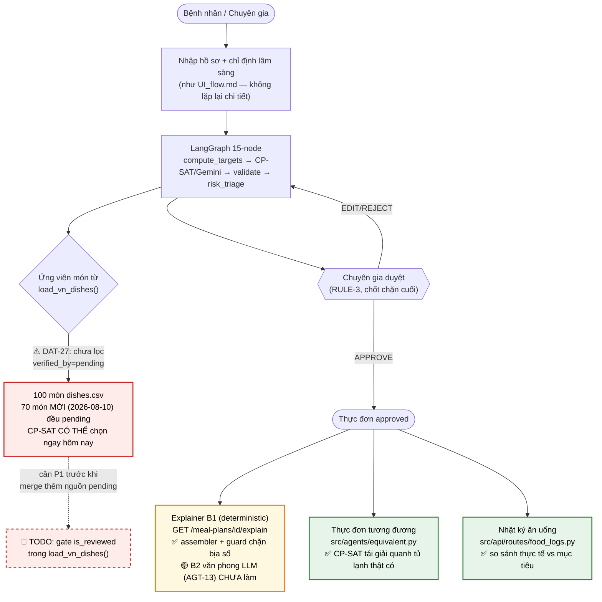
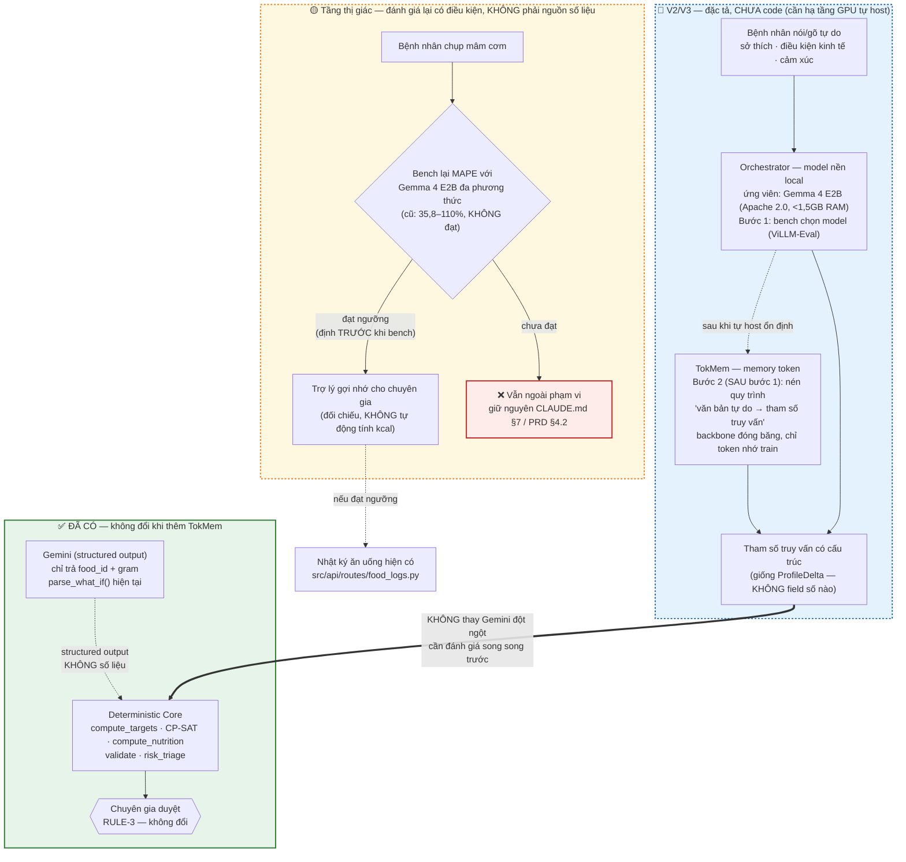

> **Cập nhật 2026-08-10:** thêm cột "Trạng thái" cho M/S theo `main` thật (không suy đoán — đối chiếu trực tiếp mã nguồn/PR), và thêm mục **"Cập nhật trạng thái & định hướng V2/V3"** ở cuối file với 2 sơ đồ mermaid (luồng hệ thống hiện tại đã mở rộng + định hướng model nền local/TokMem). Bảng M/S/C/W gốc giữ nguyên cấu trúc và lý do — đây vẫn là tài liệu **lựa chọn tính năng** (rationale), không phải tracker tiến độ; xem `docs/TICKETS.md` cho trạng thái ticket chi tiết.

## **M — Must have: Bắt buộc phải có**

| Hạng mục | Lý do bắt buộc | Trạng thái (2026-08-10) |
| ----- | ----- | ----- |
| Hồ sơ bệnh nhân cơ bản | Là đầu vào để tính nhu cầu và tạo thực đơn | ✅ `src/api/routes/patients.py`, `patient_profiles` |
| Thông tin bệnh lý và bệnh đồng mắc | Hệ thống phải hỗ trợ tiểu đường, tăng huyết áp, bệnh thận và gout | ✅ `compute_targets()`, đa bệnh lý DEC-007, không thu hẹp (CLAUDE.md §7) |
| Thuốc đang sử dụng và dị ứng | Cần thiết để kiểm tra an toàn | ✅ `patient_medications`, `patient_allergies` + `src/clinical/interactions.py` |
| Sở thích và hạn chế ăn uống | Giúp thực đơn có khả năng áp dụng trong thực tế | ✅ đưa vào ràng buộc CP-SAT (đa dạng hoá, dị ứng) |
| Lõi tính toán dinh dưỡng | Tính năng lượng, đạm, tinh bột, chất béo, natri, kali, phospho và purin | ✅ `src/clinical/nutrition.py` (SQL/Python thuần, RULE-1) |
| Bộ quy tắc lâm sàng | Xác định giới hạn dinh dưỡng theo từng bệnh và xử lý bệnh đồng mắc | ✅ `src/clinical/rules.py`, `data/seeds/clinical_rules.csv` (21 rule, đa số `to_verify` — R2 cần đối chiếu trước Demo Day, DAT-00) |
| Cơ sở dữ liệu thực phẩm và món Việt | Cung cấp nguyên liệu, món ăn và số liệu dinh dưỡng có nguồn | ✅ Đã tách 3 tầng (DAT-25, 2026-08-10): `data/seeds/` (548 food + 100 dish, chạm bệnh nhân) · `data/reference/` (USDA/FNDDS, tra cứu) · `data/quarantine/` (chờ duyệt/license). **70/100 món vẫn `verified_by="pending"`, chưa duyệt.** |
| AI xây dựng thực đơn | Chọn món Việt và phối hợp các bữa ăn theo yêu cầu | ✅ `src/agents/hybrid.py::HybridMenuGenerator` — CP-SAT feasibility-only trước (~0,1s), Gemini chỉ khi vô nghiệm/chọn giữa nhiều nghiệm |
| Kiểm tra lại thực đơn | Tính lại các chất dinh dưỡng, không sử dụng trực tiếp con số do AI tạo ra | ✅ node `compute_nutrition` tách khỏi `generate_menu` — LLM không bao giờ thấy số kcal (ARCHITECTURE.md §3) |
| Tự điều chỉnh khi thực đơn không đạt | AI phải thay món hoặc sửa khẩu phần khi vi phạm giới hạn | ✅ vòng `build_feedback` → `generate_menu` (tối đa 3 lần), `fallback_template` khi vẫn P0 |
| Cảnh báo dị ứng | Ngăn thực đơn chứa thực phẩm gây dị ứng | ✅ node `safety_validate` |
| Cảnh báo tương tác thuốc–thực phẩm | Đáp ứng mục tiêu nghiên cứu RQ5 | ✅ `src/clinical/interactions.py` + `data/seeds/drug_food_interactions.csv` (30 cặp, `to_verify`) |
| Chuyên gia phê duyệt bắt buộc | Không cho phép thực đơn AI đi thẳng đến bệnh nhân | ✅ HITL interrupt (node 15), RULE-3. ⚠️ Xem lỗ hổng đã phát hiện+vá (`MENU-*`, DEC-022) và lỗ hổng còn mở (`DAT-27`) ở mục cập nhật cuối file |
| Ghi nhận chỉnh sửa, duyệt hoặc từ chối | Là dữ liệu đánh giá vai trò của chuyên gia trong RQ2 | ✅ `audit_log` append-only + `reviewer_notes` trên `meal_plans` |
| Truy vết nguồn số liệu | Mọi giá trị dinh dưỡng phải xác định được lấy từ đâu | ✅ `source`/`source_ref` bắt buộc, validator chặn CI (RULE-2) |
| Bộ hồ sơ bệnh nhân mô phỏng | Cần để phát triển và đánh giá mà không sử dụng dữ liệu bệnh nhân thật | ✅ NHANES 2021-2023 de-identified, `data/patients/` (2020 hồ sơ, 4 tập) |
| Bộ đánh giá kết quả | Đo mức độ đạt ngưỡng, khả năng truy vết và hiệu quả của bước chuyên gia duyệt | ✅ `eval/` — `compute_oracle_targets.py`, `generate_eval_cases.py`, `generate_safety_prompts.py` |

Ba câu hỏi nghiên cứu bắt buộc tương ứng là:

* **RQ1:** Kiến trúc AI chọn món kết hợp hệ thống tính toán có giảm sai lệch không?
* **RQ2:** Chuyên gia phê duyệt có cải thiện mức độ an toàn không?
* **RQ5:** Hệ thống phát hiện tương tác thuốc–thực phẩm chính xác đến đâu?

Nếu thiếu một trong ba trụ cột **tính toán xác định – kiểm tra an toàn – chuyên gia phê duyệt**, sản phẩm không còn đúng với mục tiêu của tài liệu.

---

## **S — Should have: Nên có**

Các hạng mục này quan trọng và làm sản phẩm hoàn chỉnh hơn, nhưng nếu chưa làm sâu thì V1 vẫn có thể chứng minh luồng cốt lõi.

| Hạng mục | Phạm vi phù hợp cho V1 | Trạng thái (2026-08-10) |
| ----- | ----- | ----- |
| Nhật ký ăn uống | Cho bệnh nhân nhập những món thực tế đã ăn | ✅ `src/api/routes/food_logs.py` (BE-07) |
| So sánh thực tế với thực đơn | Cho biết bệnh nhân ăn thiếu hoặc vượt mục tiêu | ✅ trong luồng food log |
| Cảnh báo vượt ngưỡng trong ngày | Nhắc khi ăn quá mặn, quá nhiều đường hoặc vượt giới hạn | ✅ đi kèm food log |
| Báo cáo xu hướng | Tổng hợp tình hình để chuyên gia xem ở lần tái khám | ⏳ chưa xác nhận có dashboard tổng hợp riêng |
| Điều chỉnh mục tiêu điều trị | Cho phép chuyên gia cập nhật hồ sơ và tạo thực đơn mới | ✅ `POST /targets/{id}/what-if` (`src/services/target_assistant.py`, P1) |
| Thông tin vùng miền | Ưu tiên những món quen thuộc với người bệnh | ✅ `region` trên `dishes.csv` + alias vùng miền (`vn-food-data` skill) |
| Thực phẩm sẵn có và điều kiện nấu ăn | Tăng khả năng áp dụng thực đơn | ✅ nền tảng cho "thực đơn tương đương" |
| Món ăn thay thế | Giúp bệnh nhân linh hoạt khi không có món được đề xuất | ✅ `src/agents/equivalent.py` (P2/AGT-12) — CP-SAT tái giải với tập ứng viên thu hẹp quanh thực đơn gốc, không phải LLM phán đoán tương tự |
| Giải thích lý do chọn món | Giúp người bệnh hiểu và tuân thủ tốt hơn | 🟡 **B1 xong** (`src/clinical/menu_explainer.py` + `menu_explanation_guard.py`, PR #77, đã merge) — assembler tất định + chặn LLM bịa số. **B2 (văn phong hoá bằng LLM + route API, `AGT-13`) CHƯA làm** — `menu_coach.py`/`menu_explainer.py` route chưa tồn tại |
| Nhập dữ liệu xét nghiệm qua biểu mẫu | Chưa cần kết nối trực tiếp với hệ thống bệnh viện | ✅ qua `patient_profiles`/hồ sơ nhập tay |
| Nhập dữ liệu InBody/nhân trắc bằng tay | Hỗ trợ cá thể hóa ở mức cơ bản | ✅ trường nhân trắc trong hồ sơ |
| Giao diện riêng cho chuyên gia | Giúp việc xem, sửa và duyệt thực đơn thuận tiện | ✅ `web-next/src/app/dietitian/` (dashboard, review queue, polish 2026-08-10) |

Những phần này nên có nếu nguồn lực cho phép, nhưng có thể triển khai ở mức đơn giản trước.

---

## **C — Could have: Có thể có nếu còn thời gian**

Đây là các điểm tạo khác biệt hoặc minh họa hướng phát triển, nhưng không quyết định sự thành công của bản V1.

| Hạng mục | Liên hệ trong tài liệu |
| ----- | ----- |
| Phân rã "mâm cơm chung" thành món và khẩu phần | RQ6 — mục tiêu mở rộng |
| AI ước lượng nguyên liệu từ mô tả bữa ăn | Phục vụ tính năng mâm cơm chung |
| So sánh kết quả ước lượng với chuyên gia | Chỉ cần thử trên một số kịch bản mẫu |
| Mô phỏng dữ liệu InBody theo thời gian | RQ3 ở mức minh họa khái niệm |
| Minh họa thay đổi nhu cầu khi cân nặng, khối cơ hoặc khối mỡ thay đổi | Chưa đủ cơ sở để đưa ra kết luận nghiên cứu |
| Cá thể hóa sâu hơn theo vùng miền | Có thể mở rộng khi cơ sở dữ liệu món ăn đủ lớn |
| Nhiều phương án thực đơn để chuyên gia lựa chọn | Hữu ích nhưng chưa bắt buộc |
| Nhắc nhở theo thói quen sử dụng | Có thể làm đơn giản nếu còn nguồn lực |
| Nhập form khảo sát thời gian ăn uống trong ngày | |

Trong tài liệu, **RQ6** được ghi rõ là làm nếu còn thời gian, vì vậy phù hợp nhất với nhóm Could have.

---

## **W — Won't have now: Chưa thực hiện trong V1**

Nhóm này không có nghĩa là không bao giờ làm. Đây là những hạng mục chủ động loại khỏi bản sáu tuần và đưa vào V2 hoặc V3.

| Hạng mục chưa thực hiện | Lý do |
| ----- | ----- |
| Tích hợp wearable như đồng hồ thông minh | Tốn nhiều công sức kết nối và chưa có dữ liệu thật |
| Tích hợp CGM đo đường huyết liên tục | Cần thiết bị và bệnh nhân thật |
| Tự động điều chỉnh mức vận động từ wearable | Thuộc RQ4, chưa khả thi trong V1 |
| Kết nối trực tiếp máy InBody | V1 chỉ nhập dữ liệu mô phỏng hoặc nhập tay |
| Kết nối trực tiếp DEXA | Cần thiết bị và quy trình thực tế |
| Kết nối hệ thống HIS/LIS bệnh viện | Cần cơ sở y tế hợp tác và chuẩn kết nối phù hợp |
| Sử dụng dữ liệu bệnh nhân thật | V1 chỉ sử dụng dữ liệu mô phỏng |
| Thí điểm chính thức tại bệnh viện | Cần phê duyệt đạo đức và quy trình bảo vệ dữ liệu |
| Đo tác động lên HbA1c, huyết áp hoặc eGFR | Thuộc RQ7, cần theo dõi nhiều tháng và nhóm đối chứng |
| Đánh giá nhắc nhở có cải thiện tuân thủ không | Thuộc RQ8, cần bệnh nhân thật và theo dõi dài hạn |
| Tự động đưa ra quyết định điều trị | Nằm ngoài vai trò của sản phẩm |
| Gửi thực đơn AI trực tiếp cho bệnh nhân | Không được phép trong mọi phiên bản hiện tại |
| **VLM ước tính dinh dưỡng trực tiếp từ ảnh món ăn** | MAPE đo được 35,8–110% (không đạt an toàn lâm sàng) — **đang đánh giá lại có điều kiện** với Gemma 4 E2B, xem mục V2/V3 bên dưới. Chưa có quyết định đổi phạm vi. |
| **Model nền tự host + TokMem** | Cần hạ tầng GPU chưa có tại thời điểm này — đặc tả trước, xem mục V2/V3 bên dưới. |

---

## Cập nhật trạng thái & định hướng V2/V3 (2026-08-10)

> Nguồn: `docs/PLAN_WEEK_NEXT_v2v3.md`, `docs/Nghiên cứu ứng dụng LLM và CP-SAT tạo thực đơn cho người đái tháo đường.md` (mục "Lộ Trình Model Nền & TokMem" + "Tầng thị giác/VLM"), `docs/ARCHITECTURE.md`, `docs/LANGGRAPH_ARCHITECTURE_COMPARISON.md`, `UI_flow.md`.

### Tóm tắt những gì đã thật sự đổi kể từ lần soạn M/S/C/W ban đầu

1. **Graph 8-node (thiết kế ban đầu) → 15-node thật** (`src/agents/graph.py`) — thêm `target_gate` tách riêng, phân loại rủi ro P0/P1/P2, `prepare_manual_review`, `prepare_review_packet` riêng biệt khỏi HITL. Chi tiết: `docs/LANGGRAPH_ARCHITECTURE_COMPARISON.md`.
2. **CP-SAT chạy chế độ feasibility-only**, không phải tối đa hoá hàm mục tiêu như tài liệu nghiên cứu mô tả — đo được 0,1s OPTIMAL so với ~105s UNKNOWN ở chế độ có hàm mục tiêu. Đây là khác biệt triển khai quan trọng nhất so với lý thuyết tham khảo (FinAgent dùng LP, không phải CP-SAT).
3. **Dữ liệu đã tách 3 tầng (DAT-25)** — `data/seeds/` (chạm bệnh nhân) tách khỏi `data/reference/` (USDA/FNDDS tra cứu) và `data/quarantine/` (chờ duyệt/license, gồm cả 263 món ViFoodRec chưa xác nhận license và 34 món công nghiệp không decompose được). Validator từ 2647 lỗi → 0.
4. **⚠️ Lỗ hổng đã phát hiện và vá (DEC-022):** `load_vn_dishes()` từng lọc `dishes.csv` theo cột `verified_by` bắt đầu bằng `"USDA FNDDS"` — món `MENU-*` (mẫu bữa Excel, không phải món ăn) ghi `verified_by="pending"` nên lọt qua, hiện lên UI bệnh nhân dưới dạng tên mẫu. Đã sửa bằng nguồn lọc tập trung `src/clinical/tiers.py`.
5. **⚠️ Lỗ hổng CÙNG LOẠI vẫn còn mở (`DAT-27`, P1, chưa merge):** `load_vn_dishes()` hiện **không loại món `verified_by=="pending"` khỏi tập ứng viên CP-SAT** — chỉ gắn cờ `is_reviewed=False` để tầng trên "cảnh báo", không chặn thật. Bản thân `dishes.csv` hiện có **100 món, 70 món mới (2026-08-10) đều `pending`, chưa R2 duyệt công thức** — về mặt code, CP-SAT vẫn có thể chọn chúng ngay hôm nay. Đây là ưu tiên P1 cần làm **trước** khi merge thêm bất kỳ nguồn `pending` nào khác (VD 263 món ViFoodRec khi có license).
6. **Menu Explainer & Coaching — B1 xong (PR #77), B2 (`AGT-13`) chưa bắt đầu.** Endpoint giải thích thực đơn bằng ngôn ngữ tự nhiên cho bệnh nhân KHÔNG phải node trong graph — vì mọi node hiện tại chạy trước khi duyệt; đây là service gọi theo yêu cầu, tương tự `target_assistant.py`.

### Sơ đồ 1 — Luồng hệ thống hiện tại (user + UI + system, mở rộng từ `UI_flow.md`)

`UI_flow.md` vẽ luồng tạo-duyệt thực đơn gốc. Sơ đồ dưới đây **mở rộng thêm** các nhánh đã có thật trên `main` nhưng chưa từng được vẽ chung một chỗ: nhật ký ăn uống, thực đơn tương đương từ tủ lạnh, và Explainer B1 — đồng thời đánh dấu rõ lỗ hổng `DAT-27` đang mở.

### Sơ đồ 2 — Định hướng V2/V3: model nền local + TokMem (đặc tả trước, CHƯA triển khai)

Vị trí duy nhất TokMem được phép chạm vào hệ thống là **tầng hiểu ngôn ngữ tự do của bệnh nhân** (Orchestrator) — KHÔNG BAO GIỜ ở tầng tính toán. Đây là ranh giới bắt buộc để giữ RULE-1 nguyên vẹn: TokMem nén *quy trình phân tích văn bản thành tham số truy vấn*, không nén hay thay thế bất kỳ phép tính dinh dưỡng nào.

**Đọc sơ đồ 2:**
- Khối xanh lá (`NOW`) là toàn bộ hệ thống hiện tại — **không có gì trong khối này thay đổi** khi V2/V3 triển khai. TokMem chỉ cắm thêm một nhánh song song ở đầu vào, không sửa lõi.
- `TOKMEM` chỉ hoạt động được nếu Orchestrator là **model mã nguồn mở tự host** (cần truy cập trọng số backbone để train token nhớ) — **không tương thích Gemini** (API đóng). Đây là lý do bước 1 (chọn model nền) phải xong trước bước 2 (TokMem), không thể làm song song.
- `PARAMS` (tham số truy vấn) có cấu trúc **giống hệt** `ProfileDelta` đã dùng cho `target_assistant.parse_what_if()` hiện tại — không field số nào, Pydantic chặn field lạ. TokMem không đổi *loại* dữ liệu trả về, chỉ đổi *cách* mô hình được huấn luyện để trả về nó rẻ hơn (không cần prompt dài mỗi lần).
- Nhánh VLM **tách biệt hoàn toàn** khỏi nhánh TokMem — hai quyết định độc lập, không phụ thuộc nhau. Ngưỡng đạt/không-đạt phải định **trước khi** bench (đã ghi rõ trong tài liệu nghiên cứu, để tránh việc đặt ngưỡng sau khi thấy số).

### Việc cần làm trước khi bắt đầu bất kỳ nhánh V2/V3 nào

| Điều kiện tiên quyết | Trạng thái |
|---|---|
| `DAT-27` — gate `verified_by=pending` khỏi ứng viên CP-SAT | 🔴 Chưa làm, P1, chặn cả việc merge thêm dữ liệu `pending` khác |
| Hạ tầng GPU tự host cho model nền | 🔴 Chưa có |
| Bench Gemma 4 E2B (ViLLM-Eval + bộ câu hỏi nghiệp vụ thật) | 🔴 Chưa chạy — chờ hạ tầng |
| Bench lại MAPE ảnh món ăn với Gemma 4 E2B (ngưỡng định trước) | 🔴 Chưa chạy — chờ hạ tầng |
| License ViFoodRec (263 món) xác nhận bằng văn bản | 🔴 Chưa có — `github.com/QuocAn55/DS300` không có LICENSE |

Không mục nào ở trên có thể bỏ qua để "làm tắt" — đúng tinh thần RULE-1/RULE-2/RULE-3 của dự án: hạ tầng chưa sẵn sàng thì đặc tả trước, không code trước.
