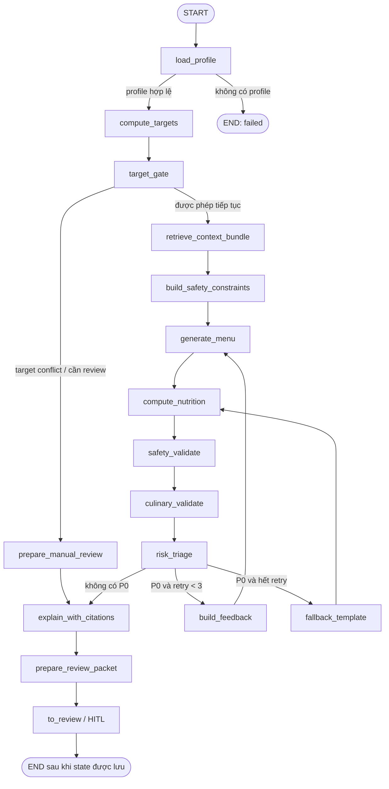

# Kiến trúc sinh thực đơn hiện tại

> Cập nhật: 2026-08-20 · Phạm vi: backend LangGraph, CP-SAT, Gemini selector, validator và API hiện có.

## 1. Tóm tắt

Hệ thống hiện dùng mô hình hybrid an toàn:

- Luật lâm sàng, tính mục tiêu, tính dinh dưỡng và kiểm định đều deterministic.
- CP-SAT là bộ sinh chính, dùng OR-Tools để tìm tổ hợp thỏa ràng buộc.
- Gemini chỉ là nhánh fallback khi CP-SAT không tạo được thực đơn hoặc graph đã có feedback kiểm định.
- Gemini chỉ nhận catalog món đã lọc và chỉ được trả `dish_id` theo slot; không được trả gram hay số dinh dưỡng.
- Mọi thực đơn mới đều được tính lại dinh dưỡng và kiểm định trước khi đưa vào review.
- Graph dừng ở HITL `to_review`; không tự public cho bệnh nhân.

## 2. Execution flow



Graph chính được định nghĩa tại `src/agents/graph.py`. Khi cấu hình checkpointer và `interrupt_for_hitl=True`, graph dừng ngay trước `to_review` để API lưu bản nháp và chờ chuyên gia.

## 3. Trách nhiệm từng node

| Node | Vai trò chính | LLM? | State đầu ra quan trọng |
|---|---|:---:|---|
| `load_profile` | Nạp hồ sơ, tạo `run_id`, hash snapshot, version | Không | `profile`, `profile_snapshot_hash`, `status` |
| `compute_targets` | Tính mục tiêu từ rule đã verify; chạy shadow inventory để ghi conflict | Không | `targets`, `target_conflicts`, `shadow_target_conflicts`, `unverified_rule_ids` |
| `target_gate` | Chặn target conflict thật; rule chưa verify trở thành finding P1 | Không | `safety_findings`, `target_gate_reasons`, `manual_review_required` nếu cần |
| `retrieve_context_bundle` | Lọc ứng viên theo dị ứng, bệnh lý, dislike, nguồn dữ liệu; rút gọn top-K | Không | `candidate_ids`, `food_data_version` |
| `build_safety_constraints` | Tạo exclusions, interaction đã verify, unresolved medications và hard nutrient bounds | Không | `safety_constraints`, `interaction_version` |
| `generate_menu` | Gọi `generate_options(max_options=3)` nếu generator hỗ trợ; chọn option đầu làm draft hiện tại | Có điều kiện | `draft_menu`, `menu_options`, `menu_hash`, `attempt_history` |
| `compute_nutrition` | Tính kcal/protein/carb/fat/fiber/natri từ server-side repository | Không | `computed_nutrition`, `nutrition_hash`, `violations` |
| `safety_validate` | Kiểm tra clinical rules, allergy, drug-food, medication timing | Không | `safety_findings`, `violations`, `feedback` |
| `culinary_validate` | Kiểm tra cấu trúc bữa Việt, vai trò món, vùng miền, món tối ưu tiên cơm | Không | culinary findings P0/P1/P2 |
| `risk_triage` | Chọn mức cao nhất theo P0 > P1 > P2 | Không | `highest_risk` |
| `build_feedback` | Chuyển lỗi deterministic thành feedback cho lần sinh kế tiếp | Không | `feedback` |
| `fallback_template` | Dùng template an toàn khi hết retry; không kết thúc trực tiếp | Không | draft fallback, `used_fallback` |
| `explain_with_citations` | Gom guideline refs/evidence refs, không bịa citation | Không | `citations`, expert explanation |
| `prepare_review_packet` | Sắp xếp finding P0 trước và xác định `can_approve` | Không | `review_packet` |
| `to_review` | Điểm dừng Human-in-the-Loop | Không | `status=pending_review` |

## 4. Luồng CP-SAT và Gemini

### CP-SAT

- Code: `src/agents/optimizer.py`.
- Nhận các ứng viên đã lọc, mục tiêu lâm sàng và món Việt đã chuẩn bị.
- Tạo tối đa 3 phương án bằng no-good cut, mỗi phương án có composition khác nhau.
- Không dùng LLM, không tự phát minh món, không trả số dinh dưỡng.
- `HybridMenuGenerator.generate_options()` ưu tiên delegate trực tiếp cho CP-SAT.

### Gemini

- Code: `src/services/gemini_dish_selector.py`.
- Chỉ nhận catalog dạng `dish_id | tên món | role | slot | region`.
- Chọn đúng một `dish_id` cho mỗi slot; server dựng lại recipe grams từ `dish_ingredients`.
- Không nhận hoặc trả `food_id`, gram, kcal, protein, đường, natri.
- Được gọi khi CP-SAT vô nghiệm hoặc khi hybrid nhận feedback từ validator.

### Điểm kiểm soát bắt buộc

```text
candidate filtering
    -> hard safety constraints
    -> CP-SAT/Gemini selection
    -> server nutrition recomputation
    -> clinical + culinary validation
    -> risk triage
    -> HITL review
```

## 5. State và retry

`NutriState` trong `src/agents/state.py` là nguồn sự thật duy nhất. Các trường quan trọng:

- Identity/audit: `run_id`, `trace_id`, version hashes, `audit_events`, `node_timings_ms`.
- Generation: `draft_menu`, `menu_options`, `attempt_history`, `retry_count`, `generation_source`.
- Safety: `safety_constraints`, `violations`, `safety_findings`, `highest_risk`.
- HITL: `review_packet`, `status`, `reviewer_id`, `approved_menu_version`.

Khi retry hoặc fallback tạo draft mới, các artifact cũ (`computed_nutrition`, `nutrition_hash`, `violations`, `feedback`) được reset để không trộn state giữa các lần thử.

## 6. Trạng thái API/UI hiện tại

- Graph và generator đã có dữ liệu `menu_options` tối đa 3 phương án.
- Luồng API hiện vẫn chọn `draft_menu = menu_options[0]` để giữ tương thích schema cũ.
- Vì vậy UI production hiện hiển thị một phương án; để hiển thị 3 phương án cần versioned API/UI contract và validate/recompute riêng từng option.
- Recompute khi chuyên gia sửa gram chạy downstream-only: `compute_nutrition -> safety_validate -> culinary_validate -> risk_triage -> explain_with_citations -> prepare_review_packet`.

## 7. Các giới hạn cần biết

- `src/rag/` chưa có pipeline ingest/vector retrieval hoàn chỉnh; citation hiện tại là rule/evidence đã có trong state. Assistant mới chỉ trả lời grounded khi được cung cấp chunk từ `guideline_chunks`.
- Durable worker/scheduler production chưa được nối vào hạ tầng; `src/agents/worker.py` cung cấp runner contract không phụ thuộc request.
- CP-SAT/Gemini không thay thế phê duyệt chuyên gia. `approved` và hash menu/dinh dưỡng không đổi mới đủ điều kiện publish.

