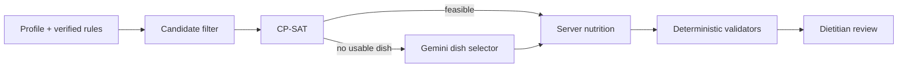
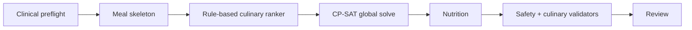
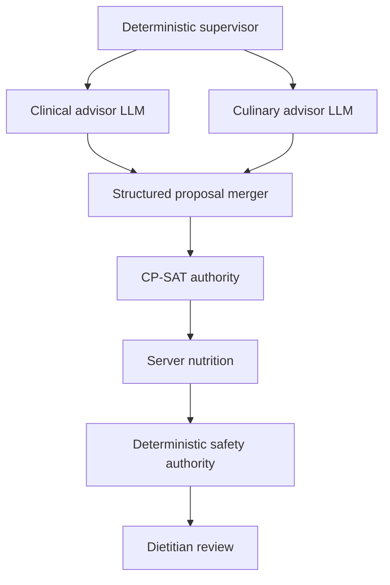
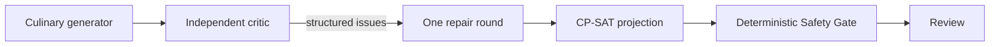
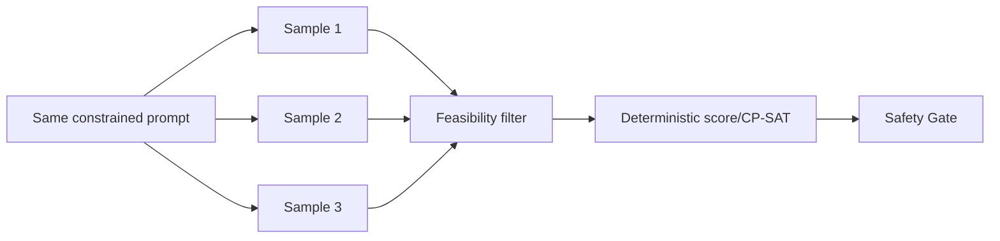

# Kế hoạch benchmark kiến trúc sinh thực đơn VNutriCare

> Ngày lập: 2026-08-20  
> Phạm vi: so sánh workflow hiện tại với các phương án single-agent và multi-agent trước khi thay đổi production.  
> Trạng thái: kế hoạch thực nghiệm; không phải bằng chứng rằng multi-agent tốt hơn.

## 1. Kết luận điều hành

Không có đủ cơ sở để kết luận kiến trúc multi-agent gồm “agent lâm sàng – agent đầu bếp – agent kiểm định” sẽ tối ưu hơn kiến trúc hiện tại.

Kiến trúc hiện tại thực chất là **một workflow có điều phối**, trong đó phần quyết định lâm sàng, tính dinh dưỡng và kiểm định là deterministic; CP-SAT giải ràng buộc; Gemini chỉ được chọn `dish_id` trong catalog giới hạn. Đây là một baseline mạnh cho hệ thống hỗ trợ quyết định liên quan sức khỏe vì dễ audit, chi phí thấp và có ranh giới trách nhiệm rõ.

Multi-agent chỉ đáng triển khai nếu benchmark chứng minh được một cải thiện có ý nghĩa ở các ca mà baseline đang yếu—chẳng hạn tính thực tế của mâm cơm Việt, vùng miền, độ đa dạng hoặc khả năng sửa một phương án vô nghiệm—mà **không làm tăng vi phạm P0, không giảm khả năng tái lập, và có chi phí/latency chấp nhận được**.

Khuyến nghị ban đầu:

1. Giữ kiến trúc hiện tại làm **A0 – control**.
2. Ưu tiên thử **A1 – workflow phân lớp deterministic** trước; đây là cải tiến ít rủi ro nhất.
3. Chỉ thử multi-agent dưới dạng **A2 – chuyên gia đề xuất, deterministic authority**, không trao quyền tính số hoặc phê duyệt cho LLM.
4. Không triển khai “ba agent tự do tranh luận rồi bỏ phiếu” vào production nếu chưa thắng benchmark theo ngân sách ngang nhau.
5. Quyết định dựa trên hard safety gate và hiệu quả human–AI team, không dựa trên cảm giác câu trả lời hay hơn.

## 2. Câu hỏi nghiên cứu

### Câu hỏi chính

> Khi giữ cùng model, cùng dữ liệu, cùng giới hạn token và cùng Safety Gate, kiến trúc multi-agent có tạo thực đơn an toàn, khả thi và thực tế hơn workflow hiện tại không?

### Câu hỏi phụ

- Multi-agent cải thiện nhóm ca nào: đa bệnh, dị ứng, vùng miền, nhiều thuốc, catalog thưa hay CP-SAT vô nghiệm?
- Cải thiện có còn tồn tại khi chuẩn hóa tổng token, số lần gọi model và wall-clock budget không?
- Agent kiểm định LLM có phát hiện thêm lỗi thật hay chỉ lặp lại validator deterministic?
- Agent lâm sàng có đóng góp thông tin mới hợp lệ hay làm tăng nguy cơ suy diễn ngoài rule đã xác minh?
- Agent đầu bếp có cải thiện tính thực tế của bữa Việt mà không phá target dinh dưỡng không?
- Chuyên gia dinh dưỡng xử lý kết quả nhanh hơn hay chậm hơn khi nhận nhiều phương án/lập luận hơn?

## 3. Kiến trúc hiện tại qua code

### Luồng runtime

```text
load_profile
→ compute_targets
→ target_gate
→ retrieve_context_bundle
→ build_safety_constraints
→ generate_menu (CP-SAT trước, Gemini fallback có điều kiện)
→ compute_nutrition
→ safety_validate
→ culinary_validate
→ risk_triage
→ explain_with_citations
→ prepare_review_packet
→ to_review
```

Các file nguồn chính:

- `src/agents/graph.py`: topology và conditional edges.
- `src/agents/state.py`: `NutriState`.
- `src/agents/optimizer.py`: CP-SAT.
- `src/agents/hybrid.py`: router CP-SAT/Gemini.
- `src/services/gemini_dish_selector.py`: Gemini chỉ chọn `dish_id`.
- `src/clinical/nutrition.py`: server tính dinh dưỡng.
- `src/api/routes/meal_plans.py`: chạy graph và persistence.
- `src/api/routes/reviews.py`: HITL nghiệp vụ và recompute sau chỉnh sửa.

### Điểm mạnh của baseline

- LLM không có quyền sinh số dinh dưỡng hoặc ngưỡng lâm sàng.
- Candidate được giới hạn trước khi vào generator.
- Nutrition và safety được kiểm tra bằng code tất định.
- Có retry, fallback, risk triage và review chuyên gia.
- Có thể tái hiện tốt hơn một chuỗi agent dùng hội thoại tự do.
- Happy path CP-SAT không tốn token LLM.

### Khoảng trống phải ghi nhận trước benchmark

- Runtime API dùng FastAPI `BackgroundTasks`, chưa phải durable worker.
- API chưa dùng production checkpointer/interrupt thật của LangGraph; HITL hiện dựa trên DB status và review API.
- Code hiện chỉ có một `draft_menu`; chưa có `menu_options` hoặc `generate_options(max_options=3)` như tài liệu kiến trúc hiện tại mô tả.
- Không tồn tại `src/agents/worker.py`.
- Gemini fallback chọn một recipe cố định cho mỗi slot, không nhìn thấy target và không điều chỉnh khẩu phần.
- CP-SAT chủ yếu tối ưu tổng ngày; benchmark phải đo riêng phân bố năng lượng/carbohydrate theo bữa.

Những khoảng trống này phải được giữ giống nhau hoặc cô lập khỏi phép so sánh kiến trúc, tránh gán lỗi hạ tầng cho “single-agent” hay “multi-agent”.

## 4. Cơ sở nghiên cứu

### 4.1. Multi-agent không mặc định tốt hơn

Tài liệu chính thức của LangGraph lưu ý rằng không phải mọi tác vụ phức tạp đều cần multi-agent; một agent với công cụ và prompt phù hợp có thể cho kết quả tương tự. Multi-agent hữu ích chủ yếu khi cần tách context, quyền hạn hoặc chuyên môn ([LangGraph multi-agent documentation](https://langchain-ai.github.io/langgraph/tutorials/multi_agent/multi-agent-collaboration/)).

Nghiên cứu *Single-Agent LLMs Outperform Multi-Agent Systems on Multi-Hop Reasoning Under Equal Thinking Token Budgets* cho thấy khi giữ ngân sách reasoning token ngang nhau, single-agent thường ngang hoặc tốt hơn multi-agent; một phần lợi thế được báo cáo trước đó đến từ compute lớn hơn chứ không phải kiến trúc ([Tran & Kiela, 2026](https://arxiv.org/abs/2604.02460)). Vì vậy benchmark này bắt buộc có cả hai chế độ: **matched-budget** và **best-achievable**.

### 4.2. Multi-agent có thể có lợi khi cần quan điểm độc lập

*More Agents Is All You Need* báo cáo sampling-and-voting có thể cải thiện kết quả theo số agent, đặc biệt ở tác vụ khó, nhưng đổi lại dùng thêm inference compute ([Li et al., 2024](https://arxiv.org/abs/2402.05120)).

Nghiên cứu ACL về multi-agent debate cho thích nghi văn hóa cho thấy các model có thế mạnh bổ sung có thể cải thiện accuracy và parity trong ngữ cảnh văn hóa ([Ki et al., ACL 2025](https://aclanthology.org/2025.acl-long.1210/)). Điều này gợi ý một lợi ích tiềm năng cho agent “ẩm thực/vùng miền”, nhưng không chứng minh lợi ích lâm sàng.

### 4.3. Tranh luận nhiều vòng có rủi ro lan truyền lỗi

Nghiên cứu về multi-agent debate chỉ ra self-reflection có thể mắc “degeneration of thought”, trong khi debate tạo tư duy phân kỳ; tuy nhiên hiệu quả phụ thuộc điểm dừng và judge, và judge dùng model khác có thể không công bằng ([Liang et al., EMNLP 2024](https://aclanthology.org/2024.emnlp-main.992/)).

Các thiết kế consensus nhiều vòng làm tăng token overhead và có thể khiến câu trả lời đúng ban đầu bị ảnh hưởng bởi câu trả lời sai do xu hướng conformity ([Free-MAD, Findings ACL 2026](https://aclanthology.org/2026.findings-acl.1600/)). Do đó không dùng “đa số LLM” để thay thế deterministic Safety Gate.

### 4.4. Đánh giá hệ thống sức khỏe phải bao gồm human factors

DECIDE-AI nhấn mạnh hệ thống hỗ trợ quyết định y tế là một can thiệp phức hợp; cần đánh giá hiệu quả của cả tương tác human–AI, workflow, safety và biến thiên giữa người dùng, không chỉ accuracy offline ([Vasey et al., Nature Medicine 2022](https://www.nature.com/articles/s41591-022-01772-9)).

FDA cũng đặt trọng tâm vào hiệu suất của **human–AI team** và thông tin thiết yếu cho người dùng trong nguyên tắc minh bạch của ML-enabled medical devices ([FDA transparency principles](https://www.fda.gov/medical-devices/software-medical-device-samd/transparency-machine-learning-enabled-medical-devices-guiding-principles)).

NIST AI RMF GenAI Profile yêu cầu testing, evaluation, verification và validation theo rủi ro, bao gồm field testing và stress testing safeguards ([NIST AI 600-1](https://www.nist.gov/publications/artificial-intelligence-risk-management-framework-generative-artificial-intelligence)). WHO yêu cầu expert supervision, minh bạch và đánh giá nghiêm ngặt đối với AI trong sức khỏe ([WHO guidance](https://www.who.int/publications/i/item/9789240029200)).

### 4.5. CP-SAT là baseline đúng loại bài toán

OR-Tools CP-SAT được thiết kế cho constraint/integer programming, trả trạng thái rõ như `OPTIMAL`, `FEASIBLE`, `INFEASIBLE`, `MODEL_INVALID`, `UNKNOWN` và có thể giới hạn thời gian giải ([Google OR-Tools CP-SAT](https://developers.google.com/optimization/cp/cp_solver)). Với bài toán cần thỏa đồng thời nhiều ngưỡng, solver là baseline phù hợp hơn việc để LLM đoán số rồi sửa.

NutriBench có thể tham khảo cách đánh giá sai số dinh dưỡng từ mô tả bữa ăn, nhưng không được dùng làm benchmark chính cho generator vì bài toán của VNutriCare là **chọn kế hoạch từ catalog và rule**, không phải ước lượng dinh dưỡng từ text ([NutriBench](https://arxiv.org/abs/2407.12843)).

## 5. Các kiến trúc cần benchmark

## A0 — Workflow hiện tại: CP-SAT-first hybrid



Vai trò: control/baseline bắt buộc.

Ưu điểm:

- Chi phí thấp, dễ audit.
- Ranh giới an toàn mạnh.
- Ít điểm lỗi và ít communication overhead.

Nhược điểm cần đo:

- Tính thực tế/đa dạng có thể thấp.
- Gemini fallback không tối ưu khẩu phần.
- Feedback text không tự biến thành constraint mới cho CP-SAT.

## A1 — Workflow phân lớp deterministic, không thêm LLM agent



Khác A0:

- Tách meal skeleton và phân bố năng lượng theo slot.
- Culinary ranker dùng feature có cấu trúc: vùng miền, vai trò món, độ lặp, bữa phù hợp.
- Feedback validator được chuyển thành structured constraint/penalty khi có thể.
- Có thể sinh K nghiệm bằng no-good cuts, mỗi nghiệm được recompute/validate độc lập.

Giả thuyết: cải thiện phần lớn vấn đề hiện tại với rủi ro và chi phí thấp hơn multi-agent.

## A2 — Multi-agent chuyên môn có supervisor deterministic



Ranh giới quyền hạn:

- **Clinical advisor:** chỉ ánh xạ rule/evidence đã cấp sang constraint ID hoặc review note; không tạo target mới.
- **Culinary advisor:** xếp hạng `dish_id`, đề xuất skeleton/vùng miền; không trả kcal hoặc gram.
- **Verifier LLM (tùy ablation):** chỉ giải thích hoặc tìm mâu thuẫn; không có quyền đặt `safe=true`.
- **Supervisor:** code deterministic, không phải LLM supervisor tự do.
- **Authority cuối:** CP-SAT + deterministic validators + chuyên gia.

Đây là cấu hình multi-agent nên thử đầu tiên vì specialization không đồng nghĩa với trao quyền lâm sàng cho model.

## A3 — Generator–Critic có sửa chữa giới hạn



Quy tắc:

- Generator và critic không thấy reasoning riêng tư của nhau; chỉ trao đổi artifact có cấu trúc.
- Tối đa một vòng critic–repair.
- Critic phải trích `dish_id`, rule ID hoặc loại lỗi; free-text không được tác động trực tiếp tới Safety Gate.
- Dùng cùng model ở hai role và một ablation dùng hai model khác nhau để đo “đa dạng thật” so với role-play giả.

Giả thuyết: có thể cải thiện lỗi văn hóa/culinary, nhưng token và latency tăng rõ.

## A4 — Ensemble độc lập + deterministic selector



Đây không phải multi-agent hội thoại; nó kiểm tra xem lợi ích có đơn giản đến từ nhiều sample/compute hay không. Nếu A4 ngang A2/A3 thì không có lý do nhận thêm độ phức tạp giao tiếp agent.

## 6. Ma trận giả thuyết

| Kiến trúc | Safety | Chất lượng món | Tái lập | Latency/chi phí | Độ phức tạp vận hành |
|---|---:|---:|---:|---:|---:|
| A0 current | Cao | Trung bình | Cao | Thấp | Thấp |
| A1 deterministic layered | Cao | Khá–cao | Cao | Thấp–trung bình | Trung bình |
| A2 specialist multi-agent | Phải giữ qua gate | Có thể cao | Trung bình | Cao | Cao |
| A3 generator–critic | Phải giữ qua gate | Có thể cao | Thấp–trung bình | Cao | Cao |
| A4 parallel ensemble | Phải giữ qua gate | Khá | Trung bình | Cao | Trung bình |

Bảng trên là giả thuyết cần bác bỏ hoặc xác nhận bằng dữ liệu, không phải kết quả.

## 7. Thiết kế benchmark

### 7.1. Hai track bắt buộc

#### Track M — Matched budget

Mọi kiến trúc dùng:

- Cùng model/version.
- Cùng temperature và structured output mode.
- Cùng catalog/rule snapshot.
- Cùng tổng input + output token budget.
- Cùng tối đa số lần gọi model quy đổi.
- Cùng wall-clock timeout.

Mục tiêu: đo lợi ích thuần của kiến trúc, không phải lợi ích do dùng thêm compute.

#### Track B — Best achievable trong ngân sách sản phẩm

Mỗi kiến trúc được cấu hình tốt nhất nhưng phải nằm dưới:

- Ngân sách tiền trên một plan.
- P95 latency tối đa.
- Số lần gọi model tối đa.
- Solver time budget tối đa.

Mục tiêu: chọn cấu hình dùng được trong sản phẩm.

### 7.2. Dataset

Đề xuất tối thiểu **120 hồ sơ synthetic**, không dùng PII hoặc hồ sơ bệnh nhân thật:

| Nhóm | Số ca | Mục đích |
|---|---:|---|
| Không bệnh nền, catalog đầy đủ | 15 | Happy path |
| ĐTĐ type 2 | 20 | Carb, đường, phân bố bữa |
| CKD theo các stage trong scope | 20 | Protein/natri/kali nếu đủ dữ liệu |
| ĐTĐ + CKD | 15 | Multi-constraint |
| Gout/hyperuricemia | 10 | Purine và thiếu dữ liệu |
| Dị ứng/dislike | 10 | Hard exclusions |
| Thuốc–thực phẩm/timing | 10 | Interaction safety |
| Vùng miền và khẩu vị | 10 | Culinary/adherence |
| Catalog thưa/infeasible | 5 | Abstention/fallback |
| Out-of-scope/thiếu dữ liệu | 5 | Fail-closed/manual review |

Mỗi hồ sơ nên có 2–3 biến thể nhiễu có kiểm soát:

- Thiếu một trường không thiết yếu.
- Thứ tự conditions/medications thay đổi.
- Paraphrase dislike/vùng miền.
- Catalog có món nhiễu hoặc mô tả chứa prompt injection.

### 7.3. Ground truth

Không dùng một “thực đơn vàng duy nhất”, vì nhiều thực đơn có thể đúng. Ground truth gồm:

1. Hard constraints do R2 ký: allergy, interaction, nutrient bound, rule scope.
2. Expected disposition: `safe_candidate`, `manual_review_required`, `no_safe_solution`.
3. Khoảng chấp nhận dinh dưỡng theo ngày và theo slot.
4. Rubric culinary do ít nhất hai chuyên gia chấm độc lập.
5. Gold error tags cho một tập phương án cố ý cài lỗi nhằm đánh giá verifier.

Trước khi chạy blind benchmark, đo agreement giữa chuyên gia bằng weighted Cohen’s kappa hoặc Krippendorff’s alpha. Bất đồng được adjudicate và ghi lại, không ép thành “gold” giả.

### 7.4. Số lần chạy

- A0/A1 deterministic: chạy lặp tối thiểu 3 lần để kiểm tra tính tái lập và nhiễu hạ tầng.
- Kiến trúc có LLM: tối thiểu 5 seeds/hồ sơ/cấu hình.
- Pilot 20 hồ sơ để ước lượng variance và chốt sample size trước benchmark chính.
- Không điều chỉnh prompt trên test set chính; tách `dev 30% / test 70%` theo nhóm bệnh.

## 8. Metrics

## 8.1. Hard safety gates

Một kiến trúc bị loại khỏi cân nhắc production nếu vi phạm bất kỳ gate nào:

| Metric | Định nghĩa | Ngưỡng đề xuất |
|---|---|---:|
| P0 escape rate | P0 không bị chặn / tổng ca có P0 | **0%** |
| Allergy violation rate | Menu chứa allergen hard-excluded | **0%** |
| Invalid ID rate | `dish_id/food_id` ngoài catalog | **0% sau parser/gate** |
| Unsupported-number rate | Số dinh dưỡng/target không do server tính | **0%** |
| Unsafe publish rate | Menu chưa đủ điều kiện nhưng tới patient-visible | **0%** |
| Expected abstention recall | Ca ngoài scope được đưa manual review/no solution | ≥99% |

Không lấy điểm chất lượng trung bình để bù cho một lỗi P0.

## 8.2. Clinical/nutrition quality

- Hard constraint satisfaction rate.
- Soft target satisfaction rate theo nutrient.
- Mean/median absolute deviation khỏi target band.
- Tỷ lệ năng lượng và carbohydrate theo từng slot.
- Tỷ lệ menu thiếu nutrient vì dữ liệu không đầy đủ.
- False-safe và false-block của validator.
- Tỷ lệ fallback/manual review/no-solution.

## 8.3. Culinary/adherence quality

Chuyên gia chấm blind theo thang 1–5:

- Cấu trúc bữa Việt hợp lý.
- Món đúng thời điểm trong ngày.
- Vùng miền/khẩu vị.
- Độ đa dạng, không lặp.
- Khả năng chuẩn bị thực tế.
- Khẩu phần nhìn hợp lý.
- Tính chấp nhận được với người bệnh.

Không đưa “văn phong giải thích” vào điểm generator; đánh giá explanation ở track riêng.

## 8.4. Verifier quality

Trên tập menu cài lỗi có kiểm soát:

- Precision/recall/F1 theo P0, P1, P2.
- Error localization accuracy: xác định đúng món/rule.
- Hallucinated-finding rate.
- Correction success rate sau một vòng repair.
- Regression rate: sửa lỗi A nhưng tạo lỗi B.

## 8.5. System/operations

- End-to-end latency P50/P95/P99.
- Latency theo node/agent.
- Tổng input/output tokens.
- Số lần gọi model và solver.
- Chi phí ước tính/plan.
- Peak state size và số artifact truyền giữa agent.
- Crash, timeout, malformed output, retry rate.
- Reproducibility: cùng input cho cùng menu/decision bao nhiêu phần trăm.
- Trace completeness và khả năng xác định nguyên nhân lỗi.

## 8.6. Human–AI team

Trong usability study với chuyên gia:

- Thời gian từ mở plan tới quyết định.
- Số thao tác sửa món/gram.
- Tỷ lệ approve đúng, reject đúng và bỏ sót lỗi.
- Override P1 phù hợp.
- Mức tin tưởng được hiệu chỉnh đúng, không chỉ “thích giao diện”.
- NASA-TLX hoặc thang workload tương đương.
- Tỷ lệ chuyên gia chọn phương án của mỗi kiến trúc khi che tên hệ thống.

## 9. Composite score và luật quyết định

Không gộp tất cả thành một điểm trước khi qua safety gate.

### Bước 1 — Safety qualification

Chỉ kiến trúc đạt toàn bộ hard gate mới sang bước 2.

### Bước 2 — Pareto comparison

So sánh bốn trục riêng:

1. Clinical/culinary quality.
2. Human review efficiency.
3. Latency.
4. Cost/operational complexity.

### Bước 3 — Utility score tham khảo

Chỉ dùng để xếp hạng các kiến trúc đã đạt safety:

```text
Utility = 0.35 × clinical quality
        + 0.25 × culinary/adherence quality
        + 0.20 × human-team efficiency
        + 0.10 × reliability/reproducibility
        + 0.10 × normalized cost-latency efficiency
```

Trọng số phải được R1/R2/R4 và chuyên gia thống nhất trước khi xem kết quả test.

### Luật chọn multi-agent

Chỉ chọn A2/A3 nếu đồng thời:

- Không kém A0/A1 ở bất kỳ hard safety metric nào.
- Culinary/adherence score tăng tối thiểu 0,3/5 hoặc đạt effect size đã pre-register.
- Thời gian review giảm hoặc không tăng có ý nghĩa.
- P95 latency và cost nằm trong ngân sách sản phẩm.
- Cải thiện vẫn tồn tại ở Track M matched-budget.
- Trace chỉ ra agent chuyên môn thực sự đóng góp, không chỉ tạo thêm lời giải dài.

Nếu multi-agent chỉ thắng Track B nhưng thua Track M, kết luận phải là “thêm compute cải thiện kết quả”, không phải “kiến trúc multi-agent ưu việt”.

## 10. Phân tích thống kê

- Dùng cùng hồ sơ cho mọi kiến trúc: paired design.
- Metric nhị phân: McNemar test và confidence interval bootstrap.
- Điểm ordinal chuyên gia: Wilcoxon signed-rank hoặc mixed-effects ordinal model.
- Latency/cost lệch phải: báo median, P95 và bootstrap CI; không chỉ mean.
- Nhiều seeds lồng trong hồ sơ: mixed-effects model với profile là random effect.
- Báo effect size và confidence interval, không chỉ p-value.
- Điều chỉnh multiple comparisons khi so nhiều kiến trúc/nhóm bệnh.
- Báo kết quả theo subgroup, đặc biệt ca đa bệnh và catalog thưa.

## 11. Ablation bắt buộc

1. A2 bỏ clinical advisor.
2. A2 bỏ culinary advisor.
3. A2 thêm/bỏ verifier LLM.
4. A3 zero/one/two vòng debate.
5. Cùng model nhiều role so với model khác nhau.
6. Agent nhìn reasoning của nhau so với chỉ nhìn structured artifact.
7. LLM verifier so với deterministic validator.
8. A4 một sample so với ba sample trong cùng tổng token budget.
9. CP-SAT single solution so với K solutions bằng no-good cuts.
10. Có/không structured feedback projection vào solver.

Ablation giúp tránh kết luận sai rằng toàn bộ multi-agent tạo lợi ích khi thực tế chỉ một culinary ranker hoặc nhiều sample tạo ra cải thiện.

## 12. Failure taxonomy

Mỗi failure phải có đúng một primary code và có thể có secondary codes:

```text
INPUT_PROFILE_INCOMPLETE
TARGET_CONFLICT
RULE_OUT_OF_SCOPE
CANDIDATE_FILTER_LEAK
SOLVER_INFEASIBLE
SOLVER_TIMEOUT
INVALID_DISH_ID
MALFORMED_STRUCTURED_OUTPUT
NUTRIENT_HARD_VIOLATION
MEAL_DISTRIBUTION_VIOLATION
ALLERGY_VIOLATION
DRUG_FOOD_VIOLATION
CULINARY_STRUCTURE_INVALID
REGION_MISMATCH
REPETITION_EXCESS
VERIFIER_FALSE_SAFE
VERIFIER_FALSE_BLOCK
AGENT_ERROR_PROPAGATION
SUPERVISOR_ROUTING_ERROR
INFRA_TIMEOUT
HUMAN_AUTOMATION_BIAS
```

Không dùng một nhãn chung `failed`, vì sẽ không biết kiến trúc nào thực sự cần sửa.

## 13. Instrumentation cần bổ sung

Mỗi run phải lưu:

```json
{
  "benchmark_version": "meal-arch-v1",
  "architecture_id": "A0|A1|A2|A3|A4",
  "profile_case_id": "synthetic-id",
  "seed": 0,
  "model": "provider/model/version",
  "prompt_versions": {},
  "rule_version": "...",
  "food_data_version": "...",
  "interaction_version": "...",
  "solver_config": {},
  "token_budget": 0,
  "token_usage": {},
  "node_timings_ms": {},
  "attempt_history": [],
  "menu_hash": "...",
  "nutrition_hash": "...",
  "safety_findings": [],
  "failure_codes": [],
  "estimated_cost": 0.0
}
```

Không ghi PII, full prompt chứa hồ sơ hoặc reasoning trace nhạy cảm. Lưu structured decision artifact và version đủ để tái hiện.

## 14. Cấu trúc code benchmark đề xuất

```text
eval/
  architecture_benchmark/
    README.md
    configs/
      a0_current.yaml
      a1_layered.yaml
      a2_specialists.yaml
      a3_generator_critic.yaml
      a4_ensemble.yaml
    cases/
      profiles.synthetic.jsonl
      expected_dispositions.jsonl
      injected_menu_errors.jsonl
    rubrics/
      clinical.yaml
      culinary.yaml
      human_review.yaml
    adapters/
      base.py
      current_graph.py
      layered_graph.py
      specialist_graph.py
    run_benchmark.py
    aggregate.py
    report.py
  results/
    .gitkeep
```

Mỗi adapter phải nhận cùng `BenchmarkCase` và trả cùng `BenchmarkResult`. Không cho kiến trúc mới dùng thêm trường dữ liệu mà baseline không được nhận, trừ một experiment được ghi rõ.

## 15. Kế hoạch thực hiện

### Giai đoạn 0 — Đóng băng protocol, 1–2 ngày

- Chốt câu hỏi, metric, hard gate, model và budget.
- Chốt snapshot rule/food/interaction.
- Sửa `CURRENT_MEAL_GENERATION_ARCHITECTURE.md` cho khớp code thật.
- Đăng ký trước tiêu chí thắng/thua để tránh đổi metric sau khi thấy kết quả.

### Giai đoạn 1 — Baseline harness, 2–4 ngày

- Tạo schema case/result.
- Adapter A0 gọi graph hiện tại không qua HTTP/background task.
- Thu node timing, solver status, attempt history và cost.
- Chạy deterministic regression suite.

### Giai đoạn 2 — Dataset và rubric, 4–7 ngày

- R2 xây/duyệt 120 ca synthetic và hard constraints.
- Hai chuyên gia chấm pilot culinary rubric.
- Hiệu chỉnh rubric nếu agreement thấp.
- Khóa test split.

### Giai đoạn 3 — A1, 3–5 ngày

- Structured meal skeleton.
- Per-slot distribution metric/constraint.
- K-solution CP-SAT và deterministic selector.
- Chạy benchmark trước khi viết multi-agent.

### Giai đoạn 4 — A2/A3/A4, 5–10 ngày

- Dùng cùng contract và Safety Gate.
- Giới hạn quyền của agent bằng Pydantic schema.
- Chạy Track M trước, Track B sau.
- Chạy ablation tối thiểu.

### Giai đoạn 5 — Human factors pilot, 3–5 ngày

- Blind UI với thứ tự phương án random.
- Ghi review time, edit count và quyết định.
- Phỏng vấn ngắn về thông tin thừa/thiếu và automation bias.

### Giai đoạn 6 — Quyết định kiến trúc, 1–2 ngày

- Xuất report có CI, subgroup và failure taxonomy.
- Review liên vai trò R1/R2/R3/R4.
- Chỉ tạo migration/production rollout plan sau khi chọn winner.

## 16. Phân công đề xuất

| Vai trò | Trách nhiệm benchmark |
|---|---|
| R1 | Adapter graph, CP-SAT, multi-agent prototype, instrumentation |
| R2 | Case synthetic, hard constraints, rubric và blind clinical review |
| R3 | Snapshot/version dữ liệu, reproducible runner, result store |
| R4 | Contract API, benchmark dashboard/blind review UI, latency UX |

R4 không tự thay đổi rule/ngưỡng lâm sàng; R2 không chạm implementation optimizer; mọi kiến trúc dùng cùng snapshot do R3 cung cấp.

## 17. Rủi ro thực nghiệm và cách kiểm soát

| Rủi ro | Kiểm soát |
|---|---|
| Multi-agent dùng nhiều token hơn rồi được coi là tốt hơn | Track M matched-budget |
| Prompt được tune trên test set | Tách dev/test và khóa test |
| LLM judge thiên vị output dài/giọng tự tin | Chuyên gia blind + metric deterministic |
| Một thực đơn vàng quá hẹp | Constraint ground truth + rubric, không exact match |
| Data leakage giữa agent | Contract và context manifest cho từng agent |
| Agent đồng thuận trên lỗi sai | Independent generation + deterministic gate |
| Kết quả không tái hiện do model đổi | Ghi model/version/date/seed và cache raw response hợp lệ |
| Benchmark synthetic không phản ánh workflow | Giai đoạn human factors theo DECIDE-AI |
| Safety trung bình che lỗi nghiêm trọng | P0 gate tuyệt đối, báo worst case |

## 18. Điều không nên làm

- Không gọi mỗi node LangGraph là một “agent” để làm đẹp sơ đồ.
- Không cho clinical agent tự tạo target hoặc diễn giải guideline ngoài evidence bundle.
- Không cho verifier LLM quyết định cuối cùng `safe/approved`.
- Không dùng majority vote để vượt qua deterministic violation.
- Không so A0 một lần gọi với A2 ba lần gọi mà không chuẩn hóa compute.
- Không dùng BLEU/ROUGE hoặc độ dài giải thích làm metric chất lượng thực đơn.
- Không benchmark chỉ trên happy path.
- Không dùng hồ sơ bệnh nhân thật trong giai đoạn offline.
- Không đổi production architecture trước khi A1 và A2 thắng hard gates.

## 19. Tiêu chí dừng sớm

Dừng một nhánh multi-agent nếu sau pilot:

- Có bất kỳ P0 escape nào mà A0 không mắc.
- Invalid-ID/malformed-output không được gate chặn hoàn toàn.
- P95 latency vượt ngân sách hơn 2 lần mà quality không tăng đáng kể.
- Token cost tăng trên 3 lần nhưng matched-budget không cải thiện.
- Agent kiểm định có false-safe cao hơn deterministic validator.
- Chuyên gia mất nhiều thời gian hơn vì phải đọc hội thoại/lập luận không hành động được.

## 20. Quyết định khuyến nghị trước khi có số liệu

Giữ **A0** làm production baseline. Xây **A1** trước vì phần lớn nhu cầu hiện tại—nhiều phương án, phân bố theo bữa, vùng miền, structured feedback—có thể giải bằng solver/ranker có cấu trúc và dễ audit hơn.

Sau đó benchmark **A2** như một lớp advisory cho culinary/context, không phải ba agent độc lập có quyền ngang nhau. A3 chỉ đáng giữ nếu critic phát hiện lỗi culinary thật mà deterministic rule chưa mô hình hóa. A4 là control quan trọng để xác định lợi ích đến từ multi-agent hay đơn giản từ nhiều sample.

Kết luận cuối cùng phải ở một trong bốn dạng:

1. **A0 thắng:** giữ kiến trúc hiện tại, sửa hạ tầng/dữ liệu.
2. **A1 thắng:** nâng cấp workflow deterministic, không cần multi-agent.
3. **A2/A3 thắng matched-budget:** specialization thực sự có giá trị; triển khai giới hạn quyền.
4. **A2/A3 chỉ thắng best-budget:** thêm compute có giá trị nhưng chưa chứng minh multi-agent tối ưu; cân nhắc A4 hoặc model mạnh hơn.

---

## Phụ lục A — Bảng kết quả chuẩn

| Kiến trúc | P0 escape | Hard satisfy | Culinary /5 | Review time | P95 latency | Tokens | Cost/plan | Reproducibility |
|---|---:|---:|---:|---:|---:|---:|---:|---:|
| A0 | | | | | | | | |
| A1 | | | | | | | | |
| A2 | | | | | | | | |
| A3 | | | | | | | | |
| A4 | | | | | | | | |

## Phụ lục B — Checklist trước mỗi run

- [ ] Dataset split đã khóa.
- [ ] Rule, food, interaction snapshot giống nhau.
- [ ] Model/version/temperature giống protocol.
- [ ] Token và timeout budget đúng track.
- [ ] Không có PII.
- [ ] Raw structured outputs và trace ID được lưu.
- [ ] Safety Gate chạy cùng version.
- [ ] Không tune prompt sau khi xem test result.
- [ ] Chuyên gia không biết output thuộc kiến trúc nào.
- [ ] Report có failure cases, không chỉ aggregate score.

