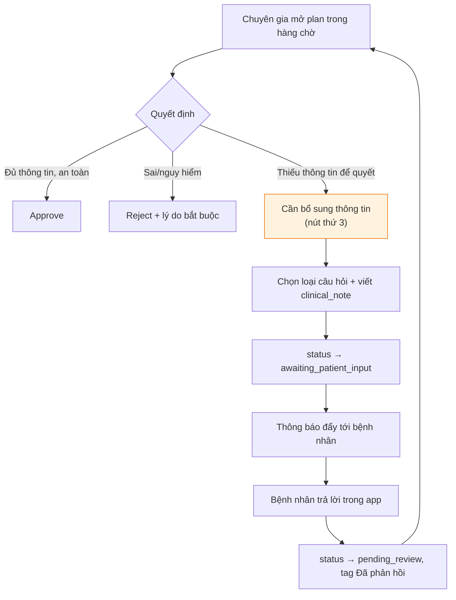
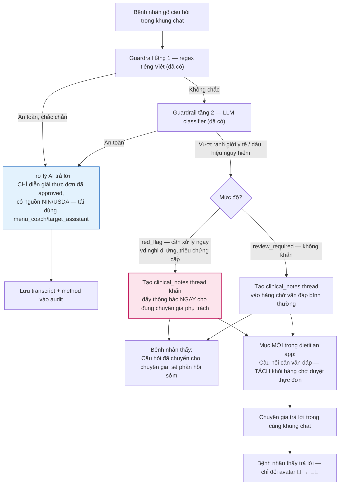
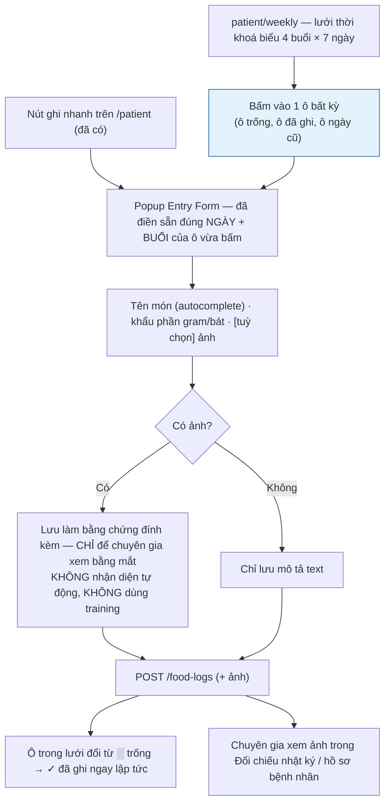
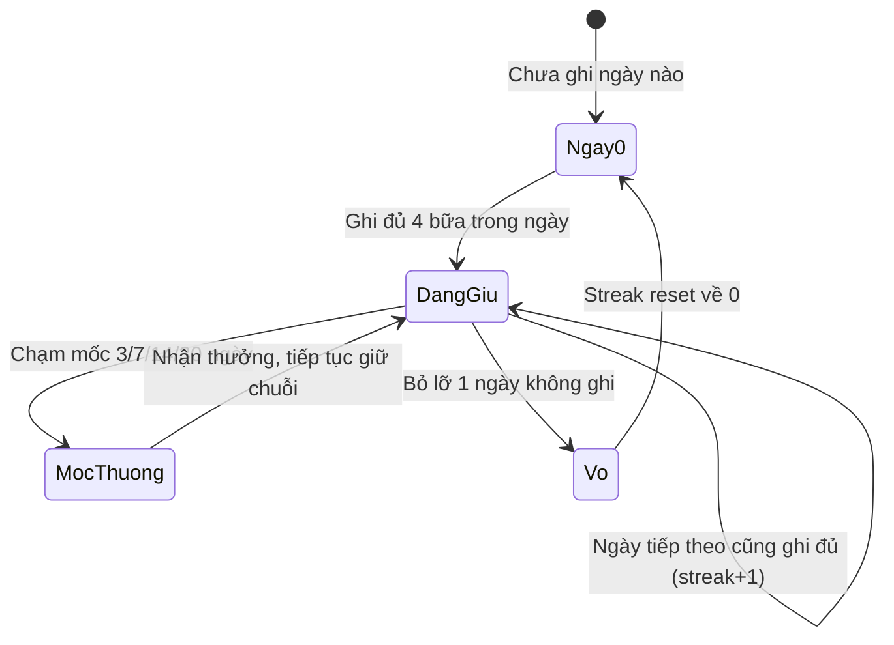

# Kim chỉ nam trải nghiệm bệnh nhân — VNutriCare

Ngày tạo: 2026-08-17
Tổng hợp từ: `docs/PRODUCTION_READINESS_MASTER_PLAN.md` (nền tảng production) + chuỗi quyết định thiết kế tính năng mới (chat trợ lý AI có leo thang, nhật ký ảnh, chỉ số cân nặng, lịch ghi nhận, streak, phần thưởng) + nguyên tắc mobile-first đã có trong `docs/FRONTEND_UI_UX_IMPROVEMENT_REPORT.md` §3.0.1 và `docs/ke-hoach-ui-ux-vnutricare-v2.md` §6.

> Tài liệu này trả lời 1 câu duy nhất: **"Tính năng nào làm trước, làm sau, và vì sao?"** — không lặp lại nội dung kỹ thuật hạ tầng (migration, hàng đợi, tổ chức B2B) đã có đầy đủ ở `PRODUCTION_READINESS_MASTER_PLAN.md`. Coi tài liệu đó là **nền móng**, tài liệu này là **tầng trải nghiệm** xây trên nền đó.
>
> **Quan hệ giữa 2 file:** `PRODUCTION_READINESS_MASTER_PLAN.md` đã hấp thụ bản tóm tắt của các tính năng F1–F8 vào đúng Chặng 3/4 và có mục riêng cho ứng dụng di động — đó là bản dùng để **lập kế hoạch và báo cáo tiến độ**. File này giữ **đặc tả chi tiết** (mermaid, mockup, ràng buộc từng tính năng) — dùng khi bắt tay vào code. Khi sửa 1 tính năng, sửa file này trước rồi cập nhật dòng tương ứng bên kia, tránh 2 nơi nói khác nhau.

---

## 0. Nguyên tắc chọn ưu tiên

Người ra quyết định đã chốt: **đơn giản và dễ dùng được ưu tiên hơn tính năng gây ấn tượng.** Cụ thể hoá thành 3 phép lọc, áp cho mọi tính năng bên dưới trước khi xếp độ ưu tiên:

1. **Giảm việc cho người bận trước, làm đẹp sau.** Chuyên gia dinh dưỡng không có nhiều thời gian — mọi tính năng giảm được số lần họ phải tự tay làm gì đó (duyệt lại, đọc từng bữa, trả lời câu hỏi lặp) xếp trên tính năng chỉ tăng mức độ hài lòng.
2. **Tính năng lâm sàng thật đứng trước tính năng giữ chân.** Cân nặng/BMI, ghi nhận bữa ăn là dữ liệu bác sĩ dùng để ra quyết định — ưu tiên hơn streak/phần thưởng, vốn chỉ có giá trị nếu tính năng lõi đã chạy tốt.
3. **Không tính năng nào được phép mở đường tắt qua RULE-1/2/3** (`CLAUDE.md` §2) — AI trợ lý không tự tính số, không tự đổi thực đơn, ảnh không tự nhận diện, mọi câu trả lời AI phải đi kèm khả năng leo thang cho người thật.

---

## 1. Bảng tổng hợp tính năng

| # | Tính năng | Độ phức tạp | Giá trị lâm sàng/vận hành | Ưu tiên | Gắn với chặng nào trong Production Plan |
|---|---|---|---|:-:|---|
| F1 | Nút "Cần bổ sung thông tin" trong hàng chờ duyệt | Thấp | Cao — đóng lỗ hổng an toàn hiện tại (chỉ có Approve/Reject nhị phân) | **P0** | Chặng 3 (`plan_approvals`) |
| F2 | Cơ chế tái sử dụng thực đơn đã duyệt (`plan_assignments`) | Trung bình | Cao — giải quyết đúng nỗi đau "chuyên gia bận" mà không bỏ HITL | **P0** | Chặng 4 |
| F3a | Chat trợ lý AI — trả lời câu hỏi an toàn (dựa trên plan đã duyệt, có nguồn) | Trung bình | Cao — giảm số câu hỏi lặp chuyên gia phải tự trả lời | **P1** | Chặng 3 (tái dùng guardrail đã có) |
| F3b | Leo thang "@ chuyên gia" khi AI không chắc / phát hiện rủi ro | Trung bình | Cao — an toàn, bắt buộc đi kèm F3a, không tách rời | **P0** (đi kèm F3a) | Chặng 4 (`clinical_notes`) |
| F4 | Chỉ số cân nặng / BMI theo thời gian | Thấp | Cao — dữ liệu lâm sàng thật, bảng đã có sẵn (`patient_observations`) | **P1** | Chặng 4 |
| 🆕 F4b | **Chỉ số xét nghiệm** — HbA1c, vòng eo, đường huyết, mỡ máu | Thấp (dùng lại bảng của F4) | **Cao** — HbA1c là bước 1 của thuật toán t-DNA; thiếu nó thì "cá thể hoá" dừng ở nhân trắc | **P1** | Chặng 2 (schema) + Chặng 4 (UI) |
| F5 | Thời khoá biểu bữa ăn (lưới 4 buổi × 7 ngày) + popup ghi nhận, có ảnh đính kèm (chỉ là log) | Trung bình | Trung bình-Cao — dễ đọc cho mọi lứa tuổi, tăng lượng dữ liệu nhật ký | **P1** | Chặng 4 |
| F6 | Chuỗi ngày liên tục (streak) | Thấp | Trung bình — chỉ có giá trị nếu F5 đã ổn định | **P2** | Chặng 4 (phụ, không có trong plan gốc) |
| F7 | Phần thưởng/huy hiệu (gamification) | Thấp | Thấp — thuần giữ chân, không ảnh hưởng quyết định lâm sàng | **P3** | Không thuộc chặng nào, làm sau cùng |
| F8 | Mobile-first / PWA cho toàn bộ giao diện bệnh nhân | Xuyên suốt, không phải 1 tính năng | Cao — theo đúng nguyên tắc đã chốt trước đó: *"Mobile là luồng chính của người bệnh"* | **Song song, bắt buộc với mọi F mới** | Không thuộc chặng nào — là ràng buộc thiết kế |

**Đọc bảng này thế nào:** làm theo đúng thứ tự P0 → P1 → P2 → P3. Trong cùng 1 mức ưu tiên, làm F đứng số nhỏ trước (F1 trước F2, v.v.) vì thường là điều kiện của F đứng sau.

---

## 2. Chi tiết từng tính năng

### F1 — Nút "Cần bổ sung thông tin"

**Vấn đề giải quyết:** hiện `dietitian/reviews` chỉ có Approve/Reject. Khi chuyên gia thiếu thông tin để quyết định (VD cần xác nhận dị ứng còn hiệu lực không), họ buộc phải Reject (mất công sinh lại) hoặc tự nhắn ngoài hệ thống (mất dấu vết).



**Việc cần làm:** thêm nút + trạng thái `awaiting_patient_input` vào `meal_plans`, dùng bảng `clinical_notes` có sẵn (chưa có dữ liệu, theo Production Plan §2), thêm banner phía bệnh nhân.

**Định nghĩa xong:** chuyên gia yêu cầu bổ sung → bệnh nhân nhận thông báo trong vòng hợp lý → trả lời → ca tự quay lại đầu hàng chờ với nhãn "Đã phản hồi".

---

### F2 — Tái sử dụng thực đơn đã duyệt

**Vấn đề giải quyết:** đây là câu trả lời chính thức cho lo ngại "chuyên gia không có thời gian duyệt mỗi ngày" — **không bỏ duyệt, giảm tần suất phải duyệt.**

Nguyên văn từ Production Plan mục 3: *"Hệ thống không tạo một thực đơn mới rồi tự duyệt. Nó chỉ tiếp tục áp dụng đúng thực đơn đã được duyệt khi bệnh nhân, thuốc, dị ứng, bệnh lý, mục tiêu và rule liên quan chưa thay đổi."*

**Việc cần làm (tầng UI):**
- Patient app: card "Thực đơn đang áp dụng" (đã có ở `/patient`) hiển thị thêm **hạn hiệu lực** và lý do nếu bị dừng tái sử dụng ("Chuyên gia cần xem lại vì hồ sơ đã đổi").
- Dietitian app: hàng chờ duyệt chỉ hiện các ca **thật sự cần quyết định mới** — không hiện lại các ngày chỉ đang tái áp dụng plan cũ. Cần 1 badge riêng "Tái sử dụng tự động" ở trang chi tiết bệnh nhân để chuyên gia vẫn thấy được nhưng không bị tính vào việc phải xử lý.

**Định nghĩa xong:** số lượt duyệt/tuần cho 1 bệnh nhân ổn định giảm rõ rệt so với hiện tại (mỗi ngày 1 lượt), chỉ còn duyệt khi có thay đổi thật.

---

### F3 — Khung chat trợ lý AI có leo thang

**Bối cảnh quyết định:** đã cân nhắc 2 hướng — chat tự do thời gian thực (Phương án A) và luồng hỏi-đáp gắn theo ngữ cảnh (Phương án B) — chốt theo hướng **giống chat về giao diện, nhưng có ngữ cảnh và có leo thang**, tái dùng đúng guardrail 2 tầng đã tồn tại ở `POST /api/v1/chat` (`src/agents/guardrail.py`) thay vì xây bộ lọc mới.



**3 ràng buộc bắt buộc — không thương lượng khi triển khai:**

1. AI **không được** tự đề xuất đổi món/thực đơn trực tiếp trong chat. Nếu bệnh nhân yêu cầu đổi món, AI trả lời hướng dẫn cách gửi yêu cầu qua đúng luồng sinh–duyệt (F2 ở trên), không tự thực hiện thay đổi (giữ RULE-3).
2. Khi guardrail không chắc, **mặc định leo thang**, không mặc định tự trả lời (nguyên tắc "an toàn thắng tiện lợi" đã có sẵn trong code guardrail).
3. Mục "Câu hỏi cần vấn đáp" của chuyên gia phải **tách khỏi** hàng chờ duyệt thực đơn (`dietitian/reviews`) — gộp chung sẽ làm loãng ưu tiên xử lý P0 lâm sàng.

**Định nghĩa xong:** ≥ 1 mức leo thang hoạt động thật (không phải câu trả lời tĩnh như hiện tại), có audit trail đầy đủ transcript + method, chuyên gia có nơi riêng để xử lý câu hỏi được leo thang.

---

### F4 — Chỉ số cân nặng / BMI theo thời gian

**Việc cần làm:** mục mới "Chỉ số của tôi" trong nav bệnh nhân (cạnh Hồ sơ), ghi vào bảng `patient_observations` đã tồn tại nhưng chưa dùng (theo Production Plan §2). Form nhập cân nặng, BMI tự tính từ chiều cao hồ sơ, không hỏi lại người dùng.

**Ràng buộc:** biểu đồ chỉ nối điểm khi có ≥ 2 số liệu thật; ngày trống để trống, không nội suy giả — đúng nguyên tắc "thiếu dữ liệu không được gọi là ổn định" ở Production Plan mục 8. Chuyên gia xem đúng dữ liệu này trong hồ sơ bệnh nhân — 1 nguồn, 2 nơi hiển thị.

#### 🆕 Mở rộng F4 sau khi rà nguồn lâm sàng (R2, 17/08/2026)

Hội thảo t-DNA 16/08 cho thấy cân nặng/BMI **chưa đủ** để theo dõi một bệnh nhân ĐTĐ2. Bổ sung, xếp theo ưu tiên:

| Chỉ số | Ai nhập | Vì sao cần | Ưu tiên |
|---|---|---|:-:|
| **HbA1c** | Chuyên gia (từ kết quả XN) | Là **bước 1** của thuật toán t-DNA — không có nó thì không phân tầng được mục tiêu điều trị (`< 7,0%` thông thường vs `< 7,5%` với người cao tuổi/bệnh tim mạch/từng hạ đường huyết) | 🔴 Cao |
| **Vòng eo** | Bệnh nhân tự đo được | Béo bụng có mục tiêu riêng (↓ 3–5 cm), và là chỉ số ĐTĐ2 nhạy hơn BMI ở người châu Á | 🟠 TB |
| Đường huyết đói / sau ăn 2h | Bệnh nhân (máy đo tại nhà) | Phát hiện **hạ đường huyết** — thứ HbA1c trung bình che mất | 🟠 TB |
| LDL-C, HDL-C, Triglycerid | Chuyên gia | Mục tiêu tim mạch | 🟡 Thấp |

**Ba ràng buộc bắt buộc — không thương lượng:**

1. **Không hiển thị chỉ số như một kết luận.** "HbA1c 7,2%" là số liệu; "Đường huyết của bạn đang tốt" là **kết luận y khoa** — phần mềm dinh dưỡng không được nói câu thứ hai. Cùng nguyên tắc đã áp cho streak ở F6.
2. **Không để hệ thống tự đặt mục tiêu điều trị từ các chỉ số này.** Mục tiêu HbA1c của một bệnh nhân là quyết định của bác sĩ điều trị. Hệ thống chỉ **hiển thị** và **phân tầng cảnh báo cho chuyên gia**.
3. **Giữ nguyên quy tắc không nội suy** của F4 gốc — càng quan trọng hơn với HbA1c, vì chỉ số này phản ánh 2–3 tháng đường huyết. Nối hai điểm HbA1c cách nhau 3 tháng bằng một đường thẳng là vẽ ra dữ liệu không tồn tại.

> 💡 Chi tiết đáng học từ hội thảo: bảng mục tiêu theo mốc thời gian của ca lâm sàng 1 **cố ý bỏ trống mục tiêu HbA1c ở mốc 1 tháng** — vì HbA1c phản ánh 2–3 tháng nên đặt mục tiêu 1 tháng là vô nghĩa về sinh lý. Nếu giao diện có phần "mục tiêu theo mốc", đây là loại chi tiết rất dễ làm sai.

---

### F5 — Thời khoá biểu bữa ăn + ghi nhận có ảnh đính kèm

**Quyết định thiết kế (đã chốt, thay cho phương án cũ):** màn hình tuần của bệnh nhân trình bày theo **dạng thời khoá biểu** — lưới giống thời khoá biểu học sinh/sinh viên, **không** dùng dãy chấm tiến độ.

Lý do: dữ liệu hiện có khớp y hệt cấu trúc thời khoá biểu (4 buổi ăn × 7 ngày = 4 "tiết" × 7 "thứ"); người Việt ở mọi lứa tuổi đều đã quen đọc bảng này; và quan trọng nhất — nhìn phát biết ngay **bữa nào ăn món gì**, không cần bấm/hover từng chấm mới biết nội dung.

```
          Thứ 2       Thứ 3       Thứ 4       Thứ 5       Thứ 6       Thứ 7        CN
        ┌───────────┬───────────┬───────────┬───────────┬───────────┬───────────┬═══════════╗
 Sáng   │ 🍜 Phở bò │ 🥣 Cháo   │  ░  +  ░  │ 🍞 Bánh mì│ 🍜 Phở gà │  ░  +  ░  ║ (hôm nay) ║
        │  ✓ đã ghi │  ✓ đã ghi │   trống   │  ✓ đã ghi │  ✓ đã ghi │   trống   ║  đang mở  ║
        ├───────────┼───────────┼───────────┼───────────┼───────────┼───────────╫───────────╢
 Trưa   │ 🍚 Cơm bí │ 🍚 Cơm cá │  ░  +  ░  │ 🍚 Cơm thịt│ ⚠ Bỏ bữa │  ░  +  ░  ║ chưa tới  ║
        │  ✓ đã ghi │  ✓ đã ghi │   trống   │  ✓ đã ghi │ (tự báo)  │   trống   ║   giờ     ║
        ├───────────┼───────────┼───────────┼───────────┼───────────┼───────────╫───────────╢
 Phụ    │ 🍌 Chuối  │  ░  +  ░  │  ░  +  ░  │ 🥛 Sữa    │  ░  +  ░  │  ░  +  ░  ║ chưa tới  ║
        ├───────────┼───────────┼───────────┼───────────┼───────────┼───────────╫───────────╢
 Tối    │ 🍲 Canh cá│ 🍲 Bún    │  ░  +  ░  │ 🍲 Canh rau│ 🍲 Cá kho │  ░  +  ░  ║ chưa tới  ║
        └───────────┴───────────┴───────────┴───────────┴───────────┴───────────┴═══════════╝
                                                                                  ↑ cột hôm nay
                                                                                    viền đậm
```

**Quy tắc thị giác — tách bạch 2 tầng thông tin:**

| Tầng | Mã hoá bằng | Vì sao |
|---|---|---|
| **Buổi ăn** (Sáng/Trưa/Phụ/Tối) | Màu nền ô — mỗi buổi 1 tông cố định, như mỗi "môn học" 1 màu | Quét mắt theo hàng ngang nhận ra buổi ngay, đúng thói quen đọc thời khoá biểu |
| **Trạng thái ghi nhận** | Icon + kiểu viền phủ lên trên, **không** đổi màu nền | Màu semantic (đỏ/hổ phách/xanh lá) đã dành riêng cho P0/P1/P2 và care status — không được tái sử dụng ở đây kẻo bệnh nhân hiểu nhầm "ô vàng" là cảnh báo lâm sàng |

Bốn trạng thái ô:
- **✓ Đã ghi** — hiện tên món rút gọn + icon check góc ô.
- **░ Trống** — viền nét đứt nhạt, giữa ô có dấu `+`; bấm vào mở form ghi nhận cho đúng ngày/buổi đó (kể cả **ngày đã qua** — đây là điểm `patient/diary` hiện tại chưa làm được, chỉ ghi được "hôm nay").
- **⚠ Bỏ bữa** — chỉ hiện khi bệnh nhân **tự báo**, không bao giờ do hệ thống suy đoán. Gạch chéo nhẹ + icon cảnh báo nhạt.
- **Chưa tới giờ** — ô mờ, không có dấu `+`, không mời gọi thao tác.

Cột **hôm nay** viền đậm nổi bật hơn các cột còn lại (đúng như thời khoá biểu thật hay bôi đậm ngày hiện tại).



**Đây là bản nâng cấp của `patient/weekly` ("Tuần của bạn") đang có — không phải trang mới.** Việc cần làm là đổi cách trình bày từ dãy chấm sang lưới, và biến mỗi ô thành entry point ghi nhận. Toàn bộ logic phía sau (`POST /food-logs`, ảnh đính kèm, quy tắc dữ liệu) giữ nguyên như đã chốt.

**Ràng buộc đã chốt (quan trọng, đã có tranh luận trước đó):**
- Ảnh **chỉ là log cho chuyên gia kiểm tra** — không computer vision/OCR (đúng phạm vi cắt trong `CLAUDE.md` §7), không dùng để training model.
- Ảnh là dữ liệu nhạy hơn NHANES de-identified đang dùng → giới hạn quyền xem đúng theo ranh giới tổ chức/care team (Production Plan Chặng 5), và cần nói rõ trong consent là ảnh chỉ dùng để đối chiếu, không mục đích khác.
- Khi hiển thị cho chuyên gia, gắn nhãn *"Ảnh do bệnh nhân gửi — chưa được hệ thống xác minh nội dung"* để không ai hiểu nhầm là hệ thống đã "đọc" ảnh.

#### 🆕 Hai bổ sung từ nguồn lâm sàng (R2, 17/08/2026)

**① Hiển thị khẩu phần bằng "đơn vị bàn tay", không chỉ bằng gram.**

Tài liệu hướng dẫn bệnh nhân của BV Bạch Mai dùng đúng một câu ghi nhớ cho cả chế độ ăn:

> **"Cơm bớt một nửa — rau gấp đôi — đạm đủ một lòng bàn tay — đi bộ sau ăn."**

| Nhóm | Cách nói cho bệnh nhân | Tương đương |
|---|---|---|
| Tinh bột | ¾ bát cơm · **hoặc** 1 bát phở/bún nhỏ · **hoặc** ½ gói xôi · **hoặc** 1 củ khoai nhỏ | chọn 1 trong 4 mỗi bữa chính |
| Đạm | **1 lòng bàn tay** (cá, gà bỏ da, thịt nạc, tôm, đậu phụ) | ~120–150 g |
| Rau | ít nhất **2 nắm tay lớn** | ~200–300 g |
| Trái cây | 1 quả nhỏ **hoặc** 1 nắm tay, **ăn nguyên quả — không ép nước** | 1–2 phần/ngày |
| Dầu | 1 thìa cà phê mỗi món | ~5 ml |

Gram vẫn phải hiển thị (chuyên gia cần), nhưng **đơn vị bàn tay đặt trước** ở giao diện bệnh nhân — đối tượng dùng gồm nhiều người lớn tuổi, và không ai có cân trong bếp. Điều này khớp nguyên tắc mobile-first đã chốt ở §3: *"ưu tiên chạm hơn gõ"*.

**② Ô trong thời khoá biểu nên cho thấy bữa đó nặng hay nhẹ.**

Hướng dẫn của Bộ Y tế/t-DNA Việt Nam phân bổ năng lượng theo bữa: **sáng 20–25% · trưa 30–35% · phụ chiều 5–10% · tối 30–35%**, kèm thông điệp *"không dồn lượng lớn carb vào một bữa"*.

Đây trước hết là việc của bộ giải (ticket `C3-AGT-03` của R1), nhưng giao diện nên **phản ánh được** — ví dụ một dải nhỏ trong mỗi ô cho thấy bữa này chiếm bao nhiêu phần năng lượng ngày.

> ⚠️ **Ranh giới:** dải này hiển thị **tỉ lệ năng lượng**, không phải đánh giá. Không tô đỏ ô "vượt", không viết "bữa này quá nhiều". Màu semantic (đỏ/hổ phách/xanh lá) đã dành cho P0/P1/P2 và care status — đúng như quy tắc thị giác hai tầng đã chốt ở bảng trên.

---

### F6 — Chuỗi ngày liên tục (streak)



**Ràng buộc quan trọng:** streak đo *hành vi ghi nhận đều đặn*, tuyệt đối không được ngầm hiểu là "tuân thủ điều trị tốt" — đây là khái niệm khác hẳn `care_status` (`stable/watch/review_required/red_flag`) đã thiết kế ở tài liệu trước. Text đi kèm phải trung tính: "Bạn đã ghi nhật ký 5 ngày liên tục" — không viết "5 ngày ăn uống tốt". Vi phạm điều này lặp đúng lỗi Production Plan đã cảnh báo: *"UI không tự tính số và không tự suy diễn chữ Đạt"*.

---

### F7 — Phần thưởng / huy hiệu

Huy hiệu mở theo mốc streak/tuần ghi đủ dữ liệu, thuần trang trí, không đổi được gì có giá trị y tế. Đặt trong "Hồ sơ", không chiếm trang riêng. Có nút tắt hiệu ứng ăn mừng trong cài đặt — đối tượng dùng là bệnh nhân mãn tính, nhiều người lớn tuổi, hiệu ứng vui nhộn quá mức có thể lệch tông với 1 sản phẩm lâm sàng.

**Cảnh báo màu sắc:** `ke-hoach-ui-ux-vnutricare-v2.md` §3.1 đã chỉ ra teal đang dùng cho quá nhiều loại tín hiệu trong app. Huy hiệu/streak nên dùng 1 màu accent hoàn toàn khác (vd vàng/cam ấm) để không lẫn với màu trạng thái lâm sàng (đỏ/hổ phách/xanh lá đã dùng cho P0/P1/P2 và care status).

---

## 3. Mobile app

### Quyết định cần chốt trước khi code

**Đề xuất: PWA / web responsive mobile-first, không phải app native riêng.** Lý do:
- Đúng stack hiện có (Next.js) — không cần thêm dependency mới, không vi phạm nguyên tắc "dependency mới cần lý do trong PR + được duyệt" (`CLAUDE.md` §7).
- Đã có tiền lệ trong `FRONTEND_UI_UX_IMPROVEMENT_REPORT.md` — Nguyên tắc 5: *"Mobile là luồng chính của người bệnh"* — nói về ưu tiên trải nghiệm mobile, không nói về việc cần code base native riêng.
- 1 codebase, 1 chỗ để RULE-1/2/3 được thực thi — tách app native đồng nghĩa phải đảm bảo lại toàn bộ ranh giới an toàn ở 1 codebase thứ hai.

**Nếu team thực sự cần app native** (icon trên màn hình chính, notification đẩy mạnh hơn PWA cho phép) — đó là quyết định kiến trúc mới, cần bàn riêng như 1 ADR, không nên lẫn vào roadmap tính năng này.

### Thiết kế cho mobile (áp dụng cho mọi F ở trên)

- **Điều hướng chính chuyển sang bottom tab bar** ở màn hình hẹp thay vì sidebar trái đang dùng cho desktop (sidebar hiện tại phù hợp chuyên gia làm việc trên máy tính, không phù hợp bệnh nhân dùng điện thoại).
- **Nút ghi nhận bữa ăn (F5) là hành động chính**, đặt cố định dễ bấm bằng ngón cái (floating action button hoặc tab giữa) — đúng tinh thần "Locket chụp mỗi khi ăn" ban đầu, nhưng đã bỏ phần CV theo quyết định ở F5.
- **Khung chat (F3)** trên mobile nên là 1 tab riêng trong bottom bar, không phải icon nổi nhỏ (đã phát hiện lỗi UI thật: nút nổi hiện tại bị cắt nửa ngoài mép phải màn hình trên mọi trang — xem ghi chú ở mục 4).
- **Thời khoá biểu bữa ăn (F5) trên màn hình hẹp: KHÔNG ép đủ 7 cột.** Lưới 7 cột co lại trên điện thoại sẽ khiến tên món bị cắt cụt, mất đúng ưu điểm "nhìn phát biết ăn gì". Thay vào đó:
  - Mặc định hiện **1 cột = 1 ngày** (4 ô buổi ăn xếp dọc), mở sẵn ở hôm nay.
  - Trên đầu là **dải chọn ngày ngang** (T2…CN) để chuyển ngày bằng 1 chạm, kèm vuốt trái/phải.
  - Vẫn giữ nguyên mã hoá màu theo buổi và icon trạng thái như bản desktop — người dùng chuyển giữa 2 thiết bị không phải học lại.
  - Bảng đầy đủ 7 cột chỉ hiện ở tablet/desktop hoặc khi xoay ngang.
- Form nhập liệu (F4, F5) ưu tiên input lớn, ít gõ chữ — dùng picker/slider cho gram thay vì bàn phím số khi có thể, vì đối tượng dùng gồm nhiều người lớn tuổi.
- Biểu đồ (F4) trên màn hình hẹp: cuộn ngang trong khung riêng (`overflow-x: auto`), không được để chart tự co nhỏ tới mức không đọc được số.

---

## 4. Nợ kỹ thuật cần dọn trước khi thêm tính năng mới

Từ đợt kiểm tra UI thật trước đó (không suy đoán, đã chụp màn hình):

- **Nút nổi (trợ lý/chat) bị cắt nửa ngoài mép phải màn hình trên mọi trang đã kiểm tra** — phải sửa trước khi biến nó thành entry point chính của F3, kẻo tính năng mới thừa hưởng đúng lỗi cũ.
- **Hàng chờ duyệt không hiển thị mức rủi ro P0/P1/P2 trên từng dòng** — nên sửa cùng lúc với F1, vì cả hai đều động vào cùng 1 màn hình `dietitian/reviews`.
- **Trang "Hồ sơ bệnh nhân" chỉ có phân trang, không filter/sort** — sẽ càng đau hơn khi F1/F2 tạo thêm trạng thái mới cần lọc (`awaiting_patient_input`, "tái sử dụng tự động").

---

## 5. Thứ tự triển khai tổng hợp

```text
Bước 1 (P0, làm cùng lúc vì chung 1 màn hình dietitian/reviews)
  ├─ Sửa nút nổi bị cắt mép (nợ kỹ thuật)
  ├─ Hiện rõ P0/P1/P2 trên từng dòng hàng chờ (nợ kỹ thuật)
  └─ F1 — nút "Cần bổ sung thông tin"

Bước 2 (P0, lõi giải quyết bài toán chuyên gia bận)
  └─ F2 — cơ chế tái sử dụng thực đơn đã duyệt

Bước 3 (P1, giảm tải hỏi-đáp)
  └─ F3a + F3b — chat trợ lý AI + leo thang (bắt buộc đi cùng nhau)

Bước 4 (P1, dữ liệu lâm sàng + dễ dùng cho người lớn tuổi)
  ├─ F4  — chỉ số cân nặng/BMI
  ├─ F4b — chỉ số xét nghiệm (HbA1c, vòng eo…)   🆕 schema làm sớm ở Chặng 2
  └─ F5  — lịch ghi nhận + ảnh đính kèm
            + khẩu phần "đơn vị bàn tay"          🆕
            + dải tỉ lệ năng lượng mỗi bữa        🆕

Bước 5 (P2-P3, chỉ làm sau khi Bước 4 chạy ổn định và có dữ liệu thật)
  ├─ F6 — streak
  └─ F7 — phần thưởng

Song song toàn bộ: mọi màn hình mới ở Bước 1-5 phải làm mobile-first (mục 3)
  trước, desktop coi là mở rộng thêm — không làm ngược lại.
```

---

## 6. Tài liệu liên quan

| Chủ đề | Xem ở |
|---|---|
| Nền tảng production (DB, hàng đợi, tổ chức, security) + lịch trình tổng và quyết định PWA | `docs/PRODUCTION_READINESS_MASTER_PLAN.md` — mục 4 (Ứng dụng di động), mục 5 (Tính năng nào được ưu tiên), mục 6 (Danh mục tính năng) |
| 🆕 Nguồn lâm sàng cho F4b, khẩu phần bàn tay, phân bố năng lượng theo bữa | `docs/HOI_THAO_TDNA_DSF_2026-08-16.md` — §3 (thuật toán 4 bước), §4 (phân bố bữa), §7.1 (mục tiêu điều trị), §7.4 (khẩu phần bàn tay) |
| 🆕 Ai làm phần nào trong các bổ sung trên, và ranh giới an toàn kèm theo | `docs/KE_HOACH_TRI_THUC_LAM_SANG_R2.md` — §3 (phân định), §6 (ba đặc tả bàn giao) |
| Danh sách lỗi UI hiện tại đã audit bằng browser thật | `docs/ke-hoach-ui-ux-vnutricare-v2.md` |
| Nguyên tắc nhập liệu, mobile-first cho nhật ký ăn uống | `docs/FRONTEND_UI_UX_IMPROVEMENT_REPORT.md` |
| Luồng sinh thực đơn Việt Nam (mâm cơm, vai trò món) | `docs/MEAL_GENERATION_VIETNAMESE_UX_PLAN.md` |
| Kiến trúc hệ thống, sơ đồ Mermaid | `architecture/README.md` |
| Luồng logic gốc (cần cập nhật lại theo tài liệu này) | `UI_flow.md` |
| Phân công tuần đầu + checkpoint | `docs/SPRINT_1_TUAN_PHAN_CONG.md` |
